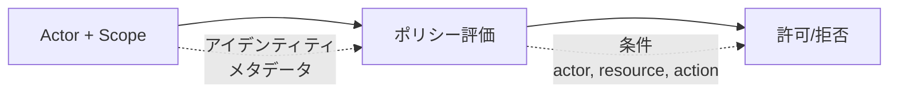

# セキュリティモデル

Wippyは属性ベースのアクセス制御を実装します。すべてのリクエストはアクター（誰が）とスコープ（どのポリシーが適用されるか）を持ちます。ポリシーはアクション、リソース、およびアクターとリソース両方からのメタデータに基づいてアクセスを評価します。



## エントリ種別

| 種別 | 説明 |
|------|------|
| `security.policy` | 条件付き宣言的ポリシー |
| `security.policy.expr` | 式ベースのポリシー |
| `security.token_store` | トークンストレージと検証 |

## アクター

アクターはアクションを実行している人を表します。

```lua
local security = require("security")

-- メタデータ付きアクターを作成
local actor = security.new_actor("user:123", {
    role = "admin",
    team = "backend",
    department = "engineering",
    clearance = 3
})

-- アクタープロパティにアクセス
local id = actor:id()        -- "user:123"
local meta = actor:meta()    -- {role="admin", ...}
```

### コンテキスト内のアクター

```lua
-- コンテキストから現在のアクターを取得
local actor = security.actor()
if not actor then
    return nil, errors.new("UNAUTHORIZED", "No actor in context")
end
```

## ポリシー

ポリシーはアクション、リソース、条件、効果を持つアクセスルールを定義します。

### 宣言的ポリシー

```yaml
# src/security/_index.yaml
version: "1.0"
namespace: app.security

entries:
  # 管理者フルアクセス
  - name: admin_policy
    kind: security.policy
    policy:
      actions: "*"
      resources: "*"
      effect: allow
      conditions:
        - field: actor.meta.role
          operator: eq
          value: admin
    groups:
      - admin

  # 読み取り専用アクセス
  - name: readonly_policy
    kind: security.policy
    policy:
      actions:
        - "*.read"
        - "*.get"
        - "*.list"
      resources: "*"
      effect: allow
    groups:
      - default

  # リソース所有者アクセス
  - name: owner_policy
    kind: security.policy
    policy:
      actions:
        - read
        - write
        - delete
      resources: "document:*"
      effect: allow
      conditions:
        - field: meta.owner
          operator: eq
          value_from: actor.id
    groups:
      - default

  # クリアランスなしで機密を拒否
  - name: deny_confidential
    kind: security.policy
    policy:
      actions: "*"
      resources: "document:*"
      effect: deny
      conditions:
        - field: meta.classification
          operator: eq
          value: confidential
        - field: actor.meta.clearance
          operator: lt
          value: 3
    groups:
      - security
```

### ポリシー構造

```yaml
policy:
  actions: "*" | "action" | ["action1", "action2"]
  resources: "*" | "resource" | ["res1", "res2"]
  effect: allow | deny
  conditions:  # オプション
    - field: "field.path"
      operator: "eq"
      value: "static_value"
      # または
      value_from: "other.field.path"
```

### 式ベースのポリシー

複雑なロジックには式ポリシーを使用：

```yaml
- name: flexible_access
  kind: security.policy.expr
  policy:
    actions:
      - read
      - write
    resources: "file:*"
    effect: allow
    expression: |
      (actor.meta.role == "editor" && action == "write") ||
      (action == "read" && meta.public == true) ||
      actor.id == meta.owner
  groups:
    - editors
```

## 条件

条件はアクター、アクション、リソース、メタデータに基づいた動的ポリシー評価を可能にします。

### フィールドパス

| パス | 説明 |
|------|------|
| `actor.id` | アクターの一意識別子 |
| `actor.meta.*` | アクターメタデータ（ネストをサポート） |
| `action` | 実行されているアクション |
| `resource` | リソース識別子 |
| `meta.*` | リソースメタデータ |

### 演算子

| 演算子 | 説明 | 例 |
|--------|------|-----|
| `eq` | 等しい | `actor.meta.role eq "admin"` |
| `ne` | 等しくない | `meta.status ne "deleted"` |
| `lt` | より小さい | `meta.priority lt 5` |
| `gt` | より大きい | `actor.meta.clearance gt 2` |
| `lte` | 以下 | `meta.size lte 1000` |
| `gte` | 以上 | `actor.meta.level gte 3` |
| `in` | 配列内の値 | `action in ["read", "write"]` |
| `nin` | 配列内にない値 | `meta.status nin ["deleted", "archived"]` |
| `exists` | フィールドが存在 | `meta.owner exists true` |
| `nexists` | フィールドが存在しない | `meta.deleted nexists true` |
| `contains` | 文字列を含む | `resource contains "sensitive"` |
| `ncontains` | 文字列を含まない | `resource ncontains "public"` |
| `matches` | 正規表現マッチ | `resource matches "^doc:.*"` |
| `nmatches` | 正規表現マッチしない | `actor.id nmatches "^system:.*"` |

### 条件の例

```yaml
# アクターロールをマッチ
conditions:
  - field: actor.meta.role
    operator: eq
    value: admin

# フィールドを比較
conditions:
  - field: meta.owner
    operator: eq
    value_from: actor.id

# 数値比較
conditions:
  - field: actor.meta.clearance
    operator: gte
    value: 3

# 配列メンバーシップ
conditions:
  - field: actor.meta.role
    operator: in
    value:
      - admin
      - moderator

# パターンマッチング
conditions:
  - field: resource
    operator: matches
    value: "^api:/v[0-9]+/admin/.*"

# 複数条件（AND）
conditions:
  - field: actor.meta.department
    operator: eq
    value: engineering
  - field: meta.environment
    operator: eq
    value: production
```

## スコープ

スコープは複数のポリシーをセキュリティコンテキストに組み合わせます。

```lua
local security = require("security")

-- ポリシーを取得
local admin_policy = security.policy("app.security:admin_policy")
local readonly_policy = security.policy("app.security:readonly_policy")

-- ポリシー付きスコープを作成
local scope = security.new_scope()
scope = scope:with(admin_policy)
scope = scope:with(readonly_policy)

-- スコープは不変 - :with()は新しいスコープを返す
```

### 名前付きスコープ（ポリシーグループ）

グループからすべてのポリシーをロード：

```lua
-- グループ内のすべてのポリシーを持つスコープをロード
local scope, err = security.named_scope("app.security:admin")
```

ポリシーは`groups`フィールドでグループに割り当てられます：

```yaml
- name: admin_policy
  kind: security.policy
  policy:
    # ...
  groups:
    - admin      # このポリシーは"admin"グループ内
    - default    # 複数グループに所属可能
```

### スコープ操作

```lua
-- ポリシーを追加
local new_scope = scope:with(policy)

-- ポリシーを削除
local new_scope = scope:without("app.security:temp_policy")

-- ポリシーがスコープ内にあるかチェック
local has = scope:contains("app.security:admin_policy")

-- すべてのポリシーを取得
local policies = scope:policies()
```

## ポリシー評価

### 評価フロー

```
1. スコープ内の各ポリシーをチェック
2. いずれかのポリシーがDenyを返す → 結果はDeny
3. 少なくとも1つのAllowがありDenyがない → 結果はAllow
4. 適用可能なポリシーがない → 結果はUndefined
```

### 評価結果

| 結果 | 意味 |
|------|------|
| `allow` | アクセス許可 |
| `deny` | アクセス明示的に拒否 |
| `undefined` | ポリシーがマッチしなかった |

```lua
-- 直接評価
local result = scope:evaluate(actor, "read", "document:123", {
    owner = "user:456",
    classification = "internal"
})

if result == "deny" then
    return nil, errors.new("FORBIDDEN", "Access denied")
elseif result == "undefined" then
    -- ポリシーがマッチしなかった - strictモードに依存
end
```

### クイック権限チェック

```lua
-- 現在のコンテキストのアクターとスコープに対してチェック
local allowed = security.can("read", "document:123", {
    owner = "user:456"
})

if not allowed then
    return nil, errors.new("FORBIDDEN", "Access denied")
end
```

## トークンストア

トークンストアはセキュアなトークン作成、検証、失効を提供します。

### 設定

```yaml
# src/auth/_index.yaml
version: "1.0"
namespace: app.auth

entries:
  # 環境変数を登録
  - name: os_env
    kind: env.storage.os

  - name: AUTH_SECRET_KEY
    kind: env.variable
    variable: AUTH_SECRET_KEY
    storage: app.auth:os_env

  # トークン用バッキングストア
  - name: token_data
    kind: store.memory
    lifecycle:
      auto_start: true

  # トークンストア
  - name: tokens
    kind: security.token_store
    store: app.auth:token_data
    token_length: 32
    default_expiration: "24h"
    token_key_env: "AUTH_SECRET_KEY"
```

### トークンストアオプション

| オプション | デフォルト | 説明 |
|-----------|-----------|------|
| `store` | 必須 | バッキングキーバリューストア参照 |
| `token_length` | 32 | トークンサイズ（バイト、256ビット） |
| `default_expiration` | 24h | デフォルトトークンTTL |
| `token_key` | なし | HMAC-SHA256署名キー（直接値） |
| `token_key_env` | なし | 署名キー用環境変数名 |

本番環境ではエントリにシークレットを埋め込まないよう`token_key_env`を使用してください。環境変数の登録については[環境変数システム](system/env.md)を参照してください。

### トークンの作成

```lua
local security = require("security")

-- トークンストアを取得
local store, err = security.token_store("app.auth:tokens")
if err then
    return nil, err
end

-- アクターとスコープを作成
local actor = security.new_actor("user:123", {
    role = "user",
    email = "user@example.com"
})

local scope, _ = security.named_scope("app.security:default")

-- トークンを作成
local token, err = store:create(actor, scope, {
    expiration = "7d",  -- デフォルト有効期限をオーバーライド
    meta = {
        device = "mobile",
        ip = "192.168.1.1"
    }
})

if err then
    return nil, err
end

-- トークン形式: base64_token.hmac_signature（token_keyが設定されている場合）
-- 例: "dGVzdHRva2VuMTIz.a1b2c3d4e5f6"
```

### トークンの検証

```lua
-- トークンを検証
local actor, scope, err = store:validate(token)
if err then
    return nil, errors.new("UNAUTHORIZED", "Invalid token")
end

-- アクターとスコープは保存されたデータから再構築される
print(actor:id())  -- "user:123"
```

### トークンの失効

```lua
-- 単一トークンを失効
local ok, err = store:revoke(token)

-- 完了したらストアを閉じる
store:close()
```

## コンテキストフロー

セキュリティコンテキストは関数呼び出しを通じて伝播します。

### コンテキストの設定

```lua
local funcs = require("funcs")

-- セキュリティコンテキスト付きで関数を呼び出し
local result, err = funcs.new()
    :with_actor(actor)
    :with_scope(scope)
    :call("app.api:protected_endpoint", data)
```

### コンテキスト継承

| コンポーネント | 継承 |
|---------------|------|
| アクター | はい - 子呼び出しに渡される |
| スコープ | はい - 子呼び出しに渡される |
| Strictモード | いいえ - アプリケーション全体 |

関数は呼び出し元のセキュリティコンテキストを継承します。生成されたプロセスは新規に開始します。

## サービスレベルセキュリティ

サービスのデフォルトセキュリティを設定：

```yaml
- name: worker_service
  kind: process.lua
  source: file://worker.lua
  lifecycle:
    auto_start: true
    security:
      actor:
        id: "service:worker"
        meta:
          role: worker
          service: true
      policies:
        - app.security:worker_policy
      groups:
        - workers
```

## Strictモード

セキュリティコンテキストが欠落している場合にアクセスを拒否するためstrictモードを有効化：

```yaml
# wippy.yaml
security:
  strict_mode: true
```

| モード | 欠落コンテキスト | 動作 |
|--------|-----------------|------|
| 通常 | アクター/スコープなし | 許可（寛容） |
| Strict | アクター/スコープなし | 拒否（セキュアデフォルト） |

## 認証フロー

HTTPハンドラでのトークン検証：

```lua
local http = require("http")
local security = require("security")

local function protected_handler()
    local req = http.request()
    local res = http.response()

    -- トークンを抽出して検証
    local auth = req:header("Authorization")
    if not auth then
        return res:set_status(401):write_json({error = "Missing authorization"})
    end

    local token = auth:gsub("^Bearer%s+", "")
    local store, _ = security.token_store("app.auth:tokens")
    local actor, scope, err = store:validate(token)
    if err then
        return res:set_status(401):write_json({error = "Invalid token"})
    end

    -- 権限をチェック
    if not security.can("api.users.read", "users") then
        return res:set_status(403):write_json({error = "Forbidden"})
    end

    res:write_json({user = actor:id()})
end

return { handler = protected_handler }
```

ログイン時のトークン作成：

```lua
local actor = security.new_actor("user:" .. user.id, {role = user.role})
local scope, _ = security.named_scope("app.security:" .. user.role)

local store, _ = security.token_store("app.auth:tokens")
local token, err = store:create(actor, scope, {expiration = "24h"})
```

## ベストプラクティス

1. **最小権限** - 必要最小限の権限を付与
2. **デフォルトで拒否** - 明示的な許可ポリシーを使用し、strictモードを有効化
3. **ポリシーグループを使用** - ロール/機能ごとにポリシーを整理
4. **トークンに署名** - 本番環境では常に`token_key_env`を設定
5. **短い有効期限** - 機密操作には短いトークン寿命を使用
6. **コンテキストで条件付け** - 静的ポリシーより動的条件を使用
7. **機密アクションを監査** - セキュリティ関連の操作をログ

## セキュリティモジュールリファレンス

| 関数 | 説明 |
|------|------|
| `security.actor()` | コンテキストから現在のアクターを取得 |
| `security.scope()` | コンテキストから現在のスコープを取得 |
| `security.can(action, resource, meta?)` | 権限をチェック |
| `security.new_actor(id, meta?)` | 新しいアクターを作成 |
| `security.new_scope(policies?)` | 空またはシード付きスコープを作成 |
| `security.policy(id)` | IDでポリシーを取得 |
| `security.named_scope(group_id)` | グループのすべてのポリシーを持つスコープを取得 |
| `security.token_store(id)` | トークンストアを取得 |
