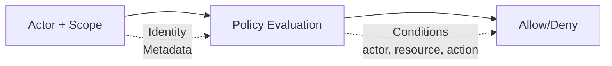

# セキュリティモデル

Wippy は、アクターとポリシースコープを使用した属性ベースのアクセス制御を実装します。ポリシーは、アクターおよびリソースのメタデータを使用してアクションとリソースを評価します。

このページは設定および API のリファレンスです。完全な例では必要なレジストリエントリに名前を付けています。短い Lua および YAML のコードブロックは、既存のセキュリティコンテキスト内での 1 つの操作または設定の断片を示します。


```mermaid
flowchart LR
    A[Actor + Scope] --> PE[Policy Evaluation] --> AD[Allow/Deny]
    A -.->|Identity<br/>Metadata| PE
    PE -.->|Conditions<br/>actor, resource, action| AD
```

## エントリ種別

| 種別 | 説明 |
|------|------|
| `security.policy` | 条件付きの宣言的ポリシー |
| `security.policy.expr` | 式ベースのポリシー |
| `security.token_store` | トークンの保存と検証 |

## アクター

アクターは、アクションを実行するプリンシパルを識別します。

```lua
local security = require("security")

-- Create actor with metadata
local actor = security.new_actor("user:123", {
    role = "admin",
    team = "backend",
    department = "engineering",
    clearance = 3
})

-- Access actor properties
local id = actor:id()        -- "user:123"
local meta = actor:meta()    -- {role="admin", ...}
```

### コンテキスト内のアクター

```lua
-- Get current actor from context
local errors = require("errors")

local actor = security.actor()
if not actor then
    return nil, errors.new({ kind = errors.PERMISSION_DENIED, message = "No actor in context" })
end
```

## ポリシー

ポリシーは、アクション、リソース、条件、効果を持つアクセスルールを定義します。

### 宣言的ポリシー

```yaml
# src/security/_index.yaml
version: "1.0"
namespace: app.security

entries:
  # Admin full access
  - name: admin_policy
    kind: security.policy
    policy:
      actions: "*"
      resources: "*"
      effect: allow
      conditions:
        - field: actor.meta.role
          operator: eq
          value: admin
    groups:
      - admin

  # Read-only access
  - name: readonly_policy
    kind: security.policy
    policy:
      actions:
        - "*.read"
        - "*.get"
        - "*.list"
      resources: "*"
      effect: allow
    groups:
      - default

  # Resource owner access
  - name: owner_policy
    kind: security.policy
    policy:
      actions:
        - read
        - write
        - delete
      resources: "document:*"
      effect: allow
      conditions:
        - field: meta.owner
          operator: eq
          value_from: actor.id
    groups:
      - default

  # Deny confidential without clearance
  - name: deny_confidential
    kind: security.policy
    policy:
      actions: "*"
      resources: "document:*"
      effect: deny
      conditions:
        - field: meta.classification
          operator: eq
          value: confidential
        - field: actor.meta.clearance
          operator: lt
          value: 3
    groups:
      - security
```

### ポリシー構造

```text
policy:
  actions: "*" | "action" | ["action1", "action2"]
  resources: "*" | "resource" | ["res1", "res2"]
  effect: allow | deny
  conditions:  # Optional
    - field: "field.path"
      operator: "eq"
      value: "static_value"
      # OR
      value_from: "other.field.path"
```

### 式ベースのポリシー

複雑なロジックには式ポリシーを使用します。

```yaml
- name: flexible_access
  kind: security.policy.expr
  policy:
    actions:
      - read
      - write
    resources: "file:*"
    effect: allow
    expression: |
      (actor.meta.role == "editor" && action == "write") ||
      (action == "read" && meta.public == true) ||
      actor.id == meta.owner
  groups:
    - editors
```

## 条件

条件は、実行時にアクター、アクション、リソース、メタデータのフィールドを評価します。

### フィールドパス

| パス | 説明 |
|------|------|
| `actor.id` | アクターの一意な識別子 |
| `actor.meta.*` | アクターのメタデータ（ネストをサポート） |
| `action` | 実行されるアクション |
| `resource` | リソースの識別子 |
| `meta.*` | リソースのメタデータ |

### 演算子

| 演算子 | 説明 | 例 |
|--------|------|-----|
| `eq` | 等しい | `actor.meta.role eq "admin"` |
| `ne` | 等しくない | `meta.status ne "deleted"` |
| `lt` | より小さい | `meta.priority lt 5` |
| `gt` | より大きい | `actor.meta.clearance gt 2` |
| `lte` | 以下 | `meta.size lte 1000` |
| `gte` | 以上 | `actor.meta.level gte 3` |
| `in` | 配列内に値がある | `action in ["read", "write"]` |
| `nin` | 配列内に値がない | `meta.status nin ["deleted", "archived"]` |
| `exists` | フィールドが存在する | `meta.owner exists true` |
| `nexists` | フィールドが存在しない | `meta.deleted nexists true` |
| `contains` | 文字列を含む | `resource contains "sensitive"` |
| `ncontains` | 文字列を含まない | `resource ncontains "public"` |
| `matches` | 正規表現に一致する | `resource matches "^doc:.*"` |
| `nmatches` | 正規表現に一致しない | `actor.id nmatches "^system:.*"` |

### 条件の例

```yaml
# Match actor role
conditions:
  - field: actor.meta.role
    operator: eq
    value: admin

# Compare fields
conditions:
  - field: meta.owner
    operator: eq
    value_from: actor.id

# Numeric comparison
conditions:
  - field: actor.meta.clearance
    operator: gte
    value: 3

# Array membership
conditions:
  - field: actor.meta.role
    operator: in
    value:
      - admin
      - moderator

# Pattern matching
conditions:
  - field: resource
    operator: matches
    value: "^api:/v[0-9]+/admin/.*"

# Multiple conditions (AND)
conditions:
  - field: actor.meta.department
    operator: eq
    value: engineering
  - field: meta.environment
    operator: eq
    value: production
```

## スコープ

スコープは、複数のポリシーを 1 つのセキュリティコンテキストにまとめます。

```lua
local security = require("security")

-- Get policies
local admin_policy, admin_err = security.policy("app.security:admin_policy")
if admin_err then return nil, admin_err end
local readonly_policy, readonly_err = security.policy("app.security:readonly_policy")
if readonly_err then return nil, readonly_err end

-- Create scope with policies
local scope = security.new_scope()
scope = scope:with(admin_policy)
scope = scope:with(readonly_policy)

-- Scopes are immutable - :with() returns new scope
```

### 名前付きスコープ（ポリシーグループ）

グループに割り当てられたポリシーを読み込みます。

```lua
-- Load scope with all policies in group
local scope, err = security.named_scope("app.security:admin")
if err then return nil, err end
```

ポリシーは `groups` フィールドを使用してグループに割り当てます。

```yaml
- name: admin_policy
  kind: security.policy
  policy:
    # ...
  groups:
    - admin      # This policy is in "admin" group
    - default    # Can be in multiple groups
```

### スコープの操作

```lua
-- Add policy
local new_scope = scope:with(policy)

-- Remove policy
local new_scope = scope:without("app.security:temp_policy")

-- Check if policy is in scope
local has = scope:contains("app.security:admin_policy")

-- Get all policies
local policies = scope:policies()
```

### モジュール権限

strict モードでは、トークン操作だけでなく、アクター、ポリシー、スコープの構築にも権限チェックが適用されます。

| アクション | リソース | 使用箇所 | 拒否時の動作 |
|-----------|----------|----------|--------------|
| `security.actor.create` | アクター ID | `security.new_actor` | Lua エラーを発生 |
| `security.policy.get` | ポリシーのレジストリ ID | `security.policy` | `nil, error` を返す |
| `security.policy_group.get` | ポリシーグループ ID | `security.named_scope` | `nil, error` を返す |
| `security.scope.create` | `custom`、`with`、`without` | それぞれ `security.new_scope`、`scope:with`、`scope:without` | Lua エラーを発生 |

呼び出し元に必要な操作と ID だけを許可してください。このページのアクター、スコープ、トークンの例では、操作固有のトークン権限に加え、これらの権限も付与されていることを前提としています。

## ポリシー評価

### 評価フロー

```
1. コンテキストにアクターまたはスコープがない → strictモードが判断（デフォルトは拒否）
2. スコープ内の各ポリシーをチェック
3. いずれかのポリシーがDenyを返す → 結果はDeny
4. 少なくとも1つのAllowがありDenyがない → 結果はAllow
5. 適用可能なポリシーがない → 結果はUndefined
```

アクセスチェックが通るのは`Allow`の場合のみです。`Undefined`は`Deny`とまったく同様にアクセスを拒否します。アクターとスコープの両方が揃っている場合、strictモードは一切関与しません。

### 評価結果

| 結果 | 意味 |
|------|------|
| `allow` | アクセスを許可 |
| `deny` | アクセスを明示的に拒否 |
| `undefined` | 一致するポリシーがない |

```lua
local errors = require("errors")

-- Evaluate directly
local result = scope:evaluate(actor, "read", "document:123", {
    owner = "user:456",
    classification = "internal"
})

if result == "deny" then
    return nil, errors.new({ kind = errors.PERMISSION_DENIED, message = "Access denied" })
elseif result == "undefined" then
    -- ポリシーがマッチしなかった - アクセスチェックはこれを拒否として扱う
end
```

### 簡易権限チェック

```lua
local errors = require("errors")

-- Check against current context's actor and scope
local allowed = security.can("read", "document:123", {
    owner = "user:456"
})

if not allowed then
    return nil, errors.new({ kind = errors.PERMISSION_DENIED, message = "Access denied" })
end
```

## トークンストア

トークンストアは、認証トークンを作成、検証、失効します。

Lua の操作は権限によってゲートされます。アクティブなスコープでは、取得に対して `security.token_store.get` を許可し、対応する操作に対して `security.token.create`、`security.token.validate`、または `security.token.revoke` を許可する必要があります。これは、デフォルトの strict モードでも、明示的に設定したセキュリティコンテキストでも同様です。アクターを作成したり名前付きスコープを読み込んだりする例では、`security.actor.create` と `security.policy_group.get` も必要です。

### 設定

```yaml
# src/auth/_index.yaml
version: "1.0"
namespace: app.auth

entries:
  # Register environment variable
  - name: os_env
    kind: env.storage.os

  - name: AUTH_SECRET_KEY
    kind: env.variable
    variable: AUTH_SECRET_KEY
    storage: app.auth:os_env

  # Backing store for tokens
  - name: token_data
    kind: store.memory
    lifecycle:
      auto_start: true

  # Token store
  - name: tokens
    kind: security.token_store
    store: app.auth:token_data
    token_length: 32
    default_expiration: "24h"
    token_key: ${env:AUTH_SECRET_KEY}
```

### トークンストアのオプション

| オプション | デフォルト | 説明 |
|-----------|-----------|------|
| `store` | 必須 | バッキングキーバリューストア参照 |
| `token_length` | 32 | トークンサイズ（バイト、256ビット） |
| `default_expiration` | 24h | デフォルトトークンTTL |
| `token_key` | なし | HMAC-SHA256署名キー（直接値、または[envレジストリ](system/env.md)から取得する`${env:NAME}`） |

本番環境ではエントリにシークレットを埋め込まないよう`token_key: ${env:NAME}`を使用してください。従来の`token_key_env`ディレクティブも同じ方法で解決されますが非推奨です。`${env:NAME}`を使用してください。

### トークンの作成

```lua
local security = require("security")

-- Get token store
local store, err = security.token_store("app.auth:tokens")
if err then
    return nil, err
end

-- Create actor and scope
local actor = security.new_actor("user:123", {
    role = "user",
    email = "user@example.com"
})

local scope, scope_err = security.named_scope("app.security:default")
if scope_err then
    store:close()
    return nil, scope_err
end

-- Create token
local token, create_err = store:create(actor, scope, {
    expiration = "7d",  -- Override default expiration
    meta = {
        device = "mobile",
        ip = "192.168.1.1"
    }
})
store:close()
if create_err then return nil, create_err end
return token

-- Token format: base64_token.hmac_signature (if token_key set)
-- Example: "dGVzdHRva2VuMTIz.a1b2c3d4e5f6"
```

### トークンの検証

```lua
local errors = require("errors")

-- Validate token
local actor, scope, err = store:validate(token)
store:close()
if err then
    return nil, errors.new({ kind = errors.PERMISSION_DENIED, message = "Invalid token" })
end

-- Actor and scope are reconstructed from stored data
print(actor:id())  -- "user:123"
```

### トークンの失効

```lua
-- Revoke single token
local ok, err = store:revoke(token)
if err then
    store:close()
    return nil, err
end

-- Close store when done
store:close()
return ok
```

## コンテキストフロー

アクターとスコープは継承可能なフレームコンテキストです。関数呼び出しと生成されたプロセスは、呼び出し元が置き換え用のコンテキストを指定しない限り、両方を継承します。生成するプロセスのアクターまたはスコープを明示的に変更するには、`process.security` 権限が必要です。一方、`funcs.new():with_actor(...)` または `:with_scope(...)` を通じて関数呼び出しのセキュリティコンテキストを変更するには、`funcs.security` が `security` に対して必要です。

### コンテキストの設定

```lua
local funcs = require("funcs")

-- Call function with security context
local caller, err = funcs.new():with_actor(actor)
if err then return nil, err end
caller, err = caller:with_scope(scope)
if err then return nil, err end
local result, call_err = caller:call("app.api:protected_endpoint", data)
if call_err then return nil, call_err end
```

### コンテキストの継承

| コンポーネント | 継承 |
|---------------|------|
| アクター | はい - 子呼び出しと生成されたプロセスに渡される |
| スコープ | はい - 子呼び出しと生成されたプロセスに渡される |
| strict モード | いいえ - アプリケーション全体に適用 |

関数と生成されたプロセスは、どちらも呼び出し元のセキュリティコンテキストを継承します。生成されたプロセスはスポーン元からフォークされたフレーム上で開始し、そのフレームはスポーン元のアクターとスコープを運びます。自身のエントリの`security:`ブロックは、その継承されたコンテキストを変更します。エントリがブロックを宣言していない場合、プロセスはスポーン元のアクターとスコープをそのまま保持します。どちらも持たないスポーン元からはどちらも持たない子が生まれ、strictモードはこれを拒否します。宣言されたブロックが`actor`を指定した場合は継承されたアクターを置き換え、その`policies`と`groups`は継承されたスコープにマージされます。`actor`を省略したブロックはスポーン元のアクターを保持し、`policies`と`groups`の両方を省略したブロックはスポーン元のスコープを保持します。

## エントリでのセキュリティ宣言

セキュリティブロックの形は、どこに現れても同じです：

| フィールド | 型 | 説明 |
|-------|------|-------------|
| `actor.id` | string | アクターアイデンティティ。継承したアクターを置き換えます |
| `actor.meta` | map | ポリシーが評価するアクター属性 |
| `policies` | list | スコープにマージされるポリシーのレジストリID |
| `groups` | list | そのポリシーがスコープにマージされるポリシーグループのレジストリID |

`policies`と`groups`は**`namespace:name`形式のレジストリID**です。名前のみでは解決されません。ポリシーエントリの`groups:`フィールドがそのポリシー自身の名前空間をデフォルトとするのとは異なり、これらの参照にはデフォルトの名前空間がありません。

解決はアトミックかつフェイルクローズドです。列挙されたすべてのポリシーとグループは、何かがインストールされる前に解決されます。いずれか1つでも存在しない、空である、またはポリシーを含まない場合、設定全体が失敗し、アクターも部分的なスコープも適用されません。したがって、呼び出し側が中途半端なコンテキストを持って境界を越えることはありません。

### プロセスエントリ

`process.lua`、`process.lua.bc`、`function.lua`、`function.lua.bc`の各エントリは、そのエントリのすべての実行に適用されるトップレベルの`security:`ブロックを取ります：

```yaml
- name: worker_process
  kind: process.lua
  source: file://worker.lua
  method: main
  security:
    actor:
      id: "service:worker"
      meta:
        role: worker
        service: true
    policies:
      - app.security:worker_policy
    groups:
      - app.security:workers
```

このブロックはプロセスの起動時に、`process.host`と`terminal.host`の両方で適用されます。解決に失敗した場合は、より弱いコンテキストでプロセスを起動するのではなくスポーンを中止します。

### サービスライフサイクル

スーパーバイズされるサービスは、同じブロックを`lifecycle`の下に取ります。これはサービスコントローラの作成時に一度だけ解決され、そのサービスの存続期間中は封印されます：

```yaml
- name: worker
  kind: process.service
  process: app:worker_process
  host: app:processes
  lifecycle:
    auto_start: true
    security:
      actor:
        id: "service:worker"
      groups:
        - app.security:workers
```

### CLIコマンド

コマンドエントリは`meta.command.security`を宣言します。これはエントリがCLIコマンドとして起動されたときにのみ適用されます。`wippy run <name>`を実行するオペレータが、そのコンテキストの信頼の起点です。同じエントリの通常のスポーンには影響しません。ブロックは厳格に検証されます。未知のフィールドは拒否され、空のブロックは拒否され、コマンドの`name`を持たない`security`は拒否されます。[コマンドのセキュリティ](guides/cli.md#command-security)を参照してください。

## Strictモード

strictモードは、リクエストにアクターもスコープもない場合にどうなるかを決めます。**デフォルトで有効**であり、不完全なコンテキストは拒否されます。無効化することは明示的な選択であり、モジュールマニフェストの`wippy.yaml`ではなく、ランタイム設定ファイル（`.wippy.yaml`）で行います：

```yaml
# .wippy.yaml
security:
  strict_mode: false
```

| モード | 欠落コンテキスト | 動作 |
|--------|-----------------|------|
| Strict（デフォルト） | アクター/スコープなし | 拒否 |
| 寛容（`strict_mode: false`） | アクター/スコープなし | 許可 |

アクターとスコープが揃っている場合、strictモードは何も変えません。どちらの設定でも評価はデフォルト拒否です。strictモードが支配するのは不完全なケースのみであり、そのためセキュリティコンテキストを宣言せずに実行されるプロセスは、デフォルトではすべてのチェックに失敗します。そのようなプロセスには`security:`ブロックを与えるか、コンテキストを供給する経路から起動してください。

## 認証フロー

HTTP ハンドラーでトークンを検証します。

```lua
local http = require("http")
local security = require("security")

local function protected_handler()
    local req, req_err = http.request()
    if req_err then return nil, req_err end
    local res, res_err = http.response()
    if res_err then return nil, res_err end

    local function respond(status, body)
        local content_type_err = res:set_header("Content-Type", "application/json")
        if content_type_err then return nil, content_type_err end
        local status_err = res:set_status(status)
        if status_err then return nil, status_err end
        local write_err = res:write_json(body)
        if write_err then return nil, write_err end
        return true
    end

    -- Extract and validate token
    local auth, header_err = req:header("Authorization")
    if header_err then return nil, header_err end
    if not auth then
        return respond(http.STATUS.UNAUTHORIZED, {error = "Missing authorization"})
    end

    local token = auth:match("^Bearer%s+(.+)$")
    if not token then
        return respond(http.STATUS.UNAUTHORIZED, {error = "Expected a bearer token"})
    end
    local store, store_err = security.token_store("app.auth:tokens")
    if store_err then
        return respond(http.STATUS.INTERNAL_ERROR, {error = "Token store unavailable"})
    end

    local actor, scope, validate_err = store:validate(token)
    store:close()
    if validate_err then
        return respond(http.STATUS.UNAUTHORIZED, {error = "Invalid token"})
    end

    -- Evaluate the actor and scope reconstructed from this token.
    if scope:evaluate(actor, "api.users.read", "users") ~= "allow" then
        return respond(http.STATUS.FORBIDDEN, {error = "Forbidden"})
    end

    return respond(http.STATUS.OK, {user = actor:id()})
end

return { handler = protected_handler }
```

ログイン時にトークンを作成します。

```lua
local actor = security.new_actor("user:" .. user.id, {role = user.role})
local scope, scope_err = security.named_scope("app.security:" .. user.role)
if scope_err then return nil, scope_err end

local store, store_err = security.token_store("app.auth:tokens")
if store_err then return nil, store_err end
local token, token_err = store:create(actor, scope, {expiration = "24h"})
store:close()
if token_err then return nil, token_err end
return token
```

## ランタイムの信頼境界

ポリシー評価はコードが何をできるかを支配します。どのコードが受け入れられ、コンテキストがどこまで移動できるかは、別の3つの仕組みが支配します。

### モジュールの整合性

`wippy.lock` 内のすべてのモジュールはアーティファクトダイジェストを持ちます。ブート時、ダウンロードはロックに固定されたダイジェストとハブが提供したダイジェストの両方に対して検証され、ベンダー化済みのパックはロードされる前にロックに対して再検証されます。不一致はリトライも回避もされない整合性の失敗であり、モジュールはロードされません。`wippy install` は新規ダウンロードをハブが提供したダイジェストとサイズに対してのみ検証し、不一致の場合はファイルを削除して失敗し、その後に提供されたダイジェストをロックへ書き戻します。したがって固定されたダイジェストは、installによって強制されるのではなく再確立されます。ロックのダイジェストに対してチェックされるのは、ベンダーディレクトリにすでにあるパックだけです。展開されたモジュールディレクトリも自身の記録済みダイジェストとツリーダイジェストを持ち、同様にチェックされるため、変更されたベンダーツリーは信頼されずに検出されます。[依存関係管理](guides/dependency-management.md#integrity-verification)を参照してください。

### クラスタのノード間アイデンティティ

クラスタ内のノードは相互に認証します。各ノードはed25519のアイデンティティ鍵と、信頼するピア公開鍵のマップを保持します。メッシュのハンドシェイクは相互認証であり、共有ゴシップシークレットに対するHMACを、両ノードIDと両ノンスを含むトランスクリプトに対するed25519署名に束縛します。信頼マップに存在しないピア、またはゴシップで広告された鍵が信頼エントリと食い違うピアは拒否されます。未認証のモードは存在せず、アイデンティティを持たないノードはメッシュに参加できません。[ノード間アイデンティティ](guides/cluster.md#internode-identity)を参照してください。

### Temporalへの伝播

Temporalへ越境するセキュリティコンテキストは、平文のワークフロー入力ではなく署名済みヘッダーとして運ばれます。アクター、そのメタデータ、ポリシーIDは`wippy-security`エンベロープにシリアライズされ、クライアントのHMAC鍵で署名され、特定のワークフローIDまたはアクティビティIDにオーディエンス指定されます。受信側のワーカーは、ワークフローやアクティビティの実行前に署名とオーディエンスを検証し、指定されたすべてのポリシーをローカルで解決します。いずれかが失敗すると実行は失敗します。セキュリティコンテキストの下で実行されるワークフローは署名のないシグナルも拒否するため、外部のTemporalクライアントがそれを駆動することはできません。[ワークフロー](temporal/workflows.md#security-context)と[Temporal概要](temporal/overview.md#security-context-propagation)を参照してください。

## ベストプラクティス

1. **最小権限** - 必要最小限の権限を付与
2. **デフォルトで拒否** - 明示的な許可ポリシーを使用し、strictモードを有効化
3. **ポリシーグループを使用** - ロール/機能ごとにポリシーを整理
4. **トークンに署名** - 本番環境では常に`${env:NAME}`参照から`token_key`を設定
5. **短い有効期限** - 機密操作には短いトークン寿命を使用
6. **コンテキストで条件付け** - 静的ポリシーより動的条件を使用
7. **機密アクションを監査** - セキュリティ関連の操作をログ

## セキュリティモジュールリファレンス

| 関数 | 説明 |
|------|------|
| `security.actor()` | コンテキストから現在のアクターを取得 |
| `security.scope()` | コンテキストから現在のスコープを取得 |
| `security.can(action, resource, meta?)` | 権限を確認 |
| `security.new_actor(id, meta?)` | 新しいアクターを作成 |
| `security.new_scope(policies?)` | 空または初期ポリシー付きのスコープを作成 |
| `security.policy(id)` | ID でポリシーを取得 |
| `security.named_scope(group_id)` | グループ内のすべてのポリシーを持つスコープを取得 |
| `security.token_store(id)` | トークンストアを取得 |
