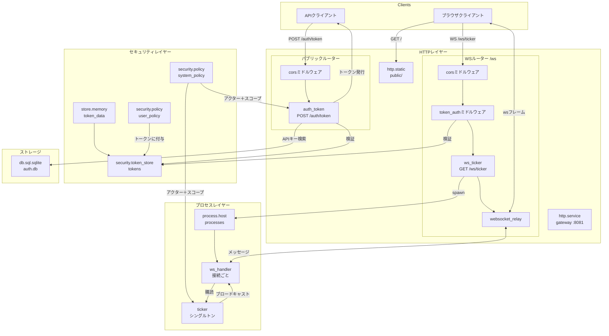

# 暗号通貨ティッカー

APIキー認証とWebSocketストリーミングを備えたリアルタイム暗号通貨ティッカーを構築します。このチュートリアルでは、トークンベースのセキュリティ、ミドルウェア設定、プロセスベースのWebSocket処理を実演します。

## 概要

- **APIキー交換** — APIキーをPOSTして、HMAC署名されたbearerトークンを取得
- **トークンミドルウェア** — token storeを使ってWebSocketアップグレードを保護
- **WebSocketファンアウト** — 単一のtickerプロセスが複数の接続ハンドラーにブロードキャスト
- **静的アセット** — `http.static`がブラウザクライアントを配信
- **SQLite** — APIキーを保存; memory storeがtoken storeのバックエンドとして機能

## プロジェクト構造

```
auth-ticker/
├── wippy.lock
└── src/
    ├── _index.yaml
    ├── auth_token.lua
    ├── ws_ticker.lua
    ├── ws_handler.lua
    ├── ticker.lua
    ├── migrate.lua
    └── public/
        └── index.html
```

## アーキテクチャ



## セキュリティフロー

1. **APIキー交換**: クライアントがAPIキーを`/auth/token`にPOST。ハンドラがデータベースで検証し、`user_policy`を持つアクターを作成し、HMAC署名付きトークンを発行。

2. **トークン認証**: WebSocket接続は`token_auth`ミドルウェアを通過し、Bearerトークンを検証してセキュリティコンテキスト（アクター＋ポリシー）を復元。

3. **プロセス生成**: WebSocketエンドポイントがハンドラプロセスを生成。トークンに`user_policy`が含まれているため、生成が許可される。

4. **メッセージルーティング**: `websocket_relay`ミドルウェアがWebSocketフレームをメッセージとしてハンドラプロセスにルーティング。

## 設定

完全な`_index.yaml`：

```yaml
version: "1.0"
namespace: app

entries:
  # APIキー用データベース
  - name: db
    kind: db.sql.sqlite
    file: "./data/auth.db"
    lifecycle:
      auto_start: true

  # トークンバッキングストア
  - name: token_data
    kind: store.memory
    lifecycle:
      auto_start: true

  # HMAC署名付きトークンストア
  - name: tokens
    kind: security.token_store
    store: app:token_data
    token_length: 32
    default_expiration: "1h"
    token_key: "demo-secret-key-change-in-production"

  # 認証ユーザー用セキュリティポリシー
  - name: user_policy
    kind: security.policy
    policy:
      actions: "*"
      resources: "*"
      effect: allow
    groups:
      - user

  # エンドユーザーのアクターなしで実行される内部コード用のポリシー
  - name: system_policy
    kind: security.policy
    policy:
      actions:
        - db.get
        - security.actor.create
        - security.policy.get
        - security.scope.create
        - security.token_store.get
        - security.token.create
        - process.registry.register
        - process.send
        - process.monitor
      resources: "*"
      effect: allow

  # プロセスホスト
  - name: processes
    kind: process.host
    lifecycle:
      auto_start: true

  # データベースマイグレーション
  - name: migrate
    kind: process.lua
    source: file://migrate.lua
    method: main
    modules: [sql, logger, crypto]
    security:
      actor:
        id: "service:migrate"
      policies:
        - app:system_policy

  - name: migrate-service
    kind: process.service
    process: app:migrate
    host: app:processes
    lifecycle:
      auto_start: true

  # ティッカーブロードキャスター
  - name: ticker
    kind: process.lua
    source: file://ticker.lua
    method: main
    modules: [logger, time, crypto]
    security:
      actor:
        id: "service:ticker"
      policies:
        - app:system_policy

  - name: ticker-service
    kind: process.service
    process: app:ticker
    host: app:processes
    lifecycle:
      auto_start: true

  # WebSocketハンドラ（接続ごとに生成）
  - name: ws_handler
    kind: process.lua
    source: file://ws_handler.lua
    method: main
    modules: [logger, json]

  # HTTPサーバー
  - name: gateway
    kind: http.service
    addr: ":8081"
    lifecycle:
      auto_start: true

  # パブリックルーター（認証なし）
  - name: public_router
    kind: http.router
    meta:
      server: app:gateway
    middleware:
      - cors
    options:
      cors.allow.origins: "*"

  # WebSocketルーター（認証あり）
  - name: ws_router
    kind: http.router
    meta:
      server: app:gateway
    prefix: /ws
    middleware:
      - cors
      - token_auth
    options:
      cors.allow.origins: "*"
      token_auth.store: "app:tokens"
    post_middleware:
      - websocket_relay
    post_options:
      wsrelay.allowed.origins: "*"

  # 静的ファイル
  - name: public_fs
    kind: fs.directory
    directory: ./src/public

  - name: static
    kind: http.static
    meta:
      server: app:gateway
    path: /
    fs: app:public_fs
    static_options:
      spa: true
      index: index.html

  # 認証トークン交換
  - name: auth_token
    kind: function.lua
    source: file://auth_token.lua
    method: handler
    modules: [http, sql, crypto, security, json]
    security:
      actor:
        id: "service:auth"
      policies:
        - app:system_policy

  - name: auth_token.endpoint
    kind: http.endpoint
    meta:
      router: app:public_router
    method: POST
    path: /auth/token
    func: app:auth_token

  # WebSocketティッカーエンドポイント
  - name: ws_ticker
    kind: function.lua
    source: file://ws_ticker.lua
    method: handler
    modules: [http, json, security, logger]

  - name: ws_ticker.endpoint
    kind: http.endpoint
    meta:
      router: app:ws_router
    method: GET
    path: /ticker
    func: app:ws_ticker
```

`user_policy`は発行されるすべてのトークンに同梱され、認証済み接続が行う操作をカバーします。`system_policy`はトークンが存在する前に実行されるコード、つまりマイグレーション、ティッカー、そしてトークン交換そのものをカバーします。アクターとスコープなしで行われたゲート付き呼び出しは拒否されるためです。

本番環境では、HMACキーをハードコードする代わりにプレースホルダ（`token_key: ${env:TOKEN_KEY}`）で環境変数から読み取ります。[環境システム](system/env.md)を参照。

## トークン交換

`auth_token.lua` - APIキーを検証しHMAC署名付きトークンを発行：

```lua
local http = require("http")
local sql = require("sql")
local security = require("security")

local function handler()
    local req = http.request()
    local res = http.response()

    local body, parse_err = req:body_json()
    if parse_err then
        res:set_status(http.STATUS.BAD_REQUEST)
        res:write_json({error = "invalid JSON"})
        return
    end

    local api_key = body.api_key
    if not api_key or #api_key == 0 then
        res:set_status(http.STATUS.BAD_REQUEST)
        res:write_json({error = "api_key required"})
        return
    end

    local db, db_err = sql.get("app:db")
    if db_err then
        res:set_status(http.STATUS.INTERNAL_ERROR)
        res:write_json({error = "database unavailable"})
        return
    end

    local rows, query_err = db:query(
        "SELECT user_id, role FROM api_keys WHERE api_key = ?",
        {api_key}
    )
    db:release()

    if query_err then
        res:set_status(http.STATUS.INTERNAL_ERROR)
        res:write_json({error = "lookup failed"})
        return
    end
    if #rows == 0 then
        res:set_status(http.STATUS.UNAUTHORIZED)
        res:write_json({error = "invalid API key"})
        return
    end

    local user = rows[1]

    -- ユーザーIDでアクターを作成
    local actor = security.new_actor("user:" .. user.user_id, {
        role = user.role,
        user_id = user.user_id
    })

    -- スコープにuser_policyを付与
    local policy, _ = security.policy("app:user_policy")
    local scope = policy and security.new_scope({policy}) or security.new_scope()

    -- HMAC署名付きトークンを発行
    local store, store_err = security.token_store("app:tokens")
    if store_err then
        res:set_status(http.STATUS.INTERNAL_ERROR)
        res:write_json({error = "token store unavailable"})
        return
    end

    local token, token_err = store:create(actor, scope, {
        expiration = "1h",
        meta = {ip = req:remote_addr()}
    })
    store:close()

    if token_err then
        res:set_status(http.STATUS.INTERNAL_ERROR)
        res:write_json({error = "token creation failed"})
        return
    end

    res:write_json({
        token = token,
        user_id = user.user_id,
        role = user.role,
        expires_in = 3600
    })
end

return { handler = handler }
```

## WebSocketエンドポイント

`ws_ticker.lua` - 認証された各接続に対してハンドラプロセスを生成：

```lua
local http = require("http")
local json = require("json")
local security = require("security")
local logger = require("logger")

local function handler()
    local req = http.request()
    local res = http.response()

    if req:method() ~= http.METHOD.GET then
        res:set_status(http.STATUS.METHOD_NOT_ALLOWED)
        res:write_json({error = "method not allowed"})
        return
    end

    -- アクターはtoken_authミドルウェアによって設定される
    local actor = security.actor()
    if not actor then
        res:set_status(http.STATUS.UNAUTHORIZED)
        res:write_json({error = "authentication required"})
        return
    end

    local user_id = actor:id()

    -- ハンドラプロセスを生成（トークン内のuser_policyによって許可）
    local pid, err = process.spawn("app:ws_handler", "app:processes", user_id)
    if err then
        logger:error("spawn failed", {error = tostring(err)})
        res:set_status(http.STATUS.INTERNAL_ERROR)
        res:write_json({error = "failed to create handler"})
        return
    end

    -- メッセージをハンドラにルーティングするようwebsocket_relayを設定
    res:set_header("X-WS-Relay", json.encode({
        target_pid = tostring(pid),
        metadata = {user_id = user_id, auth_time = os.time()}
    }))
end

return { handler = handler }
```

## 接続ハンドラ

`websocket_relay`ミドルウェアはライフサイクルメッセージを自動的にハンドラプロセスに送信：
- `ws.join` - 接続確立、レスポンス送信用の`client_pid`を含む
- `ws.message` - クライアントがメッセージを送信。ペイロードは生のフレーム（テキストフレームの場合は文字列）
- `ws.leave` - 接続終了（切断時に自動送信）

逆方向、つまりクライアントPIDに送信されたメッセージは、`{topic, data}`という形の単一のJSONテキストフレームとしてブラウザに届きます。トピックは自由に選べ、ペイロードは`data`として到着します。

`ws_handler.lua` - これらのライフサイクルメッセージを処理：

```lua
local logger = require("logger")
local json = require("json")

local function main(user_id)
    local inbox = process.inbox()
    local client_pid = nil
    local subscribed = false

    logger:info("handler started", {user_id = user_id})

    while true do
        local msg, ok = inbox:receive()
        if not ok then break end

        local topic = msg:topic()
        local data = msg:payload():data()

        if topic == "ws.join" then
            client_pid = data.client_pid

            -- クラッシュモニタリング用に自身のPIDで購読
            process.send("ticker", "subscribe", {
                client_pid = client_pid,
                handler_pid = process.pid()
            })
            subscribed = true

            -- ウェルカムメッセージを送信
            process.send(client_pid, "welcome", {user_id = user_id})

            logger:info("client joined", {user_id = user_id, client_pid = client_pid})

        elseif topic == "ws.message" then
            local content = json.decode(data)
            if content and content.type == "ping" then
                process.send(client_pid, "pong", {})
            end

        elseif topic == "ws.leave" then
            -- リレーは切断時にこれを自動送信
            logger:info("client left", {user_id = user_id, client_pid = data.client_pid})
            if subscribed then
                process.send("ticker", "unsubscribe", {handler_pid = process.pid()})
            end
            break
        end
    end

    return 0
end

return { main = main }
```

## ブロードキャスト

`ticker.lua` - 購読を管理し、価格更新をブロードキャスト：

```lua
local logger = require("logger")
local time = require("time")
local crypto = require("crypto")

-- handler_pid -> client_pid マッピング
local subscriptions = {}

local prices = {
    ["BTC-USD"] = 42000.00,
    ["ETH-USD"] = 2500.00,
    ["SOL-USD"] = 95.00
}

local function broadcast(updates)
    for _, client_pid in pairs(subscriptions) do
        process.send(client_pid, "ticker", updates)
    end
end

local function update_prices()
    for symbol, price in pairs(prices) do
        local bytes = crypto.random.bytes(2)
        local rand = (bytes:byte(1) * 256 + bytes:byte(2)) / 65535.0
        local factor = (rand - 0.5) * 0.002
        prices[symbol] = price * (1 + factor)
        prices[symbol] = tonumber(string.format("%.2f", prices[symbol]))
    end
end

local function get_updates()
    local updates = {}
    for symbol, price in pairs(prices) do
        table.insert(updates, {symbol = symbol, price = price, timestamp = os.time()})
    end
    return updates
end

local function main()
    local inbox = process.inbox()
    local events = process.events()

    local ticker, ticker_err = time.ticker("1s")
    if ticker_err then
        logger:error("failed to create ticker", {error = tostring(ticker_err)})
        return 1
    end
    local tick_ch = ticker:response()

    process.registry.register("ticker")
    logger:info("ticker started", {pid = process.pid()})

    while true do
        local r = channel.select {
            inbox:case_receive(),
            events:case_receive(),
            tick_ch:case_receive()
        }

        if r.channel == tick_ch then
            update_prices()
            if next(subscriptions) then
                broadcast(get_updates())
            end

        elseif r.channel == events then
            local event = r.value
            if event.kind == process.event.CANCEL then
                ticker:stop()
                logger:info("ticker stopping")
                return 0
            elseif event.kind == process.event.EXIT then
                -- ハンドラが終了、購読を削除
                if subscriptions[event.from] then
                    logger:info("handler exited", {handler_pid = event.from})
                    subscriptions[event.from] = nil
                end
            end

        else
            local msg = r.value
            local topic = msg:topic()
            local data = msg:payload():data()

            if topic == "subscribe" then
                local handler_pid = data.handler_pid
                local client_pid = data.client_pid

                subscriptions[handler_pid] = client_pid
                process.monitor(handler_pid)

                logger:info("subscribed", {handler_pid = handler_pid, client_pid = client_pid})

                process.send(client_pid, "ticker", get_updates())

            elseif topic == "unsubscribe" then
                subscriptions[data.handler_pid] = nil
                logger:info("unsubscribed", {handler_pid = data.handler_pid})
            end
        end
    end
end

return { main = main }
```

## データベースマイグレーション

`migrate.lua` - APIキーテーブルを作成しデモキーを生成：

```lua
local sql = require("sql")
local logger = require("logger")
local crypto = require("crypto")

local function main()
    local db, err = sql.get("app:db")
    if err then
        logger:error("failed to connect", {error = tostring(err)})
        return 1
    end

    local _, exec_err = db:execute([[
        CREATE TABLE IF NOT EXISTS api_keys (
            id INTEGER PRIMARY KEY AUTOINCREMENT,
            api_key TEXT UNIQUE NOT NULL,
            user_id TEXT NOT NULL,
            role TEXT NOT NULL DEFAULT 'user',
            created_at INTEGER NOT NULL
        )
    ]])

    if exec_err then
        db:release()
        logger:error("migration failed", {error = tostring(exec_err)})
        return 1
    end

    -- デモキーが存在するかチェック
    local rows, _ = db:query("SELECT api_key FROM api_keys WHERE user_id = ?", {"demo"})
    if #rows == 0 then
        local demo_key, key_err = crypto.random.string(32)
        if key_err then
            db:release()
            return 1
        end

        db:execute(
            "INSERT INTO api_keys (api_key, user_id, role, created_at) VALUES (?, ?, ?, ?)",
            {demo_key, "demo", "user", os.time()}
        )
        logger:info("demo API key created", {api_key = demo_key})
    else
        logger:info("demo API key exists", {api_key = rows[1].api_key})
    end

    db:release()
    return 0
end

return { main = main }
```

## ブラウザクライアント

`public/index.html` - APIキーをトークンに交換し、価格をストリーミングします。ブラウザはWebSocketハンドシェイクでヘッダーを設定できないため、トークンは`token_auth`も読み取る`x-auth-token`クエリパラメータで渡します：

```html
<!doctype html>
<html>
<head>
  <meta charset="utf-8">
  <title>Crypto Ticker</title>
  <style>
    body { font-family: system-ui, sans-serif; max-width: 40rem; margin: 3rem auto; }
    table { border-collapse: collapse; width: 100%; margin-top: 1rem; }
    th, td { text-align: left; padding: .4rem .6rem; border-bottom: 1px solid #ddd; }
    #status { color: #666; }
  </style>
</head>
<body>
  <h1>Crypto Ticker</h1>
  <input id="key" placeholder="demo API key" size="40">
  <button id="connect">Connect</button>
  <p id="status">disconnected</p>
  <table><thead><tr><th>Symbol</th><th>Price</th></tr></thead><tbody id="rows"></tbody></table>

  <script>
    const status = document.getElementById("status");
    const rows = document.getElementById("rows");

    document.getElementById("connect").onclick = async () => {
      const res = await fetch("/auth/token", {
        method: "POST",
        headers: {"Content-Type": "application/json"},
        body: JSON.stringify({api_key: document.getElementById("key").value})
      });
      if (!res.ok) { status.textContent = "auth failed"; return; }
      const {token} = await res.json();

      const url = `ws://${location.host}/ws/ticker?x-auth-token=${encodeURIComponent(token)}`;
      const ws = new WebSocket(url);

      ws.onopen = () => {
        status.textContent = "connected";
        ws.send(JSON.stringify({type: "ping"}));
      };
      ws.onclose = () => { status.textContent = "disconnected"; };

      ws.onmessage = (evt) => {
        const msg = JSON.parse(evt.data);
        if (msg.topic !== "ticker") return;
        rows.innerHTML = "";
        for (const quote of msg.data) {
          rows.insertAdjacentHTML("beforeend",
            `<tr><td>${quote.symbol}</td><td>${quote.price.toFixed(2)}</td></tr>`);
        }
      };
    };
  </script>
</body>
</html>
```

## 実行

```bash
mkdir -p data
wippy init
wippy run
```

http://localhost:8081 を開き、ログに表示されるデモAPIキーを入力します。

## 次のステップ

- [WebSocketリレー](http/websocket-relay.md) - ミドルウェア設定
- [セキュリティモジュール](lua/security/security.md) - アクター、ポリシー、トークンストア
- [プロセス管理](lua/core/process.md) - 生成とメッセージング

