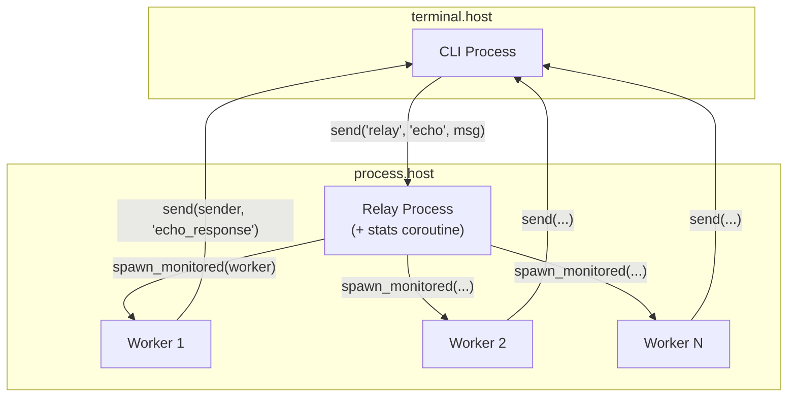

# Echoサービス

複数のWippyプロセス、チャネル、コルーチン、メッセージパッシング、プロセス監視を使うCLI Echoサービスを構築します。

**分類:** 実行可能なチュートリアルです。ローカルの単一ノードCLIアプリケーションに必要な
レジストリとLuaソース一式に加え、起動・検証手順も掲載しています。

## 概要

このチュートリアルでは、リレーサービスにメッセージを送信するCLIクライアントを作成し、リレーは各メッセージを処理するワーカーを生成します。以下を実演します：

- **プロセス生成** — 子プロセスを動的に作成
- **メッセージパッシング** — send/receive操作でプロセス間通信
- **チャネルとselect** — 複数のイベントソースを待機
- **コルーチン** — プロセス内で並行処理を実行
- **プロセス登録** — 名前でプロセスを検索
- **モニタリング** — 子プロセスのライフサイクルを追跡

## 前提条件

- `wippy`として実行できるWippyランタイム`v0.3.32a`。`wippy version --short`で確認してください。
- 対話型ターミナル。
- 空の作業ディレクトリ。以下のファイルを追加する前に、プロジェクトとソースディレクトリを作成します：

  ```bash
  mkdir echo-service
  cd echo-service
  mkdir src
  ```

## アーキテクチャ


```mermaid
flowchart TB
    subgraph terminal["terminal.host"]
        CLI["CLI Process"]
    end

    subgraph processes["process.host"]
        Relay["Relay Process<br/>(+ stats coroutine)"]
        W1["Worker 1"]
        W2["Worker 2"]
        W3["Worker N"]
    end

    CLI -->|"send('relay', 'echo', msg)"| Relay
    Relay -->|"spawn_monitored(worker)"| W1
    Relay -->|"spawn_monitored(...)"| W2
    Relay -->|"spawn_monitored(...)"| W3
    W1 -->|"send(sender, 'echo_response')"| CLI
    W2 -->|"send(...)"| CLI
    W3 -->|"send(...)"| CLI
```

## プロジェクト構造

```
echo-service/
├── wippy.lock
└── src/
    ├── _index.yaml
    ├── cli.lua
    ├── relay.lua
    └── worker.lua
```

## エントリ定義

`src/_index.yaml`を作成：

```yaml
version: "1.0"
namespace: app

entries:
  # Capabilities used by the CLI, relay, and workers in strict mode
  - name: process-policy
    kind: security.policy
    policy:
      actions:
        - process.host
        - process.registry.register
        - process.send
        - process.spawn
        - process.spawn.monitored
      resources: "*"
      effect: allow

  - name: terminal
    kind: terminal.host
    lifecycle:
      auto_start: true

  - name: processes
    kind: process.host
    lifecycle:
      auto_start: true

  - name: cli
    kind: process.lua
    source: file://cli.lua
    method: main
    modules:
      - io
      - time
    security:
      actor:
        id: app:cli
      policies:
        - app:process-policy

  - name: relay
    kind: process.lua
    source: file://relay.lua
    method: main
    modules:
      - logger
      - time
    security:
      actor:
        id: app:relay
      policies:
        - app:process-policy

  - name: relay-service
    kind: process.service
    process: app:relay
    host: app:processes
    lifecycle:
      auto_start: true

  - name: worker
    kind: process.lua
    source: file://worker.lua
    method: main
    modules:
      - time
    security:
      actor:
        id: app:worker
      policies:
        - app:process-policy
```

## リレープロセス

リレーは自身を登録し、メッセージを処理し、ワーカーを生成し、statsコルーチンを実行します。

`src/relay.lua`を作成：

```lua
local logger = require("logger")
local time = require("time")

local stats = {
    messages = 0,
    workers_spawned = 0
}

local function stats_reporter()
    while true do
        time.sleep("5s")
        logger:info("stats", {
            messages = stats.messages,
            workers_spawned = stats.workers_spawned
        })
    end
end

local function main()
    local inbox = process.inbox()
    local events = process.events()

    local _, register_err = process.registry.register("relay")
    if register_err then
        error("cannot register relay: " .. tostring(register_err))
    end
    logger:info("relay started", {pid = process.pid()})

    coroutine.spawn(stats_reporter)

    while true do
        local r = channel.select {
            inbox:case_receive(),
            events:case_receive()
        }

        if r.channel == events then
            local event = r.value
            if event.kind == process.event.EXIT then
                logger:info("worker exited", {
                    from = event.from,
                    result = event.result
                })
            end
        else
            local msg = r.value
            if msg:topic() == "echo" then
                local echo = msg:payload():data()
                stats.messages = stats.messages + 1

                local worker_pid, err = process.spawn_monitored(
                    "app:worker",
                    "app:processes",
                    echo.sender,
                    echo.data
                )

                if err then
                    logger:error("spawn failed", {error = tostring(err)})
                else
                    stats.workers_spawned = stats.workers_spawned + 1
                end
            end
        end
    end
end

return { main = main }
```

### 主要パターン {id="relay-key-patterns"}

**コルーチンの生成**

```lua
coroutine.spawn(stats_reporter)
```

メイン関数とメモリを共有するコルーチンを起動します。コルーチンは`time.sleep`などのI/O操作でyieldします。

**チャネルselect**

```lua
local r = channel.select {
    inbox:case_receive(),
    events:case_receive()
}
```

複数のチャネルを待機します。`r.channel`は選択されたチャネルを示し、`r.value`にデータが含まれます。

**ペイロードの抽出**

```lua
local echo = msg:payload():data()
```

メッセージにはトピック文字列用の`msg:topic()`とペイロード用の`msg:payload():data()`があります。

**モニタリング付き生成**

```lua
local worker_pid, err = process.spawn_monitored("app:worker", "app:processes", ...)
```

ワーカーを生成して監視を開始します。ワーカーが終了すると、リレーが`EXIT`イベントを受信します。

## ワーカープロセス

ワーカーは引数を直接受け取り、送信者にレスポンスを送信します。

`src/worker.lua`を作成：

```lua
local function main(sender_pid, data)
    local response = {
        data = string.upper(data),
        worker = process.pid()
    }

    local _, send_err = process.send(sender_pid, "echo_response", response)
    if send_err then
        error("cannot send echo response: " .. tostring(send_err))
    end

    return 0
end

return { main = main }
```

## CLIプロセス

CLIはリレーの登録名にメッセージを送信し、各レスポンスをタイムアウト付きで待機します。

`src/cli.lua`を作成：

```lua
local io = require("io")
local time = require("time")

local reset = "\027[0m"
local function dim(s) return "\027[2m" .. s .. reset end
local function green(s) return "\027[32m" .. s .. reset end
local function yellow(s) return "\027[33m" .. s .. reset end
local function cyan(s) return "\027[36m" .. s .. reset end

local function main()
    local inbox = process.inbox()

    -- Wait for relay to register its name
    local deadline = time.after("5s")
    while not process.registry.lookup("relay") do
        local tick = time.after("50ms")
        local r = channel.select { deadline:case_receive(), tick:case_receive() }
        if r.channel == deadline then
            io.print("relay not ready")
            return 1
        end
    end

    io.print(cyan("Echo Client"))
    io.print(dim("Type messages to echo. Ctrl+C to exit.\n"))

    while true do
        local _, write_err = io.write(yellow("> "))
        if write_err then
            io.eprint("cannot write prompt:", write_err)
            return 1
        end

        local _, flush_err = io.flush()
        if flush_err then
            io.eprint("cannot flush prompt:", flush_err)
            return 1
        end

        local input, read_err = io.readline()
        if read_err then
            io.eprint("cannot read input:", read_err)
            return 1
        end

        if not input or #input == 0 then
            break
        end

        local msg = {
            sender = process.pid(),
            data = input
        }
        local _, err = process.send("relay", "echo", msg)
        if err then
            io.print(dim("  error: " .. tostring(err)))
        else
            local timeout = time.after("2s")
            local r = channel.select {
                inbox:case_receive(),
                timeout:case_receive()
            }

            if r.channel == timeout then
                io.print(dim("  timeout"))
            else
                local msg = r.value
                if msg:topic() == "echo_response" then
                    local resp = msg:payload():data()
                    io.print(green("  " .. resp.data))
                    io.print(dim("  from worker: " .. resp.worker))
                end
            end
        end
    end

    io.print("\nGoodbye!")
    return 0
end

return { main = main }
```

### 主要パターン {id="cli-key-patterns"}

**名前で送信**

```lua
process.send("relay", "echo", msg)
```

`process.send`は登録名を送信先として受け付け、その名前を解決できない場合はエラーを返します。

**タイムアウトパターン**

```lua
local timeout = time.after("2s")
local r = channel.select {
    inbox:case_receive(),
    timeout:case_receive()
}
if r.channel == timeout then
    -- timed out
end
```

## 実行

```bash
wippy init
wippy run -x app:cli
```

出力例：

```
Echo Client
Type messages to echo. Ctrl+C to exit.

> hello world
  HELLO WORLD
  from worker: {app:processes|0x00004}
```

ワーカーPIDは実行時に生成されるため、表示される値は異なります。複数行を入力し、各レスポンスが
大文字になることを確認してください。空行を送信すると正常に終了します。

## トラブルシューティングとクリーンアップ

- `relay not ready`は、自動起動したリレーが5秒以内に登録されなかったことを示します。
  ランタイムログでリレーの起動、ポリシー、レジストリエラーを確認してください。
- `not allowed to spawn`または`not allowed to send`は、プロセスエントリに上記の
  `app:process-policy`セキュリティコンテキストがないことを示します。
- `no terminal host found`は`terminal.host`エントリがないことを示します。複数のターミナルホストがある場合は、
  実行コマンドに`--host app:terminal`を追加してください。
- 送信後のタイムアウトは、ワーカーがレスポンスを返さなかったことを示します。リレーログで生成エラーを確認し、
  `app:worker`と`app:processes`がエントリ名と一致していることを確認してください。
- 空行を送信するとCLIが終了します。ランタイムが動作し続ける場合はCtrl+Cを押してください。
  使い捨ての演習であれば、ディレクトリを離れた後に`echo-service/`を削除してください。

## 次のステップ

- [プロセス管理](lua/core/process.md) — プロセスAPIリファレンス
- [チャネル](lua/core/channel.md) — チャネルAPIリファレンス
- [時間とDuration](lua/core/time.md) — 時間APIリファレンス
