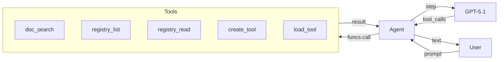
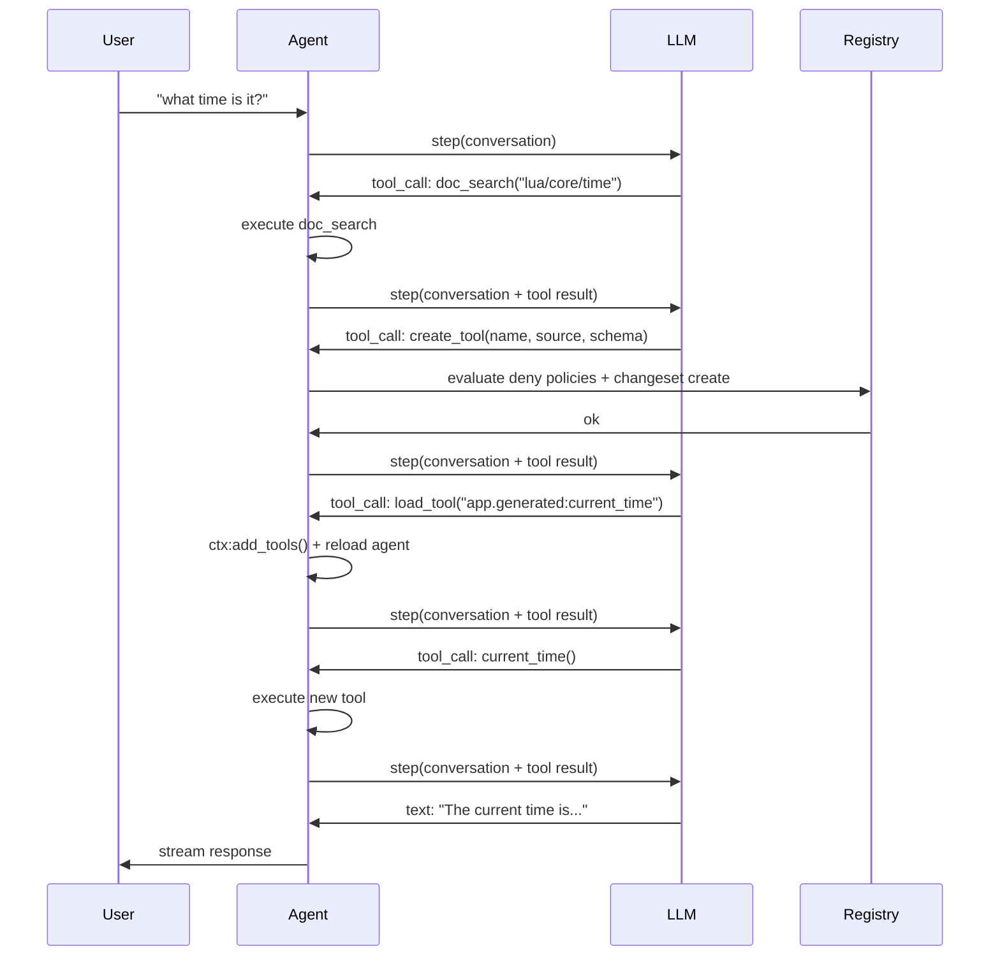
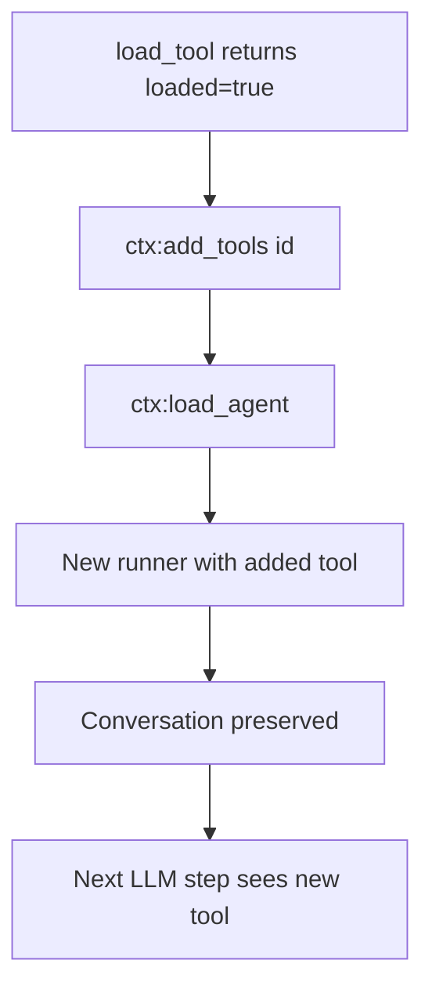
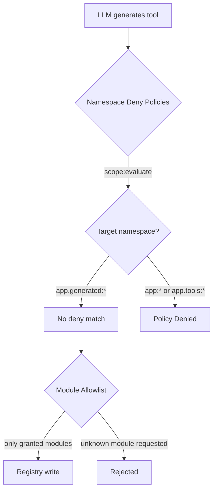

# Micro AGI

ランタイム中に自分専用のツールを作成する自己改変型エージェントを構築します — ドキュメントを読み、Lua を書き、レジストリにエントリを登録し、それをアクティブなセッションへロードします。

## 構築するもの

以下を行うターミナルエージェントです：
- LLM とストリーミングで質問に回答する
- Wippy ドキュメントを検索して API を学ぶ
- レジストリを調査して既存の機能を発見する
- 機能が不足しているときに新しいツールを動的に作成する
- 圧縮を介して自身のコンテキストウィンドウを管理する



## アーキテクチャ

エージェントはレジストリへのアクセスを持つ Wippy プロセスとして実行されます。LLM が持っていない機能が必要だと判断すると、自己改変ループを使用します：



重要な洞察：ツールはレジストリエントリです。ツールを作成するとは、`data.source` にインライン Lua ソースを持つ `function.lua` エントリを書き込むだけです。エージェントランタイムは他のエントリと同じようにそれをコンパイルしてロードします。

## プロジェクト構造

```
micro-agi/
├── .wippy.yaml
├── wippy.yaml
└── src/
    ├── _index.yaml
    ├── README.md
    ├── agent.lua
    └── tools/
        ├── _index.yaml
        ├── doc_search.lua
        ├── registry_list.lua
        ├── registry_read.lua
        ├── create_tool.lua
        └── load_tool.lua
```

## インフラストラクチャ

`.wippy.yaml` を作成します：

```yaml
version: "1.0"

logger:
  encoding: console
```

## エントリ定義

`src/_index.yaml` をインフラストラクチャ、セキュリティポリシー、モデル、エージェント、プロセスとともに作成します：

```yaml
version: "1.0"
namespace: app

entries:
  - name: definition
    kind: ns.definition
    readme: file://README.md
    meta:
      title: Micro AGI
      description: Self-modifying development agent that builds its own tools at runtime
      depends_on: [wippy/llm, wippy/agent]

  - name: os_env
    kind: env.storage.os

  - name: processes
    kind: process.host
    lifecycle:
      auto_start: true

  - name: __dep.llm
    kind: ns.dependency
    component: wippy/llm
    version: "*"
    parameters:
      - name: env_storage
        value: app:os_env
      - name: process_host
        value: app:processes

  - name: __dep.agent
    kind: ns.dependency
    component: wippy/agent
    version: "*"
    parameters:
      - name: process_host
        value: app:processes
```

### セキュリティポリシー

2 つの `security.policy` エントリが、エージェントが書き込み可能な名前空間を制限します：

```yaml
  - name: deny_core_ns
    kind: security.policy
    policy:
      actions: "*"
      resources: "app:*"
      effect: deny
    groups:
      - agent_security

  - name: deny_tools_ns
    kind: security.policy
    policy:
      actions: "*"
      resources: "app.tools:*"
      effect: deny
    groups:
      - agent_security
```

これらのポリシーは `create_tool` によって名前付きスコープ（`app:agent_security`）としてロードされ、レジストリへの書き込み前に評価されます。エージェントは `app.generated:*` には書き込めますが（拒否ポリシーが一致しない）、`app:*`（コアエントリ、モデル、エージェント定義）や `app.tools:*`（組み込みツール）には書き込めません。

ポリシー評価の詳細については、[セキュリティモデル](system/security.md) を参照してください。

### モデル

2 つのモデルがそれぞれ異なる目的を果たします：

```yaml
  - name: gpt-5.1
    kind: registry.entry
    meta:
      name: gpt-5.1
      type: llm.model
      title: GPT-5.1
      comment: Reasoning model
      capabilities: [generate, tool_use, structured_output, vision, thinking]
      class: [reasoning]
      priority: 210
    max_tokens: 128000
    output_tokens: 32768
    pricing:
      input: 2.5
      output: 10
    providers:
      - id: wippy.llm.openai:provider
        options:
          reasoning_model_request: true
        provider_model: gpt-5.1
    thinking_effort: 10

  - name: gpt-4.1-nano
    kind: registry.entry
    meta:
      name: gpt-4.1-nano
      type: llm.model
      title: GPT-4.1 Nano
      comment: Compression model
      capabilities: [generate, tool_use, structured_output]
      class: [fast]
      priority: 100
    max_tokens: 1047576
    output_tokens: 32768
    pricing:
      input: 0.1
      output: 0.4
    providers:
      - id: wippy.llm.openai:provider
        provider_model: gpt-4.1-nano
```

GPT-5.1 は推論とツール使用を担当します。GPT-4.1 Nano は 25 倍低コストでコンテキスト圧縮を担当します。

### エージェント定義

```yaml
  - name: dev_assistant
    kind: registry.entry
    meta:
      type: agent.gen1
      name: dev_assistant
      title: Dev Assistant
      comment: Wippy development assistant
    prompt: |
      Self-modifying Wippy development agent. You run inside Wippy runtime
      with access to docs, registry, and dynamic tool creation.

      Rules:
      - NEVER fabricate, guess, or hallucinate facts. If you need real data,
        use or build a tool to get it. Only state what a tool actually returned.
      - Maximum 2-3 sentences per response. No bullet lists. No disclaimers.
      - Never say "I can't" or "I don't have". Build the tool and do it.
      - Act first, explain only if asked.

      To gain new capabilities: doc_search the API, create_tool with Lua source,
      load_tool, call it. All in one turn.
    model: gpt-5.1
    max_tokens: 2048
    tools:
      - "app.tools:*"
```

プロンプトは意図的に簡潔です。重要なルール：
- **ハルシネーションなし** — エージェントは実データのためにツールを使用しなければならない
- **自己改変** — 拒否する代わりにツールを構築する
- **説明より行動** — 先に実行し、聞かれたら説明する

### プロセス

```yaml
  - name: agent
    kind: process.lua
    meta:
      command:
        name: agent
        short: Start dev assistant
    source: file://agent.lua
    method: main
    modules: [io, json, process, funcs, registry, time, security]
    imports:
      prompt: wippy.llm:prompt
      agent_context: wippy.agent:context
      compress: wippy.llm.util:compress
```

プロセスはターミナルコマンドとして実行されます。セキュリティ強制は `create_tool` 内部で行われ、`agent_security` ポリシーグループをロードして書き込み前に評価します。

インポート：
- `prompt` — 会話ビルダー
- `agent_context` — エージェントのロードと動的ツール管理
- `compress` — コンテキスト管理用の LLM ベースのテキスト圧縮

## ツール

`src/tools/_index.yaml` を 5 つのツールとともに作成します：

### doc_search

`wippy.ai/llm` API 経由で Wippy ドキュメントをフェッチします。2 つのモードをサポート：パスでページを取得するか、クエリで検索します。

```lua
local http_client = require("http_client")
local json = require("json")

local BASE_URL = "https://wippy.ai/llm"
local MAX_CHARS = 8000

local function fetch_page(path)
    local url = BASE_URL .. "/path/en/" .. path
    local resp, err = http_client.get(url, {
        headers = { ["User-Agent"] = "wippy-agent/1.0" },
    })
    if err then
        return nil, tostring(err)
    end
    if resp.status_code ~= 200 then
        return nil, "HTTP " .. resp.status_code
    end

    local body = resp.body or ""
    if #body > MAX_CHARS then
        body = body:sub(1, MAX_CHARS) .. "\n... (truncated)"
    end
    return body, nil
end

local function search_docs(query)
    local url = BASE_URL .. "/search?q=" .. query
    local resp, err = http_client.get(url, {
        headers = { ["User-Agent"] = "wippy-agent/1.0" },
    })
    if err then
        return { error = tostring(err) }
    end
    if resp.status_code ~= 200 then
        return { error = "HTTP " .. resp.status_code }
    end

    local body = resp.body or ""
    if #body > MAX_CHARS then
        body = body:sub(1, MAX_CHARS) .. "\n... (truncated)"
    end

    return { results = body }
end

local function handler(input)
    if input.path then
        local content, err = fetch_page(input.path)
        if err then
            return { error = err }
        end
        return { path = input.path, content = content }
    end

    if input.query then
        return search_docs(input.query)
    end

    return { error = "provide either 'path' or 'query'" }
end

return { handler = handler }
```

### create_tool

自己改変の中核です。名前空間の拒否ポリシーを評価し、インライン Lua ソースを持つ `function.lua` エントリをレジストリに作成します。

生成されるエントリの `modules` フィールドは、ツールがアクセスできる範囲を制御します。リストにないモジュールはそのエントリに対して単純に存在しません — ブロックする対象もスキャンする対象もありません。

```lua
local registry = require("registry")
local json = require("json")
local security = require("security")

local NAMESPACE = "app.generated"
local MAX_SOURCE_LEN = 16000
local MAX_NAME_LEN = 64

local ALLOWED_MODULES = {
    time = true, json = true, http_client = true, expr = true,
    text = true, base64 = true, yaml = true, crypto = true,
    hash = true, uuid = true, url = true,
}
```

**ポリシー評価** — `create_tool` は `agent_security` 名前付きスコープをロードし、対象のエントリ ID に対して拒否ポリシーを評価します。`app:*` または `app.tools:*` への書き込みは拒否されます。`app.generated:*` への書き込みは通過します（一致する拒否ポリシーがありません）：

```lua
local actor = security.new_actor("service:agent", { role = "agent" })
local scope, scope_err = security.named_scope("app:agent_security")
if scope_err then
    return { error = "failed to load security scope: " .. tostring(scope_err) }
end

local result = scope:evaluate(actor, action, id)
if result == "deny" then
    return { error = "policy denied: " .. action .. " on " .. id }
end
```

**レジストリ書き込み** — エントリは `data.source` にソースを持ち、許可されたモジュールのみを伴って書き込まれます：

```lua
local entry = {
    id = id,
    kind = "function.lua",
    meta = {
        type = "tool",
        title = input.name,
        comment = input.description,
        input_schema = schema,
        llm_alias = input.name,
        llm_description = input.description,
    },
    data = {
        source = input.source,
        modules = modules,
        method = "handler",
    },
}

local snap = registry.snapshot()
local changes = snap:changes()
if existing then
    changes:update(entry)
else
    changes:create(entry)
end
changes:apply()
```

ディスク上にファイルはありません。ツールは完全にレジストリ内に存在します。

### load_tool

エントリがツールであることを検証し、エージェントループにリロードを通知します：

```lua
local function handler(input)
    local entry, err = registry.get(input.id)
    if err then
        return { error = tostring(err) }
    end
    if not entry then
        return { error = "not found: " .. input.id }
    end
    if not entry.meta or entry.meta.type ~= "tool" then
        return { error = "not a tool (meta.type != 'tool'): " .. input.id }
    end

    return {
        loaded = true,
        id = entry.id,
        alias = entry.meta.llm_alias or input.id,
        description = entry.meta.llm_description or "",
    }
end
```

エージェントループは結果内の `loaded = true` を検出し、`ctx:add_tools(id)` の後に `ctx:load_agent()` を呼び出して、新しいツールを伴うエージェントを再コンパイルします。

## エージェントループ

`src/agent.lua` のエージェントループは、ストリーミング、ツール実行、動的ロード、コンテキスト圧縮を処理します。

### ストリーミング

[LLM エージェントチュートリアル](tutorials/llm-agent.md) と同じコルーチン + チャネルパターンを使用します：

```lua
coroutine.spawn(function()
    local response, err = session.runner:step(session.conversation, {
        stream_target = {
            reply_to = process.pid(),
            topic = STREAM_TOPIC,
        },
    })
    done_ch:send({ response = response, err = err })
end)
```

### ツール実行

ツールは安全のため `pcall` を伴って `funcs.call()` 経由で呼ばれます：

```lua
local ok, result = pcall(funcs.call, tc.registry_id, args)
```

### 動的ツールロード

`load_tool` が `loaded = true` を返すと、エージェントは自身をリロードします：



```lua
local function handle_tool_loading(tool_calls, results)
    local reload_needed = false
    for _, tc in ipairs(tool_calls) do
        if tc.name == "load_tool" then
            local result = results[tc.id]
            if result and result.loaded then
                session.ctx:add_tools(result.id)
                reload_needed = true
            end
        end
    end
    if reload_needed then
        reload_agent()
    end
end
```

会話はランナーではなくプロンプトビルダー内に存在するため、リロード間で保持されます。

### コンテキスト圧縮

プロンプトトークンが 96K（128K コンテキストウィンドウの 75%）を超えると、GPT-4.1 Nano を使用して会話が圧縮されます：

```lua
if response.tokens and response.tokens.prompt_tokens
    and response.tokens.prompt_tokens > PROMPT_TOKEN_LIMIT then
    try_compress()
end
```

圧縮はメッセージコンテンツを抽出し、4000 文字をターゲットに `compress.to_size()` を呼び出し、会話をサマリーに置き換えます：

```lua
local summary = compress.to_size(COMPRESS_MODEL, full_text, COMPRESS_TARGET)
session.conversation = prompt.new()
session.conversation:add_system("Conversation summary:\n\n" .. summary)
```

## セキュリティモデル

エージェントは名前空間の拒否ポリシーとモジュールレベルのアクセス制御で保護されています。



### 名前空間の拒否ポリシー

| ポリシー | リソース | 効果 |
|--------|-----------|--------|
| `deny_core_ns` | `app:*` | deny |
| `deny_tools_ns` | `app.tools:*` | deny |

`create_tool` は `agent_security` ポリシーグループをロードし、対象のエントリ ID に対して評価します。拒否ポリシーは `app:*` と `app.tools:*` のみに一致するため、`app.generated:*` への書き込みは通過します（結果は `undefined` で、「拒否されていない」を意味します）。

これによりエージェントは以下を行うことができません：
- 自身のプロンプトやエージェント定義（`app:dev_assistant`）の改変
- 組み込みツール（`app.tools:*`）の上書き
- インフラストラクチャエントリ（`app:processes` など）の変更

### モジュールアクセス制御

生成されたツールは `data.modules` でその `modules` を宣言します。`ALLOWED_MODULES` セットからのモジュールのみが許可されます。Wippy ランタイムはこれをモジュールレベルで強制します — モジュールがエントリにリストされていない場合、`require()` はエラーを返します。スキャンする対象がないため、ソースコードのスキャンは行いません：許可されていないモジュールは実行コンテキスト内に存在しません。

## 実行

Hub から直接実行します：

```bash
wippy run wippy/micro-agi agent
```

またはクローンしてローカルで実行します：

```bash
cd micro-agi
wippy init && wippy update
wippy run agent
```

```
dev assistant (quit to exit)

> what time is it?
  [doc_search] ok
  [create_tool] ok
  [load_tool] ok
  [+] app.generated:current_time_utc
  [current_time_utc] ok
The current UTC time is 2026-02-13T03:13:41Z.

> fetch https://httpbin.org/get and show my ip
  [create_tool] ok
  [load_tool] ok
  [+] app.generated:http_get
  [http_get] ok
Your IP is 203.0.113.42.
```

## 次のステップ

- [LLM エージェント](tutorials/llm-agent.md) — 基本的なエージェントをゼロから構築する
- [エージェントモジュール](framework/agents.md) — エージェントフレームワークリファレンス
- [レジストリ](concepts/registry.md) — レジストリの仕組み
- [セキュリティモデル](system/security.md) — 宣言的セキュリティポリシー
- [エントリ種別](guides/entry-kinds.md) — 利用可能なエントリ種別
