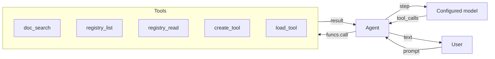
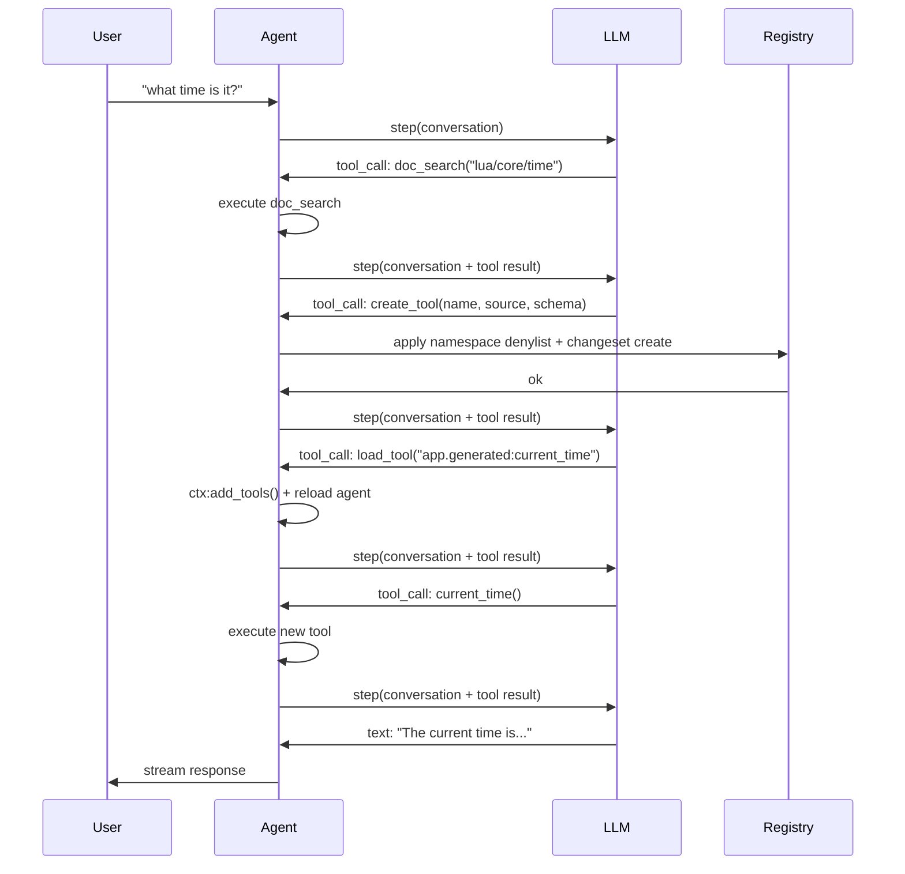
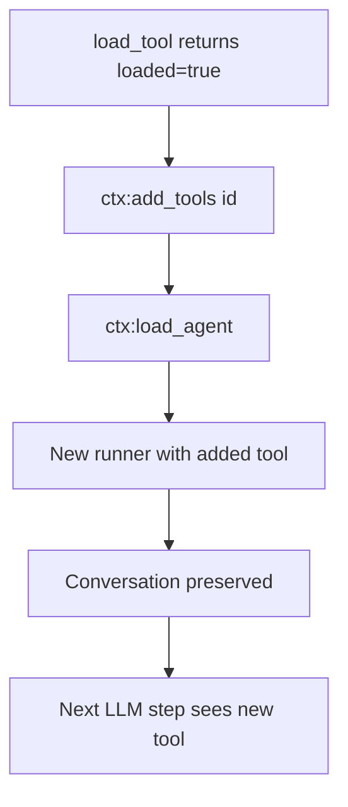
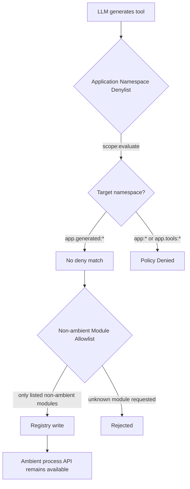

# Micro AGI

ドキュメントを読み、Luaツールを生成し、実行時に登録してアクティブなセッションへ読み込むエージェントを学びます。

**分類: リファレンス実装のウォークスルー。** 公開済み`wippy/micro-agi`モジュールのスニペットを説明しますが、
完全なソースツリーではありません。実装を試すにはHubモジュールを実行し、自己完結した構築手順が必要なら
LLMエージェントチュートリアルを使用してください。

## パッケージが示すもの

以下を行うターミナルエージェントです：

- LLMからの回答をストリーミングする。
- WippyドキュメントでAPIを検索する。
- レジストリから既存の機能を調べる。
- 必要な機能がない場合にツールを作成して読み込む。
- コンテキスト上限に近づくと会話履歴を圧縮する。


```mermaid
flowchart LR
    User -->|prompt| Agent
    Agent -->|step| LLM[Configured model]
    LLM -->|tool_calls| Agent
    Agent -->|funcs.call| Tools
    Tools -->|result| Agent
    Agent -->|text| User

    subgraph Tools
        doc_search
        registry_list
        registry_read
        create_tool
        load_tool
    end
```

## アーキテクチャ

エージェントはレジストリへのアクセスを持つ Wippy プロセスとして実行されます。LLM が持っていない機能が必要だと判断すると、自己改変ループを使用します：


```mermaid
sequenceDiagram
    participant U as User
    participant A as Agent
    participant L as LLM
    participant R as Registry

    U->>A: "what time is it?"
    A->>L: step(conversation)
    L->>A: tool_call: doc_search("lua/core/time")
    A->>A: execute doc_search
    A->>L: step(conversation + tool result)
    L->>A: tool_call: create_tool(name, source, schema)
    A->>R: apply namespace denylist + changeset create
    R->>A: ok
    A->>L: step(conversation + tool result)
    L->>A: tool_call: load_tool("app.generated:current_time")
    A->>A: ctx:add_tools() + reload agent
    A->>L: step(conversation + tool result)
    L->>A: tool_call: current_time()
    A->>A: execute new tool
    A->>L: step(conversation + tool result)
    L->>A: text: "The current time is..."
    A->>U: stream response
```

ツールはレジストリエントリです。作成時には`data.source`にインラインLuaソースを持つ`function.lua`エントリを書き、
ランタイムがそのエントリをコンパイルして読み込みます。

## 公開パッケージの構造

これらのファイルはすべてパッケージが所有します。このページでは`doc_search.lua`とアーキテクチャ上重要な
契約を再掲しますが、レジストリヘルパー、changeset処理、動的ローダー、エージェントループは省略しています。
特に`create_tool`、`load_tool`、`agent.lua`の各セクションはそのままコピーできる完全なファイルではなく抜粋です。
`registry_list`と`registry_read`の完全なレジストリ定義も公開モジュール側にあります。

```
micro-agi/
├── .wippy.yaml
├── wippy.yaml
└── src/
    ├── _index.yaml
    ├── README.md
    ├── agent.lua
    └── tools/
        ├── _index.yaml
        ├── doc_search.lua
        ├── registry_list.lua
        ├── registry_read.lua
        ├── create_tool.lua
        └── load_tool.lua
```

## インフラストラクチャ

パッケージは次の`.wippy.yaml`設定を使用します：

```yaml
version: "1.0"

logger:
  encoding: console
```

## エントリ定義

以下はインフラストラクチャ、セキュリティポリシー、モデル、エージェント、プロセスを示す
`src/_index.yaml`の抜粋です：

```yaml
version: "1.0"
namespace: app

entries:
  - name: definition
    kind: ns.definition
    readme: file://README.md
    meta:
      title: Micro AGI
      description: Self-modifying development agent that builds its own tools at runtime
      depends_on: [wippy/llm, wippy/agent]

  - name: os_env
    kind: env.storage.os

  - name: processes
    kind: process.host
    lifecycle:
      auto_start: true

  - name: __dep.llm
    kind: ns.dependency
    component: wippy/llm
    version: "*"
    parameters:
      - name: env_storage
        value: app:os_env
      - name: process_host
        value: app:processes

  - name: __dep.agent
    kind: ns.dependency
    component: wippy/agent
    version: "*"
    parameters:
      - name: process_host
        value: app:processes
```

### セキュリティポリシー

2つの`security.policy`エントリが、アプリケーションレベルの名前空間denylistを構成します：

```yaml
  - name: deny_core_ns
    kind: security.policy
    policy:
      actions: "*"
      resources: "app:*"
      effect: deny
    groups:
      - agent_security

  - name: deny_tools_ns
    kind: security.policy
    policy:
      actions: "*"
      resources: "app.tools:*"
      effect: deny
    groups:
      - agent_security
```

`create_tool`はこれらを名前付きスコープ`app:agent_security`として読み込みます。`app:*`または`app.tools:*`に
明示的な`deny`が返れば拒否し、`app.generated:*`に一致しない`undefined`は独自フィルター上で通過させます。
これはWippyランタイムの認可ではありません。保護された操作には実行コンテキストからの明示的な`allow`が必要で、
後述のsecurityモジュール操作や`changes:apply()`内の`registry.apply`も含まれます。

ポリシー評価の詳細は[セキュリティモデル](../system/security.md)を参照してください。

### モデル

2 つのモデルがそれぞれ異なる目的を果たします：

```yaml
  - name: gpt-5.1
    kind: registry.entry
    meta:
      name: gpt-5.1
      type: llm.model
      title: GPT-5.1
      comment: Reasoning model
      capabilities: [generate, tool_use, structured_output, vision, thinking]
      class: [reasoning]
      priority: 210
    max_tokens: 400000
    output_tokens: 128000
    pricing:
      input: 1.25
      output: 10
    providers:
      - id: wippy.llm.openai:provider
        options:
          reasoning_model_request: true
        provider_model: gpt-5.1

  - name: gpt-4.1-nano
    kind: registry.entry
    meta:
      name: gpt-4.1-nano
      type: llm.model
      title: GPT-4.1 Nano
      comment: Compression model
      capabilities: [generate, tool_use, structured_output]
      class: [fast]
      priority: 100
    max_tokens: 1047576
    output_tokens: 32768
    pricing:
      input: 0.1
      output: 0.4
    providers:
      - id: wippy.llm.openai:provider
        provider_model: gpt-4.1-nano
```

GPT-5.1は推論とツール使用を担当し、GPT-4.1 Nanoはコンテキスト圧縮を担当します。

### エージェント定義

```yaml
  - name: dev_assistant
    kind: registry.entry
    meta:
      type: agent.gen1
      name: dev_assistant
      title: Dev Assistant
      comment: Wippy development assistant
    prompt: |
      Self-modifying Wippy development agent. You run inside Wippy runtime
      with access to docs, registry, and dynamic tool creation.

      Rules:
      - NEVER fabricate, guess, or hallucinate facts. If you need real data,
        use or build a tool to get it. Only state what a tool actually returned.
      - Maximum 2-3 sentences per response. No bullet lists. No disclaimers.
      - Never say "I can't" or "I don't have". Build the tool and do it.
      - Act first, explain only if asked.

      To gain new capabilities: doc_search the API, create_tool with Lua source,
      load_tool, call it. All in one turn.
    model: gpt-5.1
    thinking_effort: 10
    max_tokens: 2048
    tools:
      - "app.tools:*"
```

プロンプトはエージェントに3つの運用ルールを与えます：

- **取得したデータを使う** — 外部の事実にはツールを使う。
- **不足した機能を作る** — 許可された機能がない場合はツールを構築する。
- **行動を優先する** — 説明より先に要求された操作を実行する。

### プロセス

```yaml
  - name: agent
    kind: process.lua
    meta:
      command:
        name: agent
        short: Start dev assistant
    source: file://agent.lua
    method: main
    modules: [io, json, funcs, registry, time, security]
    imports:
      prompt: wippy.llm:prompt
      agent_context: wippy.agent:context
      compress: wippy.llm.util:compress
```

プロセスはターミナルコマンドとして実行されます。`create_tool`は書き込み前にパッケージのdenylistを適用しますが、
このフィルターはコマンドのランタイムセキュリティコンテキストを提供しません。

インポート：

- `prompt` — 会話ビルダー
- `agent_context` — エージェントのロードと動的ツール管理
- `compress` — コンテキスト管理用の LLM ベースのテキスト圧縮

## ツール

`src/tools/_index.yaml` を 5 つのツールとともに作成します：

### doc_search

`wippy.ai/llm` API 経由で Wippy ドキュメントをフェッチします。2 つのモードをサポート：パスでページを取得するか、クエリで検索します。

```lua
local http_client = require("http_client")
local json = require("json")

local BASE_URL = "https://wippy.ai/llm"
local MAX_CHARS = 8000

local function fetch_page(path)
    local url = BASE_URL .. "/path/en/" .. path
    local resp, err = http_client.get(url, {
        headers = { ["User-Agent"] = "wippy-agent/1.0" },
    })
    if err then
        return nil, tostring(err)
    end
    if resp.status_code ~= 200 then
        return nil, "HTTP " .. resp.status_code
    end

    local body = resp.body or ""
    if #body > MAX_CHARS then
        body = body:sub(1, MAX_CHARS) .. "\n... (truncated)"
    end
    return body, nil
end

local function search_docs(query)
    local url = BASE_URL .. "/search?q=" .. http_client.encode_uri(query)
    local resp, err = http_client.get(url, {
        headers = { ["User-Agent"] = "wippy-agent/1.0" },
    })
    if err then
        return { error = tostring(err) }
    end
    if resp.status_code ~= 200 then
        return { error = "HTTP " .. resp.status_code }
    end

    local body = resp.body or ""
    if #body > MAX_CHARS then
        body = body:sub(1, MAX_CHARS) .. "\n... (truncated)"
    end

    return { results = body }
end

local function handler(input)
    if input.path then
        local content, err = fetch_page(input.path)
        if err then
            return { error = err }
        end
        return { path = input.path, content = content }
    end

    if input.query then
        return search_docs(input.query)
    end

    return { error = "provide either 'path' or 'query'" }
end

return { handler = handler }
```

### create_tool

このツールはパッケージの名前空間denylistを評価し、インラインLuaソースを持つ`function.lua`エントリをレジストリに作成します。

生成されるエントリの`modules`フィールドは、ツールがrequireできる非ambientランタイムモジュールを制御します。
`process`はすべての実行可能Luaエントリに組み込まれるため、省略してもセキュリティ境界にはなりません。
process操作は引き続きランタイムセキュリティポリシーに依存します。

```lua
local registry = require("registry")
local json = require("json")
local security = require("security")

local NAMESPACE = "app.generated"
local MAX_SOURCE_LEN = 16000
local MAX_NAME_LEN = 64

local ALLOWED_MODULES = {
    time = true, json = true, http_client = true, expr = true,
    text = true, base64 = true, yaml = true, crypto = true,
    hash = true, uuid = true,
}
```

**Denylist評価** — `create_tool`は`agent_security`名前付きスコープを読み込みます。
`app:*`または`app.tools:*`への書き込みはscopeが`deny`を返すと拒否され、
一致しない`app.generated:*`は`undefined`を返してこのアプリケーションフィルターを通過します：

```lua
local actor = security.new_actor("service:agent", { role = "agent" })
local scope, scope_err = security.named_scope("app:agent_security")
if scope_err then
    return { error = "failed to load security scope: " .. tostring(scope_err) }
end

local result = scope:evaluate(actor, action, id)
if result == "deny" then
    return { error = "policy denied: " .. action .. " on " .. id }
end
```

この確認だけではレジストリ変更を認可しません。現在のコマンドにはsecurityモジュール呼び出しと
`registry.apply`を明示的に許可するランタイムアクターとscopeも必要です。

**レジストリ書き込み** — エントリは`data.source`にソースを持ち、許可されたモジュールだけを伴って書き込まれます：

```lua
local entry = {
    id = id,
    kind = "function.lua",
    meta = {
        type = "tool",
        title = input.name,
        comment = input.description,
        input_schema = schema,
        llm_alias = input.name,
        llm_description = input.description,
    },
    data = {
        source = input.source,
        modules = modules,
        method = "handler",
    },
}

local snap = registry.snapshot()
local changes = snap:changes()
if existing then
    changes:update(entry)
else
    changes:create(entry)
end
local _, apply_err = changes:apply()
if apply_err then
    return { error = "failed to apply registry change: " .. tostring(apply_err) }
end
```

生成したツールはソースファイルへ書かれず、レジストリに保存されます。

### load_tool

エントリがツールであることを検証し、エージェントループにリロードを通知します：

```lua
local function handler(input)
    local entry, err = registry.get(input.id)
    if err then
        return { error = tostring(err) }
    end
    if not entry then
        return { error = "not found: " .. input.id }
    end
    if not entry.meta or entry.meta.type ~= "tool" then
        return { error = "not a tool (meta.type != 'tool'): " .. input.id }
    end

    return {
        loaded = true,
        id = entry.id,
        alias = entry.meta.llm_alias or input.id,
        description = entry.meta.llm_description or "",
    }
end
```

エージェントループは結果内の `loaded = true` を検出し、`ctx:add_tools(id)` の後に `ctx:load_agent()` を呼び出して、新しいツールを伴うエージェントを再コンパイルします。

## エージェントループ

`src/agent.lua` のエージェントループは、ストリーミング、ツール実行、動的ロード、コンテキスト圧縮を処理します。

### ストリーミング

[LLMエージェントチュートリアル](./llm-agent.md)と同じコルーチンとチャネルのパターンを使用します：

```lua
coroutine.spawn(function()
    local response, err = session.runner:step(session.conversation, {
        stream_target = {
            reply_to = process.pid(),
            topic = STREAM_TOPIC,
        },
    })
    done_ch:send({ response = response, err = err })
end)
```

### ツール実行

ツールは`funcs.call()`で呼ばれます。`pcall`はLuaでraiseされたエラーを捕捉し、
`funcs.call()`の通常の第2戻り値は呼び出しエラーを伝えます：

```lua
local ok, result, call_err = pcall(funcs.call, tc.registry_id, args)
if not ok then
    results[tc.id] = { error = tostring(result) }
elseif call_err then
    results[tc.id] = { error = tostring(call_err) }
else
    results[tc.id] = result
end
```

### 動的ツールロード

`load_tool` が `loaded = true` を返すと、エージェントは自身をリロードします：


```mermaid
flowchart TD
    A[load_tool returns loaded=true] --> B[ctx:add_tools id]
    B --> C[ctx:load_agent]
    C --> D[New runner with added tool]
    D --> E[Conversation preserved]
    E --> F[Next LLM step sees new tool]
```

```lua
local function handle_tool_loading(tool_calls, results)
    local reload_needed = false
    for _, tc in ipairs(tool_calls) do
        if tc.name == "load_tool" then
            local result = results[tc.id]
            if result and result.loaded then
                session.ctx:add_tools(result.id)
                reload_needed = true
            end
        end
    end
    if reload_needed then
        reload_agent()
    end
end
```

会話はランナーではなくプロンプトビルダー内に存在するため、リロード間で保持されます。

### コンテキスト圧縮

プロンプトトークンが300K（400Kコンテキストウィンドウの75%）を超えると、GPT-4.1 Nanoで会話を圧縮します：

```lua
if response.tokens and response.tokens.prompt_tokens
    and response.tokens.prompt_tokens > PROMPT_TOKEN_LIMIT then
    try_compress()
end
```

圧縮はメッセージコンテンツを抽出し、4000 文字をターゲットに `compress.to_size()` を呼び出し、会話をサマリーに置き換えます：

```lua
local summary, compress_err = compress.to_size(COMPRESS_MODEL, full_text, COMPRESS_TARGET)
if compress_err then
    return nil, compress_err
end
session.conversation = prompt.new()
session.conversation:add_system("Conversation summary:\n\n" .. summary)
```

## セキュリティモデル

アプリケーションdenylistとモジュール単位のアクセス制御が生成ツールを制約しますが、ランタイム認可の代わりにはなりません。


```mermaid
flowchart TD
    LLM[LLM generates tool] --> P{Application Namespace Denylist}
    P -->|scope:evaluate| Check{Target namespace?}
    Check -->|app.generated:*| OK[No deny match]
    Check -->|app:* or app.tools:*| Deny[Policy Denied]

    OK --> M{Non-ambient Module Allowlist}
    M -->|only listed non-ambient modules| R[Registry write]
    M -->|unknown module requested| Err[Rejected]
    R --> A[Ambient process API remains available]
```

### 名前空間denylist

| ポリシー | リソース | 効果 |
|--------|-----------|--------|
| `deny_core_ns` | `app:*` | deny |
| `deny_tools_ns` | `app.tools:*` | deny |

`create_tool`は`agent_security`ポリシーグループを読み込み、対象エントリIDを評価します。このアプリケーション
フィルターでは`undefined`を「拒否されていない」と扱います。Wippyの保護された認可は異なり、明示的な`allow`だけで
操作を許可します。このコードを実行するコンテキストには、必要なランタイム権限が引き続き必要です。

これによりエージェントは以下を行うことができません：
- 自身のプロンプトやエージェント定義（`app:dev_assistant`）の改変
- 組み込みツール（`app.tools:*`）の上書き
- インフラストラクチャエントリ（`app:processes` など）の変更

### モジュールアクセス制御

生成ツールは`data.modules`で非ambient機能を宣言し、`create_tool`は`ALLOWED_MODULES`の名前だけを受け付けます。
宣言されていない非ambientモジュールはrequireできません。ただしランタイムは生成ツールを含むすべての実行可能Luaエントリへ
`process`を注入するため、process操作は`data.modules`から省略するのではなくセキュリティポリシーで制約してください。

このチュートリアルは`process.spawn`や`process.exec`用のポリシーを定義しません。したがって生成ツールは完全なsandboxではありません。
信頼できないツールソースを許可する前に、ambient process操作用のランタイムポリシーを追加してください。

## 実行方法と現在のパッケージ制限

公開アーティファクトはHubモジュールです。`wippy.lock`を含まない空のディレクトリから開始してください。
Hub bootstrapは無関係なロックや複数rootのロックを拒否します。初回実行でデプロイ用ロックが作成され、
同じディレクトリでの以降の実行は一致するロックを再利用します。

```bash
mkdir micro-agi-deploy
cd micro-agi-deploy
wippy run wippy/micro-agi agent
```

このコマンドは選択したモジュールバージョンをダウンロードし、宣言済み依存関係を解決して`agent`コマンドを呼び出します。

このモジュールが期待するプロバイダー認証情報とモデル設定に加え、Hubダウンロードとドキュメント検索用の
レジストリ・ネットワークアクセスも必要です。このページはローカルcloneやlockfileを提供しないため、
再現可能なソースビルドとは説明していません。

レビュー対象リリースでは、`wippy/micro-agi` v0.3.1の`agent`に`meta.command.security`コンテキストがありません。
デフォルトのstrictモードでは、`funcs.call`、レジストリ読み書き、ドキュメント検索HTTPリクエストなどの
保護されたツール経路に必要な明示的allowが付与されません。したがって上記のツールと自己改変フローは、
default strict modeで成功する実行例ではなくリファレンス設計です。信頼できないコード生成器を動かすために
strictモードを無効化せず、まずパッケージへ必要なactionだけを持つ最小権限のcommand scopeを追加してください。

## 次のステップ

- [LLMエージェント](./llm-agent.md) — 基本的なエージェントをゼロから構築する
- [エージェントモジュール](../framework/agents.md) — エージェントフレームワークリファレンス
- [レジストリ](../concepts/registry.md) — レジストリの概念
- [セキュリティモデル](../system/security.md) — 宣言的セキュリティポリシー
- [エントリ種別](../guides/entry-kinds.md) — 利用可能なエントリ種別
