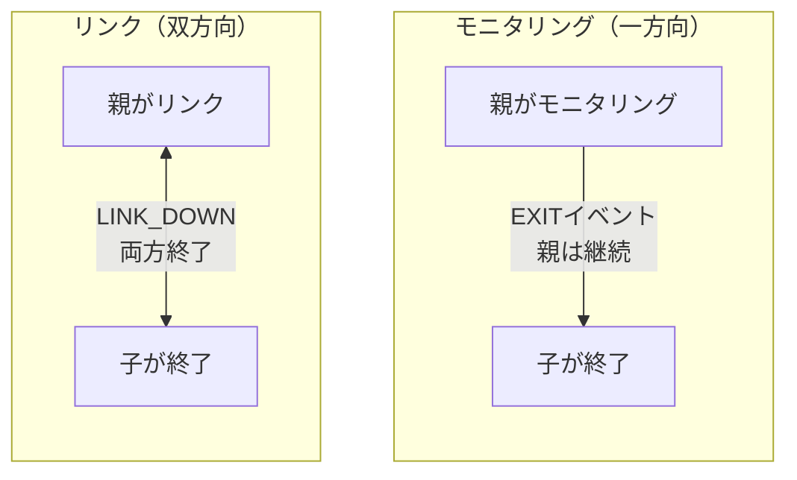

# プロセススーパービジョン

プロセスをモニタリングおよびリンクして、フォールトトレラントなシステムを構築します。

## モニタリングとリンク

**モニタリング**は一方向の監視を提供：
- 親が子をモニタリング
- 子が終了すると、親がEXITイベントを受信
- 親は実行を継続

**リンク**は双方向の運命共有を作成：
- 親と子がリンクされる
- どちらかのプロセスが失敗すると、両方が終了
- `trap_links=true`が設定されていない限り



## プロセスモニタリング

### モニタリング付き生成

`process.spawn_monitored()`を使用して生成とモニタリングを1回の呼び出しで実行：

```lua
local function main()
    local events_ch = process.events()

    -- ワーカーを生成してモニタリング開始
    local worker_pid, err = process.spawn_monitored(
        "app.workers:task_worker",
        "app:processes"
    )
    if err then
        return nil, "spawn failed: " .. tostring(err)
    end

    -- ワーカーの完了を待機
    local event = events_ch:receive()

    if event.kind == process.event.EXIT then
        print("Worker exited:", event.from)
        if event.result then
            print("Result:", event.result.value)
        end
        if event.result and event.result.error then
            print("Error:", event.result.error)
        end
    end
end
```

### 既存プロセスのモニタリング

すでに実行中のプロセスのモニタリングを開始するには`process.monitor()`を呼び出す：

```lua
local function main()
    local time = require("time")
    local events_ch = process.events()

    -- モニタリングなしで生成
    local worker_pid, err = process.spawn(
        "app.workers:long_worker",
        "app:processes"
    )
    if err then
        return nil, "spawn failed: " .. tostring(err)
    end

    -- 後でモニタリングを開始
    local ok, monitor_err = process.monitor(worker_pid)
    if monitor_err then
        return nil, "monitor failed: " .. tostring(monitor_err)
    end

    -- ワーカーをキャンセル
    time.sleep("5ms")
    process.cancel(worker_pid, "100ms")

    -- EXITイベントを受信
    local event = events_ch:receive()
    if event.kind == process.event.EXIT then
        print("Worker terminated:", event.from)
    end
end
```

### モニタリングの停止

EXITイベントの受信を停止するには`process.unmonitor()`を使用：

```lua
local function main()
    local time = require("time")
    local events_ch = process.events()

    -- 生成してモニタリング
    local worker_pid, err = process.spawn_monitored(
        "app.workers:long_worker",
        "app:processes"
    )

    time.sleep("5ms")

    -- モニタリングを停止
    local ok, unmon_err = process.unmonitor(worker_pid)
    if unmon_err then
        return nil, "unmonitor failed: " .. tostring(unmon_err)
    end

    -- ワーカーをキャンセル
    process.cancel(worker_pid, "100ms")

    -- EXITイベントは受信されない（モニタリング解除したため）
    local timeout = time.after("200ms")
    local result = channel.select {
        events_ch:case_receive(),
        timeout:case_receive(),
    }

    if result.channel == events_ch then
        return nil, "should not receive event after unmonitor"
    end
end
```

## プロセスリンク

### 明示的なリンク

双方向リンクを作成するには`process.link()`を使用：

```lua
-- ターゲットプロセスにリンクするワーカー
local function worker_main()
    local time = require("time")
    local events_ch = process.events()
    local inbox_ch = process.inbox()

    -- LINK_DOWNイベントを受信するためにtrap_linksを有効化
    process.set_options({ trap_links = true })

    -- 送信者からターゲットPIDを受信
    local msg = inbox_ch:receive()
    local target_pid = msg:payload():data()
    local sender = msg:from()

    -- 双方向リンクを作成
    local ok, err = process.link(target_pid)
    if err then
        return nil, "link failed: " .. tostring(err)
    end

    -- 送信者にリンク完了を通知
    process.send(sender, "linked", process.pid())

    -- ターゲット終了時のLINK_DOWNを待機
    local timeout = time.after("3s")
    local result = channel.select {
        events_ch:case_receive(),
        timeout:case_receive(),
    }

    if result.channel == events_ch then
        local event = result.value
        if event.kind == process.event.LINK_DOWN then
            return "LINK_DOWN_RECEIVED"
        end
    end

    return nil, "no LINK_DOWN received"
end
```

### リンク付き生成

`process.spawn_linked()`を使用して生成とリンクを1回の呼び出しで実行：

```lua
local function parent_main()
    -- 子の死亡を処理するためにtrap_linksを有効化
    process.set_options({ trap_links = true })

    local events_ch = process.events()

    -- 子を生成してリンク
    local child_pid, err = process.spawn_linked(
        "app.workers:child_worker",
        "app:processes"
    )
    if err then
        return nil, "spawn_linked failed: " .. tostring(err)
    end

    -- 子が死亡するとLINK_DOWNを受信
    local event = events_ch:receive()
    if event.kind == process.event.LINK_DOWN then
        print("Child died:", event.from)
    end
end
```

## トラップリンク

デフォルトでは、リンクされたプロセスが失敗すると、現在のプロセスも失敗します。代わりにLINK_DOWNイベントを受信するには`trap_links=true`を設定します。

### デフォルト動作（trap_links=false）

`trap_links`なしでは、リンクされたプロセスの失敗は現在のプロセスを終了させます：

```lua
local function worker_main()
    local events_ch = process.events()

    -- trap_linksはデフォルトでfalse
    local opts = process.get_options()
    print("trap_links:", opts.trap_links)  -- false

    -- 失敗するリンクされたワーカーを生成
    local child_pid, err = process.spawn_linked(
        "app.workers:error_worker",
        "app:processes"
    )

    -- 子がエラーを起こすと、このプロセスは終了
    -- この地点には到達しない
    local event = events_ch:receive()
end
```

### trap_links=trueの場合

LINK_DOWNイベントを受信して生存するには`trap_links`を有効化：

```lua
local function worker_main()
    -- trap_linksを有効化
    process.set_options({ trap_links = true })

    local events_ch = process.events()

    -- 失敗するリンクされたワーカーを生成
    local child_pid, err = process.spawn_linked(
        "app.workers:error_worker",
        "app:processes"
    )

    -- LINK_DOWNイベントを待機
    local event = events_ch:receive()

    if event.kind == process.event.LINK_DOWN then
        print("Child failed, handling gracefully")
        return "LINK_DOWN_RECEIVED"
    end
end
```

## キャンセル

### キャンセルシグナルの送信

プロセスを適切に終了させるには`process.cancel()`を使用：

```lua
local function main()
    local time = require("time")
    local events_ch = process.events()

    -- ワーカーを生成してモニタリング
    local worker_pid, err = process.spawn_monitored(
        "app.workers:long_worker",
        "app:processes"
    )

    time.sleep("5ms")

    -- クリーンアップ用に100msのタイムアウトでキャンセル
    local ok, cancel_err = process.cancel(worker_pid, "100ms")
    if cancel_err then
        return nil, "cancel failed: " .. tostring(cancel_err)
    end

    -- EXITイベントを待機
    local event = events_ch:receive()
    if event.kind == process.event.EXIT then
        print("Worker cancelled:", event.from)
    end
end
```

### キャンセルの処理

ワーカーは`process.events()`経由でCANCELイベントを受信：

```lua
local function worker_main()
    local events_ch = process.events()
    local inbox_ch = process.inbox()

    while true do
        local result = channel.select {
            inbox_ch:case_receive(),
            events_ch:case_receive(),
        }

        if result.channel == events_ch then
            local event = result.value
            if event.kind == process.event.CANCEL then
                -- リソースをクリーンアップ
                cleanup()
                return "cancelled gracefully"
            end
        else
            -- inboxメッセージを処理
            handle_message(result.value)
        end
    end
end
```

## スーパービジョントポロジー

### スタートポロジー

親に戻ってリンクする複数の子を持つ親：

```lua
-- 親ワーカーは親にリンクする子を生成
local function star_parent_main()
    local time = require("time")
    local events_ch = process.events()
    local child_count = 10

    -- 子の死亡を確認するためにtrap_linksを有効化
    process.set_options({ trap_links = true })

    local children = {}

    -- 子を生成
    for i = 1, child_count do
        local child_pid, err = process.spawn(
            "app.workers:linker_child",
            "app:processes"
        )
        if err then
            error("spawn child failed: " .. tostring(err))
        end

        -- 親のPIDを子に送信
        process.send(child_pid, "inbox", process.pid())
        children[child_pid] = true
    end

    -- すべての子がリンク確認を待機
    for i = 1, child_count do
        local msg = process.inbox():receive()
        if msg:topic() ~= "linked" then
            error("expected linked confirmation")
        end
    end

    -- 失敗をトリガー - すべての子がLINK_DOWNを受信
    error("PARENT_STAR_FAILURE")
end
```

親にリンクする子ワーカー：

```lua
local function linker_child_main()
    local events_ch = process.events()
    local inbox_ch = process.inbox()

    -- 親のPIDを受信
    local msg = inbox_ch:receive()
    local parent_pid = msg:payload():data()

    -- 親にリンク
    process.link(parent_pid)

    -- リンク確認
    process.send(parent_pid, "linked", process.pid())

    -- 親が死亡したときのLINK_DOWNを待機
    local event = events_ch:receive()
    if event.kind == process.event.LINK_DOWN then
        return "parent_died"
    end
end
```

### チェーントポロジー

各ノードが親にリンクする線形チェーン：

```lua
-- チェーンルート: A -> B -> C -> D -> E
local function chain_root_main()
    local time = require("time")

    -- 最初の子を生成
    local child_pid, err = process.spawn_linked(
        "app.workers:chain_node",
        "app:processes",
        4  -- 残りの深さ
    )
    if err then
        error("spawn failed: " .. tostring(err))
    end

    -- チェーン構築を待機
    time.sleep("100ms")

    -- カスケードをトリガー - すべてのリンクされたプロセスが終了
    error("CHAIN_ROOT_FAILURE")
end
```

チェーンノードは次のノードを生成してリンク：

```lua
local function chain_node_main(depth)
    local time = require("time")

    if depth > 0 then
        -- チェーンの次を生成
        local child_pid, err = process.spawn_linked(
            "app.workers:chain_node",
            "app:processes",
            depth - 1
        )
        if err then
            error("spawn failed: " .. tostring(err))
        end
    end

    -- 親の死亡を待機（LINK_DOWNで自身の終了をトリガー）
    time.sleep("5s")
end
```

## スーパービジョン付きワーカープール

### 設定

```yaml
# src/_index.yaml
version: "1.0"
namespace: app

entries:
  - name: processes
    kind: process.host
    host:
      workers: 16
    lifecycle:
      auto_start: true
```

```yaml
# src/supervisor/_index.yaml
version: "1.0"
namespace: app.supervisor

entries:
  - name: pool
    kind: process.lua
    source: file://pool.lua
    method: main
    modules:
      - time
    lifecycle:
      auto_start: true
```

### スーパーバイザー実装

```lua
-- src/supervisor/pool.lua
local function main(worker_count)
    local time = require("time")
    worker_count = worker_count or 4

    -- ワーカーの死亡を処理するためにtrap_linksを有効化
    process.set_options({ trap_links = true })

    local events_ch = process.events()
    local workers = {}

    local function start_worker(id)
        local pid, err = process.spawn_linked(
            "app.workers:task_worker",
            "app:processes",
            id
        )
        if err then
            print("Failed to start worker " .. id .. ": " .. tostring(err))
            return nil
        end

        workers[pid] = {id = id, started_at = os.time()}
        print("Worker " .. id .. " started: " .. pid)
        return pid
    end

    -- 初期プールを起動
    for i = 1, worker_count do
        start_worker(i)
    end

    print("Supervisor started with " .. worker_count .. " workers")

    -- スーパービジョンループ
    while true do
        local timeout = time.after("60s")
        local result = channel.select {
            events_ch:case_receive(),
            timeout:case_receive(),
        }

        if result.channel == timeout then
            -- 定期的なヘルスチェック
            local count = 0
            for _ in pairs(workers) do count = count + 1 end
            print("Health check: " .. count .. " active workers")

        elseif result.channel == events_ch then
            local event = result.value

            if event.kind == process.event.LINK_DOWN then
                local dead_worker = workers[event.from]
                if dead_worker then
                    workers[event.from] = nil
                    local uptime = os.time() - dead_worker.started_at
                    print("Worker " .. dead_worker.id .. " died after " .. uptime .. "s, restarting")

                    -- 再起動前の短い遅延
                    time.sleep("100ms")
                    start_worker(dead_worker.id)
                end
            end
        end
    end
end

return { main = main }
```

## プロセス設定

### ワーカー定義

```yaml
# src/workers/_index.yaml
version: "1.0"
namespace: app.workers

entries:
  - name: task_worker
    kind: process.lua
    source: file://task_worker.lua
    method: main
    modules:
      - time
```

### ワーカー実装

```lua
-- src/workers/task_worker.lua
local function main(worker_id)
    local time = require("time")
    local events_ch = process.events()
    local inbox_ch = process.inbox()

    print("Task worker " .. worker_id .. " started")

    while true do
        local timeout = time.after("5s")
        local result = channel.select {
            inbox_ch:case_receive(),
            events_ch:case_receive(),
            timeout:case_receive(),
        }

        if result.channel == events_ch then
            local event = result.value
            if event.kind == process.event.CANCEL then
                print("Worker " .. worker_id .. " cancelled")
                return "cancelled"
            elseif event.kind == process.event.LINK_DOWN then
                print("Worker " .. worker_id .. " linked process died")
                return nil, "linked_process_died"
            end

        elseif result.channel == inbox_ch then
            local msg = result.value
            local topic = msg:topic()
            local payload = msg:payload():data()

            if topic == "work" then
                print("Worker " .. worker_id .. " processing: " .. payload)
                time.sleep("100ms")
                process.send(msg:from(), "result", "completed: " .. payload)
            end

        elseif result.channel == timeout then
            -- アイドルタイムアウト
            print("Worker " .. worker_id .. " idle")
        end
    end
end

return { main = main }
```

## プロセスホスト設定

プロセスホストは、プロセスを実行するOSスレッドの数を制御します：

```yaml
# src/_index.yaml
version: "1.0"
namespace: app

entries:
  - name: processes
    kind: process.host
    host:
      workers: 16  # OSスレッドの数
    lifecycle:
      auto_start: true
```

ワーカー設定：
- CPUバウンドな作業の並列性を制御
- 通常はCPUコア数に設定
- すべてのプロセスがこのスレッドプールを共有

## 主要コンセプト

**モニタリング**（一方向の監視）：
- `process.spawn_monitored()`または`process.monitor()`を使用
- モニタリング対象のプロセスが終了するとEXITイベントを受信
- 子が終了しても親は実行を継続

**リンク**（双方向の運命共有）：
- `process.spawn_linked()`または`process.link()`を使用
- デフォルト：どちらかのプロセスが失敗すると両方が終了
- `trap_links=true`の場合：代わりにLINK_DOWNイベントを受信

**キャンセル**：
- 適切なシャットダウンには`process.cancel(pid, timeout)`を使用
- ワーカーは`process.events()`経由でCANCELイベントを受信
- 強制終了前のクリーンアップ用タイムアウト期間

## イベントタイプ

| イベント | トリガー | 必要な設定 |
|---------|---------|-----------|
| `EXIT` | モニタリング対象のプロセスが終了 | `spawn_monitored()`または`monitor()` |
| `LINK_DOWN` | リンクされたプロセスが失敗 | `spawn_linked()`または`link()`と`trap_links=true` |
| `CANCEL` | `process.cancel()`が呼ばれた | なし（常に配信） |

## 次のステップ

- [プロセス](processes.md) - プロセスの基礎
- [チャネル](channels.md) - メッセージパッシングパターン
- [プロセスモジュール](lua/core/process.md) - APIリファレンス

