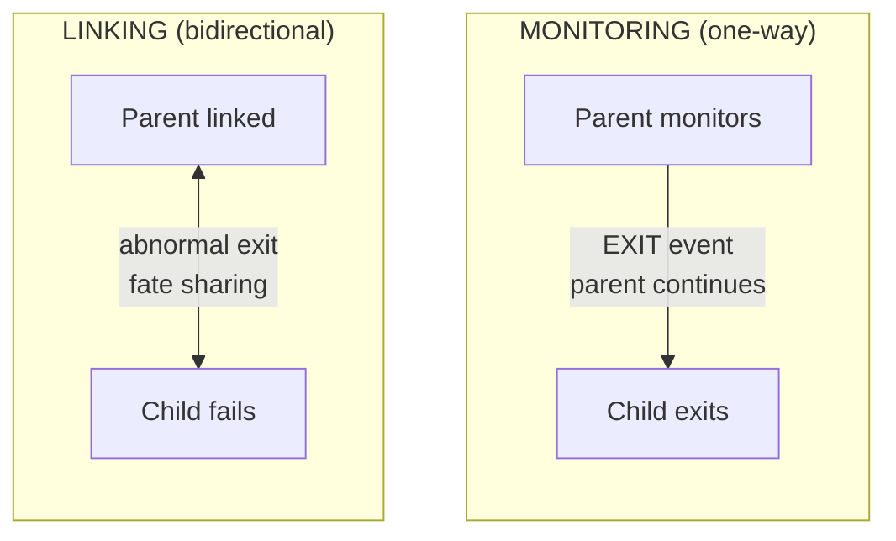

# プロセススーパービジョンのレシピ

監視とリンクを使ってプロセスの終了を観測し、障害を伝播し、キャンセルを処理し、ワーカーを再起動します。

**分類:** 部分的なレシピです。ライフサイクルの各スニペットは独立しています。ワーカープールのセクションは
主要なエントリを提供しますが、再起動を発生させて検証するための独立した制御プロセスは含みません。

## コンテキストと依存関係

各スニペットはWippyランタイム`v0.3.32a`を対象とし、実行可能なLuaエントリ、
`app:processes`という稼働中の`process.host`、`app.workers:task_worker`などプロジェクトで定義した
ワーカーエントリを前提とします。`process`と`channel` APIは実行コンテキストに組み込まれています。
`time.*`を呼び出すスニペットでは、エントリに`time`モジュールを追加し、ソースで
`local time = require("time")`を指定してください。

プロセスの生成、ホスト選択、監視、リンク、送信、キャンセル、終了は保護された操作です。
これらを使う実行可能エントリにはアクターと、範囲を限定したallowポリシーを付与してください。
以下のワーカープール設定には必要なポリシーが含まれますが、独立したスニペットには含まれません。

## モニタリングとリンク

**モニタリング**は一方向の監視を提供します：

- 親が子を監視します。
- 子が終了すると、親が`EXIT`イベントを受信します。
- 親は実行を継続します。

**リンク**は双方向に運命を共有します：

- 親と子がリンクされます。
- どちらかのプロセスが異常終了すると、もう一方も終了します。
- `trap_links=true`を設定すると、障害を処理可能なイベントへ変換できます。


```mermaid
flowchart TB
    subgraph Monitoring["MONITORING (one-way)"]
        direction TB
        P1[Parent monitors] -->|EXIT event<br/>parent continues| C1[Child exits]
    end

    subgraph Linking["LINKING (bidirectional)"]
        direction TB
        P2[Parent linked] <-->|abnormal exit<br/>fate sharing| C2[Child fails]
    end
```

## プロセスモニタリング

### モニタリング付きスポーン

`process.spawn_monitored()`を使用して生成とモニタリングを1回の呼び出しで実行:

```lua
local function main()
    local events_ch = process.events()

    -- Spawn worker and start monitoring
    local worker_pid, err = process.spawn_monitored(
        "app.workers:task_worker",
        "app:processes"
    )
    if err then
        return nil, "spawn failed: " .. tostring(err)
    end

    -- Wait for worker to complete
    local event = events_ch:receive()

    if event.kind == process.event.EXIT then
        print("Worker exited:", event.from)
        if event.result then
            print("Result:", event.result.value)
        end
        if event.result and event.result.error then
            print("Error:", event.result.error)
        end
    end
end
```

### 既存プロセスのモニタリング

すでに実行中のプロセスのモニタリングを開始するには`process.monitor()`を呼び出す:

```lua
local function main()
    local time = require("time")
    local events_ch = process.events()

    -- Spawn without monitoring
    local worker_pid, err = process.spawn(
        "app.workers:long_worker",
        "app:processes"
    )
    if err then
        return nil, "spawn failed: " .. tostring(err)
    end

    -- Start monitoring later
    local ok, monitor_err = process.monitor(worker_pid)
    if monitor_err then
        return nil, "monitor failed: " .. tostring(monitor_err)
    end

    -- Cancel the worker
    time.sleep("5ms")
    local _, cancel_err = process.cancel(worker_pid)
    if cancel_err then
        return nil, "cancel failed: " .. tostring(cancel_err)
    end

    -- Receive EXIT event
    local event = events_ch:receive()
    if event.kind == process.event.EXIT then
        print("Worker terminated:", event.from)
    end
end
```

### モニタリングの停止

EXITイベントの受信を停止するには`process.unmonitor()`を使用:

```lua
local function main()
    local time = require("time")
    local events_ch = process.events()

    -- Spawn and monitor
    local worker_pid, err = process.spawn_monitored(
        "app.workers:long_worker",
        "app:processes"
    )
    if err then
        return nil, "spawn failed: " .. tostring(err)
    end

    time.sleep("5ms")

    -- Stop monitoring
    local ok, unmon_err = process.unmonitor(worker_pid)
    if unmon_err then
        return nil, "unmonitor failed: " .. tostring(unmon_err)
    end

    -- Cancel worker
    local _, cancel_err = process.cancel(worker_pid)
    if cancel_err then
        return nil, "cancel failed: " .. tostring(cancel_err)
    end

    -- No EXIT event will be received (we unmonitored)
    local timeout = time.after("200ms")
    local result = channel.select {
        events_ch:case_receive(),
        timeout:case_receive(),
    }

    if result.channel == events_ch then
        return nil, "should not receive event after unmonitor"
    end
end
```

## プロセスリンク

### 明示的なリンク

双方向リンクを作成するには`process.link()`を使用:

```lua
-- Worker that links to a target process
local function worker_main()
    local time = require("time")
    local events_ch = process.events()
    local inbox_ch = process.inbox()

    -- Enable trap_links to receive LINK_DOWN events
    local _, options_err = process.set_options({ trap_links = true })
    if options_err then
        return nil, "set_options failed: " .. tostring(options_err)
    end

    -- Receive target PID from sender
    local msg = inbox_ch:receive()
    local target_pid = msg:payload():data()
    local sender = msg:from()

    -- Create bidirectional link
    local ok, err = process.link(target_pid)
    if err then
        return nil, "link failed: " .. tostring(err)
    end

    -- Notify sender we're linked
    local _, send_err = process.send(sender, "linked", process.pid())
    if send_err then
        return nil, "confirmation failed: " .. tostring(send_err)
    end

    -- Wait for LINK_DOWN when target exits with an error
    local timeout = time.after("3s")
    local result = channel.select {
        events_ch:case_receive(),
        timeout:case_receive(),
    }

    if result.channel == events_ch then
        local event = result.value
        if event.kind == process.event.LINK_DOWN then
            return "LINK_DOWN_RECEIVED"
        end
    end

    return nil, "no LINK_DOWN received"
end
```

### リンク付きスポーン

`process.spawn_linked()`を使用して生成とリンクを1回の呼び出しで実行:

```lua
local function parent_main()
    -- Enable trap_links to handle child death
    local _, options_err = process.set_options({ trap_links = true })
    if options_err then
        return nil, "set_options failed: " .. tostring(options_err)
    end

    local events_ch = process.events()

    -- Spawn and link to child
    local child_pid, err = process.spawn_linked(
        "app.workers:child_worker",
        "app:processes"
    )
    if err then
        return nil, "spawn_linked failed: " .. tostring(err)
    end

    -- If the child exits with an error, we receive LINK_DOWN
    local event = events_ch:receive()
    if event.kind == process.event.LINK_DOWN then
        print("Child died:", event.from)
    end
end
```

## トラップリンク

デフォルトでは、リンクされたプロセスが失敗すると、現在のプロセスも失敗します。代わりにLINK_DOWNイベントを受信するには`trap_links=true`を設定します。

### デフォルト動作（trap_links=false）

`trap_links`なしでは、リンクされたプロセスの失敗は現在のプロセスを終了させます:

```lua
local function worker_main()
    local events_ch = process.events()

    -- trap_links is false by default
    local opts = process.get_options()
    print("trap_links:", opts.trap_links)  -- false

    -- Spawn linked worker that will fail
    local child_pid, err = process.spawn_linked(
        "app.workers:error_worker",
        "app:processes"
    )
    if err then
        return nil, "spawn_linked failed: " .. tostring(err)
    end

    -- When child errors, THIS process terminates
    -- We never reach this point
    local event = events_ch:receive()
end
```

### trap_links=trueの場合

LINK_DOWNイベントを受信して生存するには`trap_links`を有効化:

```lua
local function worker_main()
    -- Enable trap_links
    local _, options_err = process.set_options({ trap_links = true })
    if options_err then
        return nil, "set_options failed: " .. tostring(options_err)
    end

    local events_ch = process.events()

    -- Spawn linked worker that will fail
    local child_pid, err = process.spawn_linked(
        "app.workers:error_worker",
        "app:processes"
    )
    if err then
        return nil, "spawn_linked failed: " .. tostring(err)
    end

    -- Wait for LINK_DOWN event
    local event = events_ch:receive()

    if event.kind == process.event.LINK_DOWN then
        print("Child failed, handling gracefully")
        return "LINK_DOWN_RECEIVED"
    end
end
```

これらの例で`LINK_DOWN`を受信するには、対象または子プロセスが異常終了する必要があります。
明示的なリンクの例では、その障害が3秒の待機時間内に発生する必要もあります。正常終了ではイベントは発生しません。

## キャンセル

### キャンセルシグナルの送信

プロセスに正常なキャンセルを要求するには`process.cancel()`を使用します：

```lua
local function main()
    local time = require("time")
    local events_ch = process.events()

    -- Spawn and monitor worker
    local worker_pid, err = process.spawn_monitored(
        "app.workers:long_worker",
        "app:processes"
    )
    if err then
        return nil, "spawn failed: " .. tostring(err)
    end

    time.sleep("5ms")

    -- Cancel the worker
    local ok, cancel_err = process.cancel(worker_pid)
    if cancel_err then
        return nil, "cancel failed: " .. tostring(cancel_err)
    end

    -- Wait for EXIT event
    local event = events_ch:receive()
    if event.kind == process.event.EXIT then
        print("Worker cancelled:", event.from)
    end
end
```

### キャンセルの処理

ワーカーは`process.events()`経由で`CANCEL`イベントを受信します。

以下の`cleanup()`と`handle_message()`は、このレシピでは定義していないアプリケーション側のコールバックです。

```lua
local function worker_main()
    local events_ch = process.events()
    local inbox_ch = process.inbox()

    while true do
        local result = channel.select {
            inbox_ch:case_receive(),
            events_ch:case_receive(),
        }

        if result.channel == events_ch then
            local event = result.value
            if event.kind == process.event.CANCEL then
                -- Cleanup resources
                cleanup()
                return "cancelled gracefully"
            end
        else
            -- Process inbox message
            handle_message(result.value)
        end
    end
end
```

## スーパービジョントポロジー

### スタートポロジー

親は、自身へリンクする複数の子を連携させられます：

```lua
-- Parent worker spawns children that link TO parent
local function star_parent_main()
    local time = require("time")
    local events_ch = process.events()
    local child_count = 10

    -- Enable trap_links to see children die
    local _, options_err = process.set_options({ trap_links = true })
    if options_err then
        error("set_options failed: " .. tostring(options_err))
    end

    local children = {}

    -- Spawn children
    for i = 1, child_count do
        local child_pid, err = process.spawn(
            "app.workers:linker_child",
            "app:processes"
        )
        if err then
            error("spawn child failed: " .. tostring(err))
        end

        -- Send parent PID to child
        local _, send_err = process.send(child_pid, "inbox", process.pid())
        if send_err then
            error("send parent PID failed: " .. tostring(send_err))
        end
        children[child_pid] = true
    end

    -- Wait for all children to confirm link
    for i = 1, child_count do
        local msg = process.inbox():receive()
        if msg:topic() ~= "linked" then
            error("expected linked confirmation")
        end
    end

    -- Trigger failure - all children should receive LINK_DOWN
    error("PARENT_STAR_FAILURE")
end
```

親にリンクする子ワーカー:

```lua
local function linker_child_main()
    -- Enable trap_links to receive LINK_DOWN events
    local _, options_err = process.set_options({ trap_links = true })
    if options_err then
        return nil, "set_options failed: " .. tostring(options_err)
    end

    local events_ch = process.events()
    local inbox_ch = process.inbox()

    -- Receive parent PID
    local msg = inbox_ch:receive()
    local parent_pid = msg:payload():data()

    -- Link to parent
    local _, link_err = process.link(parent_pid)
    if link_err then
        return nil, "link failed: " .. tostring(link_err)
    end

    -- Confirm link
    local _, send_err = process.send(parent_pid, "linked", process.pid())
    if send_err then
        return nil, "confirmation failed: " .. tostring(send_err)
    end

    -- Wait for LINK_DOWN when parent dies
    local event = events_ch:receive()
    if event.kind == process.event.LINK_DOWN then
        return "parent_died"
    end
end
```

### チェーントポロジー

線形チェーンでは各ノードが親へリンクします：

```lua
-- Chain root: A -> B -> C -> D -> E
local function chain_root_main()
    local time = require("time")

    -- Spawn first child
    local child_pid, err = process.spawn_linked(
        "app.workers:chain_node",
        "app:processes",
        4  -- depth remaining
    )
    if err then
        error("spawn failed: " .. tostring(err))
    end

    -- Wait for chain to build
    time.sleep("100ms")

    -- Trigger cascade - all linked processes die
    error("CHAIN_ROOT_FAILURE")
end
```

チェーンノードは次のノードを生成してリンク:

```lua
local function chain_node_main(depth)
    if depth > 0 then
        -- Spawn next in chain
        local child_pid, err = process.spawn_linked(
            "app.workers:chain_node",
            "app:processes",
            depth - 1
        )
        if err then
            error("spawn failed: " .. tostring(err))
        end
    end

    -- Block until parent death kills us via LINK_DOWN (default trap_links=false)
    process.inbox():receive()
end
```

## スーパービジョン付きワーカープール

### 設定

```yaml
# src/_index.yaml
version: "1.0"
namespace: app

entries:
  - name: supervision-policy
    kind: security.policy
    policy:
      actions:
        - process.host
        - process.send
        - process.spawn
        - process.spawn.linked
      resources: "*"
      effect: allow

  - name: processes
    kind: process.host
    host:
      workers: 16
    lifecycle:
      auto_start: true
```

```yaml
# src/supervisor/_index.yaml
version: "1.0"
namespace: app.supervisor

entries:
  - name: pool
    kind: process.lua
    source: file://pool.lua
    method: main
    modules:
      - time
    security:
      actor:
        id: app.supervisor:pool
      policies:
        - app:supervision-policy

  - name: pool-service
    kind: process.service
    process: app.supervisor:pool
    host: app:processes
    input:
      - 4
    lifecycle:
      auto_start: true
```

### スーパーバイザー実装

```lua
-- src/supervisor/pool.lua
local function main(worker_count)
    local time = require("time")
    worker_count = worker_count or 4

    -- Enable trap_links to handle worker deaths
    local _, options_err = process.set_options({ trap_links = true })
    if options_err then
        error("set_options failed: " .. tostring(options_err))
    end

    local events_ch = process.events()
    local workers = {}

    local function start_worker(id)
        local pid, err = process.spawn_linked(
            "app.workers:task_worker",
            "app:processes",
            id
        )
        if err then
            print("Failed to start worker " .. id .. ": " .. tostring(err))
            return nil
        end

        workers[pid] = {id = id, started_at = os.time()}
        print("Worker " .. id .. " started: " .. pid)
        return pid
    end

    -- Start initial pool
    for i = 1, worker_count do
        start_worker(i)
    end

    print("Supervisor started with " .. worker_count .. " workers")

    -- Supervision loop
    while true do
        local timeout = time.after("60s")
        local result = channel.select {
            events_ch:case_receive(),
            timeout:case_receive(),
        }

        if result.channel == timeout then
            -- Periodic health check
            local count = 0
            for _ in pairs(workers) do count = count + 1 end
            print("Health check: " .. count .. " active workers")

        elseif result.channel == events_ch then
            local event = result.value

            if event.kind == process.event.LINK_DOWN then
                local dead_worker = workers[event.from]
                if dead_worker then
                    workers[event.from] = nil
                    local uptime = os.time() - dead_worker.started_at
                    print("Worker " .. dead_worker.id .. " died after " .. uptime .. "s, restarting")

                    -- Brief delay before restart
                    time.sleep("100ms")
                    start_worker(dead_worker.id)
                end
            end
        end
    end
end

return { main = main }
```

## プロセス設定

### ワーカー定義

```yaml
# src/workers/_index.yaml
version: "1.0"
namespace: app.workers

entries:
  - name: task_worker
    kind: process.lua
    source: file://task_worker.lua
    method: main
    modules:
      - time
    security:
      actor:
        id: app.workers:task_worker
      policies:
        - app:supervision-policy
```

### ワーカー実装

```lua
-- src/workers/task_worker.lua
local function main(worker_id)
    local time = require("time")
    local events_ch = process.events()
    local inbox_ch = process.inbox()

    print("Task worker " .. worker_id .. " started")

    while true do
        local timeout = time.after("5s")
        local result = channel.select {
            inbox_ch:case_receive(),
            events_ch:case_receive(),
            timeout:case_receive(),
        }

        if result.channel == events_ch then
            local event = result.value
            if event.kind == process.event.CANCEL then
                print("Worker " .. worker_id .. " cancelled")
                return "cancelled"
            elseif event.kind == process.event.LINK_DOWN then
                print("Worker " .. worker_id .. " linked process died")
                return nil, "linked_process_died"
            end

        elseif result.channel == inbox_ch then
            local msg = result.value
            local topic = msg:topic()
            local payload = msg:payload():data()

            if topic == "work" then
                print("Worker " .. worker_id .. " processing: " .. payload)
                time.sleep("100ms")
                local _, send_err = process.send(msg:from(), "result", "completed: " .. payload)
                if send_err then
                    return nil, "send result failed: " .. tostring(send_err)
                end
            end

        elseif result.channel == timeout then
            -- Idle timeout
            print("Worker " .. worker_id .. " idle")
        end
    end
end

return { main = main }
```

## プロセスホストの設定

「設定」セクションで定義した`app:processes`エントリは、次のホスト設定を使用します：

```yaml
# Within the app:processes entry in src/_index.yaml
host:
  workers: 16  # Worker goroutines (default: NumCPU)
```

`workers`設定：

- CPUバウンドな処理の並列性を制御します。
- 通常はCPUコア数に設定します。
- ホスト上のすべてのプロセスが共有するスケジューラープールに適用されます。

## イベントタイプ

| イベント | トリガー | 必要な設定 |
|---------|---------|-----------|
| `EXIT` | モニタリング対象のプロセスが終了 | `spawn_monitored()`または`monitor()` |
| `LINK_DOWN` | リンクされたプロセスが失敗 | `spawn_linked()`または`link()`と`trap_links=true` |
| `CANCEL` | `process.cancel()`が呼ばれた | 対象が`process.events()`を受信する |

## スーパーバイザープールのレシピを使う

このプールはワーカーを起動して監視しますが、完全な実行可能チュートリアルではありません。
制御プロセス、そのプロセスの終了ポリシー、再起動を決定的に検証するアサーションは意図的に省略しています。
レシピをアプリケーションへ組み込んだら、通常どおり初期化して実行します：

```bash
wippy init
wippy run
```

スーパーバイザーは自動起動して4つのワーカーを生成します。再起動動作を検証するには、ワーカーPIDを検出し、
そのPIDへの`process.terminate`権限を持ち、ワーカーを終了して代替ワーカーの起動を確認する信頼済み制御エントリを追加してください。

ワーカーが異常終了するとプールは`LINK_DOWN`を受信し、100ミリ秒待ってから同じIDでワーカーを再生成します。
正常な`process.cancel()`ではワーカーが正常終了するため`LINK_DOWN`は発生せず、再起動も行われません。
検証が完了したらCtrl+Cでアプリケーションを停止してください。

## 次のステップ

- [プロセス](tutorials/processes.md) — プロセスの基礎
- [チャネル](tutorials/channels.md) — メッセージパッシングのパターン
- [プロセスモジュール](lua/core/process.md) — APIリファレンス
