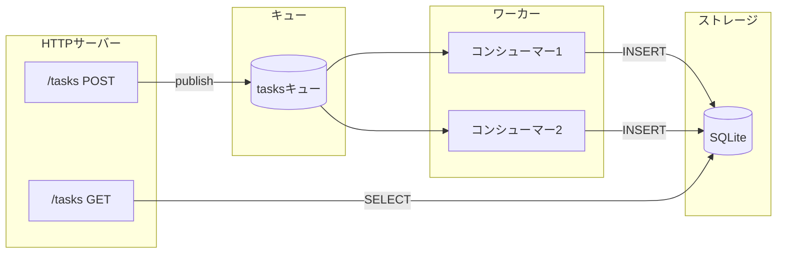

# タスクキュー

データベース永続化によるバックグラウンド処理でタスクをキューイングするREST APIを構築します。

## 概要

このチュートリアルでは以下を実演するタスク管理APIを作成します：

- **RESTエンドポイント** - タスクのPOST、結果のGET
- **キューパブリッシュ** - 非同期ジョブディスパッチ
- **キューコンシューマー** - バックグラウンドワーカー
- **データベース永続化** - SQLiteストレージ
- **マイグレーション** - 終了するワンショットプロセス



## プロジェクト構造

```
task-queue/
├── wippy.lock
└── src/
    ├── _index.yaml
    ├── migrate.lua
    ├── create_task.lua
    ├── list_tasks.lua
    └── process_task.lua
```

## エントリ定義

`src/_index.yaml`を作成：

```yaml
version: "1.0"
namespace: app

entries:
  # SQLiteデータベース
  - name: db
    kind: db.sql.sqlite
    file: "./data/tasks.db"
    lifecycle:
      auto_start: true

  # メモリキュードライバ
  - name: queue_driver
    kind: queue.driver.memory
    lifecycle:
      auto_start: true

  # タスクキュー
  - name: tasks_queue
    kind: queue.queue
    driver: app:queue_driver

  # HTTPサーバー
  - name: gateway
    kind: http.service
    addr: ":8080"
    lifecycle:
      auto_start: true

  # ルーター
  - name: router
    kind: http.router
    meta:
      server: app:gateway

  # マイグレーションプロセス（一度実行して終了）
  - name: migrate
    kind: process.lua
    source: file://migrate.lua
    method: main
    modules:
      - sql
      - logger

  # マイグレーションサービス（自動起動、成功時に終了）
  - name: migrate-service
    kind: process.service
    process: app:migrate
    host: app:processes
    lifecycle:
      auto_start: true

  # プロセスホスト
  - name: processes
    kind: process.host
    lifecycle:
      auto_start: true

  # APIハンドラ
  - name: create_task
    kind: function.lua
    source: file://create_task.lua
    method: handler
    modules:
      - http
      - queue
      - uuid

  - name: list_tasks
    kind: function.lua
    source: file://list_tasks.lua
    method: handler
    modules:
      - http
      - sql

  # キューワーカー
  - name: process_task
    kind: function.lua
    source: file://process_task.lua
    method: main
    modules:
      - queue
      - sql
      - logger
      - time
      - json

  # エンドポイント
  - name: create_task.endpoint
    kind: http.endpoint
    meta:
      router: app:router
    method: POST
    path: /tasks
    func: app:create_task

  - name: list_tasks.endpoint
    kind: http.endpoint
    meta:
      router: app:router
    method: GET
    path: /tasks
    func: app:list_tasks

  # キューコンシューマー
  - name: task_consumer
    kind: queue.consumer
    queue: app:tasks_queue
    func: app:process_task
    concurrency: 2
    prefetch: 5
    lifecycle:
      auto_start: true
```

## マイグレーションプロセス

`src/migrate.lua`を作成：

```lua
local sql = require("sql")
local logger = require("logger")

local function main()
    local db, err = sql.get("app:db")
    if err then
        logger:error("failed to connect", {error = tostring(err)})
        return 1
    end

    local _, exec_err = db:execute([[
        CREATE TABLE IF NOT EXISTS tasks (
            id TEXT PRIMARY KEY,
            payload TEXT NOT NULL,
            status TEXT NOT NULL DEFAULT 'pending',
            result TEXT,
            created_at INTEGER NOT NULL,
            processed_at INTEGER
        )
    ]])

    db:release()

    if exec_err then
        logger:error("migration failed", {error = tostring(exec_err)})
        return 1
    end

    logger:info("migration complete")
    return 0
end

return { main = main }
```

<tip>
0を返すと成功を示します。スーパーバイザーはコード0で正常終了したプロセスを再起動しません。
</tip>

## タスク作成エンドポイント

`src/create_task.lua`を作成：

```lua
local http = require("http")
local queue = require("queue")
local uuid = require("uuid")

local function handler()
    local req, req_err = http.request()
    local res, res_err = http.response()

    if not req or not res then
        return nil, "failed to get HTTP context"
    end

    local body, parse_err = req:body_json()
    if parse_err then
        res:set_status(http.STATUS.BAD_REQUEST)
        res:write_json({error = "invalid JSON"})
        return
    end

    if not body.action then
        res:set_status(http.STATUS.BAD_REQUEST)
        res:write_json({error = "action required"})
        return
    end

    local task_id = uuid.v4()
    local task = {
        id = task_id,
        action = body.action,
        data = body.data or {},
        created_at = os.time()
    }

    local ok, err = queue.publish("app:tasks_queue", task)
    if err then
        res:set_status(http.STATUS.INTERNAL_SERVER_ERROR)
        res:write_json({error = "failed to queue task"})
        return
    end

    res:set_status(http.STATUS.ACCEPTED)
    res:write_json({
        id = task_id,
        status = "queued"
    })
end

return { handler = handler }
```

## タスク一覧エンドポイント

`src/list_tasks.lua`を作成：

```lua
local http = require("http")
local sql = require("sql")

local function handler()
    local req, req_err = http.request()
    local res, res_err = http.response()

    if not req or not res then
        return nil, "failed to get HTTP context"
    end

    local db, db_err = sql.get("app:db")
    if db_err then
        res:set_status(http.STATUS.INTERNAL_SERVER_ERROR)
        res:write_json({error = "database unavailable"})
        return
    end

    local status_filter = req:query("status")

    local query = sql.builder.select("id", "payload", "status", "result", "created_at", "processed_at")
        :from("tasks")
        :order_by("created_at DESC")
        :limit(100)

    if status_filter then
        query = query:where({status = status_filter})
    end

    local rows, query_err = query:run_with(db):query()
    db:release()

    if query_err then
        res:set_status(http.STATUS.INTERNAL_SERVER_ERROR)
        res:write_json({error = "query failed"})
        return
    end

    res:set_status(http.STATUS.OK)
    res:write_json({
        tasks = rows,
        count = #rows
    })
end

return { handler = handler }
```

## キューワーカー

`src/process_task.lua`を作成：

```lua
local queue = require("queue")
local sql = require("sql")
local logger = require("logger")
local time = require("time")
local json = require("json")

local function main(task)
    local msg, msg_err = queue.message()
    if msg_err then
        logger:error("failed to get message", {error = tostring(msg_err)})
        return false
    end

    logger:info("processing task", {
        id = task.id,
        action = task.action
    })

    -- 作業をシミュレート
    time.sleep("100ms")

    -- アクションに基づいて処理
    local result
    if task.action == "uppercase" then
        result = {output = string.upper(task.data.text or "")}
    elseif task.action == "sum" then
        local nums = task.data.numbers or {}
        local total = 0
        for _, n in ipairs(nums) do
            total = total + n
        end
        result = {output = total}
    else
        result = {output = "processed"}
    end

    -- データベースに保存
    local db, db_err = sql.get("app:db")
    if db_err then
        logger:error("database unavailable", {error = tostring(db_err)})
        return false
    end

    local insert = sql.builder.insert("tasks")
        :columns("id", "payload", "status", "result", "created_at", "processed_at")
        :values(
            task.id,
            json.encode(task),
            "completed",
            json.encode(result),
            task.created_at,
            os.time()
        )

    local _, exec_err = insert:run_with(db):exec()
    db:release()

    if exec_err then
        logger:error("failed to store result", {error = tostring(exec_err)})
        return false
    end

    logger:info("task completed", {id = task.id})
    return true
end

return { main = main }
```

<note>
<code>true</code>を返すとメッセージを確認応答します。<code>false</code>を返すとメッセージは再キューイングされるか、デッドレターキューに送信されます。
</note>

## サービスの実行

初期化と実行：

```bash
mkdir -p data
wippy init
wippy run
```

APIをテスト：

```bash
# タスクを作成
curl -X POST http://localhost:8080/tasks \
  -H "Content-Type: application/json" \
  -d '{"action": "uppercase", "data": {"text": "hello world"}}'

# レスポンス: {"id": "550e8400-...", "status": "queued"}

# 処理を待ってからタスクを一覧表示
curl http://localhost:8080/tasks

# レスポンス: {"tasks": [...], "count": 1}

# ステータスでフィルタ
curl "http://localhost:8080/tasks?status=completed"
```

## メッセージフロー

1. **POST /tasks**がリクエストを受信し、UUIDを生成し、キューにパブリッシュ
2. **キューコンシューマー**がメッセージを取得（2つの並行ワーカー）
3. **ワーカー**がタスクを処理し、結果をSQLiteに書き込み
4. **GET /tasks**がデータベースから完了したタスクを読み取り

## 実演されるコンセプト

| コンセプト | API | 説明 |
|-----------|-----|------|
| RESTエンドポイント | `http.request()`, `http.response()` | HTTPリクエストの処理 |
| キューパブリッシュ | `queue.publish(id, data)` | 非同期ジョブの送信 |
| キュー消費 | `queue.message()` | ハンドラ内でメッセージにアクセス |
| データベースクエリ | `sql.get()`, `db:query()` | データの読み取り |
| クエリビルダー | `sql.builder.insert()` | 安全なSQL構築 |
| マイグレーション | 0を返すプロセス | ワンショットセットアップタスク |
| 並行性 | `concurrency: 2` | 並列ワーカー |

## 次のステップ

- [HTTPモジュール](lua-http.md) - リクエスト/レスポンス処理
- [Queueモジュール](lua-queue.md) - メッセージキュー操作
- [SQLモジュール](lua-sql.md) - データベースアクセス
- [キューコンシューマー](guide-queue-consumers.md) - キュー設定

