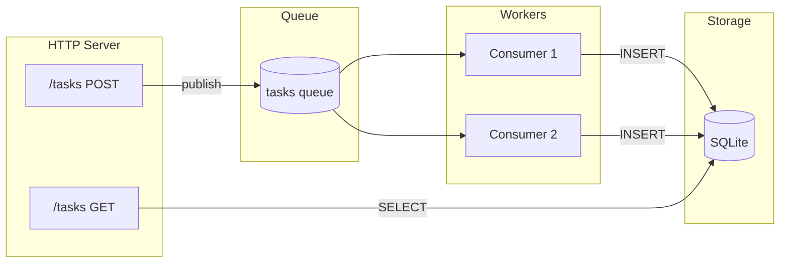

# タスクキュー

データベース永続化によるバックグラウンド処理でタスクをキューイングするREST APIを構築します。

**分類:** 実行可能なチュートリアルです。ローカルの単一ノードデモに必要なレジストリ、
Luaソース、起動コマンド、HTTP確認手順をすべて掲載しています。

## 概要

このチュートリアルでは以下を実演するタスク管理APIを作成します：

- **RESTエンドポイント** - タスクのPOST、結果のGET
- **キューパブリッシュ** - 非同期ジョブディスパッチ
- **キューコンシューマー** - バックグラウンドワーカー
- **データベース永続化** - SQLiteストレージ
- **マイグレーション** - 終了するワンショットプロセス


```mermaid
flowchart LR
    subgraph api["HTTP Server"]
        POST["/tasks POST"]
        GET["/tasks GET"]
    end

    subgraph queue["Queue"]
        Q[("tasks queue")]
    end

    subgraph workers["Workers"]
        W1["Consumer 1"]
        W2["Consumer 2"]
    end

    subgraph storage["Storage"]
        DB[(SQLite)]
    end

    POST -->|publish| Q
    Q --> W1
    Q --> W2
    W1 -->|INSERT| DB
    W2 -->|INSERT| DB
    GET -->|SELECT| DB
```

## 前提条件

- Wippyランタイム`v0.3.32a`。
- `curl`または別のHTTPクライアント。
- 空の作業ディレクトリ。以下のファイルを追加する前に、プロジェクトとソースディレクトリを作成します：

  ```bash
  mkdir task-queue
  cd task-queue
  mkdir src
  ```

## プロジェクト構造

```
task-queue/
├── wippy.lock
├── data/                    # created before startup
└── src/
    ├── _index.yaml
    ├── migrate.lua
    ├── create_task.lua
    ├── list_tasks.lua
    └── process_task.lua
```

## エントリ定義

`src/_index.yaml`を作成：

```yaml
version: "1.0"
namespace: app

entries:
  # Capabilities used by the tutorial's Lua entries in strict mode
  - name: runtime_policy
    kind: security.policy
    policy:
      actions:
        - db.get
        - queue.publish
        - queue.publish.queue
      resources: "*"
      effect: allow

  # SQLite database
  - name: db
    kind: db.sql.sqlite
    file: "./data/tasks.db"
    lifecycle:
      auto_start: true

  # Memory queue driver
  - name: queue_driver
    kind: queue.driver.memory
    lifecycle:
      auto_start: true

  # Tasks queue
  - name: tasks_queue
    kind: queue.queue
    driver: app:queue_driver

  # HTTP server
  - name: gateway
    kind: http.service
    addr: ":8080"
    lifecycle:
      auto_start: true

  # Router
  - name: router
    kind: http.router
    meta:
      server: app:gateway

  # Migration process (runs once, exits)
  - name: migrate
    kind: process.lua
    source: file://migrate.lua
    method: main
    modules:
      - sql
      - logger
    security:
      actor:
        id: app:migrate
      policies:
        - app:runtime_policy

  # Migration service (auto-starts, exits on success)
  - name: migrate-service
    kind: process.service
    process: app:migrate
    host: app:processes
    lifecycle:
      auto_start: true

  # Process host
  - name: processes
    kind: process.host
    lifecycle:
      auto_start: true

  # API handlers
  - name: create_task
    kind: function.lua
    source: file://create_task.lua
    method: handler
    modules:
      - http
      - queue
      - uuid
    security:
      actor:
        id: app:create_task
      policies:
        - app:runtime_policy

  - name: list_tasks
    kind: function.lua
    source: file://list_tasks.lua
    method: handler
    modules:
      - http
      - sql
    security:
      actor:
        id: app:list_tasks
      policies:
        - app:runtime_policy

  # Queue worker
  - name: process_task
    kind: function.lua
    source: file://process_task.lua
    method: main
    modules:
      - sql
      - logger
      - json
    security:
      actor:
        id: app:process_task
      policies:
        - app:runtime_policy

  # Endpoints
  - name: create_task.endpoint
    kind: http.endpoint
    meta:
      router: app:router
    method: POST
    path: /tasks
    func: app:create_task

  - name: list_tasks.endpoint
    kind: http.endpoint
    meta:
      router: app:router
    method: GET
    path: /tasks
    func: app:list_tasks

  # Queue consumer
  - name: task_consumer
    kind: queue.consumer
    queue: app:tasks_queue
    func: app:process_task
    concurrency: 2
    prefetch: 5
    lifecycle:
      auto_start: true
```

## マイグレーションプロセス

`src/migrate.lua`を作成：

```lua
local sql = require("sql")
local logger = require("logger")

local function main()
    local db, err = sql.get("app:db")
    if err then
        logger:error("failed to connect", {error = tostring(err)})
        error("failed to connect: " .. tostring(err))
    end

    local _, exec_err = db:execute([[
        CREATE TABLE IF NOT EXISTS tasks (
            id TEXT PRIMARY KEY,
            payload TEXT NOT NULL,
            status TEXT NOT NULL DEFAULT 'pending',
            result TEXT,
            created_at INTEGER NOT NULL,
            processed_at INTEGER
        )
    ]])

    db:release()

    if exec_err then
        logger:error("migration failed", {error = tostring(exec_err)})
        error("migration failed: " .. tostring(exec_err))
    end

    logger:info("migration complete")
    return 0
end

return { main = main }
```

<tip>
通常のreturnは<code>process.service</code>の子プロセスを再起動せず終了させます。スーパーバイザーが
再試行するのはプロセスがエラーを発生させた場合だけです。同じプロセスをCLIコマンドとして起動した場合、
<code>0</code>を返すと成功の終了ステータスにも対応します。
</tip>

## タスク作成エンドポイント

`src/create_task.lua`を作成：

```lua
local http = require("http")
local queue = require("queue")
local uuid = require("uuid")

local function handler()
    local req = http.request()
    local res = http.response()

    local body, parse_err = req:body_json()
    if parse_err then
        res:set_status(http.STATUS.BAD_REQUEST)
        res:write_json({error = "invalid JSON"})
        return
    end

    if not body.action then
        res:set_status(http.STATUS.BAD_REQUEST)
        res:write_json({error = "action required"})
        return
    end

    local task_id = uuid.v4()
    local task = {
        id = task_id,
        action = body.action,
        data = body.data or {},
        created_at = os.time()
    }

    local ok, err = queue.publish("app:tasks_queue", task)
    if err then
        res:set_status(http.STATUS.INTERNAL_ERROR)
        res:write_json({error = "failed to queue task"})
        return
    end

    res:set_status(http.STATUS.ACCEPTED)
    res:write_json({
        id = task_id,
        status = "queued"
    })
end

return { handler = handler }
```

## タスク一覧エンドポイント

`src/list_tasks.lua`を作成：

```lua
local http = require("http")
local sql = require("sql")

local function handler()
    local req = http.request()
    local res = http.response()

    local db, db_err = sql.get("app:db")
    if db_err then
        res:set_status(http.STATUS.INTERNAL_ERROR)
        res:write_json({error = "database unavailable"})
        return
    end

    local status_filter = req:query("status")

    local query = sql.builder.select("id", "payload", "status", "result", "created_at", "processed_at")
        :from("tasks")
        :order_by("created_at DESC")
        :limit(100)

    if status_filter then
        query = query:where({status = status_filter})
    end

    local rows, query_err = query:run_with(db):query()
    db:release()

    if query_err then
        res:set_status(http.STATUS.INTERNAL_ERROR)
        res:write_json({error = "query failed"})
        return
    end

    res:set_status(http.STATUS.OK)
    res:write_json({
        tasks = rows,
        count = #rows
    })
end

return { handler = handler }
```

## キューワーカー

`src/process_task.lua`を作成：

```lua
local sql = require("sql")
local logger = require("logger")
local json = require("json")

local function main(task)
    logger:info("processing task", {
        id = task.id,
        action = task.action
    })

    local result
    if task.action == "uppercase" then
        result = {output = string.upper(task.data.text or "")}
    elseif task.action == "sum" then
        local nums = task.data.numbers or {}
        local total = 0
        for _, n in ipairs(nums) do
            total = total + n
        end
        result = {output = total}
    else
        result = {output = "processed"}
    end

    local db, db_err = sql.get("app:db")
    if db_err then
        error("database unavailable: " .. tostring(db_err))
    end

    local _, exec_err = db:execute(
        "INSERT OR REPLACE INTO tasks (id, payload, status, result, created_at, processed_at) VALUES (?, ?, ?, ?, ?, ?)",
        { task.id, json.encode(task), "completed", json.encode(result), task.created_at, os.time() }
    )
    db:release()

    if exec_err then
        error("failed to store result: " .. tostring(exec_err))
    end

    logger:info("task completed", {id = task.id})
end

return { main = main }
```

<note>
コンシューマーはハンドラが正常に返ると自動でack、エラーを発生させると自動でnackします。ハンドラ終了前に明示的な制御が必要な場合のみ、<code>queue.message()</code>経由で<code>msg:ack()</code>または<code>msg:nack()</code>を呼び出してください。
</note>

## サービスの実行

初期化と実行：

```bash
mkdir data
wippy init
wippy run
```

HTTP確認には2つ目のターミナルを使い、その間ランタイムを実行したままにします。ログにHTTPサービスの
リッスン開始とマイグレーション完了が表示されるまで待ってください。起動時には、1回限りのマイグレーションと
HTTPサービスが独立して開始されます。

APIをテスト：

```bash
# Create a task
curl -X POST http://localhost:8080/tasks \
  -H "Content-Type: application/json" \
  -d '{"action": "uppercase", "data": {"text": "hello world"}}'

# Response: {"id":"<generated-uuid>","status":"queued"}

# Wait a moment for processing, then list tasks
curl http://localhost:8080/tasks

# Response includes one completed task and "count":1

# Filter by status
curl "http://localhost:8080/tasks?status=completed"
```

返された行の`status`は`"completed"`になり、`result`フィールドには
`{"output":"HELLO WORLD"}`を含むJSON文字列が入ります。インメモリキューは意図的に
非永続ですが、完了した行は`data/tasks.db`に保存され、再起動後も残ります。

## トラブルシューティングとクリーンアップ

- `no such table: tasks`は、マイグレーション完了前にリクエストがSQLiteへ到達したことを示します。
  `migration complete`を待って再試行してください。マイグレーションエラーはサービスを停止し、ランタイムログに表示されます。
- `failed to queue task`は通常、`app:queue_driver`または`app:task_consumer`が起動しなかったことを示します。
  リクエストを再試行する前に、起動ログの最初のリソースエラーを確認してください。
- `address already in use`は別のプロセスがポート8080を使用していることを示します。そのプロセスを停止するか、
  `app:gateway.addr`と`curl`コマンドの両方を同じ別のポートに変更してください。
- Ctrl+Cでランタイムを停止します。チュートリアルのデータをリセットするには`data/tasks.db`を削除します。
  次回の起動時にスキーマが再作成されます。

## メッセージフロー

1. **POST /tasks**がリクエストを受信し、UUIDを生成し、キューにパブリッシュ
2. **キューコンシューマー**がメッセージを取得（2つの並行ワーカー）
3. **ワーカー**がタスクを処理し、結果をSQLiteに書き込み
4. **GET /tasks**がデータベースから完了したタスクを読み取り

## 次のステップ

- [HTTPモジュール](lua/http/http.md) — リクエストとレスポンスの処理
- [Queueモジュール](lua/storage/queue.md) — メッセージキュー操作
- [SQLモジュール](lua/storage/sql.md) — データベースアクセス
- [キューコンシューマー](guides/queue-consumers.md) — キュー設定
