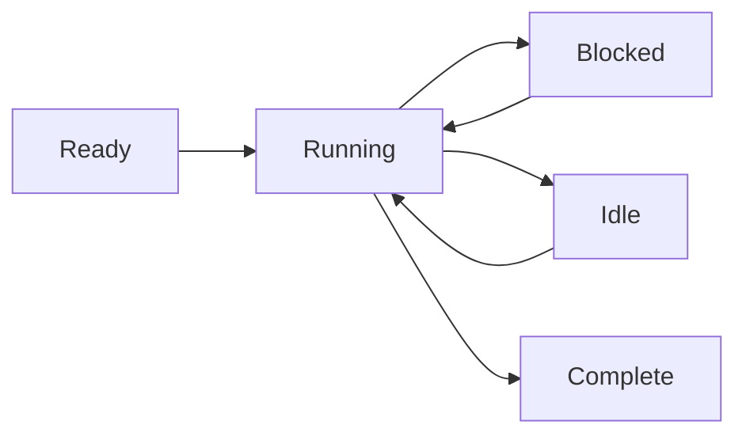

# 프로세스 모델

Wippy는 격리된 프로세스에서 코드를 실행합니다. 이는 메시지 전달을 통해 통신하는 경량 상태 머신입니다. 이 액터 모델 접근 방식은 공유 상태 버그를 제거하고 동시성 프로그래밍을 예측 가능하게 만듭니다.

## 상태 머신 실행

모든 프로세스는 동일한 패턴을 따릅니다: 초기화, 블로킹 작업에서 양보하며 실행을 단계별로 진행, 완료 시 종료. 스케줄러는 수천 개의 프로세스를 워커 풀에서 멀티플렉싱하여, 하나가 I/O를 기다리는 동안 다른 프로세스를 실행합니다.

프로세스는 여러 개의 동시 양보를 지원합니다. 여러 비동기 작업을 시작하고 일부 또는 전체가 완료될 때까지 기다릴 수 있습니다. 이를 통해 추가 프로세스를 생성하지 않고도 효율적인 병렬 I/O가 가능합니다.



프로세스는 Lua에 제한되지 않습니다. 런타임은 모든 상태 머신 구현을 지원합니다. Go 기반 프로세스와 WebAssembly 모듈이 계획되어 있습니다.

<warning>
프로세스는 경량이지만 무료는 아닙니다. 각 프로세스는 약 13KB의 기본 오버헤드로 시작합니다. 동적 할당과 힙 증가가 실행 중에 추가됩니다.
</warning>

## 프로세스 호스트

Wippy는 단일 런타임 내에서 여러 프로세스 호스트를 실행하며, 각각 다른 기능과 보안 경계를 가집니다. 권한 있는 함수를 실행하는 시스템 프로세스는 사용자 세션을 실행하는 호스트와 격리된 하나의 호스트에 있을 수 있습니다. 호스트는 프로세스가 수행할 수 있는 작업을 제한할 수 있습니다. Erlang에서는 이 수준의 격리를 위해 별도의 노드가 필요합니다.

일부 호스트는 전문화되어 있습니다. 예를 들어, Terminal 호스트는 단일 프로세스를 실행하지만 다른 호스트가 거부하는 IO 작업에 대한 접근을 부여합니다. 이를 통해 하나의 배포에서 신뢰 수준을 혼합할 수 있습니다. 전체 접근 권한을 가진 시스템 서비스와 샌드박스된 사용자 코드가 함께 있을 수 있습니다.

## 보안 모델

모든 프로세스는 액터 ID와 보안 정책 하에 실행됩니다. 일반적으로 호출을 시작한 사용자이지만, 시스템 프로세스는 다른 권한을 가진 시스템 액터로 실행됩니다.

접근 제어는 여러 수준에서 작동합니다. 개별 프로세스에는 자체 접근 수준이 있습니다. 호스트 간 메시지 전송은 보안 정책에 따라 금지될 수 있습니다. 샌드박스된 사용자 프로세스는 시스템 호스트에 메시지를 전혀 보낼 수 없을 수 있습니다. 현재 액터에 연결된 정책이 허용되는 작업을 결정합니다.

## 프로세스 생성

`process.spawn()`으로 백그라운드 프로세스를 생성합니다:

```lua
local pid = process.spawn("app.workers:handler", "app:processes", arg1, arg2)
```

첫 번째 인자는 레지스트리 엔트리, 두 번째는 프로세스 호스트이며, 나머지 인자는 프로세스에 전달됩니다.

생성 변형은 라이프사이클 관계를 제어합니다:

| 함수 | 동작 |
|----------|----------|
| `spawn` | Fire and forget |
| `spawn_monitored` | 자식이 종료할 때 EXIT 이벤트 수신 |
| `spawn_linked` | 양방향 - 어느 쪽이든 크래시 시 다른 쪽에 알림 |

## 메시지 전달

프로세스는 공유 메모리가 아닌 메시지를 통해 통신합니다:

```lua
process.send(target_pid, "topic", payload)
```

같은 발신자의 메시지는 순서대로 도착합니다. 다른 발신자의 메시지는 인터리브될 수 있습니다. 전달은 fire-and-forget입니다. 확인이 필요할 때는 요청-응답 패턴을 사용하세요.

<note>
프로세스는 로컬 이름 레지스트리에 등록하고 PID 대신 이름으로 주소 지정할 수 있습니다 (예: `session_manager`). 노드 간 주소 지정을 위한 글로벌 레지스트리가 계획되어 있습니다.
</note>

## 슈퍼비전

모든 프로세스는 다른 프로세스를 모니터링하여 슈퍼바이즈할 수 있습니다. 프로세스는 모니터링과 함께 자식을 생성하고, EXIT 이벤트를 감시하고, 실패 시 재시작합니다. 이는 Erlang의 "let it crash" 철학을 따릅니다: 프로세스는 예상치 못한 조건에서 크래시하고, 모니터링하는 프로세스가 복구를 처리합니다.

```lua
local worker = process.spawn_monitored("app.workers:handler", "app:processes")
local event = process.events():receive()

if event.kind == process.event.EXIT and event.result.error then
    worker = process.spawn_monitored("app.workers:handler", "app:processes")
end
```

루트 수준에서, 런타임은 장기 실행 프로세스를 시작하고 슈퍼바이즈하는 서비스를 제공합니다. Linux의 systemd와 유사합니다. `process.service` 엔트리를 정의하여 런타임이 프로세스를 관리하도록 합니다:

```yaml
- name: worker.service
  kind: process.service
  process: app.workers:handler
  host: app:processes
  lifecycle:
    auto_start: true
    restart:
      max_attempts: 5
      delay: 1s
```

서비스는 자동으로 시작되고, 백오프와 함께 크래시 시 재시작되며, 런타임의 라이프사이클 관리와 통합됩니다.

## 프로세스 업그레이드

실행 중인 프로세스는 ID를 잃지 않고 코드를 업그레이드할 수 있습니다. `process.upgrade()`를 호출하여 PID, 메일박스, 슈퍼비전 관계를 유지하면서 새 정의로 전환합니다:

```lua
process.upgrade("app.workers:v2", current_state)
```

첫 번째 인자는 새 레지스트리 엔트리입니다 (현재 정의를 다시 로드하려면 nil). 추가 인자는 새 버전에 전달되어 업그레이드 전반에 걸쳐 상태를 전달할 수 있습니다. 프로세스는 새 코드로 즉시 실행을 재개합니다.

이를 통해 개발 중 핫 코드 리로드와 프로덕션에서 제로 다운타임 업데이트가 가능합니다. 런타임은 컴파일된 프로토를 캐시하므로 업그레이드 시 컴파일 비용이 반복되지 않습니다. 어떤 이유로든 업그레이드가 실패하면 프로세스가 크래시하고 일반적인 슈퍼비전 시맨틱이 적용됩니다. 모니터링하는 부모가 이전 버전으로 재시작하거나 실패를 에스컬레이션할 수 있습니다.

## 스케줄링

액터 스케줄러는 CPU 코어 간 작업 스틸링을 사용합니다. 각 워커는 캐시 지역성을 위한 로컬 큐를 가지며, 분배를 위한 글로벌 큐도 있습니다. 프로세스는 블로킹 작업에서 양보하여 소수의 스레드에서 수천 개가 동시에 실행될 수 있습니다.
