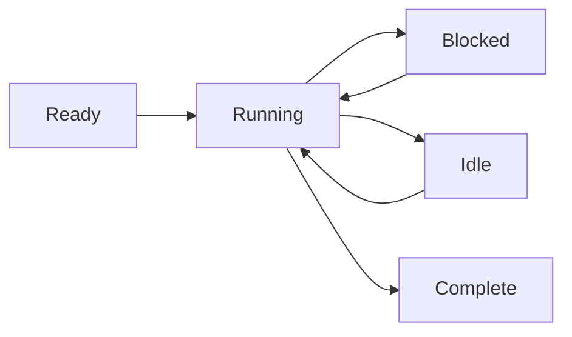

# 프로세스 모델

Wippy는 공유 memory 대신 message로 통신하는 lightweight state machine인 격리된 process에서 code를 실행합니다. 이 actor model은 각 process에 자체 state 및 lifecycle을 제공합니다.

이 페이지는 lifecycle과 isolation model을 설명합니다. spawn, messaging, monitoring, registry 및 upgrade API는 [프로세스 관리 레퍼런스](../lua/core/process.md)를 사용하십시오. runtime-managed service field는 [프로세스 호스트 및 서비스](../system/process-host.md)를 참조하십시오.

## 상태 머신 실행

모든 프로세스는 동일한 패턴을 따릅니다. 초기화 후 블로킹 작업에서 양보하면서 단계별로 실행을 진행하고, 완료되면 종료합니다. 스케줄러는 수천 개의 프로세스를 워커 풀에서 멀티플렉싱하여 하나가 I/O를 기다리는 동안 다른 프로세스가 실행될 수 있게 합니다.

프로세스는 여러 비동기 작업을 동시에 진행할 수 있습니다. 여러 작업을 시작한 뒤 일부 또는 전체가 완료될 때까지 기다릴 수 있어, 추가 프로세스를 생성하지 않고도 효율적인 병렬 I/O가 가능합니다.


```mermaid
flowchart LR
    Ready --> Running
    Running --> Blocked
    Running --> Idle
    Blocked --> Running
    Idle --> Running
    Running --> Complete
```

프로세스는 Lua에 제한되지 않습니다. 런타임은 이미 `process.wasm` 종류를 통해 WebAssembly 모듈을 지원하며, 아키텍처는 모든 상태 머신 구현을 허용합니다.

<warning>
프로세스는 경량이지만 비용이 없는 것은 아닙니다. 각 프로세스는 상태, 수신함, 스케줄러 관리를 위한 작은 기본 비용을 가지며, 동적 할당은 실행 중에 그 풋프린트를 증가시킵니다.
</warning>

## 프로세스 호스트

Wippy는 하나의 런타임에서 여러 process host를 실행할 수 있으며 각 host는 자체 capability와 security boundary를 갖습니다. privileged system process는 user session을 실행하는 host와 분리된 host에서 실행할 수 있습니다.

일부 host는 특수화되어 있습니다. 예를 들어 Terminal host는 하나의 scheduler worker를 사용하고 수락한 process에 terminal I/O context를 제공하지만 one-process lifetime limit를 강제하지 않습니다. 별도 host를 사용하면 하나의 deployment에서 서로 다른 trust level의 process를 실행할 수 있습니다.

## 보안 모델

모든 프로세스는 액터 ID와 보안 정책을 가지고 실행됩니다. 보통은 호출을 시작한 사용자의 ID이지만, 시스템 프로세스는 별도 권한을 가진 시스템 액터로 실행됩니다.

접근 제어는 여러 수준에서 작동합니다. 개별 프로세스마다 자체 접근 수준이 있고, 호스트 간 메시지 전송은 보안 정책에 따라 차단될 수 있습니다. 샌드박스된 사용자 프로세스는 시스템 호스트에 메시지를 보내지 못하도록 설정할 수 있습니다. 현재 액터에 연결된 정책이 허용되는 작업을 결정합니다.

process isolation의 security implication은 [보안 모델](./security-model.md)을 참조하십시오.

## 프로세스 생성

`process.spawn()`으로 백그라운드 프로세스를 생성합니다:

```lua
local pid, err = process.spawn("app.workers:handler", "app:processes", arg1, arg2)
if err then return nil, err end
return pid
```

첫 번째 인자는 레지스트리 엔트리, 두 번째는 프로세스 호스트이며, 나머지 인자는 프로세스에 전달됩니다.

생성 변형은 라이프사이클 관계를 제어합니다:

| 함수 | 동작 |
|----------|----------|
| `spawn` | 독립 프로세스 시작 |
| `spawn_monitored` | 자식이 종료할 때 EXIT 이벤트 수신 |
| `spawn_linked` | abnormal exit가 양방향으로 전파됨; `trap_links: true`이면 peer가 실패하는 대신 `LINK_DOWN`을 받음 |

## 메시지 전달

프로세스는 공유 메모리가 아닌 메시지를 통해 통신합니다:

```lua
local ok, err = process.send(target_pid, "topic", payload)
if err then return nil, err end
return ok
```

같은 발신자의 메시지는 순서대로 도착합니다. 다른 발신자의 메시지는 순서가 섞일 수 있습니다. 전달 방식은 fire-and-forget이므로 확인이 필요하면 요청-응답 패턴을 사용하세요.

<note>
프로세스는 local name registry에 등록하여 PID 대신 이름으로 address할 수 있습니다(예: `session_manager`). `process.registry`에서 EVENTUAL(gossip-based), CONSISTENT 또는 STRONG(둘 다 Raft-backed) scope를 사용해 cross-node addressing을 위한 cluster-wide name도 등록할 수 있습니다.
</note>

## 슈퍼비전

모든 프로세스는 다른 프로세스를 모니터링하여 감독할 수 있습니다. 부모 프로세스는 모니터링을 설정하고 자식을 생성하며, EXIT 이벤트를 감시하다가 실패 시 재시작합니다. 이는 Erlang의 "let it crash" 철학을 따릅니다. 프로세스는 예상치 못한 상황에서 크래시하고, 모니터링 프로세스가 복구를 담당합니다.

```lua
local worker, spawn_err = process.spawn_monitored("app.workers:handler", "app:processes")
if spawn_err then return nil, spawn_err end

local event, open = process.events():receive()
if not open then return nil, errors.new("process event channel closed") end

if event.kind == process.event.EXIT and event.result.error then
    local replacement, restart_err = process.spawn_monitored("app.workers:handler", "app:processes")
    if restart_err then return nil, restart_err end
    worker = replacement
end
```

최상위 수준에서 런타임은 장기 실행 프로세스를 시작하고 감독하는 서비스를 제공합니다. Linux의 systemd와 유사한 역할입니다. `process.service` 엔트리를 정의하면 런타임이 프로세스를 관리합니다:

```yaml
- name: worker.service
  kind: process.service
  process: app.workers:handler
  host: app:processes
  lifecycle:
    auto_start: true
    restart:
      max_attempts: 5
      initial_delay: 1s
```

service는 자동으로 시작되고 runtime lifecycle management와 통합됩니다. 고정된 런타임에서 최초 failed start도 `max_attempts`에 포함되므로 `5`는 최대 네 번의 후속 start를 허용합니다. 각 retry는 jitter가 적용된 `initial_delay`만큼 기다리며 attempt 사이에 delay가 증가하지 않습니다.

## 프로세스 업그레이드

실행 중인 프로세스는 ID를 유지하면서 코드를 업그레이드할 수 있습니다. `process.upgrade()`를 호출하면 PID, 메일박스, 슈퍼비전 관계를 유지한 채 새 정의로 전환합니다:

```lua
process.upgrade("app.workers:v2", current_state)
```

첫 번째 인자는 새 레지스트리 엔트리입니다(현재 정의를 다시 로드하려면 nil). 추가 인자는 새 버전에 전달되어 업그레이드 과정에서 상태를 넘길 수 있습니다. 프로세스는 새 코드로 즉시 실행을 재개합니다.

런타임은 반복 compilation을 피하기 위해 compiled prototype을 cache합니다. upgrade가 실패하면 process가 crash하고 일반 supervision behavior가 적용됩니다. monitoring parent는 이를 restart하거나 failure를 escalate할 수 있습니다.

## 스케줄링

액터 스케줄러는 CPU 코어 간 작업 스틸링을 사용합니다. 각 워커는 캐시 지역성을 위한 로컬 큐를 가지며, 분배를 위한 글로벌 큐도 있습니다. 프로세스는 블로킹 작업에서 양보하므로 적은 수의 스레드에서 수천 개가 동시에 실행될 수 있습니다.
