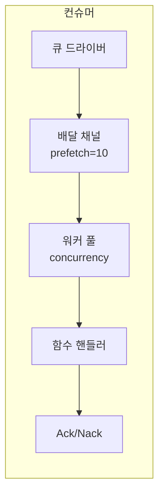

# 큐 컨슈머

큐 컨슈머는 워커 풀을 사용하여 큐에서 메시지를 처리합니다.

## 개요



## 설정

| 옵션 | 기본값 | 최대 | 설명 |
|--------|---------|-----|-------------|
| `queue` | 필수 | - | 큐 레지스트리 ID |
| `func` | 필수 | - | 핸들러 함수 레지스트리 ID |
| `concurrency` | 1 | 1000 | 워커 수 |
| `prefetch` | 10 | 10000 | 메시지 버퍼 크기 |

## 엔트리 정의

```yaml
- name: order_consumer
  kind: queue.consumer
  queue: app:orders
  func: app:process_order
  concurrency: 5
  prefetch: 20
  lifecycle:
    auto_start: true
    depends_on:
      - app:orders
```

## 핸들러 함수

핸들러 함수는 메시지 본문을 받습니다:

```lua
-- process_order.lua
local json = require("json")

local function handler(body)
    local order = json.decode(body)

    -- 주문 처리
    local result, err = process_order(order)
    if err then
        -- 에러 반환으로 Nack 트리거 (재큐잉)
        return nil, err
    end

    -- 성공은 Ack 트리거
    return result
end

return handler
```

```yaml
- name: process_order
  kind: function.lua
  source: file://process_order.lua
  modules:
    - json
```

## 확인 응답

| 결과 | 액션 | 효과 |
|--------|--------|--------|
| 성공 | Ack | 큐에서 메시지 제거 |
| 에러 | Nack | 메시지 재큐잉 (드라이버 종속) |

## 워커 풀

- 워커는 동시 고루틴으로 실행
- 각 워커는 한 번에 하나의 메시지 처리
- 메시지는 딜리버리 채널에서 라운드 로빈 분배
- 프리페치 버퍼로 드라이버가 미리 전달 가능

### 예제

```
concurrency: 3
prefetch: 10

흐름:
1. 드라이버가 버퍼에 최대 10개 메시지 전달
2. 3개 워커가 버퍼에서 동시에 가져옴
3. 워커가 완료되면 버퍼 리필
4. 모든 워커가 바쁘고 버퍼가 가득 차면 백프레셔
```

## 그레이스풀 셧다운

중지 시:
1. 새 딜리버리 수락 중지
2. 워커 컨텍스트 취소
3. 처리 중인 메시지 대기 (타임아웃 있음)
4. 워커가 완료되지 않으면 타임아웃 에러 반환

## 큐 선언

```yaml
# 큐 드라이버 (개발/테스트용 메모리)
- name: queue_driver
  kind: queue.driver.memory
  lifecycle:
    auto_start: true

# 큐 정의
- name: orders
  kind: queue.queue
  driver: app:queue_driver
  options:
    queue_name: orders      # 이름 오버라이드 (기본값: 엔트리 이름)
    max_length: 10000       # 최대 큐 크기
    durable: true           # 재시작 시 유지
```

| 옵션 | 설명 |
|--------|-------------|
| `queue_name` | 큐 이름 오버라이드 (기본값: 엔트리 ID 이름) |
| `max_length` | 최대 큐 크기 |
| `durable` | 재시작 시 유지 (드라이버 종속) |

## 메모리 드라이버

개발/테스트용 내장 인메모리 큐:

- Kind: `queue.driver.memory`
- 메시지는 메모리에 저장
- Nack은 메시지를 큐 앞으로 재큐잉
- 재시작 간 지속성 없음

## 참고

- [메시지 큐](lua/storage/queue.md) - 큐 모듈 참조
- [큐 설정](system/queue.md) - 큐 드라이버 및 엔트리 정의
- [슈퍼비전 트리](guides/supervision.md) - 컨슈머 라이프사이클
- [프로세스 관리](lua/core/process.md) - 프로세스 스폰 및 통신
