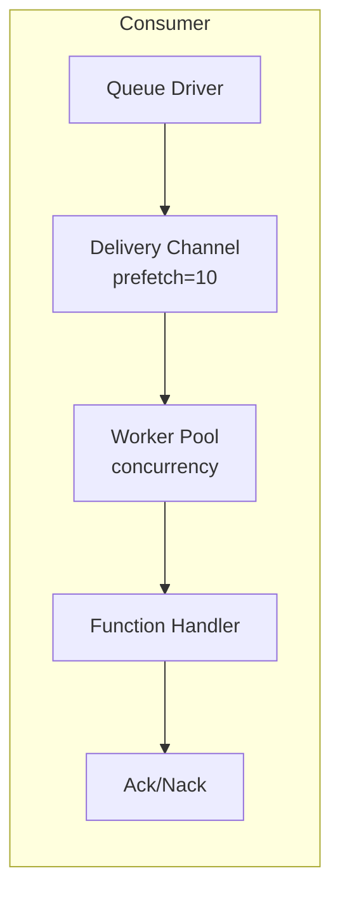

# 큐 컨슈머

queue consumer는 configurable worker pool을 통해 queue의 message를 function handler에 전달합니다.

## 개요


```mermaid
flowchart LR
    subgraph Consumer
        QD[Queue Driver] --> DC[Delivery Channel<br/>prefetch=10]
        DC --> WP[Worker Pool<br/>concurrency]
        WP --> FH[Function Handler]
        FH --> AN[Ack/Nack]
    end
```

## 설정

| 옵션 | 기본값 | 최대 | 설명 |
|--------|---------|-----|-------------|
| `queue` | 필수 | - | 큐 레지스트리 ID |
| `func` | 필수 | - | 핸들러 함수 레지스트리 ID |
| `concurrency` | 1 | 1000 | 워커 수 |
| `prefetch` | 10 | 10000 | shared delivery-buffer 크기. AMQP에서는 channel QoS prefetch count에도 적용 |
| `auto_ack` | false | - | backend별 auto-ack option. AMQP에서 `true`이면 broker가 delivery 시 acknowledge |
| `driver_options` | `{}` | - | 드라이버별 컨슈머 옵션 |

## 엔트리 정의

```yaml
- name: order_consumer
  kind: queue.consumer
  queue: app:orders
  func: app:process_order
  concurrency: 5
  prefetch: 20
  lifecycle:
    auto_start: true
    requires:
      - app:orders
```

## 핸들러 함수

handler function은 queue codec이 decode한 body를 받습니다. 현재 delivery와 metadata에 접근하려면 `queue.message()`를 사용합니다.

```lua
-- process_order.lua
local queue = require("queue")
local logger = require("logger")

local function main(order)
    local msg, msg_err = queue.message()
    if msg_err then
        return nil, msg_err
    end

    logger:info("processing order", {
        message_id = msg:id(),
        order_id = order.id
    })

    return {processed = true, order_id = order.id}
end

return {main = main}
```

```yaml
- name: process_order
  kind: function.lua
  source: file://process_order.lua
  method: main
  modules:
    - queue
    - logger
```

## 확인 응답

handler가 delivery를 명시적으로 settle하지 않으면 consumer는 function invocation result를 사용합니다.

| handler 결과 | 액션 | 효과 |
|---------------|------|------|
| invocation error 없이 완료 | Ack | queue에서 message 제거 |
| invocation error를 return 또는 raise | Nack | redelivery는 driver별 동작 |

`false`를 포함한 일반 return value는 acknowledgment behavior를 선택하지 않습니다. 명시적으로 settle하려면 `msg:ack()` 또는 `msg:nack()`를 호출하십시오. settlement는 single-shot이며 첫 settlement가 적용됩니다. AMQP `auto_ack: true`에서는 broker가 delivery 시 acknowledge하므로 이후 handler failure가 broker redelivery를 유발할 수 없습니다.

## 워커 풀

- 워커는 동시에 고루틴으로 실행
- 각 워커는 한 번에 하나의 메시지만 처리
- worker는 shared delivery channel에서 가져옵니다. 다음 idle worker가 다음 message를 받으며 worker 간 ordering 또는 rotation은 보장되지 않습니다.
- 프리페치 버퍼를 통해 드라이버가 미리 메시지 전달 가능

### 예제

```
concurrency: 3
prefetch: 10

Flow:
1. Driver delivers up to 10 messages to buffer
2. 3 workers pull from buffer concurrently
3. As workers finish, buffer refills
4. Backpressure when all workers busy and buffer full
```

## 정상 종료

shutdown 중 consumer는 다음 순서로 동작합니다.

1. 새 delivery 수락 중지
2. worker context cancel
3. stop timeout까지 in-flight handler 대기
4. worker가 끝나지 않으면 timeout error 반환

## 큐 선언

```yaml
# Queue driver (memory for dev/test)
- name: queue_driver
  kind: queue.driver.memory
  lifecycle:
    auto_start: true

# Queue definition
- name: orders
  kind: queue.queue
  driver: app:queue_driver
  queue_name: orders        # Override name (default: entry name)
  codec: json/plain         # Payload codec (optional; json/plain is the default)
  dead_letter:              # Accepted configuration; not enforced by built-in drivers
    queue: app:dlq
    max_attempts: 5
  driver_options:
    memory:
      max_length: 10000     # Memory driver: bounded queue size
```

| 필드 | 설명 |
|------|------|
| `queue_name` | 큐 이름 오버라이드 (기본값: 엔트리 ID 이름) |
| `codec` | 페이로드 코덱 이름 |
| `dead_letter.queue` | dead-letter queue로 수락되는 registry ID. built-in driver에서는 enforce하지 않음 |
| `dead_letter.max_attempts` | configuration에서 수락되는 attempt count. built-in driver에서는 enforce하지 않음 |
| `driver_options` | 드라이버 이름으로 키가 지정된 드라이버별 설정 |

<note>
built-in driver는 현재 attempt를 count하거나 `dead_letter` block에서 message를 route하지 않습니다. runtime은 이 block을 AMQP queue argument로 변환하지 않으며 일반 AMQP consumer failure는 requeue를 요청합니다. 따라서 broker-side dead-lettering은 이 block 외부에서 구성하고 trigger해야 합니다. memory driver는 DLQ로 route하지 않습니다.
</note>

## 메모리 드라이버

개발/테스트용 내장 인메모리 큐:

- Kind: `queue.driver.memory`
- 메시지는 메모리에 저장
- Nack은 cloned message를 queue 끝에 다시 enqueue하려고 하며 bounded queue가 가득 차면 실패할 수 있음
- 재시작 간 지속성 없음

## 참고

- [메시지 큐](../lua/storage/queue.md) - Queue module reference
- [큐 설정](../system/queue.md) - queue driver 및 entry definition
- [슈퍼비전](./supervision.md) - consumer lifecycle
- [프로세스 관리](../lua/core/process.md) - process spawning 및 communication
