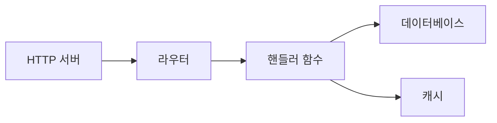
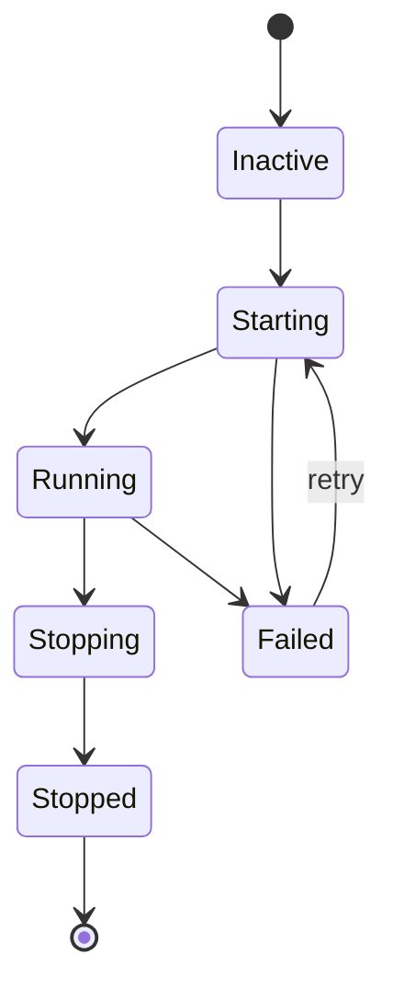

# 슈퍼비전

슈퍼바이저는 서비스 수명 주기를 관리하며, 시작 순서, 자동 재시작, 정상 종료를 처리합니다. `auto_start: true`로 설정된 서비스는 애플리케이션 부팅 시 시작됩니다.

## 라이프사이클 설정

서비스는 `lifecycle` 블록으로 슈퍼바이저에 등록합니다. 프로세스의 경우 `process.service`로 프로세스 정의를 래핑합니다:

```yaml
# 프로세스 정의 (코드)
- name: worker_process
  kind: process.lua
  source: file://worker.lua
  method: main

# 감독 서비스 (수명 주기 관리로 프로세스 래핑)
- name: worker
  kind: process.service
  process: app:worker_process
  host: app:processes
  lifecycle:
    auto_start: true
    start_timeout: 30s
    stop_timeout: 10s
    stable_threshold: 5s
    depends_on:
      - app:database
    restart:
      initial_delay: 2s
      max_delay: 60s
      max_attempts: 10
```

| 필드 | 기본값 | 설명 |
|-------|---------|-------------|
| `auto_start` | `false` | 슈퍼바이저 시작 시 자동으로 시작 |
| `start_timeout` | `10s` | 시작에 허용된 최대 시간 |
| `stop_timeout` | `10s` | 정상 종료 최대 시간 |
| `stable_threshold` | `5s` | 서비스가 안정적으로 간주되기 전 실행 시간 |
| `depends_on` | `[]` | 먼저 실행되어야 하는 서비스 |

## 의존성 해결

슈퍼바이저는 두 가지 소스에서 의존성을 해결합니다:

1. `depends_on`에 선언된 **명시적 의존성**
2. 엔트리 참조에서 **레지스트리 추출 의존성** (예: 설정의 `database: app:db`)



의존성은 의존 항목보다 먼저 시작됩니다. 서비스 C가 A와 B에 의존하면, C가 시작되기 전에 A와 B 모두 `Running` 상태에 도달해야 합니다.

<tip>
데이터베이스 같은 인프라 엔트리는 <code>depends_on</code>에 명시하지 않아도 됩니다. 슈퍼바이저가 엔트리 설정의 레지스트리 참조에서 의존성을 자동으로 추출합니다.
</tip>

## 재시작 정책

서비스 실패 시 슈퍼바이저는 지수 백오프를 적용하여 재시도합니다:

```yaml
lifecycle:
  restart:
    initial_delay: 1s      # 첫 번째 재시도 대기
    max_delay: 90s         # 최대 지연 상한
    backoff_factor: 2.0    # 시도당 지연 승수
    jitter: 0.1            # ±10% 랜덤화
    max_attempts: 0        # 0 = 무한 재시도
```

| 시도 | 기본 지연 | 지터 포함 (±10%) |
|---------|------------|-------------------|
| 1 | 1s | 0.9s - 1.1s |
| 2 | 2s | 1.8s - 2.2s |
| 3 | 4s | 3.6s - 4.4s |
| 4 | 8s | 7.2s - 8.8s |
| ... | ... | ... |
| N | 90s | 81s - 99s (상한) |

서비스가 `stable_threshold`보다 오래 실행되면 재시도 카운터가 리셋됩니다. 이는 일시적 실패로 인한 영구적 지연 증가를 방지합니다.

### 터미널 에러

다음 에러는 재시도를 중지합니다:

- 컨텍스트 취소
- 명시적 종료 요청
- 재시도 불가로 표시된 에러

## 보안 컨텍스트

서비스는 특정 보안 ID로 실행될 수 있습니다:

```yaml
# 프로세스 정의
- name: admin_worker_process
  kind: process.lua
  source: file://admin_worker.lua
  method: main

# 보안 컨텍스트가 있는 감독 서비스
- name: admin_worker
  kind: process.service
  process: app:admin_worker_process
  host: app:processes
  lifecycle:
    auto_start: true
    security:
      actor:
        id: "service:admin-worker"
        meta:
          role: admin
      groups:
        - app:admin_policies
      policies:
        - app:data_access
```

보안 컨텍스트가 설정하는 것:

| 필드 | 설명 |
|-------|-------------|
| `actor.id` | 이 서비스의 ID 문자열 |
| `actor.meta` | 키-값 메타데이터 (역할, 권한 등) |
| `groups` | 적용할 정책 그룹 |
| `policies` | 적용할 개별 정책 |

서비스에서 실행되는 코드는 이 보안 컨텍스트를 상속받습니다. `security` 모듈로 권한을 확인할 수 있습니다:

```lua
local security = require("security")

if security.can("delete", "users") then
    -- 허용됨
end
```

<note>
보안 컨텍스트가 설정되지 않으면 서비스는 액터 없이 실행됩니다. 엄격 모드(기본값)에서는 보안 검사가 실패합니다. 인가가 필요한 서비스에 대해 보안 컨텍스트를 설정하세요.
</note>

## 서비스 상태



슈퍼바이저는 서비스를 다음 상태로 전환합니다:

| 상태 | 설명 |
|-------|-------------|
| `Inactive` | 등록되었지만 시작되지 않음 |
| `Starting` | 시작 진행 중 |
| `Running` | 정상 작동 중 |
| `Stopping` | 정상 종료 진행 중 |
| `Stopped` | 정상 종료됨 |
| `Failed` | 에러 발생, 재시도 가능 |

## 시작 및 종료 순서

**시작**: 의존성 먼저, 그 다음 의존 항목. 같은 의존성 레벨의 서비스는 병렬로 시작할 수 있습니다.

**종료**: 의존하는 항목 먼저, 그 다음 의존성. 의존성이 중지되기 전에 의존하는 서비스가 먼저 종료됩니다.

```
시작:  database → cache → handler → http_server
종료: http_server → handler → cache → database
```

## 참고

- [프로세스 모델](concepts/process-model.md) - 프로세스 라이프사이클
- [설정](guides/configuration.md) - YAML 설정 형식
- [보안 모듈](lua/security/security.md) - Lua에서 권한 검사
