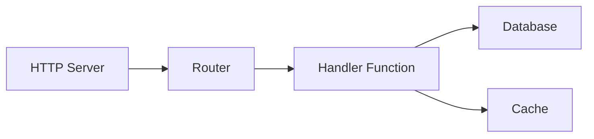
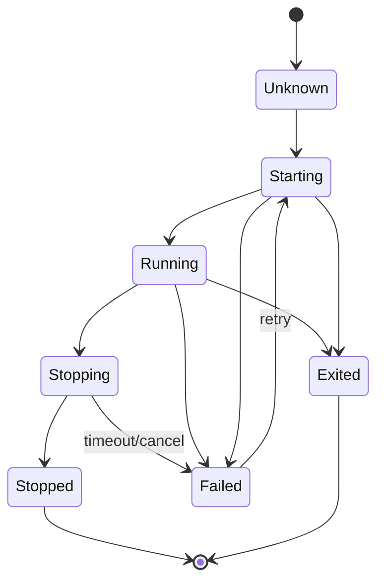

# 감독

감독자는 서비스 시작, 의존성 순서, 재시작, 정상 종료를 관리합니다. `auto_start: true`인 서비스는 애플리케이션이 부팅될 때 시작됩니다.

## 수명 주기 구성

서비스는 `lifecycle` 블록으로 감독자에 등록됩니다. 프로세스에는 프로세스 정의를 감싸는 `process.service`를 사용합니다.

```yaml
# Process definition (the code)
- name: worker_process
  kind: process.lua
  source: file://worker.lua
  method: main

# Supervised service (wraps the process with lifecycle management)
- name: worker
  kind: process.service
  process: app:worker_process
  host: app:processes
  lifecycle:
    auto_start: true
    startup: required
    start_timeout: 30s
    stop_timeout: 10s
    stable_threshold: 5s
    requires:
      - app:database
    restart:
      initial_delay: 2s
      max_delay: 60s
      max_attempts: 10
```

`host`는 구성된 프로세스 호스트를 참조해야 합니다. `requires` 엔트리는 다른 감독 서비스로 직접 해석되거나, 레지스트리 의존성 추출을 통해 참조 리소스를 소유한 감독 서비스로 해석되어야 합니다.

| 필드 | 기본값 | 설명 |
|-------|---------|-------------|
| `auto_start` | `false` | 슈퍼바이저 시작 시 자동으로 시작 |
| `start_timeout` | `10s` | 시작에 허용된 최대 시간 |
| `stop_timeout` | `10s` | 정상 종료 최대 시간 |
| `stable_threshold` | `5s` | 서비스가 안정적으로 간주되기 전 실행 시간 |
| `requires` | `[]` | 먼저 실행되어야 하는 서비스 (레거시 별칭: `depends_on`) |
| `startup` | `required` | `required`는 자동 시작 실패나 차단을 트랜잭션 오류로 보고합니다. `optional`은 배치를 실패시키지 않고 서비스가 백그라운드에서 계속 재시도하도록 둡니다 |

## 의존성 해석

감독자는 두 출처에서 의존성을 해석합니다.

1. `requires` 또는 레거시 `depends_on`에 선언된 **명시적 의존성**
2. 구성의 `database: app:db` 같은 엔트리 참조에서 얻는 **레지스트리 추출 의존성**


```mermaid
graph LR
    A[HTTP Server] --> B[Router]
    B --> C[Handler Function]
    C --> D[Database]
    C --> E[Cache]
```

의존성은 의존하는 서비스보다 먼저 시작됩니다. 서비스 C가 A와 B에 의존한다면 C가 시작되기 전에 두 의존성이 모두 `Running` 상태에 도달해야 합니다.

<tip>
레지스트리 의존성 추출이 인프라 참조를 감독 서비스까지 추적할 수 있다면 <code>requires</code>에 같은 참조를 반복할 필요가 없습니다. 엔트리 참조에 이미 표현되지 않은 수명 주기 의존성에 <code>requires</code>를 사용하세요.
</tip>

## 재시작 정책

서비스가 실패하면 감독자는 `restart` 블록에 따라 재시도합니다.

```yaml
lifecycle:
  restart:
    initial_delay: 1s      # First retry wait
    max_delay: 90s         # Accepted backoff cap; see current behavior below
    backoff_factor: 2.0    # Accepted multiplier; see current behavior below
    jitter: 0.1            # ±10% randomization
    max_attempts: 0        # 0 = infinite retries
```

런타임 v0.3.32a에서 감독자는 재시도마다 새 백오프 계산기를 만들고 첫 간격만 사용합니다. 따라서 각 재시도는 구성된 지터와 함께 `initial_delay`만큼 기다립니다. 위 값에서는 0.9~1.1초입니다. `backoff_factor`와 `max_delay`는 허용되는 구성 필드지만 고정된 런타임에서 이 일정에 영향을 주지 않습니다.

`max_attempts`는 최초 실패한 시작을 포함해 셉니다. 값 `1`은 재시도를 허용하지 않고 `10`은 후속 시작을 최대 아홉 번 허용합니다. `0`은 무제한 시도를 허용합니다.

서비스가 `stable_threshold`보다 오래 실행되면 재시도 카운터가 초기화되어 이후 실패가 최초 재시도 지연부터 다시 시작됩니다.

### 터미널 오류

다음 오류는 재시도를 중지합니다.

- 컨텍스트 취소
- 명시적 종료 요청
- 재시도 불가로 표시된 오류

## 보안 컨텍스트

서비스는 특정 보안 ID로 실행할 수 있습니다.

```yaml
# Process definition
- name: admin_worker_process
  kind: process.lua
  source: file://admin_worker.lua
  method: main

# Supervised service with security context
- name: admin_worker
  kind: process.service
  process: app:admin_worker_process
  host: app:processes
  lifecycle:
    auto_start: true
    security:
      actor:
        id: "service:admin-worker"
        meta:
          role: admin
      groups:
        - app:admin_policies
      policies:
        - app:data_access
```

보안 컨텍스트는 다음을 정의합니다.

| 필드 | 설명 |
|-------|-------------|
| `actor.id` | 서비스의 ID 문자열 |
| `actor.meta` | 키-값 메타데이터(역할, 권한 등) |
| `groups` | 적용할 정책 그룹 |
| `policies` | 적용할 개별 정책 |

서비스에서 실행되는 코드는 이 보안 컨텍스트를 상속합니다. `security` 모듈은 권한 검사에 이를 사용할 수 있습니다.

```lua
local security = require("security")

if security.can("delete", "users") then
    -- allowed
end
```

<note>
보안 블록을 구성하지 않으면 감독자는 서비스별 액터나 정책 범위를 추가하지 않습니다. 부모 컨텍스트에 이미 있는 보안 값은 그대로 상속됩니다. 엄격 모드가 기본이며 결과 보안 컨텍스트가 불완전한 검사는 거부됩니다. 권한 부여가 필요한 서비스에는 완전한 서비스 보안 컨텍스트를 구성하세요.
</note>

## 재등록 및 교체

레지스트리 변경으로 이미 실행 중인 컨트롤러가 있는 ID가 다시 등록될 수 있습니다. 등록이 동일한 서비스 인스턴스를 담고 있으면 아무것도 건드리지 않습니다. **다른** 인스턴스를 담고 있으면 — 설정이 변경되어 매니저가 서비스를 다시 빌드한 경우 — 슈퍼바이저는 기존 컨트롤러를 폐기하고 교체본을 채택합니다.

폐기 대상은 해당 서비스 하나에 그치지 않습니다. 실행 중인 의존 서비스는 대체되기 전의 인스턴스를 붙잡고 있으므로, 아래에서 교체되고 있는 서비스에 대고 계속 실행될 수 없습니다. 폐기 클로저는 교체되는 서비스와 그것에 의존하는 실행 중인 모든 서비스이며, 의존성 순서로(의존하는 쪽 먼저) 중지됩니다. 이미 중지된 서비스는 두 번 중지되지 않습니다 — 재등록 전에 자신의 인스턴스를 직접 중지하는 매니저는 중복 `Stop`을 겪지 않습니다.

핸드오버는 트랜잭션으로 처리됩니다:

1. 계획은 아무것도 건드리지 않고 계산되므로, 계획 단계의 실패는 실행 중인 집합을 그대로 둡니다.
2. 중지 배치가 실행됩니다. **중지 중 하나라도 실패하면 핸드오버는 거부됩니다**: 배치가 이미 중지한 서비스들이 다시 기동되고 에러가 보고됩니다. 다시 기동하지 못한 서비스는 그 에러에 이름이 명시됩니다. 슈퍼바이저는 커밋 이전과 동일한 실행 집합을 소유한 상태로 끝나며, 절반만 폐기된 상태가 되지 않습니다.
3. 배치가 성공한 뒤에야 폐기된 컨트롤러가 제거되고 취소되어, 대체된 서비스 인스턴스가 해제됩니다.
4. 교체본은 다른 모든 시작과 동일한 의존성 인지 시퀀서를 통해 생성되고 시작되며, 핸드오버를 위해 중지되었던 의존 서비스들이 채택된 인스턴스에 대고 다시 기동됩니다.

교체 이전에 실행 중이던 서비스는 새 등록이 `auto_start: false`를 설정하더라도 이후에 다시 시작됩니다 — 활성 서비스의 교체는 업데이트이지 암묵적 중지가 아닙니다. 중지된 의존 서비스의 재시작은 그 서비스 자신의 재시작 정책에 따르며 커밋을 막지 않습니다.

## 서비스 상태


```mermaid
stateDiagram-v2
    [*] --> Unknown
    Unknown --> Starting
    Starting --> Running
    Running --> Stopping
    Stopping --> Stopped
    Stopping --> Failed : timeout/cancel
    Stopped --> [*]

    Running --> Failed
    Starting --> Failed
    Failed --> Starting : retry
    Running --> Exited
    Starting --> Exited
    Exited --> [*]
```

감독자는 서비스를 다음 상태로 전이합니다.

| 상태 | 설명 |
|-------|-------------|
| `Unknown` | 등록되었지만 시작되지 않음 |
| `Starting` | 시작 진행 중 |
| `Running` | 정상 작동 중 |
| `Stopping` | 정상 종료 진행 중 |
| `Stopped` | 정상 종료됨 |
| `Exited` | 명시적 요청 또는 재시도 불가/최종 에러로 종료됨 |
| `Failed` | 에러 발생, 재시도 가능 |

## 시작 및 종료 순서

**시작:** 의존성이 의존하는 서비스보다 먼저 시작됩니다. 같은 의존성 수준의 서비스는 병렬로 시작할 수 있습니다.

**종료:** 의존하는 서비스가 의존성보다 먼저 중지되어 종속 서비스가 먼저 작업을 마칠 수 있습니다.

```
Startup:  database → cache → handler → http_server
Shutdown: http_server → handler → cache → database
```

SIGINT 또는 SIGTERM을 받으면 런타임은 graceful 셧다운을 시작하며, 전체 시퀀스는 런타임 설정의 `shutdown.timeout`(기본값 30초)이라는 단일 예산 안에서 실행됩니다. 이 예산은 중단된 컨텍스트를 상속하지 않는 새로운 데드라인이므로, Ctrl-C가 컴포넌트 셧다운을 도중에 끊지 않습니다. 그 안에서 서비스별 `stop_timeout`이 여전히 개별 중지를 제한합니다. 두 번째 시그널은 시퀀스를 건너뛰고 즉시 종료합니다.

```yaml
# .wippy.yaml
shutdown:
  timeout: 60s
```

## 참고

- [프로세스 모델](concepts/process-model.md) — 프로세스 수명 주기
- [구성](guides/configuration.md) — YAML 구성 형식
- [보안 모듈](lua/security/security.md) — Lua 권한 검사
