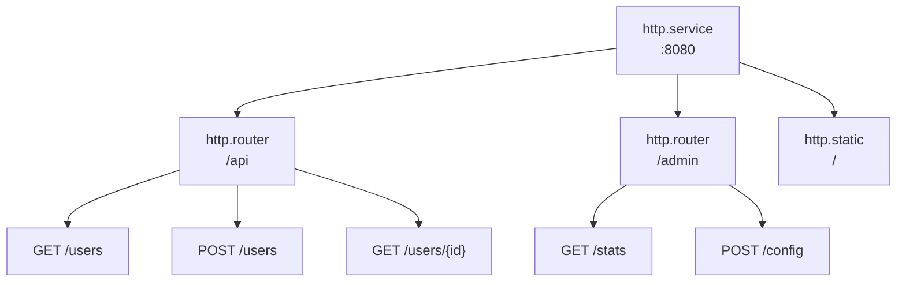

# 라우팅

라우터는 URL 프리픽스 아래에 엔드포인트를 그룹화하고 공유 미들웨어를 적용합니다. 엔드포인트는 HTTP 핸들러를 정의합니다.

## 아키텍처



엔트리는 메타데이터를 통해 부모를 참조합니다:
- 라우터: `meta.server: app:gateway`
- 엔드포인트: `meta.router: app:api`

## 라우터 설정

```yaml
- name: api
  kind: http.router
  meta:
    server: gateway
  prefix: /api/v1
  middleware:
    - cors
    - compress
  options:
    cors.allow.origins: "*"
  post_middleware:
    - endpoint_firewall
```

| 필드 | 타입 | 설명 |
|-------|------|-------------|
| `meta.server` | 레지스트리 ID | 부모 HTTP 서버 |
| `prefix` | string | 모든 라우트의 URL 프리픽스 |
| `middleware` | []string | 매칭 전 미들웨어 |
| `options` | map | 미들웨어 옵션 |
| `post_middleware` | []string | 매칭 후 미들웨어 |
| `post_options` | map | 매칭 후 미들웨어 옵션 |

## 엔드포인트 설정

```yaml
- name: get_user
  kind: http.endpoint
  meta:
    router: api
  method: GET
  path: /users/{id}
  func: app.users:get_user
```

| 필드 | 타입 | 설명 |
|-------|------|-------------|
| `meta.router` | 레지스트리 ID | 부모 라우터 |
| `method` | string | HTTP 메서드 (GET, POST, PUT, DELETE, PATCH, HEAD) |
| `path` | string | URL 경로 패턴 (`/`로 시작) |
| `func` | 레지스트리 ID | 핸들러 함수 |

## 경로 파라미터

URL 파라미터에 `{param}` 구문 사용:

```yaml
- name: get_post
  kind: http.endpoint
  meta:
    router: api
  method: GET
  path: /users/{user_id}/posts/{post_id}
  func: get_user_post
```

핸들러에서 접근:

```lua
local http = require("http")

local function handler()
    local req = http.request()
    local user_id = req:param("user_id")
    local post_id = req:param("post_id")

    -- ...
end
```

### 와일드카드 경로

`{param...}`으로 나머지 경로 세그먼트 캡처:

```yaml
- name: serve_files
  kind: http.endpoint
  meta:
    router: api
  method: GET
  path: /files/{filepath...}
  func: serve_file
```

```lua
-- 요청: GET /api/v1/files/docs/guides/readme.md
local file_path = req:param("filepath")  -- "docs/guides/readme.md"
```

와일드카드는 경로의 마지막 세그먼트여야 합니다.

## 핸들러 함수

엔드포인트 핸들러는 `http` 모듈을 사용하여 요청 및 응답 객체에 접근합니다. 전체 API는 [HTTP 모듈](lua-http.md)을 참조하세요.

```lua
local http = require("http")
local json = require("json")

local function handler()
    local req = http.request()
    local res = http.response()

    local user_id = req:param("id")
    local user = get_user(user_id)

    res:status(200)
    res:write(json.encode(user))
end

return { handler = handler }
```

## 미들웨어 옵션

미들웨어 옵션은 미들웨어 이름을 프리픽스로 하는 점 표기법을 사용합니다:

```yaml
middleware:
  - cors
  - ratelimit
  - token_auth
options:
  cors.allow.origins: "https://app.example.com"
  cors.allow.methods: "GET,POST,PUT,DELETE"
  ratelimit.requests: "100"
  ratelimit.window: "1m"
  token_auth.store: "app:tokens"
  token_auth.header.name: "Authorization"
```

매칭 후 미들웨어는 `post_options` 사용:

```yaml
post_middleware:
  - endpoint_firewall
post_options:
  endpoint_firewall.default_policy: "deny"
```

## 매칭 전 vs 매칭 후 미들웨어

**매칭 전** (`middleware`)은 라우트 매칭 전에 실행:
- CORS (OPTIONS 프리플라이트 처리)
- 압축
- 레이트 리미팅
- 실제 IP 감지
- 토큰 인증 (컨텍스트 보강)

**매칭 후** (`post_middleware`)는 라우트 매칭 후에 실행:
- 엔드포인트 방화벽 (인가에 라우트 정보 필요)
- 리소스 방화벽
- WebSocket 릴레이

```yaml
middleware:        # 매칭 전: 이 라우터로의 모든 요청
  - cors
  - compress
  - token_auth     # 액터/스코프로 컨텍스트 보강

post_middleware:   # 매칭 후: 매칭된 라우트만
  - endpoint_firewall  # token_auth의 액터 사용
```

<tip>
토큰 인증은 컨텍스트만 보강하고 요청을 차단하지 않으므로 매칭 전이 될 수 있습니다. 인가는 <code>token_auth</code>가 설정한 액터를 사용하는 <code>endpoint_firewall</code> 같은 매칭 후 미들웨어에서 발생합니다.
</tip>

## 전체 예제

```yaml
version: "1.0"
namespace: app

entries:
  # 서버
  - name: gateway
    kind: http.service
    addr: ":8080"
    lifecycle:
      auto_start: true

  # API 라우터
  - name: api
    kind: http.router
    meta:
      server: gateway
    prefix: /api/v1
    middleware:
      - cors
      - compress
      - ratelimit
    options:
      cors.allow.origins: "https://app.example.com"
      ratelimit.requests: "100"
      ratelimit.window: "1m"

  # 핸들러 함수
  - name: get_users
    kind: function.lua
    source: file://handlers/users.lua
    method: list
    modules:
      - http
      - json
      - sql

  # 엔드포인트
  - name: list_users
    kind: http.endpoint
    meta:
      router: api
    method: GET
    path: /users
    func: get_users

  - name: get_user
    kind: http.endpoint
    meta:
      router: api
    method: GET
    path: /users/{id}
    func: app:get_user_by_id

  - name: create_user
    kind: http.endpoint
    meta:
      router: api
    method: POST
    path: /users
    func: app:create_user
```

## 보호된 라우트

인증이 있는 일반적인 패턴:

```yaml
entries:
  # 퍼블릭 라우트 (인증 없음)
  - name: public
    kind: http.router
    meta:
      server: gateway
    prefix: /api/public
    middleware:
      - cors

  # 보호된 라우트
  - name: protected
    kind: http.router
    meta:
      server: gateway
    prefix: /api
    middleware:
      - cors
      - token_auth
    options:
      token_store: app:tokens
    post_middleware:
      - endpoint_firewall
```

## 참고

- [서버](http-server.md) - HTTP 서버 설정
- [정적 파일](http-static.md) - 정적 파일 서빙
- [미들웨어](http-middleware.md) - 사용 가능한 미들웨어
- [HTTP 모듈](lua-http.md) - Lua HTTP API
