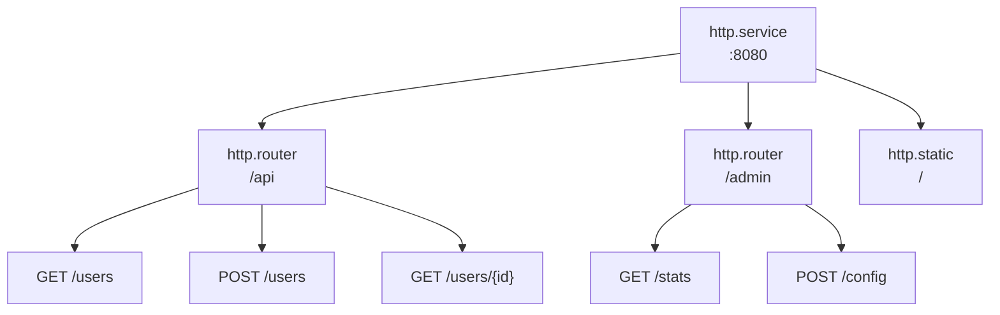

# 라우팅

`http.router`는 URL 프리픽스 아래에 엔드포인트를 그룹화하고 공유 미들웨어를 적용합니다. 각 `http.endpoint`는 HTTP 핸들러를 정의합니다.

**분류: 라우팅 참조.** 구성 블록은 네임스페이스와 참조되는 모든 엔트리를 포함하지 않는 한 부분적인 레지스트리 조각입니다. 핸들러 블록은 데이터 계층을 정의하는 대신 애플리케이션이 소유한 함수 ID를 사용합니다.

## 아키텍처


```mermaid
flowchart TB
    S[http.service<br/>:8080] --> R1[http.router<br/>/api]
    S --> R2[http.router<br/>/admin]
    S --> ST[http.static<br/>/]

    R1 --> E1[GET /users]
    R1 --> E2[POST /users]
    R1 --> E3["GET /users/{id}"]

    R2 --> E4[GET /stats]
    R2 --> E5[POST /config]
```

엔트리는 메타데이터를 통해 부모를 참조합니다:
- 라우터: `meta.server: app:gateway`
- 엔드포인트: `meta.router: app:api`

## 라우터 설정

```yaml
- name: api
  kind: http.router
  meta:
    server: gateway
  prefix: /api/v1
  middleware:
    - cors
    - compress
  options:
    cors.allow.origins: "*"
  post_middleware:
    - endpoint_firewall
```

| 필드 | 타입 | 설명 |
|-------|------|-------------|
| `meta.server` | 레지스트리 ID | 부모 HTTP 서버 |
| `prefix` | string | 모든 라우트의 URL 프리픽스 |
| `middleware` | []string | 매칭 전 미들웨어 |
| `options` | map | 미들웨어 옵션 |
| `post_middleware` | []string | 매칭 후 미들웨어 |
| `post_options` | map | 매칭 후 미들웨어 옵션 |

## 엔드포인트 설정

```yaml
- name: get_user
  kind: http.endpoint
  meta:
    router: api
  method: GET
  path: /users/{id}
  func: app.users:get_user
```

| 필드 | 타입 | 설명 |
|-------|------|-------------|
| `meta.router` | 레지스트리 ID | 부모 라우터 |
| `method` | string | HTTP 메서드: `GET`, `POST`, `PUT`, `DELETE`, `PATCH`, `HEAD`, `OPTIONS`, `TRACE` 또는 모든 메서드에 대한 `*` |
| `path` | string | URL 경로 패턴 (`/`로 시작) |
| `func` | 레지스트리 ID | 핸들러 함수 |

## 경로 파라미터

URL 파라미터에 `{param}` 구문 사용:

```yaml
- name: get_post
  kind: http.endpoint
  meta:
    router: api
  method: GET
  path: /users/{user_id}/posts/{post_id}
  func: get_user_post
```

핸들러에서 접근:

```lua
local http = require("http")

local function handler()
    local req, req_err = http.request()
    if req_err then return nil, req_err end
    local user_id, user_err = req:param("user_id")
    if user_err then return nil, user_err end
    local post_id, post_err = req:param("post_id")
    if post_err then return nil, post_err end

    return {user_id = user_id, post_id = post_id}
end
```

### 와일드카드 경로

`{param...}`으로 나머지 경로 세그먼트 캡처:

```yaml
- name: serve_files
  kind: http.endpoint
  meta:
    router: api
  method: GET
  path: /files/{filepath...}
  func: serve_file
```


와일드카드는 경로의 마지막 세그먼트여야 합니다. 예를 들어 `GET /api/v1/files/docs/guides/readme.md` 요청은 `req:param("filepath")` 값이 `docs/guides/readme.md`인 상태로 전달됩니다.

## 핸들러 함수

엔드포인트 핸들러는 `http` 모듈을 사용하여 요청 및 응답 객체에 접근합니다. 전체 API는 [HTTP 모듈](lua/http/http.md)을 참조하세요.

```lua
local http = require("http")
local funcs = require("funcs")

local function handler()
    local req, req_err = http.request()
    if req_err then return nil, req_err end
    local res, res_err = http.response()
    if res_err then return nil, res_err end

    local user_id, param_err = req:param("id")
    if param_err then return nil, param_err end
    local user, call_err = funcs.call("app.users:get_user", user_id)
    if call_err then return nil, call_err end

    local status_err = res:set_status(http.STATUS.OK)
    if status_err then return nil, status_err end
    local write_err = res:write_json(user)
    if write_err then return nil, write_err end
    return true
end

return { handler = handler }
```

## 미들웨어 옵션

미들웨어 옵션은 미들웨어 이름을 프리픽스로 하는 점 표기법을 사용합니다:

```yaml
middleware:
  - cors
  - ratelimit
  - token_auth
options:
  cors.allow.origins: "https://app.example.com"
  cors.allow.methods: "GET,POST,PUT,DELETE"
  ratelimit.requests: "100"
  ratelimit.window: "1m"
  token_auth.store: "app:tokens"
  token_auth.header.name: "Authorization"
```

매칭 후 미들웨어는 `post_options` 사용:

```yaml
post_middleware:
  - endpoint_firewall
post_options:
  endpoint_firewall.action: "access"
```

## 사전 핸들러 및 매칭 후 미들웨어

**사전 핸들러** (`middleware`)는 서버가 라우트를 선택한 뒤, 라우트 파라미터와 엔드포인트 메타데이터가 요청 컨텍스트에 연결되기 전에 실행됩니다:
- CORS (OPTIONS 프리플라이트 처리)
- 압축
- 레이트 리미팅
- 실제 IP 감지
- 토큰 인증 (컨텍스트 보강)

**매칭 후** (`post_middleware`)는 라우트 파라미터와 엔드포인트 메타데이터가 연결된 뒤 실행됩니다:
- 엔드포인트 방화벽 (인가에 라우트 정보 필요)
- 리소스 방화벽
- WebSocket 릴레이

```yaml
middleware:        # Before endpoint metadata: matched routes only
  - cors
  - compress
  - token_auth     # Enriches context with actor/scope

post_middleware:   # Post-match: matched routes only
  - endpoint_firewall  # Uses actor from token_auth
```

<tip>
토큰 인증은 인가 전에 요청 컨텍스트를 보강하므로 사전 핸들러 체인에 둡니다. <code>endpoint_firewall</code> 같은 인가 미들웨어는 매칭된 엔드포인트 ID가 필요하므로 매칭 후 체인에 둡니다. 매칭되지 않은 요청은 어느 라우터 체인도 실행하지 않습니다.
</tip>

## 전체 예제

이 예제는 목록 handler 엔트리를 정의합니다. `app:get_user_by_id`와 `app:create_user` 함수 ID는 같은 namespace의 다른 위치에 정의된 handler를 가리킵니다.

```yaml
version: "1.0"
namespace: app

entries:
  # Server
  - name: gateway
    kind: http.service
    addr: ":8080"
    lifecycle:
      auto_start: true

  # API Router
  - name: api
    kind: http.router
    meta:
      server: gateway
    prefix: /api/v1
    middleware:
      - cors
      - compress
      - ratelimit
    options:
      cors.allow.origins: "https://app.example.com"
      ratelimit.requests: "100"
      ratelimit.window: "1m"

  # Handler function
  - name: get_users
    kind: function.lua
    source: file://handlers/users.lua
    method: list
    modules:
      - http
      - json
      - sql

  # Endpoints
  - name: list_users
    kind: http.endpoint
    meta:
      router: api
    method: GET
    path: /users
    func: get_users

  - name: get_user
    kind: http.endpoint
    meta:
      router: api
    method: GET
    path: /users/{id}
    func: app:get_user_by_id

  - name: create_user
    kind: http.endpoint
    meta:
      router: api
    method: POST
    path: /users
    func: app:create_user
```

## 보호된 라우트

인증이 있는 일반적인 패턴:

```yaml
entries:
  # Public routes (no auth)
  - name: public
    kind: http.router
    meta:
      server: gateway
    prefix: /api/public
    middleware:
      - cors

  # Protected routes
  - name: protected
    kind: http.router
    meta:
      server: gateway
    prefix: /api
    middleware:
      - cors
      - token_auth
    options:
      token_auth.store: app:tokens
    post_middleware:
      - endpoint_firewall
```

## 참고

- [서버](http/server.md) - HTTP 서버 설정
- [정적 파일](http/static.md) - 정적 파일 서빙
- [미들웨어](http/middleware.md) - 사용 가능한 미들웨어
- [HTTP 모듈](lua/http/http.md) - Lua HTTP API
