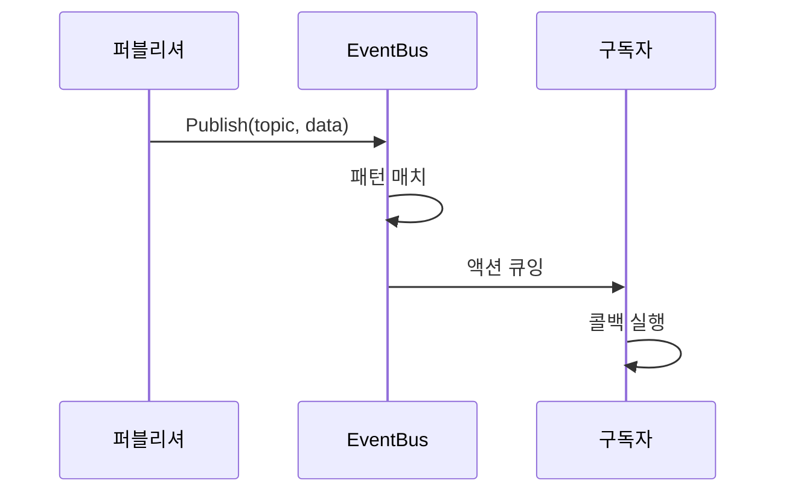
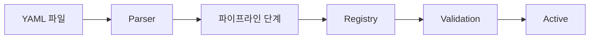
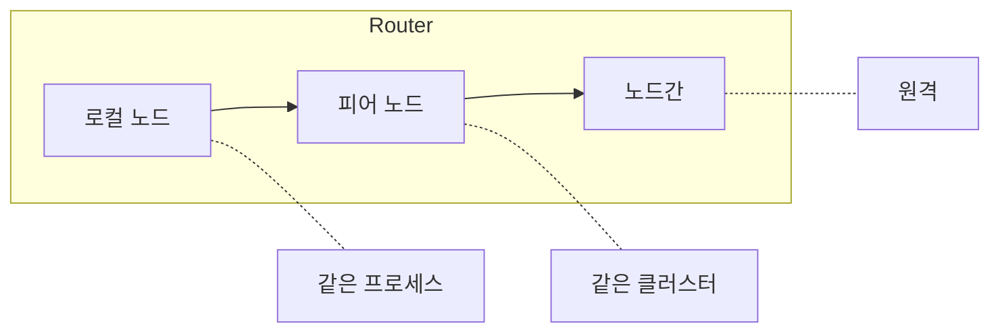

# 아키텍처

<note>
이 페이지는 작업 중입니다. 내용이 불완전하거나 변경될 수 있습니다.
</note>

Wippy는 Go 기반의 계층화된 시스템입니다. 컴포넌트는 의존성 순서로 초기화되고, 이벤트 버스를 통해 통신하며, 작업 스틸링 스케줄러를 통해 Lua 프로세스를 실행합니다.

## 계층

| 계층 | 컴포넌트 |
|-------|------------|
| 애플리케이션 | Lua 프로세스, 함수, 워크플로우 |
| 런타임 | Lua 엔진 (gopher-lua), 50+ 모듈 |
| 서비스 | HTTP, Queue, Storage, Temporal |
| 시스템 | Topology, Factory, Functions, Contracts |
| 코어 | Scheduler, Registry, Dispatcher, EventBus, Relay |
| 인프라 | AppContext, Logger, Transcoder |

각 계층은 아래 계층에만 의존합니다. 코어 계층은 기본 프리미티브를 제공하고, 서비스는 그 위에 더 높은 수준의 추상화를 구축합니다.

## 부트 시퀀스

애플리케이션 시작은 네 단계로 진행됩니다.

### 1단계: 인프라

컴포넌트가 로드되기 전에 핵심 인프라 생성:

| 컴포넌트 | 목적 |
|-----------|---------|
| AppContext | 컴포넌트 참조를 위한 봉인된 딕셔너리 |
| EventBus | 컴포넌트 간 통신을 위한 pub/sub |
| Transcoder | 페이로드 직렬화 (JSON, YAML, Lua) |
| Logger | 이벤트 스트리밍이 있는 구조화된 로깅 |
| Relay | 메시지 라우팅 (Node, Router, Mailbox) |

### 2단계: 컴포넌트 로딩

Loader가 토폴로지 정렬을 통해 의존성을 해결하고 레벨별로 컴포넌트를 로드합니다. 같은 레벨의 컴포넌트는 병렬로 로드됩니다.

| 레벨 | 컴포넌트 | 의존성 |
|-------|------------|--------------|
| 0 | PIDGen | 없음 |
| 1 | Dispatcher | PIDGen |
| 2 | Registry | Dispatcher |
| 3 | Finder, Supervisor | Registry |
| 4 | Topology | Supervisor |
| 5 | Lifecycle | Topology |
| 6 | Factory | Lifecycle |
| 7 | Functions | Factory |

각 컴포넌트는 Load 단계에서 컨텍스트에 자신을 연결하여 의존 컴포넌트가 서비스를 사용할 수 있게 합니다.

### 3단계: 활성화

모든 컴포넌트 로드 후:

1. **Dispatcher 동결** - 락 프리 조회를 위해 명령 핸들러 레지스트리 잠금
2. **AppContext 봉인** - 더 이상 쓰기 불가, 락 프리 읽기 활성화
3. **컴포넌트 시작** - `Starter` 인터페이스가 있는 각 컴포넌트에 `Start()` 호출

### 4단계: 엔트리 로딩

레지스트리 엔트리(YAML 파일에서)가 로드되고 검증됩니다:

1. 프로젝트 파일에서 엔트리 파싱
2. 파이프라인 단계가 엔트리 변환 (override, link, bytecode)
3. `auto_start: true`로 표시된 서비스 실행 시작
4. 슈퍼바이저가 등록된 서비스 모니터링

## 컴포넌트

컴포넌트는 애플리케이션 라이프사이클에 참여하는 Go 서비스입니다.

### 라이프사이클 단계

| 단계 | 메서드 | 목적 |
|-------|--------|---------|
| Load | `Load(ctx) (ctx, error)` | 초기화 및 컨텍스트에 연결 |
| Start | `Start(ctx) error` | 활성 작업 시작 |
| Stop | `Stop(ctx) error` | 그레이스풀 셧다운 |

컴포넌트는 의존성을 선언합니다. 로더가 방향성 비순환 그래프를 구축하고 토폴로지 순서로 실행합니다. 셧다운은 역순으로 발생합니다.

### 표준 컴포넌트

| 컴포넌트 | 의존성 | 목적 |
|-----------|--------------|---------|
| PIDGen | 없음 | 프로세스 ID 생성 |
| Dispatcher | PIDGen | 명령 핸들러 디스패치 |
| Registry | Dispatcher | 엔트리 스토리지 및 버전닝 |
| Finder | Registry | 엔트리 조회 및 검색 |
| Supervisor | Registry | 서비스 재시작 정책 |
| Topology | Supervisor | 프로세스 부모/자식 트리 |
| Lifecycle | Topology | 서비스 라이프사이클 관리 |
| Factory | Lifecycle | 프로세스 생성 |
| Functions | Factory | 상태 비저장 함수 호출 |

## 이벤트 버스

컴포넌트 간 통신을 위한 비동기 pub/sub.

### 설계

- 단일 디스패처 고루틴이 모든 이벤트 처리
- 큐 기반 액션 전달로 퍼블리셔 블로킹 방지
- 패턴 매칭으로 정확한 토픽과 와일드카드(`*`) 지원
- 컨텍스트 기반 라이프사이클이 구독을 취소와 연결

### 이벤트 흐름

### 일반적인 토픽

| 토픽 | 퍼블리셔 | 목적 |
|-------|-----------|---------|
| `registry.entry.*` | Registry | 엔트리 변경 |
| `process.started` | Topology | 프로세스 라이프사이클 |
| `process.stopped` | Topology | 프로세스 라이프사이클 |
| `supervisor.state.*` | Supervisor | 서비스 상태 변경 |

## 레지스트리

엔트리 정의를 위한 버전화된 스토리지.

### 기능

- **버전화된 상태** - 각 변경이 새 버전 생성
- **히스토리** - 감사 추적을 위한 SQLite 백업 히스토리
- **관찰** - 특정 엔트리의 변경 감시
- **이벤트 기반** - 변경 시 이벤트 퍼블리시

### 엔트리 라이프사이클

파이프라인 단계가 엔트리를 변환:

| 단계 | 목적 |
|-------|---------|
| Override | 설정 오버라이드 적용 |
| Disable | 패턴으로 엔트리 제거 |
| Link | 요구사항과 의존성 해결 |
| Bytecode | Lua를 바이트코드로 컴파일 |
| EmbedFS | 파일시스템 엔트리 수집 |

## 릴레이

노드 간 프로세스 메시지 라우팅.

### 3계층 라우팅

1. **Local** - 같은 노드 내 직접 전달
2. **Peer** - 클러스터 내 피어 노드로 전달
3. **Internode** - 네트워크를 통해 원격 노드로 라우팅

### 메일박스

각 노드에는 워커 풀이 있는 메일박스:

- FNV-1a 해싱으로 발신자를 워커에 할당
- 발신자별 메시지 순서 유지
- 워커가 동시에 메시지 처리
- 큐가 가득 차면 백프레셔

## AppContext

컴포넌트 참조를 위한 봉인된 딕셔너리.

| 속성 | 동작 |
|----------|----------|
| 봉인 전 | RWMutex로 보호된 쓰기 |
| 봉인 후 | 락 프리 읽기, 쓰기 시 패닉 |
| 중복 키 | 패닉 |
| 타입 안전성 | 타입화된 getter 함수 |

컴포넌트는 Load 단계에서 서비스를 연결합니다. 부트 완료 후 AppContext가 최적의 읽기 성능을 위해 봉인됩니다.

## 셧다운

그레이스풀 셧다운은 역순으로 진행:

1. SIGINT/SIGTERM이 셧다운 트리거
2. 슈퍼바이저가 관리되는 서비스 중지
3. `Stopper` 인터페이스가 있는 컴포넌트가 `Stop()` 수신
4. 인프라 정리

두 번째 시그널은 즉시 종료를 강제합니다.

## 참고

- [스케줄러](internals/scheduler.md) - 프로세스 실행
- [이벤트 버스](internals/events.md) - Pub/sub 시스템
- [레지스트리](internals/registry.md) - 상태 관리
- [명령 디스패치](internals/dispatch.md) - Yield 처리
