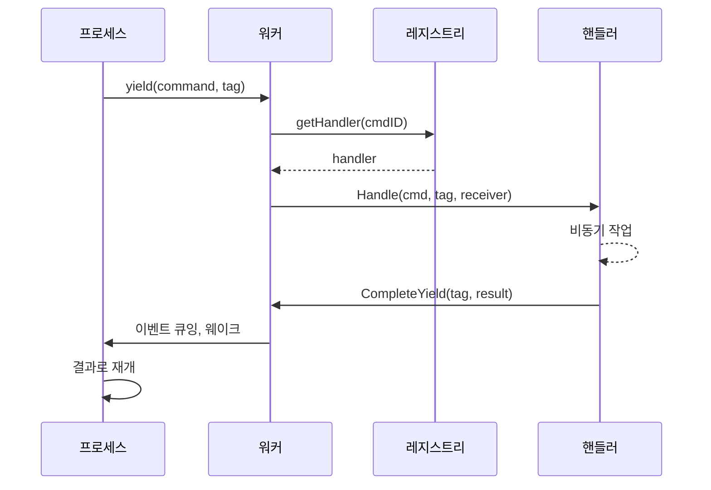

# 명령 디스패치

디스패치 시스템은 프로세스에서 핸들러로 명령을 라우팅합니다. 프로세스는 상관 태그와 함께 명령을 yield하고, 핸들러는 비동기 작업을 실행하고, 결과는 이벤트 큐를 통해 돌아옵니다.

## 흐름



## 명령 레지스트리

레지스트리는 하이브리드 구조로 핸들러를 저장합니다:

```go
type Registry struct {
    handlers [256]Handler         // 시스템 명령: O(1) 인덱스
    extended map[CommandID]Handler // 확장 명령: 맵 조회
    frozen   atomic.Bool          // 부트 후 락 프리
}
```

시스템 명령(0-255)은 배열 인덱싱을 사용합니다. 확장 명령은 맵 조회를 사용합니다. `Freeze()` 후에는 모든 조회가 락 프리입니다.

### 명령 ID 범위

| 범위 | 모듈 | 예제 |
|-------|--------|----------|
| 1-9 | process | Send, Spawn, Terminate, Monitor, Link |
| 10-29 | clock | Sleep, Ticker, Timer |
| 50-59 | stream | Read, Write, Close, Seek |
| 60-79 | http | Request, RequestBatch |
| 80-89 | websocket | Connect, Send, Receive |
| 90-99 | event | Subscribe, Send |
| 100-119 | sql | Query, Execute, Transaction ops |
| 120-129 | store | Get, Set, Delete, Has |
| 130-139 | security | ValidateToken, CreateToken |
| 140-149 | function | Call, AsyncStart, AsyncCancel |
| 150-159 | exec | ProcessWait |
| 160-169 | cloudstorage | Upload, Download, List, Presigned URLs |
| 170-179 | eval | Compile, Run, CreateProcess |
| 180-189 | workflow | SideEffect, Call, Version, UpsertAttrs |
| 190-199 | contract | Open, Call, AsyncCall, AsyncCancel |
| 256+ | custom | 사용자 정의 서비스 |

등록은 `MustRegisterCommands()`를 통해 부트 중에 발생합니다. 충돌은 시작 시 패닉을 발생시킵니다.

## 명령 정의

명령은 고유한 `CommandID`가 있는 데이터 구조입니다:

```go
const MyCommand dispatcher.CommandID = 200

type MyCmd struct {
    Input  string
    Option int
}

var myCmdPool = sync.Pool{New: func() any { return &MyCmd{} }}

func (c *MyCmd) CmdID() dispatcher.CommandID { return MyCommand }

func (c *MyCmd) Release() {
    c.Input = ""
    c.Option = 0
    myCmdPool.Put(c)
}
```

풀 재사용은 핫 패스에서 할당을 제거합니다. 패키지 init에서 등록:

```go
func init() {
    dispatcher.MustRegisterCommands("myservice", MyCommand)
}
```

## 디스패처

디스패처는 관련 핸들러를 그룹화합니다. 핸들러를 등록하기 위해 `RegisterAll`을 구현하고 설정/해제를 위한 라이프사이클 메서드를 가집니다:

```go
type Handler interface {
    Handle(ctx context.Context, cmd Command, tag uint64, receiver ResultReceiver) error
}

type ResultReceiver interface {
    CompleteYield(tag uint64, data any, err error)
}
```

```go
type Dispatcher struct {
    // 서비스 상태
}

func (d *Dispatcher) RegisterAll(register func(id dispatcher.CommandID, h dispatcher.Handler)) {
    register(myapi.MyCommand, dispatcher.HandlerFunc(d.handleMyCommand))
}

func (d *Dispatcher) handleMyCommand(ctx context.Context, cmd Command, tag uint64, receiver ResultReceiver) error {
    c := cmd.(*myapi.MyCmd)
    go func() {
        result := doWork(c)
        if ctx.Err() == nil {
            receiver.CompleteYield(tag, result, nil)
        }
    }()
    return nil
}
```

부트 컴포넌트로 등록:

```go
func MyDispatcher() boot.Component {
    return boot.New(boot.P{
        Name:      "dispatcher.myservice",
        DependsOn: []boot.Name{DispatcherName},
        Load: func(ctx context.Context) (context.Context, error) {
            reg := dispatcher.GetRegistrar(ctx)
            svc := myservice.NewDispatcher()
            svc.RegisterAll(reg.Register)
            return ctx, nil
        },
    })
}
```

## Yield와 상관관계

프로세스가 비동기 작업이 필요하면 상관 태그와 함께 명령을 yield합니다:

```go
type Yield struct {
    Cmd Command
    Tag uint64    // 상관관계를 위한 프로세스 로컬 카운터
}
```

워커는 각 스텝 후 `StepOutput`에서 yield를 추출하고 핸들러에 디스패치합니다. 각 태그는 결과를 다시 매칭할 수 있도록 요청을 고유하게 식별합니다.

## 참고

- [스케줄러](internals/scheduler.md) - 프로세스 실행
- [모듈](internals/modules.md) - Lua 모듈 통합
- [프로세스 모델](concepts/process-model.md) - 상위 수준 개념
