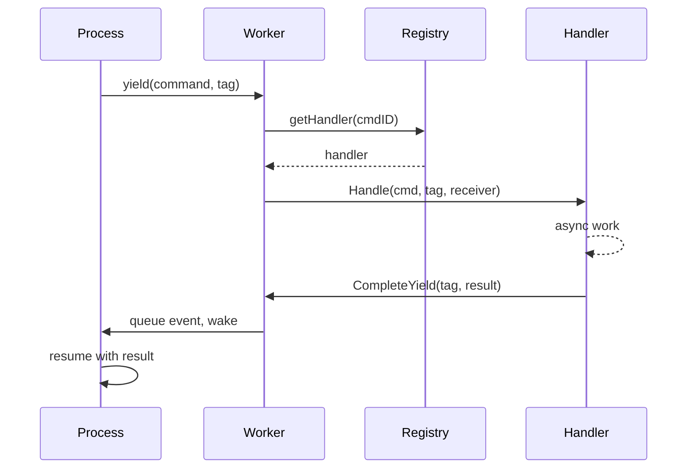

# 명령 디스패치

command dispatch는 process yield를 handler로 route하고 correlated result를 process event queue를 통해 반환합니다.

이 페이지는 extension 및 implementation reference입니다. custom command와 dispatcher fragment는 기존 Go package, boot graph, command API, service-specific error handling을 가정합니다.

## 흐름


```mermaid
sequenceDiagram
    participant P as Process
    participant W as Worker
    participant R as Registry
    participant H as Handler

    P->>W: yield(command, tag)
    W->>R: getHandler(cmdID)
    R-->>W: handler
    W->>H: Handle(cmd, tag, receiver)
    H-->>H: async work
    H->>W: CompleteYield(tag, result)
    W->>P: queue event, wake
    P->>P: resume with result
```

## 명령 레지스트리

레지스트리는 하이브리드 구조로 핸들러를 저장합니다:

```go
type Registry struct {
    handlers [256]Handler         // System commands: O(1) index
    extended map[CommandID]Handler // Extended commands: map lookup
    frozen   atomic.Bool          // Lock-free after boot
}
```

시스템 명령(0-255)은 배열 인덱싱을 사용합니다. 확장 명령은 맵 조회를 사용합니다. `Freeze()` 후에는 모든 조회가 락 프리입니다.

### 명령 ID 범위

| 범위 | 모듈 | 예제 |
|-------|--------|----------|
| 1-9 | process | Send, Spawn, Terminate, Cancel, Monitor, Unmonitor, Link, Unlink, Exec |
| 10, 14, 16, 18-23 | clock | Sleep, ticker, and timer operations |
| 30-34 | socket | Connect, Listen, Accept, Bind, Resolve |
| 50-57 | stream | Read, Write, Close, Seek, Flush, Stat, Scanner operations |
| 60-61 | http | Request, RequestBatch |
| 70-78 | tty | Terminal I/O |
| 80-85 | websocket | Connect, Send, Receive, Close, Ping, Subscribe |
| 90-91 | event | Subscribe, Send |
| 100-111 | sql | Query, Execute, Prepare, statement and transaction operations |
| 120-126 | store | Get, Set, Delete, Has, Entry, List, Put |
| 130-132 | security | ValidateToken, CreateToken, RevokeToken |
| 140-142 | function | Call, AsyncStart, AsyncCancel |
| 150 | exec | ProcessWait |
| 160-169 | cloudstorage | Object and multipart operations |
| 170-171 | eval | Compile, Run |
| 172 | cdc | Subscribe |
| 173-174 | cloudstorage | AbortMultipartUpload, OpenReader |
| 180-183 | workflow | SideEffect, Exec, Version, UpsertAttrs |
| 190-193 | contract | Open, Call, AsyncCall, AsyncCancel |
| 200-211 | pg (process group) | Join, Leave, GetMembers, GetLocalMembers, WhichGroups, Broadcast, BroadcastLocal, WhichLocalGroups, Monitor, Events, JoinGroups, LeaveGroups |
| 256+ | custom | user-defined service |

package는 `init()`에서 `MustRegisterCommands()`로 command-ID ownership을 reserve합니다. ownership collision은 package initialization 중 panic합니다. component load 중 각 service는 `Registrar.Register`를 통해 handler를 bind합니다. dispatcher는 handler가 설치된 뒤에만 freeze됩니다.

## 명령 정의

명령은 고유한 `CommandID`가 있는 데이터 구조입니다:

```go
const MyCommand dispatcher.CommandID = 256

type MyCmd struct {
    Input  string
    Option int
}

func (c *MyCmd) CmdID() dispatcher.CommandID { return MyCommand }
```

package initialization에서 command ID를 reserve합니다.

```go
func init() {
    dispatcher.MustRegisterCommands("myservice", MyCommand)
}
```

## 디스패처

디스패처는 관련 핸들러를 그룹화합니다. 핸들러를 등록하기 위해 `RegisterAll`을 구현하고 설정/해제를 위한 라이프사이클 메서드를 가집니다:

```go
type Handler interface {
    Handle(ctx context.Context, cmd Command, tag uint64, receiver ResultReceiver) error
}

type ResultReceiver interface {
    CompleteYield(tag uint64, data any, err error)
}
```

```go
type Dispatcher struct {
    // service state
}

func (d *Dispatcher) RegisterAll(register func(id dispatcher.CommandID, h dispatcher.Handler)) {
    register(myapi.MyCommand, dispatcher.HandlerFunc(d.handleMyCommand))
}

func (d *Dispatcher) handleMyCommand(ctx context.Context, cmd Command, tag uint64, receiver ResultReceiver) error {
    c := cmd.(*myapi.MyCmd)
    go func() {
        result := doWork(c)
        if ctx.Err() == nil {
            receiver.CompleteYield(tag, result, nil)
        }
    }()
    return nil
}
```

부트 컴포넌트로 등록:

```go
func MyDispatcher() boot.Component {
    return boot.New(boot.P{
        Name:      "dispatcher.myservice",
        DependsOn: []boot.Name{DispatcherName},
        Load: func(ctx context.Context) (context.Context, error) {
            reg := dispatcher.GetRegistrar(ctx)
            svc := myservice.NewDispatcher()
            svc.RegisterAll(reg.Register)
            return ctx, nil
        },
    })
}
```

## Yield와 상관관계

프로세스가 비동기 작업이 필요하면 상관 태그와 함께 명령을 yield합니다:

```go
type Yield struct {
    Cmd Command
    Tag uint64    // Process-local counter for correlation
}
```

워커는 각 스텝 후 `StepOutput`에서 yield를 추출하고 핸들러에 디스패치합니다. 각 태그는 결과를 다시 매칭할 수 있도록 요청을 고유하게 식별합니다.

## 참고

- [스케줄러](./scheduler.md) - process execution
- [모듈](./modules.md) - Lua module integration
- [프로세스 모델](../concepts/process-model.md) - high-level concept
