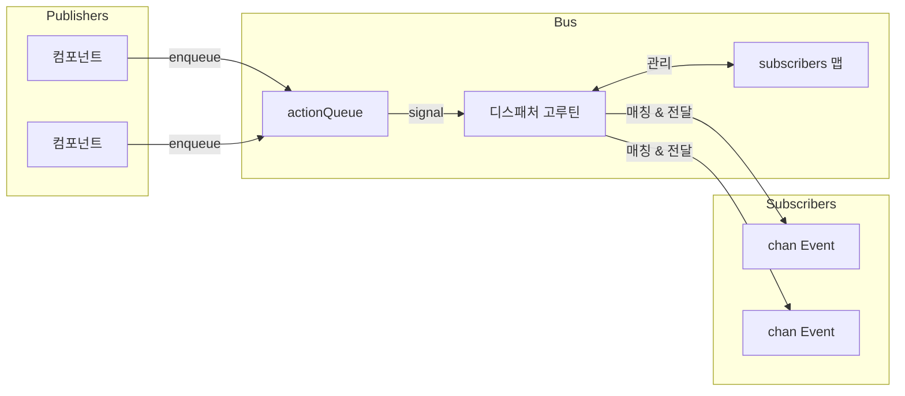

# 이벤트 버스

이벤트 버스는 단일 디스패처 고루틴을 사용하는 pub/sub 시스템입니다. 퍼블리셔는 액션을 큐에 넣고, 디스패처는 순차적으로 처리하고, 구독자는 채널에서 매칭되는 이벤트를 받습니다.

## 이벤트 구조

```go
type Event struct {
    System string  // 컴포넌트/모듈 (예: "registry", "process")
    Kind   string  // 이벤트 타입 (예: "create", "update", "exit")
    Path   string  // 엔티티 식별자
    Data   any     // 페이로드
}
```

## 버스 아키텍처



버스는 간단한 구조로 상태를 저장합니다:

```go
type Bus struct {
    subscribers       map[SubscriberID]sub
    subscriberCounter uint64

    actionQueue []action
    spareQueue  []action
    actionMu    sync.Mutex
    actionReady chan struct{}  // buffered=1

    closed atomic.Bool
}
```

모든 변이는 디스패처 고루틴을 통해 진행되어 복잡한 락킹 없이 레이스 조건을 제거합니다.

## 액션

네 가지 액션 타입이 큐를 통해 흐릅니다:

| 액션 | 동작 |
|--------|----------|
| Subscribe | 구독자를 맵에 추가, done 채널로 응답 |
| Unsubscribe | 구독자 제거, done 채널로 응답 |
| Send | 매칭하는 구독자에게 이벤트 전달 |
| Stop | 구독자 정리, 큐 드레인, 루프 종료 |

Subscribe와 Unsubscribe는 디스패처가 확인할 때까지 블록합니다. Send는 fire-and-forget입니다.

## 큐 스와핑

디스패처는 정상 상태에서 할당을 피하기 위해 슬라이스 스와핑을 사용합니다:

```go
func (b *Bus) processActions() bool {
    b.actionMu.Lock()
    actions := b.actionQueue
    b.actionQueue = b.spareQueue[:0]
    b.spareQueue = nil
    b.actionMu.Unlock()

    for i := range actions {
        // 액션 처리
    }

    clear(actions)
    b.actionMu.Lock()
    b.spareQueue = actions[:0]
    b.actionMu.Unlock()
    return true
}
```

두 슬라이스가 번갈아 사용됩니다: 하나는 처리용, 하나는 새로운 도착용. `actionReady` 채널은 1로 버퍼되어 시그널링이 절대 블록하지 않고 여러 큐잉이 하나의 웨이크업으로 합쳐집니다.

## 패턴 매칭

구독은 구독 시점에 패턴을 한 번 컴파일합니다:

```go
type sub struct {
    subID   SubscriberID
    ctx     context.Context
    system  *wildcard.Wildcard
    kind    *wildcard.Wildcard
    eventCh chan<- Event
}
```

와일드카드 패키지는 세 가지 패턴 타입을 지원합니다:

| 패턴 | 매칭 |
|---------|---------|
| `registry` | 정확한 매칭만 |
| `*` | 단일 세그먼트 |
| `**` | 0개 이상의 세그먼트 |
| `(a\|b)` | 세그먼트 내 대안 |

패턴은 `.`로 분할되므로 `registry.*`는 `registry.create`에 매칭하지만 `registry.entry.create`에는 매칭하지 않습니다. `registry.**` 패턴은 `registry`, `registry.create`, `registry.entry.create` 세 가지 모두에 매칭합니다.

## 이벤트 전달

Send 처리 중에 디스패처는 구독자를 순회합니다:

```go
for id, s := range b.subscribers {
    if s.system != nil && !s.system.Match(a.event.System) {
        continue
    }
    if s.kind != nil && !s.kind.Match(a.event.Kind) {
        continue
    }

    select {
    case <-a.ctx.Done():
        goto cleanup
    case <-s.ctx.Done():
        expiredSubs = append(expiredSubs, id)
    case s.eventCh <- a.event:
    }
}
```

구독자의 컨텍스트가 취소되면 해당 전달 패스 중에 제거 대상으로 표시됩니다. 이벤트 컨텍스트도 반복 중간에 전달을 취소할 수 있습니다.

## Lua 프로세스 브릿지

이벤트 디스패처는 Go 이벤트를 Lua 프로세스로 브릿지합니다. 모든 이벤트(`"**"`)에 한 번 구독하고 프로세스 구독에 따라 내부적으로 라우팅합니다:

```go
type Dispatcher struct {
    bus    event.Bus
    node   relay.Node
    subID  SubscriberID
    eventC chan event.Event

    mu   sync.RWMutex
    subs map[string]*subscription  // topic -> subscription
}
```

Lua 프로세스가 `events.subscribe()`를 통해 구독하면 디스패처는 패턴과 대상 PID를 저장합니다. 매칭하는 이벤트는 패키징되어 릴레이를 통해 전송됩니다:

```go
func (d *Dispatcher) routeEvent(evt event.Event) {
    d.mu.RLock()
    defer d.mu.RUnlock()

    for _, sub := range d.subs {
        if !matchPattern(sub.system, evt.System) {
            continue
        }
        if sub.kind != "" && !matchPattern(sub.kind, evt.Kind) {
            continue
        }

        data := map[string]any{
            "system": evt.System,
            "kind":   evt.Kind,
            "path":   evt.Path,
        }
        if evt.Data != nil {
            data["data"] = evt.Data
        }

        pkg := relay.NewPackage(pid.PID{}, sub.pid, sub.topic, payload.New(data))
        d.node.Send(pkg)
    }
}
```

## 헬퍼 타입

### Subscriber

콜백과 함께 채널 구독을 래핑합니다:

```go
handler, err := eventbus.NewSubscriber(ctx, bus, "registry", "*.created",
    func(evt Event) {
        // 처리
    })
defer handler.Close()
```

두 개의 고루틴을 스폰합니다: 하나는 이벤트를 읽고 핸들러를 호출하고, 다른 하나는 컨텍스트 취소를 기다려 구독을 해제합니다.

### EventRouter

중앙 집중식 라이프사이클로 여러 핸들러를 관리합니다:

```go
router, err := eventbus.StartRouter(ctx, bus,
    WithHandlers(handler1, handler2),
    WithLogger(log))
defer router.Stop()
```

각 핸들러는 `Pattern()`과 `Handle()`을 구현합니다. 라우터는 각각에 대해 Subscriber를 생성하고 Stop 시 모두 닫습니다.

### Awaiter

특정 이벤트에 대한 동기 대기:

```go
awaiter := eventbus.NewAwaiter(bus, "registry", "accept")
waiter, _ := awaiter.Prepare(ctx, "service-id")
defer waiter.Close()

bus.Send(ctx, triggeringEvent)

result := waiter.Wait()  // 매칭 또는 타임아웃까지 블록
```

Prepare-then-Wait 패턴은 레이스 조건을 피합니다: 응답을 생성하는 이벤트를 트리거하기 전에 구독합니다.

## 셧다운

1. `Stop()`이 원자적으로 closed 플래그를 설정하고 Stop 액션을 큐에 넣음
2. 디스패처가 구독자 맵 정리
3. 남은 큐잉된 액션이 드레인됨:
   - Subscribe 요청은 "bus is closed" 에러를 받음
   - Unsubscribe 요청은 즉시 완료
   - Send 이벤트는 드롭
4. WaitGroup 완료

## 참고

- [레지스트리](internal-registry.md) - 주요 이벤트 생산자
- [명령 디스패치](internal-dispatch.md) - 프로세스-핸들러 라우팅
