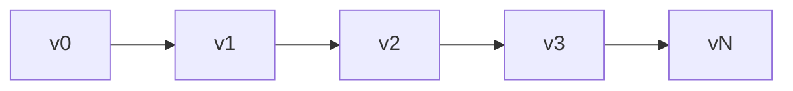
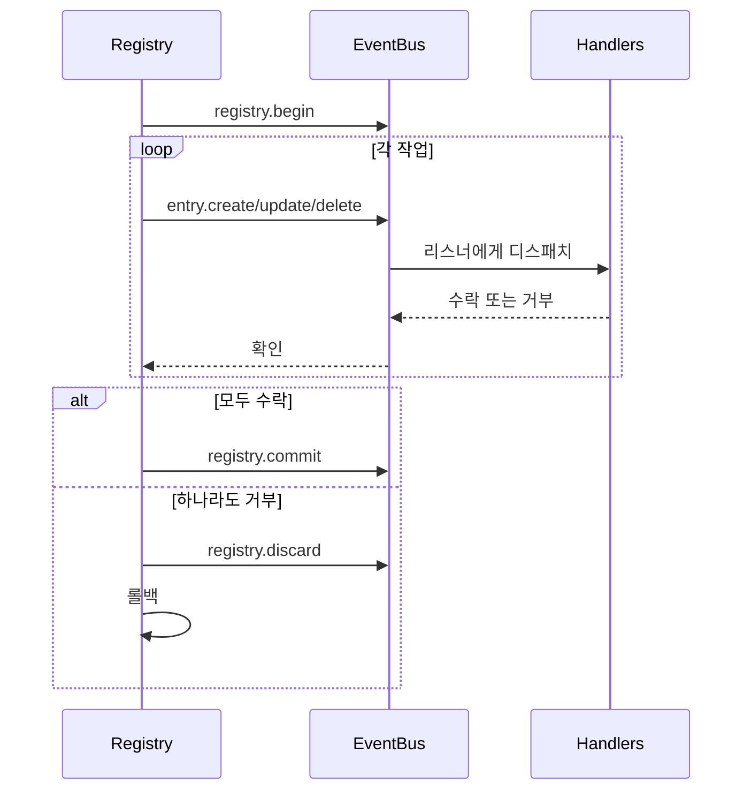

# 레지스트리 내부

레지스트리는 버전화되고 이벤트 기반인 상태 저장소입니다. 완전한 버전 히스토리를 유지하고, 트랜잭션을 지원하며, 이벤트 버스를 통해 변경 사항을 전파합니다.

## 엔트리 저장

엔트리는 O(1) 조회를 위한 해시 맵 인덱스가 있는 정렬된 슬라이스로 저장됩니다:

```go
type Entry struct {
    ID   ID              // namespace:name
    Kind Kind            // 엔트리 타입
    Meta attrs.Bag       // 메타데이터
    Data payload.Payload // 내용
}
```

엔트리 ID는 인터닝을 위해 Go의 `unique` 패키지를 사용합니다—동일한 ID는 메모리를 공유합니다.

## 버전 체인

각 버전은 부모를 가리킵니다. 경로 계산은 두 버전 간의 최단 경로를 찾기 위해 그래프 알고리즘을 사용합니다:



## 체인지셋

체인지셋은 한 상태를 다른 상태로 변환하는 작업의 정렬된 목록입니다:

| 작업 | OriginalEntry | 목적 |
|-----------|---------------|---------|
| Create | nil | 새 엔트리 추가 |
| Update | 이전 값 | 기존 항목 수정 |
| Delete | 삭제된 값 | 엔트리 제거 |

`OriginalEntry`는 역전을 가능하게 합니다—업데이트는 이전 값을 저장하고, 삭제는 제거된 것을 저장합니다.

### 델타 빌드

`BuildDelta(oldState, newState)`는 최소 작업을 생성합니다:

1. 상태 비교, 변경 식별
2. 역 의존성 순서로 삭제 정렬 (의존 항목 먼저)
3. 순방향 의존성 순서로 생성/업데이트 정렬 (의존성 먼저)

### 스쿼싱

여러 체인지셋은 엔트리별 최종 상태를 추적하여 병합됩니다:

```
Create + Update = Create (업데이트된 값으로)
Create + Delete = ∅ (상쇄)
Update + Delete = Delete
Delete + Create = Update
```

## 트랜잭션



핸들러는 각 작업을 수락하거나 거부하는 데 30초가 있습니다. 거부 시 레지스트리는 역 델타를 계산하고 적용하여 롤백합니다.

### 비전파 엔트리

일부 종류는 이벤트 버스를 완전히 건너뜁니다:
- `registry.entry` - 애플리케이션 설정
- `ns.requirement` - 네임스페이스 요구사항
- `ns.dependency` - 모듈 의존성

## 의존성 해결

엔트리는 다른 엔트리에 대한 의존성을 선언할 수 있습니다. 리졸버는 등록된 패턴을 통해 의존성을 추출합니다:

```go
resolver.RegisterPattern(PathConfig{
    Path: "meta.server",
    AllowWildcard: true,
})
```

의존성은 엔트리 Meta와 Data 필드에서 추출된 다음 상태 전환 중 토폴로지 정렬에 사용됩니다.

## 버전 히스토리

히스토리 백엔드:

| 구현 | 사용 사례 |
|----------------|----------|
| SQLite | 프로덕션 지속성 |
| Memory | 테스트 |
| Nil | 히스토리 없음 |

SQLite는 버전, 체인지셋(MessagePack 인코딩), 메타데이터 테이블이 있는 WAL 모드를 사용합니다.

### 탐색

경로 계산은 버전 간 최단 경로를 찾습니다:

```go
Path(v0, v3) = [v1, v2, v3]  // 체인지셋 순방향 적용
Path(v3, v1) = [v2, v1]      // 역전된 체인지셋 적용
```

`LoadState()`는 새 버전을 만들지 않고 기준선에서 히스토리를 리플레이합니다—부트 중에 사용됩니다.

## 파인더

엔트리 검색을 위한 LRU 캐싱이 있는 쿼리 엔진:

| 연산자 | 프리픽스 | 예제 |
|----------|--------|---------|
| Glob | (없음) | `.kind=function.*` |
| Regex | `~` | `~meta.path=/api/.*` |
| Contains | `*` | `*meta.tags=backend` |
| Prefix | `^` | `^meta.name=user` |
| Suffix | `$` | `$meta.path=Handler` |

캐시는 버전 변경 시 무효화됩니다.

## 참고

- [레지스트리](concepts/registry.md) - 상위 수준 개념
- [이벤트](internals/events.md) - 이벤트 버스 세부사항
