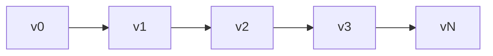
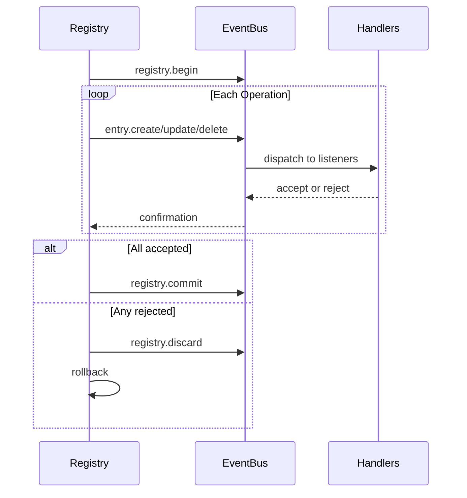

# 레지스트리 내부

registry는 versioned entry state를 저장하고 transaction과 history를 지원하며 event bus를 통해 change를 전파합니다.

이 페이지의 Go 및 query fragment는 internal data structure와 finder syntax를 설명하며 standalone application example이 아닙니다.

## 엔트리 저장

엔트리는 O(1) 조회를 위한 해시 맵 인덱스가 있는 정렬된 슬라이스로 저장됩니다:

```go
type Entry struct {
    ID   ID              // namespace:name
    Kind Kind            // Entry type
    Meta attrs.Bag       // Metadata
    Data payload.Payload // Content
}
```

엔트리 ID는 인터닝을 위해 Go의 `unique` 패키지를 사용합니다—동일한 ID는 메모리를 공유합니다.

## 버전 체인

각 버전은 부모를 가리킵니다. 경로 계산은 두 버전 간의 최단 경로를 찾기 위해 그래프 알고리즘을 사용합니다:


```mermaid
flowchart LR
    v0[v0] --> v1[v1] --> v2[v2] --> v3[v3] --> vN[vN]
```

## 체인지셋

체인지셋은 한 상태를 다른 상태로 변환하는 작업의 정렬된 목록입니다:

| 작업 | OriginalEntry | 목적 |
|-----------|---------------|---------|
| Create | nil | 새 엔트리 추가 |
| Update | 이전 값 | 기존 항목 수정 |
| Delete | 삭제된 값 | 엔트리 제거 |

`OriginalEntry`는 역전을 가능하게 합니다—업데이트는 이전 값을 저장하고, 삭제는 제거된 것을 저장합니다.

### 델타 빌드

`BuildDelta(oldState, newState)`는 최소 작업을 생성합니다:

1. 상태 비교, 변경 식별
2. 역 의존성 순서로 삭제 정렬 (의존 항목 먼저)
3. 순방향 의존성 순서로 생성/업데이트 정렬 (의존성 먼저)

### 스쿼싱

여러 체인지셋은 엔트리별 최종 상태를 추적하여 병합됩니다:

```
Create + Update = Create (with updated value)
Create + Delete = ∅ (cancel out)
Update + Delete = Delete
Delete + Create = Update
```

## 트랜잭션


```mermaid
sequenceDiagram
    participant R as Registry
    participant B as EventBus
    participant H as Handlers

    R->>B: registry.begin
    loop Each Operation
        R->>B: entry.create/update/delete
        B->>H: dispatch to listeners
        H-->>B: accept or reject
        B-->>R: confirmation
    end
    alt All accepted
        R->>B: registry.commit
    else Any rejected
        R->>B: registry.discard
        R->>R: rollback
    end
```

기본적으로 registry는 listener가 각 operation을 accept 또는 reject하기를 30초 기다립니다. `registry.event_wait_timeout`은 operation별 timeout을 변경합니다. reject되면 registry는 inverse delta를 계산하고 적용해 rollback합니다.

### 비전파 엔트리

다음 kind는 기본적으로 event bus를 건너뜁니다.
- `registry.entry` - 애플리케이션 설정
- `ns.requirement` - 네임스페이스 요구사항
- `ns.dependency` - 모듈 의존성
- `ns.definition` - 모듈 메타데이터 (readme, wiki, 라이선스, 저자)

`registry.dispatch_internal_kinds`는 이 default list를 교체합니다.

## 의존성 해결

엔트리는 다른 엔트리에 대한 의존성을 선언할 수 있습니다. 리졸버는 등록된 패턴을 통해 의존성을 추출합니다:

```go
resolver.RegisterPattern(registry.DependencyPattern{
    Path:          "meta.server",
    AllowWildcard: true,
})
```

의존성은 엔트리 Meta와 Data 필드에서 추출된 다음 상태 전환 중 토폴로지 정렬에 사용됩니다.

## 버전 히스토리

히스토리 백엔드:

| 구현 | 사용 사례 |
|----------------|----------|
| SQLite | 프로덕션 지속성 |
| PostgreSQL | 프로덕션 지속성, 노드 간 공유 |
| Memory | `history_type`이 설정되지 않았을 때의 기본값; 테스트 |
| Nil | 히스토리 없음 |

SQLite는 version, changeset(MessagePack encoding), metadata table이 있는 WAL mode를 사용합니다. PostgreSQL은 `registry.history_type: postgres`와 `history_dsn`/`history_schema`로 선택합니다([설정](../guides/configuration.md#레지스트리) 참조).

히스토리는 각 버전에 대한 정확한 의존성 해결 결과도 지속합니다: `ns.dependency` 변경이 적용될 때, 해결된 모듈 그래프가 체인지셋 옆에 콘텐츠 주소 방식으로 저장됩니다. 부트와 롤백은 다시 해결하는 대신 저장된 그래프를 리플레이하므로, 버전은 항상 자신이 해결되었던 버전들과 일치하게 됩니다. 히스토리 스키마는 업그레이드 후 첫 부트에서 자동으로 마이그레이션되며, 기존 버전은 처음 방문할 때 한 번 해결되고 체크포인트됩니다.

### 탐색

경로 계산은 버전 간 최단 경로를 찾습니다:

```go
Path(v0, v3) = [v1, v2, v3]  // Apply changesets forward
Path(v3, v1) = [v2, v1]      // Apply reversed changesets
```

`LoadState()`는 새 버전을 만들지 않고 기준선에서 히스토리를 리플레이합니다—부트 중에 사용됩니다.

## 파인더

엔트리 검색을 위한 LRU 캐싱이 있는 쿼리 엔진:

| 연산자 | 프리픽스 | 예제 |
|----------|--------|---------|
| root-field glob | `.` root field | `.kind=function.*` |
| Regex | `~` | `~meta.path=/api/.*` |
| Contains | `*` | `*meta.tags=backend` |
| Prefix | `^` | `^meta.name=user` |
| Suffix | `$` | `$meta.path=Handler` |

캐시는 버전 변경 시 무효화됩니다.

glob matching은 root field `.kind`, `.name`, `.ns`, `.id`에 적용됩니다. prefix 없는 `meta.*` criterion은 equality matching을 사용합니다.

## 참고

- [레지스트리](../concepts/registry.md) - high-level concept
- [이벤트](./events.md) - event bus detail
