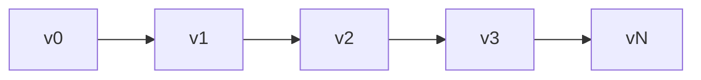
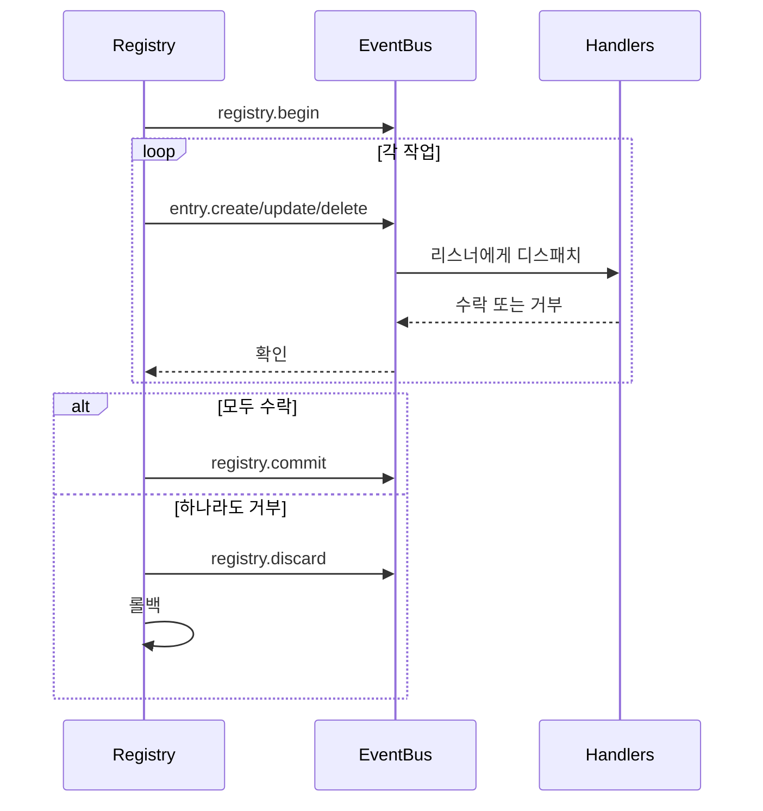

# 레지스트리 내부

레지스트리는 버전화되고 이벤트 기반인 상태 저장소입니다. 완전한 버전 히스토리를 유지하고, 트랜잭션을 지원하며, 이벤트 버스를 통해 변경 사항을 전파합니다.

## 엔트리 저장

엔트리는 O(1) 조회를 위한 해시 맵 인덱스가 있는 정렬된 슬라이스로 저장됩니다:

```go
type Entry struct {
    ID       ID              // namespace:name
    Kind     Kind            // 엔트리 타입
    Meta     attrs.Bag       // 작성자 메타데이터
    Data     payload.Payload // 내용
    Registry EntryMetadata   // 레지스트리 소유 출처 정보
}

type EntryMetadata struct {
    Owner string // 엔트리를 공급한 배포 소스
    Root  bool   // 배포가 선택한 의존성 선언
}
```

엔트리 ID는 인터닝을 위해 Go의 `unique` 패키지를 사용합니다—동일한 ID는 메모리를 공유합니다.

`Registry`는 엔트리 작성자가 아니라 레지스트리가 소유합니다. `Owner`는 배포 소스에서 할당되고, `Root`는 `ns.dependency` 엔트리의 쓰기 측 필드 `dependency_root`에서 설정됩니다. 일반 엔트리 API는 `ID`, `Kind`, `Meta`, `Data`만 반환하며, 출처 정보는 스냅샷 상태 API를 통해 읽습니다.

## 스냅샷

`Registry.Snapshot()`은 하나의 원자적 뷰를 반환합니다: 버전, 그 버전의 엔트리, 그리고 동일한 버전에 대한 레지스트리 소유 상태 메타데이터입니다.

```go
type Snapshot struct {
    Registry StateMetadata
    Version  Version
    Entries  State
}

type StateMetadata struct {
    Resolution *DependencyResolution
}
```

버전, 엔트리, 해결 결과를 하나의 값으로 읽으면 호출자가 엔트리를 다른 버전의 해결 결과와 짝지을 수 없습니다. 선택된 모듈 그래프는 모든 엔트리마다 반복되는 대신 스냅샷당 한 번 저장됩니다.

## 오버레이

`OverlayWriter`는 프로세스 로컬 엔트리를 위한 선택적 레지스트리 기능입니다:

```go
type OverlayWriter interface {
    ApplyOverlay(context.Context, string, uint64, ChangeSet) (uint64, error)
    GetOverlay(string) (State, uint64, error)
}
```

오버레이 엔트리는 논리적 소유자 문자열 아래 그룹화됩니다. 이들은 유효 상태에 합류하며 지속 엔트리와 동일한 토폴로지 정렬과 핸들러 전환을 거치므로 서비스가 정상적으로 시작되고 중지되지만, 히스토리 버전을 만들지는 않습니다. 콜드 부트 후에는 비어 있으며 소유 제어 서비스가 조정해야 합니다.

쓰기는 낙관적 동시성으로 처리됩니다: `GetOverlay`는 소유자의 현재 세대를 반환하고, `ApplyOverlay`는 그 세대가 여전히 최신일 때만 커밋하며, 그렇지 않으면 재시도 가능한 `Conflict`를 반환합니다. 성공한 적용마다 프로세스 내에서 고유한 새 세대가 발급되고, 변경이 있었던 소유자에 대해서는 툼스톤이 유지되어 ABA 시퀀스가 변경 없는 오버레이로 오인되지 않습니다.

적용할 때마다 검증되는 구성 규칙:

- 지속 엔트리와 오버레이 엔트리 어느 쪽도 해당 ID를 가지고 있지 않을 때만 엔트리를 생성할 수 있습니다.
- 소유 아이덴티티만 자신의 오버레이 엔트리를 갱신하거나 삭제할 수 있습니다.
- 오버레이 엔트리는 레지스트리 소유 메타데이터를 가질 수 없으며, 레지스트리 디렉티브가 점유한 종류를 사용할 수 없습니다.
- 살아남는 엔트리가 의존하는 엔트리는 삭제할 수 없습니다.
- 의존성 엣지는 소유자 경계를 넘을 수 없으며, 지속 엔트리는 오버레이 엔트리에 의존할 수 없습니다.

## 버전 체인

각 버전은 부모를 가리킵니다. 경로 계산은 두 버전 간의 최단 경로를 찾기 위해 그래프 알고리즘을 사용합니다:


```mermaid
flowchart LR
    v0[v0] --> v1[v1] --> v2[v2] --> v3[v3] --> vN[vN]
```

## 체인지셋

체인지셋은 한 상태를 다른 상태로 변환하는 작업의 정렬된 목록입니다:

| 작업 | OriginalEntry | 목적 |
|-----------|---------------|---------|
| Create | nil | 새 엔트리 추가 |
| Update | 이전 값 | 기존 항목 수정 |
| Delete | 삭제된 값 | 엔트리 제거 |

`OriginalEntry`는 역전을 가능하게 합니다—업데이트는 이전 값을 저장하고, 삭제는 제거된 것을 저장합니다.

### 델타 빌드

`BuildDelta(oldState, newState)`는 최소 작업을 생성합니다:

1. 상태 비교, 변경 식별
2. 역 의존성 순서로 삭제 정렬 (의존 항목 먼저)
3. 순방향 의존성 순서로 생성/업데이트 정렬 (의존성 먼저)

### 스쿼싱

여러 체인지셋은 엔트리별 최종 상태를 추적하여 병합됩니다:

```
Create + Update = Create (업데이트된 값으로)
Create + Delete = ∅ (상쇄)
Update + Delete = Delete
Delete + Create = Update
```

## 트랜잭션


```mermaid
sequenceDiagram
    participant R as Registry
    participant B as EventBus
    participant H as Handlers

    R->>B: registry.begin
    loop 각 작업
        R->>B: entry.create/update/delete
        B->>H: 리스너에게 디스패치
        H-->>B: 수락 또는 거부
        B-->>R: 확인
    end
    alt 모두 수락
        R->>B: registry.commit
    else 하나라도 거부
        R->>B: registry.discard
        R->>R: 롤백
    end
```

핸들러는 각 작업을 수락하거나 거부하는 데 30초가 있습니다. 거부 시 레지스트리는 역 델타를 계산하고 적용하여 롤백합니다.

### 비전파 엔트리

일부 종류는 이벤트 버스를 완전히 건너뜁니다:
- `registry.entry` - 애플리케이션 설정
- `ns.requirement` - 네임스페이스 요구사항
- `ns.dependency` - 모듈 의존성
- `ns.definition` - 모듈 메타데이터 (readme, wiki, 라이선스, 저자)

## 의존성 해결

엔트리는 다른 엔트리에 대한 의존성을 선언할 수 있습니다. 리졸버는 등록된 패턴을 통해 의존성을 추출합니다:

```go
resolver.RegisterPattern(registry.DependencyPattern{
    Path: "meta.server",
    AllowWildcard: true,
})
```

의존성은 엔트리 Meta와 Data 필드에서 추출된 다음 상태 전환 중 토폴로지 정렬에 사용됩니다.

### 의존성 접근 정책

외부 의존성 접근은 전역 플래그가 아니라 요청 스코프의 컨텍스트 값입니다:

| 정책 | 효과 |
|--------|--------|
| `DependencyAccessUnspecified` | 호출자가 선택. 호출자 자신의 기본값이 적용됨 |
| `DependencyAccessOnline` | 외부 해결과 아티팩트 다운로드가 허용됨 |
| `DependencyAccessVerifiedOffline` | 외부 접근이 금지됨. 해결은 잠긴 매니페스트와 로컬에 존재하는 아티팩트를 사용 |

`LoadState()`는 컨텍스트가 아무것도 지정하지 않으면 verified-offline을 기본값으로 하므로, 부팅은 네트워크에 접속하지 않고 저장된 그래프를 리플레이합니다. 배포 베이스라인을 복원할 때는 그 베이스라인이 명시한 모듈을 가져와야 하므로 컨텍스트가 online으로 전환됩니다. verified-offline에서는 잠긴 모듈만 제공하는 매니페스트 프로바이더가 허브 프로바이더를 대체하며, 아티팩트가 없으면 다운로드를 유발하는 대신 증거 부재로 실패합니다.

## 버전 히스토리

히스토리 백엔드:

| 구현 | 사용 사례 |
|----------------|----------|
| SQLite | 프로덕션 지속성 |
| PostgreSQL | 프로덕션 지속성, 노드 간 공유 |
| Memory | `history_type`이 설정되지 않았을 때의 기본값; 테스트 |
| Nil | 히스토리 없음 |

SQLite는 버전, 체인지셋(MessagePack 인코딩), 메타데이터 테이블이 있는 WAL 모드를 사용합니다. PostgreSQL은 `registry.history_type: postgres`와 `history_dsn`/`history_schema`로 선택합니다 ([설정](guides/configuration.md#레지스트리) 참조).

히스토리는 각 버전에 대한 정확한 의존성 해결 결과도 지속합니다: `ns.dependency` 변경이 적용될 때, 해결된 모듈 그래프가 체인지셋 옆에 콘텐츠 주소 방식으로 저장됩니다. 부트와 롤백은 다시 해결하는 대신 저장된 그래프를 리플레이하므로, 버전은 항상 자신이 해결되었던 버전들과 일치하게 됩니다. 히스토리 스키마는 업그레이드 후 첫 부트에서 자동으로 마이그레이션되며, 기존 버전은 처음 방문할 때 한 번 해결되고 체크포인트됩니다.

### 탐색

경로 계산은 버전 간 최단 경로를 찾습니다:

```go
Path(v0, v3) = [v1, v2, v3]  // 체인지셋 순방향 적용
Path(v3, v1) = [v2, v1]      // 역전된 체인지셋 적용
```

`LoadState()`는 새 버전을 만들지 않고 기준선에서 히스토리를 리플레이합니다—부트 중에 사용됩니다.

## 파인더

엔트리 검색을 위한 LRU 캐싱이 있는 쿼리 엔진:

| 연산자 | 프리픽스 | 예제 |
|----------|--------|---------|
| Glob | (없음) | `.kind=function.*` |
| Regex | `~` | `~meta.path=/api/.*` |
| Contains | `*` | `*meta.tags=backend` |
| Prefix | `^` | `^meta.name=user` |
| Suffix | `$` | `$meta.path=Handler` |

캐시는 버전 변경 시 무효화됩니다.

## 참고

- [레지스트리](concepts/registry.md) - 상위 수준 개념
- [이벤트](internals/events.md) - 이벤트 버스 세부사항
