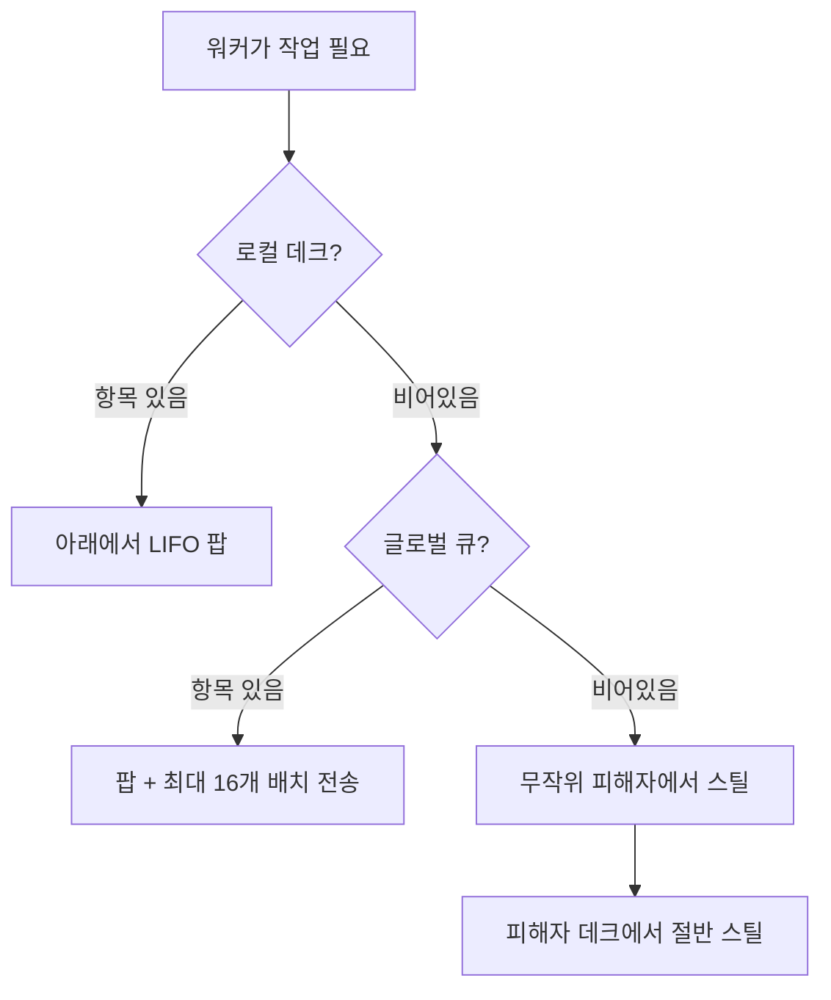
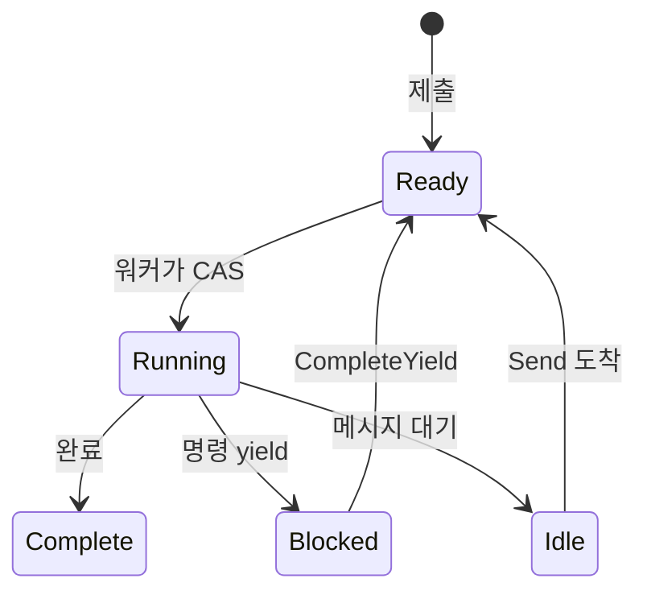

# 스케줄러

스케줄러는 작업 스틸링 설계를 사용하여 프로세스를 실행합니다. 워커는 로컬 데크를 유지하고 유휴 상태일 때 서로에게서 스틸링합니다.

## 프로세스 인터페이스

스케줄러는 `Process` 인터페이스를 구현하는 모든 타입과 작동합니다:

```go
type Process interface {
    Init(ctx context.Context, method string, input payload.Payloads) error
    Step(events []Event, out *StepOutput) error
    Close()
}
```

| 메서드 | 목적 |
|--------|---------|
| `Init` | 엔트리 메서드 이름과 입력 인자로 프로세스 준비 |
| `Step` | 들어오는 이벤트로 상태 머신 진행, 출력에 yield 쓰기 |
| `Close` | 리소스 해제 |

`Init`의 `method` 파라미터는 어떤 진입점을 호출할지 지정합니다. 프로세스 인스턴스는 여러 진입점을 노출할 수 있고, 호출자가 어떤 것을 실행할지 선택합니다. 이는 스케줄러가 프로세스를 올바르게 시작하고 있는지 검증하는 역할도 합니다.

스케줄러는 `Step()`을 반복적으로 호출하여 이벤트(yield 완료, 메시지)를 전달하고 yield(디스패치할 명령)를 수집합니다. 프로세스는 상태와 yield를 `StepOutput` 버퍼에 씁니다.

```go
type Event struct {
    Type  EventType  // EventYieldComplete 또는 EventMessage
    Tag   uint64     // yield 완료를 위한 상관 태그
    Data  any        // 결과 데이터 또는 메시지 페이로드
    Error error      // yield 실패 시 에러
}
```

## 구조

스케줄러는 기본적으로 `GOMAXPROCS` 워커를 스폰합니다. 각 워커는 캐시 친화적 LIFO 접근을 위한 로컬 데크를 가집니다. 글로벌 FIFO 큐는 새 제출과 교차 워커 전송을 처리합니다. 프로세스는 메시지 라우팅을 위해 PID로 추적됩니다.

## 작업 찾기



워커는 우선순위 순서로 소스를 확인합니다:

| 우선순위 | 소스 | 패턴 |
|----------|--------|---------|
| 1 | 로컬 데크 | LIFO 팝, 락 프리, 캐시 친화적 |
| 2 | 글로벌 큐 | 배치 전송과 함께 FIFO 팝 |
| 3 | 다른 워커 | 피해자 데크에서 절반 스틸 |

글로벌에서 팝할 때 워커는 하나를 가져가고 최대 16개를 로컬 데크로 배치 전송합니다.

## Chase-Lev 데크

각 워커는 Chase-Lev 작업 스틸링 데크를 소유합니다:

```go
type Deque struct {
    buffer atomic.Pointer[dequeBuffer]
    top    atomic.Int64  // 스틸러가 여기서 스틸 (CAS)
    bottom atomic.Int64  // 소유자가 여기서 푸시/팝
}
```

소유자는 동기화 없이 아래에서 푸시하고 팝합니다(LIFO). 스틸러는 CAS를 사용하여 위에서 스틸합니다(FIFO). 이를 통해 소유자는 최근 푸시된 항목에 캐시 친화적으로 접근하면서 오래된 작업을 스틸러에게 분배합니다.

`StealHalfInto`는 하나의 CAS 작업으로 항목의 절반을 가져가 경합을 줄입니다.

## 적응형 스피닝

컨디션 변수에서 블로킹하기 전에 워커는 적응적으로 스핀합니다:

| 스핀 횟수 | 액션 |
|------------|--------|
| < 4 | 타이트 루프 |
| 4-15 | 스레드 양보 (`runtime.Gosched`) |
| >= 16 | 컨디션 변수에서 블록 |

## 프로세스 상태



| 상태 | 설명 |
|-------|-------------|
| Ready | 실행 대기 중 |
| Running | 워커가 Step() 실행 중 |
| Blocked | yield 완료 대기 중 |
| Idle | 메시지 대기 중 |
| Complete | 실행 완료 |

웨이크업 플래그가 레이스를 처리합니다: 핸들러가 워커가 여전히 프로세스를 소유하는 동안(Running) `CompleteYield`를 호출하면 플래그를 설정합니다. 워커는 디스패치 후 플래그를 확인하고 설정되면 다시 큐에 넣습니다.

## 이벤트 큐

각 프로세스는 MPSC(다중 생산자, 단일 소비자) 이벤트 큐를 가집니다:

- **생산자**: 명령 핸들러(`CompleteYield`), 메시지 발신자(`Send`)
- **소비자**: 워커가 `Step()`에서 이벤트 드레인

## 메시지 라우팅

스케줄러는 프로세스로 메시지를 라우팅하기 위해 `relay.Receiver`를 구현합니다. `Send()`가 호출되면 `byPID` 맵에서 대상 PID를 조회하고, 메시지를 이벤트로 프로세스 큐에 푸시하고, 유휴 상태면 글로벌 큐에 푸시하여 프로세스를 깨웁니다.

## 셧다운

셧다운 시 스케줄러는 실행 중인 모든 프로세스에 취소 이벤트를 보내고 완료하거나 타임아웃될 때까지 기다립니다. 워커는 작업이 더 이상 없으면 종료합니다.

## 참고

- [명령 디스패치](internal-dispatch.md) - yield가 핸들러에 도달하는 방법
- [프로세스 모델](concept-process-model.md) - 상위 수준 개념
