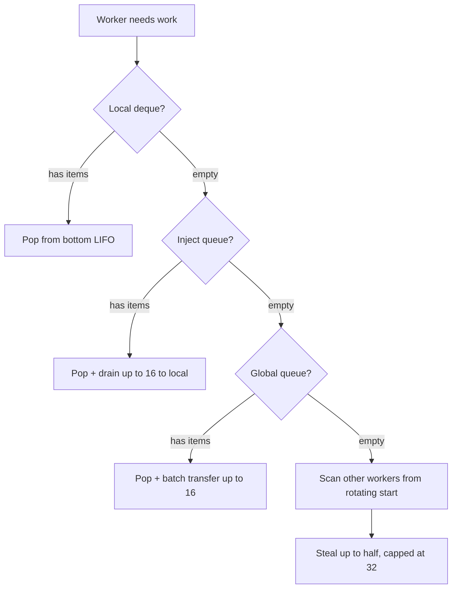
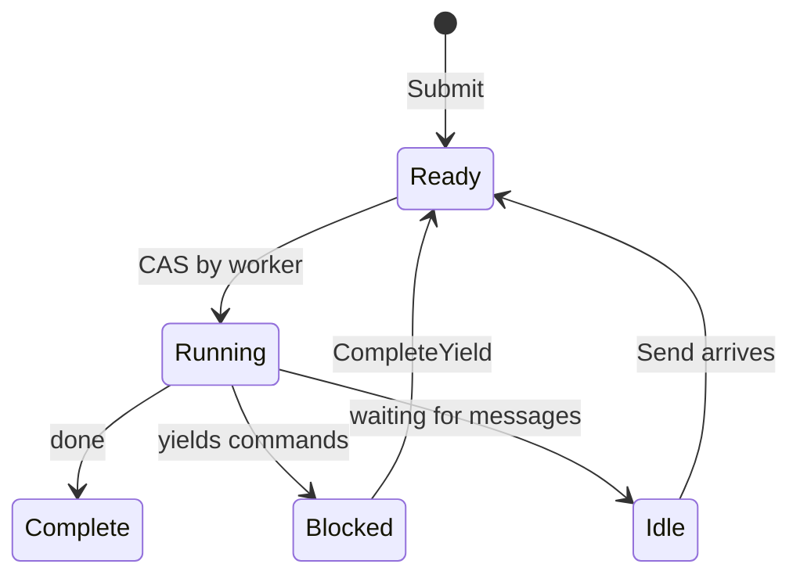

# 스케줄러

scheduler는 local deque, inject queue, global queue, work stealing을 사용해 worker에서 process를 실행합니다.

이 페이지는 implementation reference입니다. Go structure와 diagram은 application code가 구현하는 API가 아니라 pinned runtime scheduler를 설명합니다.

## 프로세스 인터페이스

스케줄러는 `Process` 인터페이스를 구현하는 모든 타입과 작동합니다:

```go
type Process interface {
    Init(ctx context.Context, method string, input payload.Payloads) error
    Step(events []Event, out *StepOutput) error
    Close()
}
```

| 메서드 | 목적 |
|--------|---------|
| `Init` | 엔트리 메서드 이름과 입력 인자로 프로세스 준비 |
| `Step` | 들어오는 이벤트로 상태 머신 진행, 출력에 yield 쓰기 |
| `Close` | 리소스 해제 |

`Init`의 `method` parameter는 호출할 entry point를 지정합니다. process instance는 여러 entry point를 expose할 수 있으며 caller가 실행할 항목을 선택합니다.

스케줄러는 `Step()`을 반복적으로 호출하여 이벤트(yield 완료, 메시지)를 전달하고 yield(디스패치할 명령)를 수집합니다. 프로세스는 상태와 yield를 `StepOutput` 버퍼에 씁니다.

```go
type Event struct {
    Type  EventType  // EventYieldComplete or EventMessage
    Tag   uint64     // Correlation tag for yield completions
    Data  any        // Result data or message payload
    Error error      // Error if yield failed
}
```

## 구조

scheduler는 기본적으로 `GOMAXPROCS` worker를 spawn합니다. 각 worker에는 cache-friendly LIFO access용 local deque와 yield completion 및 message wake처럼 affinity가 있는 requeued work용 per-worker MPSC inject queue가 있습니다. global FIFO queue는 새 submission과 affinity 없는 requeue를 처리합니다. process는 message routing을 위해 PID로 추적됩니다.

## 작업 찾기


```mermaid
flowchart TD
    W[Worker needs work] --> L{Local deque?}
    L -->|has items| LP[Pop from bottom LIFO]
    L -->|empty| I{Inject queue?}
    I -->|has items| IP[Pop + drain up to 16 to local]
    I -->|empty| G{Global queue?}
    G -->|has items| GP[Pop + batch transfer up to 16]
    G -->|empty| S[Scan other workers from rotating start]
    S --> SH[Steal up to half, capped at 32]
```

워커는 우선순위 순서로 소스를 확인합니다:

| 우선순위 | 소스 | 패턴 |
|----------|--------|---------|
| 1 | 로컬 데크 | LIFO 팝, 락 프리, 캐시 친화적 |
| 2 | inject queue | affinity가 있는 requeue/event를 MPSC pop하고 최대 16개를 local로 drain |
| 3 | global queue | batch transfer를 포함한 FIFO pop |
| 4 | 다른 worker | rotating start index에서 scan하고 시도마다 최대 32개까지 절반 steal |

inject 또는 global queue에서 pop할 때 worker는 한 item을 가져오고 최대 16개를 local deque로 이동합니다.

## Chase-Lev 데크

각 워커는 Chase-Lev 작업 스틸링 데크를 소유합니다:

```go
type Deque struct {
    buffer atomic.Pointer[dequeBuffer]
    top    atomic.Int64  // Thieves steal from here (CAS)
    bottom atomic.Int64  // Owner pushes/pops here
}
```

owner는 mutex 없이 bottom에서 push/pop(LIFO)하며 마지막 item pop은 thief와 조정하기 위해 CAS를 사용합니다. thief는 CAS로 top에서 steal(FIFO)합니다. owner는 최근 push된 item에 cache-friendly하게 접근하고 오래된 work는 stealer에 분배됩니다.

`StealHalfInto`는 하나의 CAS operation에서 available item의 최대 절반을 destination buffer 한도까지 가져옵니다. worker의 steal attempt는 32-item buffer를 사용합니다.

## 적응형 스피닝

컨디션 변수에서 블로킹하기 전에 워커는 적응적으로 스핀합니다:

| 스핀 횟수 | 액션 |
|------------|--------|
| < 4 | 타이트 루프 |
| 4-15 | 스레드 양보 (`runtime.Gosched`) |
| >= 16 | 컨디션 변수에서 블록 |

## 프로세스 상태


```mermaid
stateDiagram-v2
    [*] --> Ready: Submit
    Ready --> Running: CAS by worker
    Running --> Complete: done
    Running --> Blocked: yields commands
    Running --> Idle: waiting for messages
    Blocked --> Ready: CompleteYield
    Idle --> Ready: Send arrives
```

| 상태 | 설명 |
|-------|-------------|
| Ready | 실행 대기 중 |
| Running | 워커가 Step() 실행 중 |
| Blocked | yield 완료 대기 중 |
| Idle | 메시지 대기 중 |
| Complete | 실행 완료 |

웨이크업 플래그가 레이스를 처리합니다: 핸들러가 워커가 여전히 프로세스를 소유하는 동안(Running) `CompleteYield`를 호출하면 플래그를 설정합니다. 워커는 디스패치 후 플래그를 확인하고 설정되면 다시 큐에 넣습니다.

## 이벤트 큐

각 프로세스는 MPSC(다중 생산자, 단일 소비자) 이벤트 큐를 가집니다:

- **생산자**: 명령 핸들러(`CompleteYield`), 메시지 발신자(`Send`)
- **소비자**: 워커가 `Step()`에서 이벤트 드레인

## 메시지 라우팅

scheduler는 process로 message를 route하기 위해 `relay.Receiver`를 구현합니다. `Send()`는 `byPID` map에서 target PID를 찾고 message를 process queue에 event로 push한 다음 process가 idle 또는 blocked이면 깨웁니다. injectOrGlobal을 통해 requeue하며 알려진 worker affinity가 있으면 마지막 worker의 per-worker inject queue에 push하고, 그렇지 않으면 global queue를 사용합니다.

## 셧다운

셧다운 시 스케줄러는 실행 중인 모든 프로세스에 취소 이벤트를 보내고 완료하거나 타임아웃될 때까지 기다립니다. 워커는 작업이 더 이상 없으면 종료합니다.

## 참고

- [명령 디스패치](internals/dispatch.md) - yield가 handler에 도달하는 방식
- [프로세스 모델](concepts/process-model.md) - high-level concept
