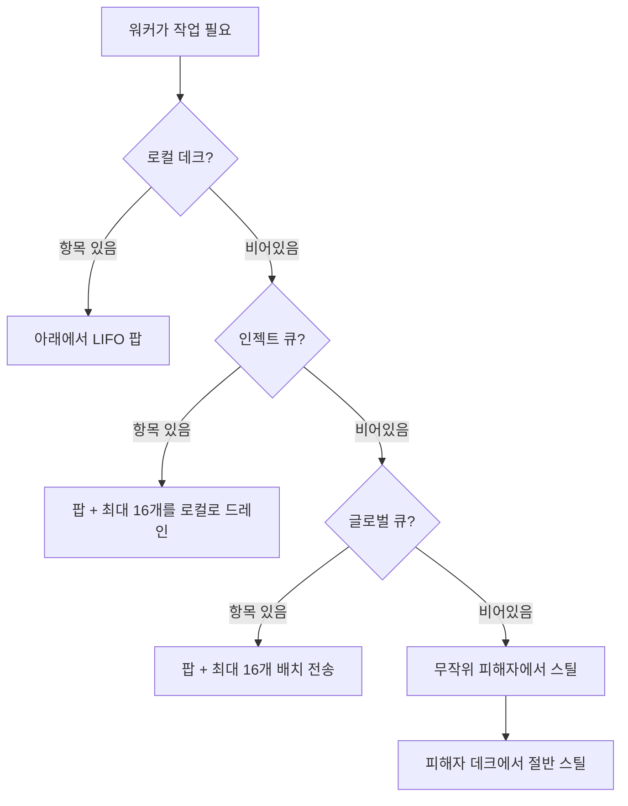
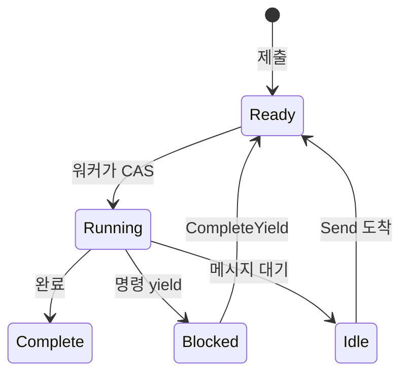

# 스케줄러

스케줄러는 작업 스틸링 설계를 사용하여 프로세스를 실행합니다. 워커는 로컬 데크를 유지하고 유휴 상태일 때 서로에게서 스틸링합니다.

## 프로세스 인터페이스

스케줄러는 `Process` 인터페이스를 구현하는 모든 타입과 작동합니다:

```go
type Process interface {
    Init(ctx context.Context, method string, input payload.Payloads) error
    Step(events []Event, out *StepOutput) error
    Close()
}
```

| 메서드 | 목적 |
|--------|---------|
| `Init` | 엔트리 메서드 이름과 입력 인자로 프로세스 준비 |
| `Step` | 들어오는 이벤트로 상태 머신 진행, 출력에 yield 쓰기 |
| `Close` | 리소스 해제 |

`Init`의 `method` 파라미터는 어떤 진입점을 호출할지 지정합니다. 프로세스 인스턴스는 여러 진입점을 노출할 수 있고, 호출자가 어떤 것을 실행할지 선택합니다. 이는 스케줄러가 프로세스를 올바르게 시작하고 있는지 검증하는 역할도 합니다.

스케줄러는 `Step()`을 반복적으로 호출하여 이벤트(yield 완료, 메시지)를 전달하고 yield(디스패치할 명령)를 수집합니다. 프로세스는 상태와 yield를 `StepOutput` 버퍼에 씁니다.

```go
type Event struct {
    Type  EventType  // EventYieldComplete 또는 EventMessage
    Tag   uint64     // yield 완료를 위한 상관 태그
    Data  any        // 결과 데이터 또는 메시지 페이로드
    Error error      // yield 실패 시 에러
}
```

## 구조

스케줄러는 기본적으로 `GOMAXPROCS` 워커를 스폰합니다. 각 워커는 캐시 친화적 LIFO 접근을 위한 로컬 데크를 가집니다. 글로벌 FIFO 큐는 새 제출과 교차 워커 전송을 처리합니다. 프로세스는 메시지 라우팅을 위해 PID로 추적됩니다.

## 작업 찾기


```mermaid
flowchart TD
    W[워커가 작업 필요] --> L{로컬 데크?}
    L -->|항목 있음| LP[아래에서 LIFO 팝]
    L -->|비어있음| I{인젝트 큐?}
    I -->|항목 있음| IP[팝 + 최대 16개를 로컬로 드레인]
    I -->|비어있음| G{글로벌 큐?}
    G -->|항목 있음| GP[팝 + 최대 16개 배치 전송]
    G -->|비어있음| S[무작위 피해자에서 스틸]
    S --> SH[피해자 데크에서 절반 스틸]
```

워커는 우선순위 순서로 소스를 확인합니다:

| 우선순위 | 소스 | 패턴 |
|----------|--------|---------|
| 1 | 로컬 데크 | LIFO 팝, 락 프리, 캐시 친화적 |
| 2 | 인젝트 큐 | 어피니티가 있는 비동기 완료의 MPSC 팝, 최대 16개를 로컬로 드레인 |
| 3 | 글로벌 큐 | 배치 전송과 함께 FIFO 팝 |
| 4 | 다른 워커 | 피해자 데크에서 절반 스틸 |

인젝트 큐 또는 글로벌 큐에서 팝할 때 워커는 하나를 가져가고 최대 16개를 로컬 데크로 옮깁니다.

## Chase-Lev 데크

각 워커는 Chase-Lev 작업 스틸링 데크를 소유합니다:

```go
type Deque struct {
    buffer atomic.Pointer[dequeBuffer]
    top    atomic.Int64  // 스틸러가 여기서 스틸 (CAS)
    bottom atomic.Int64  // 소유자가 여기서 푸시/팝
}
```

소유자는 동기화 없이 아래에서 푸시하고 팝합니다(LIFO). 스틸러는 CAS를 사용하여 위에서 스틸합니다(FIFO). 이를 통해 소유자는 최근 푸시된 항목에 캐시 친화적으로 접근하면서 오래된 작업을 스틸러에게 분배합니다.

`StealHalfInto`는 하나의 CAS 작업으로 항목의 절반을 가져가 경합을 줄입니다.

## 적응형 스피닝

컨디션 변수에서 블로킹하기 전에 워커는 적응적으로 스핀합니다:

| 스핀 횟수 | 액션 |
|------------|--------|
| < 4 | 타이트 루프 |
| 4-15 | 스레드 양보 (`runtime.Gosched`) |
| >= 16 | 컨디션 변수에서 블록 |

## 프로세스 상태


```mermaid
stateDiagram-v2
    [*] --> Ready: 제출
    Ready --> Running: 워커가 CAS
    Running --> Complete: 완료
    Running --> Blocked: 명령 yield
    Running --> Idle: 메시지 대기
    Blocked --> Ready: CompleteYield
    Idle --> Ready: Send 도착
```

| 상태 | 설명 |
|-------|-------------|
| Ready | 실행 대기 중 |
| Running | 워커가 Step() 실행 중 |
| Blocked | yield 완료 대기 중 |
| Idle | 메시지 대기 중 |
| Complete | 실행 완료 |

웨이크업 플래그가 레이스를 처리합니다: 핸들러가 워커가 여전히 프로세스를 소유하는 동안(Running) `CompleteYield`를 호출하면 플래그를 설정합니다. 워커는 디스패치 후 플래그를 확인하고 설정되면 다시 큐에 넣습니다.

## 이벤트 큐

각 프로세스는 MPSC(다중 생산자, 단일 소비자) 이벤트 큐를 가집니다:

- **생산자**: 명령 핸들러(`CompleteYield`), 메시지 발신자(`Send`)
- **소비자**: 워커가 `Step()`에서 이벤트 드레인

세대 카운터가 큐를 보호합니다. 모든 생산자는 자신이 관찰한 세대에 바인딩되며, `Reset`이 세대를 올리므로 이전 실행에서 남은 발신자는 재사용된 큐에 푸시할 수 없습니다.

일반 이벤트 트래픽은 제한이 없습니다. 어카운팅은 메시지별 옵트인입니다: `MaxItems` 또는 `MaxBytes`를 실은 메시지는 토픽별 예산에 대해 승인되며, 한 토픽에서 관찰된 가장 엄격한 제한이 적용됩니다. 메시지는 소비하는 프로세스가 해제할 때까지 예약을 유지하며, 터미널은 백로그 용량을 소비하지 않습니다.

토픽의 예산이 소진되면 큐는 오버플로를 일으킨 메시지 자리에 합성 메시지 하나를 추가하는데, 여기에는 `message queue limit exceeded`와 그 뒤를 잇는 터미널 페이로드가 담깁니다. 해당 토픽의 이후 트래픽은 큐가 리셋될 때까지 폐기되므로, 제한이 걸린 구독은 무한정 커지는 대신 에러 터미널로 끝납니다.

## 메시지 라우팅

스케줄러는 프로세스로 메시지를 라우팅하기 위해 `relay.Receiver`를 구현합니다. `Send`는 백그라운드 컨텍스트로 `SendContext`에 위임합니다. `SendContext`는 대상 조회 전과 승인 전에 취소 여부를 확인하는데, 승인 자체가 논블로킹이며 성공하면 되돌릴 수 없기 때문입니다.

두 함수 모두 `byPID` 맵에서 대상 PID를 조회하고 프로세서의 현재 세대로 패키지를 프로세스 큐에 푸시합니다. 승인 결과는 세 가지입니다:

| 결과 | 의미 | 패키지 소유권 |
|--------|---------|-------------------|
| Accepted | 큐가 패키지를 받아들임 | 큐. 처리 후 스케줄러가 해제 |
| Dropped | 토픽별 예산이 초과되어 큐가 자체 오버플로 터미널 외에는 아무것도 보관하지 않음 | 호출자. 즉시 해제 |
| Rejected | 큐가 닫혔거나 세대가 오래됨 | 호출자. `SendContext`가 `ErrProcessClosed`를 반환 |

승인되거나 드롭된 푸시는 프로세스가 유휴 또는 블록 상태면 프로세스를 깨웁니다. 재큐잉은 injectOrGlobal을 통해 이루어지며, 프로세스에 알려진 워커 어피니티가 있으면 마지막 워커의 워커별 inject 큐로 푸시하고, 없으면 글로벌 큐로 폴백합니다.

## 셧다운

셧다운 시 스케줄러는 실행 중인 모든 프로세스에 취소 이벤트를 보내고 완료하거나 타임아웃될 때까지 기다립니다. 워커는 작업이 더 이상 없으면 종료합니다.

## 참고

- [명령 디스패치](internals/dispatch.md) - yield가 핸들러에 도달하는 방법
- [프로세스 모델](concepts/process-model.md) - 상위 수준 개념
