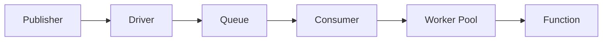

# 큐

Wippy는 설정 가능한 드라이버와 컨슈머가 있는 비동기 메시지 처리를 위한 큐 시스템을 제공합니다.

## 아키텍처



- **드라이버** - 백엔드 구현 (memory, AMQP, Redis)
- **큐** - 드라이버에 바인딩된 논리적 큐
- **컨슈머** - 동시성 설정으로 큐를 핸들러에 연결
- **워커 풀** - 동시 메시지 프로세서

여러 큐가 드라이버를 공유할 수 있습니다. 여러 컨슈머가 같은 큐에서 처리할 수 있습니다.

## 엔트리 종류

| Kind | 설명 |
|------|-------------|
| `queue.driver.memory` | 인메모리 큐 드라이버 |
| `queue.queue` | 드라이버 참조가 있는 큐 선언 |
| `queue.consumer` | 메시지를 처리하는 컨슈머 |

## 드라이버 설정

### 메모리 드라이버

개발 및 테스트용 인메모리 드라이버.

```yaml
- name: memory_driver
  kind: queue.driver.memory
  lifecycle:
    auto_start: true
```

<note>
추가 드라이버(AMQP, Redis, SQS)가 계획되어 있습니다. 드라이버 인터페이스는 큐나 컨슈머 설정을 변경하지 않고 백엔드를 교체할 수 있게 합니다.
</note>

## 큐 설정

```yaml
- name: tasks
  kind: queue.queue
  driver: app.queue:memory_driver
```

| 필드 | 타입 | 필수 | 설명 |
|-------|------|----------|-------------|
| `driver` | 레지스트리 ID | 예 | 큐 드라이버 참조 |
| `options` | Map | 아니오 | 드라이버별 옵션 |

<note>
메모리 드라이버는 설정 옵션이 없습니다. 외부 드라이버(AMQP, Redis, SQS)는 내구성, 최대 길이, TTL 같은 큐 동작에 대한 자체 옵션을 정의합니다.
</note>

## 컨슈머 설정

```yaml
- name: task_consumer
  kind: queue.consumer
  queue: app.queue:tasks
  func: app.queue:task_handler
  concurrency: 4
  prefetch: 20
  lifecycle:
    auto_start: true
    depends_on:
      - app.queue:tasks
```

| 필드 | 기본값 | 최대 | 설명 |
|-------|---------|-----|-------------|
| `queue` | 필수 | - | 큐 레지스트리 ID |
| `func` | 필수 | - | 핸들러 함수 레지스트리 ID |
| `concurrency` | 1 | 1000 | 병렬 워커 수 |
| `prefetch` | 10 | 10000 | 메시지 버퍼 크기 |

<tip>
컨슈머는 호출 컨텍스트를 준수하며 보안 정책의 적용을 받을 수 있습니다. 라이프사이클 레벨에서 액터와 정책을 설정하세요. <a href="system-security.md">보안</a> 참조.
</tip>

### 워커 풀

워커는 동시 고루틴으로 실행됩니다:

```
concurrency: 3, prefetch: 10

1. 드라이버가 버퍼에 최대 10개 메시지 전달
2. 3개 워커가 버퍼에서 동시에 가져옴
3. 워커가 완료되면 버퍼 리필
4. 모든 워커가 바쁘고 버퍼가 가득 차면 백프레셔
```

## 핸들러 함수

컨슈머 함수는 메시지 데이터를 받고 성공 또는 에러를 반환합니다:

```lua
local json = require("json")
local logger = require("logger")

local function handler(body)
    local data = json.decode(body)

    logger.info("Processing", {task_id = data.id})

    local result, err = process_task(data)
    if err then
        return nil, err  -- Nack: 메시지 재큐잉
    end

    return result  -- Ack: 큐에서 제거
end

return handler
```

```yaml
- name: task_handler
  kind: function.lua
  source: file://task_handler.lua
  modules:
    - json
    - logger
```

### 확인 응답

| 핸들러 결과 | 액션 | 효과 |
|----------------|--------|--------|
| 반환 값 | Ack | 큐에서 메시지 제거 |
| 반환 에러 | Nack | 메시지 재큐잉 (드라이버 종속) |

## 메시지 발행

Lua 코드에서:

```lua
local queue = require("queue")

queue.publish("app.queue:tasks", {
    id = "task-123",
    action = "process",
    data = payload
})
```

전체 API는 [Queue 모듈](lua-queue.md)을 참조하세요.

## 그레이스풀 셧다운

컨슈머 중지 시:

1. 새 딜리버리 수락 중지
2. 워커 컨텍스트 취소
3. 처리 중인 메시지 대기 (타임아웃 있음)
4. 워커가 제시간에 완료되지 않으면 에러 반환

## 참고

- [Queue 모듈](lua/storage/queue.md) - Lua API 참조
- [큐 컨슈머 가이드](guides/queue-consumers.md) - 컨슈머 패턴 및 워커 풀
- [슈퍼비전](guides/supervision.md) - 컨슈머 라이프사이클 관리
