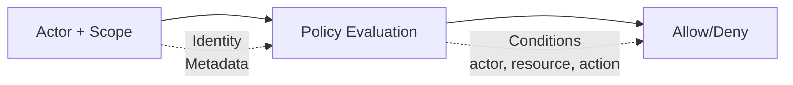

# 보안 모델

Wippy는 액터와 정책 스코프를 사용하여 속성 기반 접근 제어를 구현합니다. 정책은
액터 및 리소스 메타데이터를 사용하여 액션과 리소스를 평가합니다.

이 페이지는 설정 및 API 레퍼런스입니다. 완전한 예제는 필요한 레지스트리 엔트리를
명시하며, 짧은 Lua 및 YAML 펜스는 기존 보안 컨텍스트의 작업이나 설정 조각을 보여 줍니다.



## 엔트리 종류

| 종류 | 설명 |
|------|-------------|
| `security.policy` | 조건이 있는 선언적 정책 |
| `security.policy.expr` | 표현식 기반 정책 |
| `security.token_store` | 토큰 저장 및 검증 |

## 액터

액터는 액션을 수행하는 주체를 나타냅니다.

```lua
local security = require("security")

-- Create actor with metadata
local actor = security.new_actor("user:123", {
    role = "admin",
    team = "backend",
    department = "engineering",
    clearance = 3
})

-- Access actor properties
local id = actor:id()        -- "user:123"
local meta = actor:meta()    -- {role="admin", ...}
```

### 컨텍스트의 액터

```lua
-- Get current actor from context
local errors = require("errors")

local actor = security.actor()
if not actor then
    return nil, errors.new({
        kind = errors.PERMISSION_DENIED,
        message = "No actor in context"
    })
end
```

## 정책

정책은 액션, 리소스, 조건, 효과로 접근 규칙을 정의합니다.

### 선언적 정책

```yaml
# src/security/_index.yaml
version: "1.0"
namespace: app.security

entries:
  # Admin full access
  - name: admin_policy
    kind: security.policy
    policy:
      actions: "*"
      resources: "*"
      effect: allow
      conditions:
        - field: actor.meta.role
          operator: eq
          value: admin
    groups:
      - admin

  # Read-only access
  - name: readonly_policy
    kind: security.policy
    policy:
      actions:
        - "*.read"
        - "*.get"
        - "*.list"
      resources: "*"
      effect: allow
    groups:
      - default

  # Resource owner access
  - name: owner_policy
    kind: security.policy
    policy:
      actions:
        - read
        - write
        - delete
      resources: "document:*"
      effect: allow
      conditions:
        - field: meta.owner
          operator: eq
          value_from: actor.id
    groups:
      - default

  # Deny confidential without clearance
  - name: deny_confidential
    kind: security.policy
    policy:
      actions: "*"
      resources: "document:*"
      effect: deny
      conditions:
        - field: meta.classification
          operator: eq
          value: confidential
        - field: actor.meta.clearance
          operator: lt
          value: 3
    groups:
      - security
```

### 정책 구조

```text
policy:
  actions: "*" | "action" | ["action1", "action2"]
  resources: "*" | "resource" | ["res1", "res2"]
  effect: allow | deny
  conditions:  # Optional
    - field: "field.path"
      operator: "eq"
      value: "static_value"
      # OR
      value_from: "other.field.path"
```

### 표현식 기반 정책

복잡한 로직의 경우 표현식 정책을 사용하세요:

```yaml
- name: flexible_access
  kind: security.policy.expr
  policy:
    actions:
      - read
      - write
    resources: "file:*"
    effect: allow
    expression: |
      (actor.meta.role == "editor" && action == "write") ||
      (action == "read" && meta.public == true) ||
      actor.id == meta.owner
  groups:
    - editors
```

## 조건

조건은 액터, 액션, 리소스, 메타데이터를 기반으로 동적 정책 평가를 허용합니다.

### 필드 경로

| 경로 | 설명 |
|------|-------------|
| `actor.id` | 액터의 고유 식별자 |
| `actor.meta.*` | 액터 메타데이터 (중첩 지원) |
| `action` | 수행 중인 액션 |
| `resource` | 리소스 식별자 |
| `meta.*` | 리소스 메타데이터 |

### 연산자

| 연산자 | 설명 | 예제 |
|----------|-------------|---------|
| `eq` | 같음 | `actor.meta.role eq "admin"` |
| `ne` | 같지 않음 | `meta.status ne "deleted"` |
| `lt` | 미만 | `meta.priority lt 5` |
| `gt` | 초과 | `actor.meta.clearance gt 2` |
| `lte` | 이하 | `meta.size lte 1000` |
| `gte` | 이상 | `actor.meta.level gte 3` |
| `in` | 배열에 값 포함 | `action in ["read", "write"]` |
| `nin` | 배열에 값 미포함 | `meta.status nin ["deleted", "archived"]` |
| `exists` | 필드 존재 | `meta.owner exists true` |
| `nexists` | 필드 부재 | `meta.deleted nexists true` |
| `contains` | 문자열 포함 | `resource contains "sensitive"` |
| `ncontains` | 문자열 미포함 | `resource ncontains "public"` |
| `matches` | 정규식 일치 | `resource matches "^doc:.*"` |
| `nmatches` | 정규식 불일치 | `actor.id nmatches "^system:.*"` |

### 조건 예제

```yaml
# Match actor role
conditions:
  - field: actor.meta.role
    operator: eq
    value: admin

# Compare fields
conditions:
  - field: meta.owner
    operator: eq
    value_from: actor.id

# Numeric comparison
conditions:
  - field: actor.meta.clearance
    operator: gte
    value: 3

# Array membership
conditions:
  - field: actor.meta.role
    operator: in
    value:
      - admin
      - moderator

# Pattern matching
conditions:
  - field: resource
    operator: matches
    value: "^api:/v[0-9]+/admin/.*"

# Multiple conditions (AND)
conditions:
  - field: actor.meta.department
    operator: eq
    value: engineering
  - field: meta.environment
    operator: eq
    value: production
```

## 스코프

스코프는 여러 정책을 보안 컨텍스트로 결합합니다.

```lua
local security = require("security")

-- Get policies
local admin_policy, admin_err = security.policy("app.security:admin_policy")
if admin_err then return nil, admin_err end
local readonly_policy, readonly_err = security.policy("app.security:readonly_policy")
if readonly_err then return nil, readonly_err end

-- Create scope with policies
local scope = security.new_scope()
scope = scope:with(admin_policy)
scope = scope:with(readonly_policy)

-- Scopes are immutable - :with() returns new scope
```

### 명명된 스코프 (정책 그룹)

그룹의 모든 정책 로드:

```lua
-- Load scope with all policies in group
local scope, err = security.named_scope("app.security:admin")
if err then return nil, err end
```

정책은 `groups` 필드를 통해 그룹에 할당됩니다:

```yaml
- name: admin_policy
  kind: security.policy
  policy:
    # ...
  groups:
    - admin      # This policy is in "admin" group
    - default    # Can be in multiple groups
```

### 스코프 작업

```lua
-- Add policy
local new_scope = scope:with(policy)

-- Remove policy
local new_scope = scope:without("app.security:temp_policy")

-- Check if policy is in scope
local has = scope:contains("app.security:admin_policy")

-- Get all policies
local policies = scope:policies()
```

### 모듈 권한

Strict mode는 토큰 작업뿐 아니라 액터, 정책 및 스코프 생성에도 권한 검사를 적용합니다:

| 액션 | 리소스 | 사용 위치 | 거부 동작 |
|--------|----------|---------|-----------------|
| `security.actor.create` | 액터 ID | `security.new_actor` | Lua 오류 발생 |
| `security.policy.get` | 정책 레지스트리 ID | `security.policy` | `nil, error` 반환 |
| `security.policy_group.get` | 정책 그룹 ID | `security.named_scope` | `nil, error` 반환 |
| `security.scope.create` | `custom`, `with` 또는 `without` | 각각 `security.new_scope`, `scope:with`, `scope:without` | Lua 오류 발생 |

호출자에게 필요한 작업과 ID만 부여하세요. 이 페이지의 액터, 스코프 및 토큰 예제는
작업별 토큰 권한 외에도 이러한 권한이 있다고 가정합니다.

## 정책 평가

### 평가 흐름

```
1. Evaluate policies until a deny is found or the scope is exhausted
2. If ANY policy returns Deny → Result is Deny
3. If at least one Allow and no Deny → Result is Allow
4. No applicable policies → Result is Undefined
```

### 평가 결과

| 결과 | 의미 |
|--------|---------|
| `allow` | 접근 허용 |
| `deny` | 접근 명시적 거부 |
| `undefined` | 일치하는 정책 없음 |

```lua
local errors = require("errors")

-- Evaluate directly
local result = scope:evaluate(actor, "read", "document:123", {
    owner = "user:456",
    classification = "internal"
})

if result == "deny" then
    return nil, errors.new({
        kind = errors.PERMISSION_DENIED,
        message = "Access denied"
    })
elseif result == "undefined" then
    -- No policy matched; treat this as denied unless the caller handles it explicitly.
end
```

### 빠른 권한 확인

```lua
local errors = require("errors")

-- Check against current context's actor and scope
local allowed = security.can("read", "document:123", {
    owner = "user:456"
})

if not allowed then
    return nil, errors.new({
        kind = errors.PERMISSION_DENIED,
        message = "Access denied"
    })
end
```

## 토큰 스토어

토큰 스토어는 인증 토큰을 생성, 검증 및 취소합니다.

Lua 작업은 권한으로 보호됩니다. 활성 스코프는 획득에 `security.token_store.get`,
해당 작업에 `security.token.create`, `security.token.validate` 또는
`security.token.revoke`를 허용해야 합니다. 이는 기본 strict mode와 명시적으로
설정된 보안 컨텍스트 모두에 적용됩니다. 액터를 생성하거나 명명된 스코프를 로드하는
예제에는 `security.actor.create`와 `security.policy_group.get`도 필요합니다.

### 설정

```yaml
# src/auth/_index.yaml
version: "1.0"
namespace: app.auth

entries:
  # Register environment variable
  - name: os_env
    kind: env.storage.os

  - name: AUTH_SECRET_KEY
    kind: env.variable
    variable: AUTH_SECRET_KEY
    storage: app.auth:os_env

  # Backing store for tokens
  - name: token_data
    kind: store.memory
    lifecycle:
      auto_start: true

  # Token store
  - name: tokens
    kind: security.token_store
    store: app.auth:token_data
    token_length: 32
    default_expiration: "24h"
    token_key: ${env:AUTH_SECRET_KEY}
```

### 토큰 스토어 옵션

| 옵션 | 기본값 | 설명 |
|--------|---------|-------------|
| `store` | 필수 | 백킹 키-값 스토어 참조 |
| `token_length` | 32 | 토큰 크기 (바이트, 256비트) |
| `default_expiration` | 24h | 기본 토큰 TTL |
| `token_key` | 없음 | HMAC-SHA256 서명 키(직접 값 또는 [환경 레지스트리](system/env.md)의 `${env:NAME}`) |

프로덕션에서는 `token_key: ${env:NAME}`을 사용하여 엔트리에 시크릿을 포함시키지
마세요. 레거시 `token_key_env` 지시자도 환경 레지스트리를 읽지만 조회 값이 없거나
비어 있으면 인라인 값 또는 제로 값을 보존합니다. 기본값 없는 최신 플레이스홀더는
변수가 누락되면 실패합니다. 레거시 지시자는 더 이상 사용되지 않습니다.

### 토큰 생성

```lua
local security = require("security")

-- Get token store
local store, err = security.token_store("app.auth:tokens")
if err then
    return nil, err
end

-- Create actor and scope
local actor = security.new_actor("user:123", {
    role = "user",
    email = "user@example.com"
})

local scope, scope_err = security.named_scope("app.security:default")
if scope_err then
    store:close()
    return nil, scope_err
end

-- Create token
local token, create_err = store:create(actor, scope, {
    expiration = "7d",  -- Override default expiration
    meta = {
        device = "mobile",
        ip = "192.168.1.1"
    }
})
store:close()
if create_err then return nil, create_err end
return token

-- Token format: base64_token.hmac_signature (if token_key set)
-- Example: "dGVzdHRva2VuMTIz.a1b2c3d4e5f6"
```

### 토큰 검증

```lua
local errors = require("errors")

-- Validate token
local actor, scope, err = store:validate(token)
store:close()
if err then
    return nil, errors.new({
        kind = errors.PERMISSION_DENIED,
        message = "Invalid token"
    })
end

-- Actor and scope are reconstructed from stored data
print(actor:id())  -- "user:123"
```

### 토큰 취소

```lua
-- Revoke single token
local ok, err = store:revoke(token)
if err then
    store:close()
    return nil, err
end

-- Close store when done
store:close()
return ok
```

## 컨텍스트 흐름

액터와 스코프는 상속 가능한 프레임 컨텍스트입니다. 호출자가 대체 컨텍스트를
제공하지 않으면 함수 호출과 생성된 프로세스가 둘 다 상속합니다. 생성된 프로세스의
액터나 스코프를 명시적으로 변경하려면 `process.security` 권한이 필요합니다.
`funcs.new():with_actor(...)` 또는 `:with_scope(...)`로 함수 호출의 보안 컨텍스트를
변경하려면 대신 `security`에 대한 `funcs.security`가 필요합니다.

### 컨텍스트 설정

```lua
local funcs = require("funcs")

-- Call function with security context
local caller, err = funcs.new():with_actor(actor)
if err then return nil, err end
caller, err = caller:with_scope(scope)
if err then return nil, err end
local result, call_err = caller:call("app.api:protected_endpoint", data)
if call_err then return nil, call_err end
```

### 컨텍스트 상속

| 컴포넌트 | 상속 |
|-----------|----------|
| 액터 | 예 - 자식 호출과 생성된 프로세스로 전달 |
| 스코프 | 예 - 자식 호출과 생성된 프로세스로 전달 |
| 엄격 모드 | 아니오 - 애플리케이션 전체 |

## 서비스 레벨 보안

서비스에 대한 기본 보안 설정:

```yaml
- name: worker_service
  kind: process.lua
  source: file://worker.lua
  lifecycle:
    auto_start: true
    security:
      actor:
        id: "service:worker"
        meta:
          role: worker
          service: true
      policies:
        - app.security:worker_policy
      groups:
        - workers
```

## 엄격 모드

Strict mode는 기본적으로 활성화되며 액터나 스코프가 없으면 접근을 거부합니다.
배포가 의도적으로 레거시 허용 동작을 필요로 할 때만 `false`로 설정하세요:

```yaml
# .wippy.yaml
security:
  strict_mode: true
```

| `strict_mode` | 컨텍스트 없음 | 동작 |
|------|-----------------|----------|
| `false` | 액터 또는 스코프 없음 | 허용 (관대) |
| `true` (기본값) | 액터 또는 스코프 없음 | 거부 |

액터와 스코프가 모두 있으면 정책은 항상 평가됩니다. Strict mode를 비활성화해도
`undefined` 결과가 allow로 변환되지는 않습니다. `security.can(...)`은 평가가
`allow`를 반환할 때만 `true`를 반환합니다.

## 인증 흐름

HTTP 핸들러에서 토큰 검증:

```lua
local http = require("http")
local security = require("security")

local function protected_handler()
    local req, req_err = http.request()
    if req_err then return nil, req_err end
    local res, res_err = http.response()
    if res_err then return nil, res_err end

    local function respond(status, body)
        local content_type_err = res:set_header("Content-Type", "application/json")
        if content_type_err then return nil, content_type_err end
        local status_err = res:set_status(status)
        if status_err then return nil, status_err end
        local write_err = res:write_json(body)
        if write_err then return nil, write_err end
        return true
    end

    -- Extract and validate token
    local auth, header_err = req:header("Authorization")
    if header_err then return nil, header_err end
    if not auth then
        return respond(http.STATUS.UNAUTHORIZED, {error = "Missing authorization"})
    end

    local token = auth:match("^Bearer%s+(.+)$")
    if not token then
        return respond(http.STATUS.UNAUTHORIZED, {error = "Expected a bearer token"})
    end
    local store, store_err = security.token_store("app.auth:tokens")
    if store_err then
        return respond(http.STATUS.INTERNAL_ERROR, {error = "Token store unavailable"})
    end

    local actor, scope, validate_err = store:validate(token)
    store:close()
    if validate_err then
        return respond(http.STATUS.UNAUTHORIZED, {error = "Invalid token"})
    end

    -- Evaluate the actor and scope reconstructed from this token.
    if scope:evaluate(actor, "api.users.read", "users") ~= "allow" then
        return respond(http.STATUS.FORBIDDEN, {error = "Forbidden"})
    end

    return respond(http.STATUS.OK, {user = actor:id()})
end

return { handler = protected_handler }
```

로그인 시 토큰 생성:

```lua
local actor = security.new_actor("user:" .. user.id, {role = user.role})
local scope, scope_err = security.named_scope("app.security:" .. user.role)
if scope_err then return nil, scope_err end

local store, store_err = security.token_store("app.auth:tokens")
if store_err then return nil, store_err end
local token, token_err = store:create(actor, scope, {expiration = "24h"})
store:close()
if token_err then return nil, token_err end
return token
```

## 모범 사례

1. **최소 권한** - 필요한 최소 권한만 부여
2. **기본 거부** - 명시적 허용 정책 사용, 엄격 모드 활성화
3. **정책 그룹 사용** - 역할/기능별로 정책 구성
4. **토큰 서명** - 프로덕션에서는 항상 `${env:NAME}` 참조로 `token_key` 설정
5. **짧은 만료** - 민감한 작업에 더 짧은 토큰 수명 사용
6. **컨텍스트 조건** - 정적 정책보다 동적 조건 사용
7. **민감한 액션 감사** - 보안 관련 작업 로깅

## 보안 모듈 참조

| 함수 | 설명 |
|----------|-------------|
| `security.actor()` | 컨텍스트에서 현재 액터 가져오기 |
| `security.scope()` | 컨텍스트에서 현재 스코프 가져오기 |
| `security.can(action, resource, meta?)` | 권한 확인 |
| `security.new_actor(id, meta?)` | 새 액터 생성 |
| `security.new_scope(policies?)` | 빈 또는 시드된 스코프 생성 |
| `security.policy(id)` | ID로 정책 가져오기 |
| `security.named_scope(group_id)` | 모든 그룹 정책으로 스코프 가져오기 |
| `security.token_store(id)` | 토큰 스토어 가져오기 |
