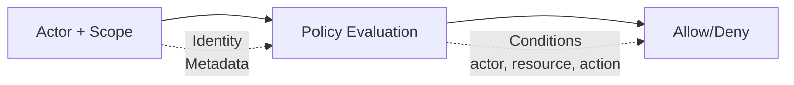

# 보안 모델

Wippy는 액터와 정책 스코프를 사용하여 속성 기반 접근 제어를 구현합니다. 정책은
액터 및 리소스 메타데이터를 사용하여 액션과 리소스를 평가합니다.

이 페이지는 설정 및 API 레퍼런스입니다. 완전한 예제는 필요한 레지스트리 엔트리를
명시하며, 짧은 Lua 및 YAML 펜스는 기존 보안 컨텍스트의 작업이나 설정 조각을 보여 줍니다.



## 엔트리 종류

| 종류 | 설명 |
|------|-------------|
| `security.policy` | 조건이 있는 선언적 정책 |
| `security.policy.expr` | 표현식 기반 정책 |
| `security.token_store` | 토큰 저장 및 검증 |

## 액터

액터는 액션을 수행하는 주체를 나타냅니다.

```lua
local security = require("security")

-- Create actor with metadata
local actor = security.new_actor("user:123", {
    role = "admin",
    team = "backend",
    department = "engineering",
    clearance = 3
})

-- Access actor properties
local id = actor:id()        -- "user:123"
local meta = actor:meta()    -- {role="admin", ...}
```

### 컨텍스트의 액터

```lua
-- Get current actor from context
local errors = require("errors")

local actor = security.actor()
if not actor then
    return nil, errors.new({ kind = errors.PERMISSION_DENIED, message = "No actor in context" })
end
```

## 정책

정책은 액션, 리소스, 조건, 효과로 접근 규칙을 정의합니다.

### 선언적 정책

```yaml
# src/security/_index.yaml
version: "1.0"
namespace: app.security

entries:
  # Admin full access
  - name: admin_policy
    kind: security.policy
    policy:
      actions: "*"
      resources: "*"
      effect: allow
      conditions:
        - field: actor.meta.role
          operator: eq
          value: admin
    groups:
      - admin

  # Read-only access
  - name: readonly_policy
    kind: security.policy
    policy:
      actions:
        - "*.read"
        - "*.get"
        - "*.list"
      resources: "*"
      effect: allow
    groups:
      - default

  # Resource owner access
  - name: owner_policy
    kind: security.policy
    policy:
      actions:
        - read
        - write
        - delete
      resources: "document:*"
      effect: allow
      conditions:
        - field: meta.owner
          operator: eq
          value_from: actor.id
    groups:
      - default

  # Deny confidential without clearance
  - name: deny_confidential
    kind: security.policy
    policy:
      actions: "*"
      resources: "document:*"
      effect: deny
      conditions:
        - field: meta.classification
          operator: eq
          value: confidential
        - field: actor.meta.clearance
          operator: lt
          value: 3
    groups:
      - security
```

### 정책 구조

```text
policy:
  actions: "*" | "action" | ["action1", "action2"]
  resources: "*" | "resource" | ["res1", "res2"]
  effect: allow | deny
  conditions:  # Optional
    - field: "field.path"
      operator: "eq"
      value: "static_value"
      # OR
      value_from: "other.field.path"
```

### 표현식 기반 정책

복잡한 로직의 경우 표현식 정책을 사용하세요:

```yaml
- name: flexible_access
  kind: security.policy.expr
  policy:
    actions:
      - read
      - write
    resources: "file:*"
    effect: allow
    expression: |
      (actor.meta.role == "editor" && action == "write") ||
      (action == "read" && meta.public == true) ||
      actor.id == meta.owner
  groups:
    - editors
```

## 조건

조건은 액터, 액션, 리소스, 메타데이터를 기반으로 동적 정책 평가를 허용합니다.

### 필드 경로

| 경로 | 설명 |
|------|-------------|
| `actor.id` | 액터의 고유 식별자 |
| `actor.meta.*` | 액터 메타데이터 (중첩 지원) |
| `action` | 수행 중인 액션 |
| `resource` | 리소스 식별자 |
| `meta.*` | 리소스 메타데이터 |

### 연산자

| 연산자 | 설명 | 예제 |
|----------|-------------|---------|
| `eq` | 같음 | `actor.meta.role eq "admin"` |
| `ne` | 같지 않음 | `meta.status ne "deleted"` |
| `lt` | 미만 | `meta.priority lt 5` |
| `gt` | 초과 | `actor.meta.clearance gt 2` |
| `lte` | 이하 | `meta.size lte 1000` |
| `gte` | 이상 | `actor.meta.level gte 3` |
| `in` | 배열에 값 포함 | `action in ["read", "write"]` |
| `nin` | 배열에 값 미포함 | `meta.status nin ["deleted", "archived"]` |
| `exists` | 필드 존재 | `meta.owner exists true` |
| `nexists` | 필드 부재 | `meta.deleted nexists true` |
| `contains` | 문자열 포함 | `resource contains "sensitive"` |
| `ncontains` | 문자열 미포함 | `resource ncontains "public"` |
| `matches` | 정규식 일치 | `resource matches "^doc:.*"` |
| `nmatches` | 정규식 불일치 | `actor.id nmatches "^system:.*"` |

### 조건 예제

```yaml
# Match actor role
conditions:
  - field: actor.meta.role
    operator: eq
    value: admin

# Compare fields
conditions:
  - field: meta.owner
    operator: eq
    value_from: actor.id

# Numeric comparison
conditions:
  - field: actor.meta.clearance
    operator: gte
    value: 3

# Array membership
conditions:
  - field: actor.meta.role
    operator: in
    value:
      - admin
      - moderator

# Pattern matching
conditions:
  - field: resource
    operator: matches
    value: "^api:/v[0-9]+/admin/.*"

# Multiple conditions (AND)
conditions:
  - field: actor.meta.department
    operator: eq
    value: engineering
  - field: meta.environment
    operator: eq
    value: production
```

## 스코프

스코프는 여러 정책을 보안 컨텍스트로 결합합니다.

```lua
local security = require("security")

-- Get policies
local admin_policy, admin_err = security.policy("app.security:admin_policy")
if admin_err then return nil, admin_err end
local readonly_policy, readonly_err = security.policy("app.security:readonly_policy")
if readonly_err then return nil, readonly_err end

-- Create scope with policies
local scope = security.new_scope()
scope = scope:with(admin_policy)
scope = scope:with(readonly_policy)

-- Scopes are immutable - :with() returns new scope
```

### 명명된 스코프 (정책 그룹)

그룹의 모든 정책 로드:

```lua
-- Load scope with all policies in group
local scope, err = security.named_scope("app.security:admin")
if err then return nil, err end
```

정책은 `groups` 필드를 통해 그룹에 할당됩니다:

```yaml
- name: admin_policy
  kind: security.policy
  policy:
    # ...
  groups:
    - admin      # This policy is in "admin" group
    - default    # Can be in multiple groups
```

### 스코프 작업

```lua
-- Add policy
local new_scope = scope:with(policy)

-- Remove policy
local new_scope = scope:without("app.security:temp_policy")

-- Check if policy is in scope
local has = scope:contains("app.security:admin_policy")

-- Get all policies
local policies = scope:policies()
```

### 모듈 권한

Strict mode는 토큰 작업뿐 아니라 액터, 정책 및 스코프 생성에도 권한 검사를 적용합니다:

| 액션 | 리소스 | 사용 위치 | 거부 동작 |
|--------|----------|---------|-----------------|
| `security.actor.create` | 액터 ID | `security.new_actor` | Lua 오류 발생 |
| `security.policy.get` | 정책 레지스트리 ID | `security.policy` | `nil, error` 반환 |
| `security.policy_group.get` | 정책 그룹 ID | `security.named_scope` | `nil, error` 반환 |
| `security.scope.create` | `custom`, `with` 또는 `without` | 각각 `security.new_scope`, `scope:with`, `scope:without` | Lua 오류 발생 |

호출자에게 필요한 작업과 ID만 부여하세요. 이 페이지의 액터, 스코프 및 토큰 예제는
작업별 토큰 권한 외에도 이러한 권한이 있다고 가정합니다.

## 정책 평가

### 평가 흐름

```
1. 컨텍스트에 액터가 없거나 스코프가 없음 → 엄격 모드가 결정 (기본값은 거부)
2. 스코프의 각 정책 확인
3. 어떤 정책이라도 Deny 반환 → 결과는 Deny
4. 최소 하나의 Allow이고 Deny 없음 → 결과는 Allow
5. 해당 정책 없음 → 결과는 Undefined
```

접근 검사는 `Allow`일 때만 통과합니다. `Undefined`는 `Deny`와 정확히 동일하게 접근을 거부합니다 — 액터와 스코프가 모두 존재하면 엄격 모드는 아무 역할도 하지 않습니다.

### 평가 결과

| 결과 | 의미 |
|--------|---------|
| `allow` | 접근 허용 |
| `deny` | 접근 명시적 거부 |
| `undefined` | 일치하는 정책 없음 |

```lua
local errors = require("errors")

-- Evaluate directly
local result = scope:evaluate(actor, "read", "document:123", {
    owner = "user:456",
    classification = "internal"
})

if result == "deny" then
    return nil, errors.new({ kind = errors.PERMISSION_DENIED, message = "Access denied" })
elseif result == "undefined" then
    -- 일치하는 정책 없음 - 접근 검사는 이를 거부로 취급함
end
```

### 빠른 권한 확인

```lua
local errors = require("errors")

-- Check against current context's actor and scope
local allowed = security.can("read", "document:123", {
    owner = "user:456"
})

if not allowed then
    return nil, errors.new({ kind = errors.PERMISSION_DENIED, message = "Access denied" })
end
```

## 토큰 스토어

토큰 스토어는 인증 토큰을 생성, 검증 및 취소합니다.

Lua 작업은 권한으로 보호됩니다. 활성 스코프는 획득에 `security.token_store.get`,
해당 작업에 `security.token.create`, `security.token.validate` 또는
`security.token.revoke`를 허용해야 합니다. 이는 기본 strict mode와 명시적으로
설정된 보안 컨텍스트 모두에 적용됩니다. 액터를 생성하거나 명명된 스코프를 로드하는
예제에는 `security.actor.create`와 `security.policy_group.get`도 필요합니다.

### 설정

```yaml
# src/auth/_index.yaml
version: "1.0"
namespace: app.auth

entries:
  # Register environment variable
  - name: os_env
    kind: env.storage.os

  - name: AUTH_SECRET_KEY
    kind: env.variable
    variable: AUTH_SECRET_KEY
    storage: app.auth:os_env

  # Backing store for tokens
  - name: token_data
    kind: store.memory
    lifecycle:
      auto_start: true

  # Token store
  - name: tokens
    kind: security.token_store
    store: app.auth:token_data
    token_length: 32
    default_expiration: "24h"
    token_key: ${env:AUTH_SECRET_KEY}
```

### 토큰 스토어 옵션

| 옵션 | 기본값 | 설명 |
|--------|---------|-------------|
| `store` | 필수 | 백킹 키-값 스토어 참조 |
| `token_length` | 32 | 토큰 크기 (바이트, 256비트) |
| `default_expiration` | 24h | 기본 토큰 TTL |
| `token_key` | 없음 | HMAC-SHA256 서명 키 (직접 값, 또는 [env 레지스트리](system/env.md)에서 가져오려면 `${env:NAME}`) |

엔트리에 시크릿을 포함시키지 않으려면 프로덕션에서 `token_key: ${env:NAME}`을 사용하세요. 레거시 `token_key_env` 디렉티브도 동일하게 해석되지만 더 이상 권장되지 않으며, `${env:NAME}`을 사용하세요.

### 토큰 생성

```lua
local security = require("security")

-- Get token store
local store, err = security.token_store("app.auth:tokens")
if err then
    return nil, err
end

-- Create actor and scope
local actor = security.new_actor("user:123", {
    role = "user",
    email = "user@example.com"
})

local scope, scope_err = security.named_scope("app.security:default")
if scope_err then
    store:close()
    return nil, scope_err
end

-- Create token
local token, create_err = store:create(actor, scope, {
    expiration = "7d",  -- Override default expiration
    meta = {
        device = "mobile",
        ip = "192.168.1.1"
    }
})
store:close()
if create_err then return nil, create_err end
return token

-- Token format: base64_token.hmac_signature (if token_key set)
-- Example: "dGVzdHRva2VuMTIz.a1b2c3d4e5f6"
```

### 토큰 검증

```lua
local errors = require("errors")

-- Validate token
local actor, scope, err = store:validate(token)
store:close()
if err then
    return nil, errors.new({ kind = errors.PERMISSION_DENIED, message = "Invalid token" })
end

-- Actor and scope are reconstructed from stored data
print(actor:id())  -- "user:123"
```

### 토큰 취소

```lua
-- Revoke single token
local ok, err = store:revoke(token)
if err then
    store:close()
    return nil, err
end

-- Close store when done
store:close()
return ok
```

## 컨텍스트 흐름

액터와 스코프는 상속 가능한 프레임 컨텍스트입니다. 호출자가 대체 컨텍스트를
제공하지 않으면 함수 호출과 생성된 프로세스가 둘 다 상속합니다. 생성된 프로세스의
액터나 스코프를 명시적으로 변경하려면 `process.security` 권한이 필요합니다.
`funcs.new():with_actor(...)` 또는 `:with_scope(...)`로 함수 호출의 보안 컨텍스트를
변경하려면 대신 `security`에 대한 `funcs.security`가 필요합니다.

### 컨텍스트 설정

```lua
local funcs = require("funcs")

-- Call function with security context
local caller, err = funcs.new():with_actor(actor)
if err then return nil, err end
caller, err = caller:with_scope(scope)
if err then return nil, err end
local result, call_err = caller:call("app.api:protected_endpoint", data)
if call_err then return nil, call_err end
```

### 컨텍스트 상속

| 컴포넌트 | 상속 |
|-----------|----------|
| 액터 | 예 - 자식 호출과 생성된 프로세스로 전달 |
| 스코프 | 예 - 자식 호출과 생성된 프로세스로 전달 |
| 엄격 모드 | 아니오 - 애플리케이션 전체 |

함수와 스폰된 프로세스는 모두 호출자의 보안 컨텍스트를 상속합니다. 스폰된 프로세스는 스포너의 프레임에서 포크된 프레임으로 시작하며, 이 프레임은 스포너의 액터와 스코프를 담고 있고, 자신의 엔트리에 있는 `security:` 블록이 그 상속된 컨텍스트를 수정합니다. 엔트리가 블록을 선언하지 않으면 프로세스는 스포너의 액터와 스코프를 그대로 유지합니다. 둘 다 없는 스포너는 둘 다 없는 자식을 만들며, 엄격 모드는 이를 거부합니다. `actor`를 지정한 선언 블록은 상속된 액터를 대체하고, 그 `policies`와 `groups`는 상속된 스코프에 병합됩니다. `actor`를 생략한 블록은 스포너의 액터를 유지하고, `policies`와 `groups`를 모두 생략한 블록은 스포너의 스코프를 유지합니다.

## 엔트리에 보안 선언하기

보안 블록은 어디에 나타나든 형태가 동일합니다:

| 필드 | 타입 | 설명 |
|-------|------|-------------|
| `actor.id` | string | 액터 아이덴티티. 상속된 액터를 대체합니다 |
| `actor.meta` | map | 정책이 평가하는 액터 속성 |
| `policies` | list | 스코프에 병합되는 정책 레지스트리 ID |
| `groups` | list | 그 정책들이 스코프에 병합되는 정책 그룹의 레지스트리 ID |

`policies`와 `groups`는 **`namespace:name` 형식의 레지스트리 ID**입니다. 이름만 쓰면 해석되지 않습니다 — 정책 엔트리의 `groups:` 필드가 정책 자신의 네임스페이스를 기본값으로 삼는 것과 달리, 이 참조들에는 기본 네임스페이스가 없습니다.

해석은 원자적이며 fail-closed입니다. 나열된 모든 정책과 그룹은 어떤 것이 설치되기 전에 해석됩니다. 그중 하나라도 없거나, 비어 있거나, 정책을 담고 있지 않으면 전체 설정이 실패하며 액터도 부분 스코프도 적용되지 않습니다. 따라서 호출자가 절반짜리 컨텍스트를 들고 경계를 넘는 일은 없습니다.

### 프로세스 엔트리

`process.lua`, `process.lua.bc`, `function.lua`, `function.lua.bc` 엔트리는 해당 엔트리의 모든 실행에 적용되는 최상위 `security:` 블록을 받습니다:

```yaml
- name: worker_process
  kind: process.lua
  source: file://worker.lua
  method: main
  security:
    actor:
      id: "service:worker"
      meta:
        role: worker
        service: true
    policies:
      - app.security:worker_policy
    groups:
      - app.security:workers
```

이 블록은 프로세스가 시작될 때 `process.host`와 `terminal.host` 양쪽에서 적용됩니다. 해석에 실패하면 더 약한 컨텍스트로 프로세스를 시작하는 대신 스폰이 중단됩니다.

### 서비스 라이프사이클

감독되는 서비스는 동일한 블록을 `lifecycle` 아래에 받으며, 서비스 컨트롤러가 생성될 때 한 번 해석되어 서비스의 수명 동안 고정됩니다:

```yaml
- name: worker
  kind: process.service
  process: app:worker_process
  host: app:processes
  lifecycle:
    auto_start: true
    security:
      actor:
        id: "service:worker"
      groups:
        - app.security:workers
```

### CLI 명령어

명령어 엔트리는 `meta.command.security`를 선언하며, 이는 엔트리가 CLI 명령어로 실행될 때만 적용됩니다 — `wippy run <name>`을 실행하는 운영자가 그 컨텍스트의 신뢰 앵커입니다. 동일한 엔트리의 일반적인 스폰에는 전혀 영향을 주지 않습니다. 블록은 엄격하게 검증됩니다: 알 수 없는 필드는 거부되고, 빈 블록은 거부되며, 명령어 `name` 없는 `security`도 거부됩니다. [명령어 보안](guides/cli.md#명령어-보안)을 참조하세요.

## 엄격 모드

엄격 모드는 요청에 액터도 스코프도 없을 때 어떻게 할지를 결정합니다. **기본적으로 켜져 있으므로** 불완전한 컨텍스트는 거부됩니다. 이를 끄는 것은 명시적인 선택이며, 모듈 매니페스트 `wippy.yaml`이 아니라 런타임 설정 파일(`.wippy.yaml`)에서 합니다:

```yaml
# .wippy.yaml
security:
  strict_mode: false
```

| `strict_mode` | 컨텍스트 없음 | 동작 |
|------|-----------------|----------|
| 엄격 (기본값) | 액터/스코프 없음 | 거부 |
| 관대 (`strict_mode: false`) | 액터/스코프 없음 | 허용 |

액터와 스코프가 존재하면 엄격 모드는 아무것도 바꾸지 않습니다: 어느 쪽이든 평가는 기본 거부입니다. 엄격 모드는 불완전한 경우만 관장하며, 그래서 선언된 보안 컨텍스트 없이 실행되는 프로세스는 기본 설정에서 모든 검사에 실패합니다. 그런 프로세스에는 `security:` 블록을 주거나, 컨텍스트를 공급하는 경로로 시작하세요.

## 인증 흐름

HTTP 핸들러에서 토큰 검증:

```lua
local http = require("http")
local security = require("security")

local function protected_handler()
    local req, req_err = http.request()
    if req_err then return nil, req_err end
    local res, res_err = http.response()
    if res_err then return nil, res_err end

    local function respond(status, body)
        local content_type_err = res:set_header("Content-Type", "application/json")
        if content_type_err then return nil, content_type_err end
        local status_err = res:set_status(status)
        if status_err then return nil, status_err end
        local write_err = res:write_json(body)
        if write_err then return nil, write_err end
        return true
    end

    -- Extract and validate token
    local auth, header_err = req:header("Authorization")
    if header_err then return nil, header_err end
    if not auth then
        return respond(http.STATUS.UNAUTHORIZED, {error = "Missing authorization"})
    end

    local token = auth:match("^Bearer%s+(.+)$")
    if not token then
        return respond(http.STATUS.UNAUTHORIZED, {error = "Expected a bearer token"})
    end
    local store, store_err = security.token_store("app.auth:tokens")
    if store_err then
        return respond(http.STATUS.INTERNAL_ERROR, {error = "Token store unavailable"})
    end

    local actor, scope, validate_err = store:validate(token)
    store:close()
    if validate_err then
        return respond(http.STATUS.UNAUTHORIZED, {error = "Invalid token"})
    end

    -- Evaluate the actor and scope reconstructed from this token.
    if scope:evaluate(actor, "api.users.read", "users") ~= "allow" then
        return respond(http.STATUS.FORBIDDEN, {error = "Forbidden"})
    end

    return respond(http.STATUS.OK, {user = actor:id()})
end

return { handler = protected_handler }
```

로그인 시 토큰 생성:

```lua
local actor = security.new_actor("user:" .. user.id, {role = user.role})
local scope, scope_err = security.named_scope("app.security:" .. user.role)
if scope_err then return nil, scope_err end

local store, store_err = security.token_store("app.auth:tokens")
if store_err then return nil, store_err end
local token, token_err = store:create(actor, scope, {expiration = "24h"})
store:close()
if token_err then return nil, token_err end
return token
```

## 런타임 신뢰 경계

정책 평가는 코드가 무엇을 할 수 있는지를 관장합니다. 어떤 코드가 받아들여지고 컨텍스트가 어디까지 이동할 수 있는지는 별개의 세 가지 메커니즘이 관장합니다.

### 모듈 무결성

`wippy.lock`의 모든 모듈은 아티팩트 다이제스트를 가집니다. 부팅 시 다운로드는 lock에 고정된 다이제스트와 허브가 제공한 다이제스트 양쪽에 대해 검증되고, 이미 벤더링된 팩은 로드되기 전에 lock에 대해 다시 검증됩니다. 불일치는 재시도되지도 우회되지도 않는 무결성 실패이며 — 해당 모듈은 로드되지 않습니다. `wippy install`은 새 다운로드를 허브가 제공한 다이제스트와 크기에 대해서만 검증하고, 불일치 시 파일을 삭제하고 실패하며, 그 후 제공된 다이제스트를 lock에 다시 기록합니다. 따라서 고정된 다이제스트는 install이 강제하는 것이 아니라 install에 의해 다시 확립됩니다. 벤더 디렉토리에 이미 있는 팩만 lock의 다이제스트에 대해 검사됩니다. 추출된 모듈 디렉토리는 자체적으로 기록된 다이제스트와 트리 다이제스트를 가지고 같은 방식으로 검사되므로, 변경된 벤더링 트리는 신뢰되지 않고 감지됩니다. [의존성 관리](guides/dependency-management.md#무결성-검증)를 참조하세요.

### 클러스터 노드 간 아이덴티티

클러스터의 노드들은 서로를 인증합니다. 각 노드는 ed25519 아이덴티티 키와 자신이 신뢰하는 피어 공개 키 맵을 가집니다. 메시 핸드셰이크는 상호적이며, 공유 gossip 시크릿에 대한 HMAC을 두 노드 ID와 두 nonce를 모두 포함하는 트랜스크립트에 대한 ed25519 서명에 묶습니다. 신뢰 맵에 없거나 gossip으로 광고한 키가 신뢰 항목과 불일치하는 피어는 거부됩니다. 인증 없는 모드는 존재하지 않습니다: 아이덴티티가 없는 노드는 메시에 합류할 수 없습니다. [노드 간 아이덴티티](guides/cluster.md#노드-간-아이덴티티)를 참조하세요.

### Temporal 전파

Temporal로 넘어가는 보안 컨텍스트는 일반 워크플로우 입력이 아니라 서명된 헤더로 운반됩니다. 액터, 그 메타데이터, 정책 ID가 `wippy-security` 엔벨로프로 직렬화되어 클라이언트의 HMAC 키로 서명되며, 특정 워크플로우 또는 액티비티 ID를 오디언스로 삼습니다. 수신 워커는 워크플로우나 액티비티가 실행되기 전에 서명과 오디언스를 검증하고 명시된 모든 정책을 로컬에서 해석합니다. 하나라도 실패하면 실행이 실패합니다. 보안 컨텍스트 아래에서 실행되는 워크플로우는 서명되지 않은 시그널도 거부하므로, 외부 Temporal 클라이언트가 이를 구동할 수 없습니다. [워크플로우](temporal/workflows.md#보안-컨텍스트)와 [Temporal 개요](temporal/overview.md#보안-컨텍스트-전파)를 참조하세요.

## 모범 사례

1. **최소 권한** - 필요한 최소 권한만 부여
2. **기본 거부** - 명시적 허용 정책 사용, 엄격 모드 활성화
3. **정책 그룹 사용** - 역할/기능별로 정책 구성
4. **토큰 서명** - 프로덕션에서 항상 `${env:NAME}` 참조로 `token_key` 설정
5. **짧은 만료** - 민감한 작업에 더 짧은 토큰 수명 사용
6. **컨텍스트 조건** - 정적 정책보다 동적 조건 사용
7. **민감한 액션 감사** - 보안 관련 작업 로깅

## 보안 모듈 참조

| 함수 | 설명 |
|----------|-------------|
| `security.actor()` | 컨텍스트에서 현재 액터 가져오기 |
| `security.scope()` | 컨텍스트에서 현재 스코프 가져오기 |
| `security.can(action, resource, meta?)` | 권한 확인 |
| `security.new_actor(id, meta?)` | 새 액터 생성 |
| `security.new_scope(policies?)` | 빈 또는 시드된 스코프 생성 |
| `security.policy(id)` | ID로 정책 가져오기 |
| `security.named_scope(group_id)` | 모든 그룹 정책으로 스코프 가져오기 |
| `security.token_store(id)` | 토큰 스토어 가져오기 |
