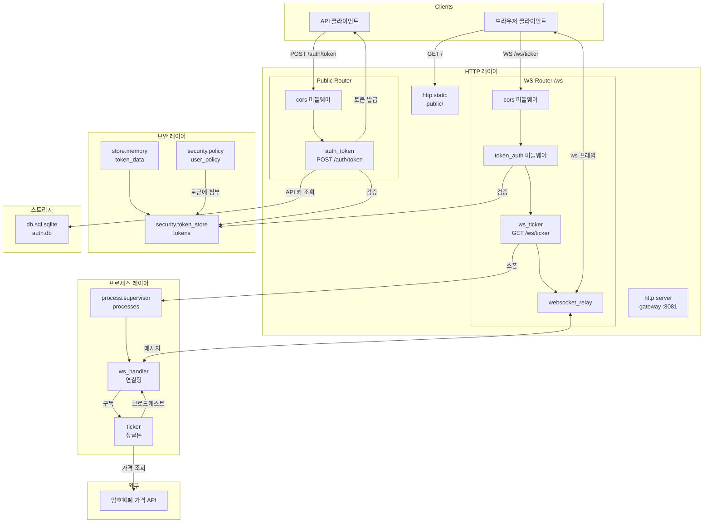

# 암호화폐 티커

API 키 인증과 WebSocket 스트리밍을 사용하여 실시간 암호화폐 티커를 구축합니다. 이 튜토리얼은 토큰 기반 보안, 미들웨어 설정, 프로세스 기반 WebSocket 처리를 보여줍니다.

## 아키텍처



## 보안 흐름

1. **API 키 교환**: 클라이언트가 API 키를 `/auth/token`에 POST. 핸들러가 데이터베이스와 비교하여 검증하고, `user_policy`를 가진 액터를 생성하고, HMAC 서명된 토큰을 발급합니다.

2. **토큰 인증**: WebSocket 연결은 Bearer 토큰을 검증하고 보안 컨텍스트(액터 + 정책)를 복원하는 `token_auth` 미들웨어를 통과합니다.

3. **프로세스 스폰**: WebSocket 엔드포인트가 핸들러 프로세스를 스폰합니다. 토큰에 `user_policy`가 포함되어 있어 스폰이 승인됩니다.

4. **메시지 라우팅**: `websocket_relay` 미들웨어가 WebSocket 프레임을 메시지로 핸들러 프로세스에 라우팅합니다.

## 설정

완전한 `_index.yaml`:

```yaml
version: "1.0"
namespace: app

entries:
  # API 키를 위한 데이터베이스
  - name: db
    kind: db.sql.sqlite
    file: "./data/auth.db"
    lifecycle:
      auto_start: true

  # 토큰 백업 저장소
  - name: token_data
    kind: store.memory
    lifecycle:
      auto_start: true

  # HMAC 서명이 있는 토큰 스토어
  - name: tokens
    kind: security.token_store
    store: app:token_data
    token_length: 32
    default_expiration: "1h"
    token_key: "demo-secret-key-change-in-production"

  # 인증된 사용자를 위한 보안 정책
  - name: user_policy
    kind: security.policy
    policy:
      actions: "*"
      resources: "*"
      effect: allow
    groups:
      - user

  # 프로세스 호스트
  - name: processes
    kind: process.host
    lifecycle:
      auto_start: true

  # 데이터베이스 마이그레이션
  - name: migrate
    kind: process.lua
    source: file://migrate.lua
    method: main
    modules: [sql, logger, crypto]

  - name: migrate-service
    kind: process.service
    process: app:migrate
    host: app:processes
    lifecycle:
      auto_start: true

  # 티커 브로드캐스터
  - name: ticker
    kind: process.lua
    source: file://ticker.lua
    method: main
    modules: [logger, time, json, crypto]

  - name: ticker-service
    kind: process.service
    process: app:ticker
    host: app:processes
    lifecycle:
      auto_start: true

  # WebSocket 핸들러 (연결당 스폰)
  - name: ws_handler
    kind: process.lua
    source: file://ws_handler.lua
    method: main
    modules: [logger, json]

  # HTTP 서버
  - name: gateway
    kind: http.service
    addr: ":8081"
    lifecycle:
      auto_start: true

  # 공개 라우터 (인증 없음)
  - name: public_router
    kind: http.router
    meta:
      server: app:gateway
    middleware:
      - cors
    options:
      cors.allow.origins: "*"

  # WebSocket 라우터 (인증 필요)
  - name: ws_router
    kind: http.router
    meta:
      server: app:gateway
    prefix: /ws
    middleware:
      - cors
      - token_auth
    options:
      cors.allow.origins: "*"
      token_auth.store: "app:tokens"
    post_middleware:
      - websocket_relay
    post_options:
      wsrelay.allowed.origins: "*"

  # 정적 파일
  - name: public_fs
    kind: fs.directory
    directory: ./public

  - name: static
    kind: http.static
    meta:
      server: app:gateway
    path: /
    fs: app:public_fs
    static_options:
      spa: true
      index: index.html

  # 인증 토큰 교환
  - name: auth_token
    kind: function.lua
    source: file://auth_token.lua
    method: handler
    modules: [http, sql, crypto, security, json]

  - name: auth_token.endpoint
    kind: http.endpoint
    meta:
      router: app:public_router
    method: POST
    path: /auth/token
    func: app:auth_token

  # WebSocket 티커 엔드포인트
  - name: ws_ticker
    kind: function.lua
    source: file://ws_ticker.lua
    method: handler
    modules: [http, json, security, logger]

  - name: ws_ticker.endpoint
    kind: http.endpoint
    meta:
      router: app:ws_router
    method: GET
    path: /ticker
    func: app:ws_ticker
```

프로덕션에서는 HMAC 키를 하드코딩하는 대신 환경 변수에서 읽기 위해 `token_key_env`를 사용하세요. [환경 시스템](system/env.md)을 참조하세요.

## 토큰 교환

`auth_token.lua` - API 키를 검증하고 HMAC 서명된 토큰을 발급합니다:

```lua
local http = require("http")
local sql = require("sql")
local security = require("security")

local function handler()
    local req = http.request()
    local res = http.response()

    local body, parse_err = req:body_json()
    if parse_err then
        res:set_status(http.STATUS.BAD_REQUEST)
        res:write_json({error = "invalid JSON"})
        return
    end

    local api_key = body.api_key
    if not api_key or #api_key == 0 then
        res:set_status(http.STATUS.BAD_REQUEST)
        res:write_json({error = "api_key required"})
        return
    end

    local db, db_err = sql.get("app:db")
    if db_err then
        res:set_status(http.STATUS.INTERNAL_ERROR)
        res:write_json({error = "database unavailable"})
        return
    end

    local rows, query_err = db:query(
        "SELECT user_id, role FROM api_keys WHERE api_key = ?",
        {api_key}
    )
    db:release()

    if query_err or #rows == 0 then
        res:set_status(http.STATUS.UNAUTHORIZED)
        res:write_json({error = "invalid API key"})
        return
    end

    local user = rows[1]

    -- 사용자 신원으로 액터 생성
    local actor = security.new_actor("user:" .. user.user_id, {
        role = user.role,
        user_id = user.user_id
    })

    -- user_policy를 스코프에 첨부
    local policy, _ = security.policy("app:user_policy")
    local scope = policy and security.new_scope({policy}) or security.new_scope()

    -- HMAC 서명된 토큰 발급
    local store, store_err = security.token_store("app:tokens")
    if store_err then
        res:set_status(http.STATUS.INTERNAL_ERROR)
        res:write_json({error = "token store unavailable"})
        return
    end

    local token, token_err = store:create(actor, scope, {
        expiration = "1h",
        meta = {ip = req:remote_addr()}
    })
    store:close()

    if token_err then
        res:set_status(http.STATUS.INTERNAL_ERROR)
        res:write_json({error = "token creation failed"})
        return
    end

    res:write_json({
        token = token,
        user_id = user.user_id,
        role = user.role,
        expires_in = 3600
    })
end

return { handler = handler }
```

## WebSocket 엔드포인트

`ws_ticker.lua` - 인증된 각 연결에 대해 핸들러 프로세스를 스폰합니다:

```lua
local http = require("http")
local json = require("json")
local security = require("security")
local logger = require("logger")

local function handler()
    local req = http.request()
    local res = http.response()

    if req:method() ~= http.METHOD.GET then
        res:set_status(http.STATUS.METHOD_NOT_ALLOWED)
        res:write_json({error = "method not allowed"})
        return
    end

    -- 액터는 token_auth 미들웨어에 의해 설정됨
    local actor = security.actor()
    if not actor then
        res:set_status(http.STATUS.UNAUTHORIZED)
        res:write_json({error = "authentication required"})
        return
    end

    local user_id = actor:id()

    -- 핸들러 프로세스 스폰 (토큰의 user_policy에 의해 승인됨)
    local pid, err = process.spawn("app:ws_handler", "app:processes", user_id)
    if err then
        logger:error("spawn failed", {error = tostring(err)})
        res:set_status(http.STATUS.INTERNAL_ERROR)
        res:write_json({error = "failed to create handler"})
        return
    end

    -- 메시지를 핸들러로 라우팅하도록 websocket_relay 설정
    res:set_header("X-WS-Relay", json.encode({
        target_pid = tostring(pid),
        metadata = {user_id = user_id, auth_time = os.time()}
    }))
end

return { handler = handler }
```

## 연결 핸들러

`websocket_relay` 미들웨어가 핸들러 프로세스에 라이프사이클 메시지를 자동으로 보냅니다:
- `ws.join` - 연결 설정됨, 응답 전송을 위한 `client_pid` 포함
- `ws.message` - 클라이언트가 메시지를 보냄
- `ws.leave` - 연결 종료됨 (연결 해제 시 자동으로 전송)

`ws_handler.lua` - 이러한 라이프사이클 메시지를 처리합니다:

```lua
local logger = require("logger")
local json = require("json")

local function main(user_id)
    local inbox = process.inbox()
    local client_pid = nil
    local subscribed = false

    logger:info("handler started", {user_id = user_id})

    while true do
        local msg, ok = inbox:receive()
        if not ok then break end

        local topic = msg:topic()
        local data = msg:payload():data()

        if topic == "ws.join" then
            client_pid = data.client_pid

            -- 크래시 모니터링을 위해 우리 PID로 구독
            process.send("ticker", "subscribe", {
                client_pid = client_pid,
                handler_pid = process.pid()
            })
            subscribed = true

            -- 환영 메시지 전송
            process.send(client_pid, "ws.send", {
                type = "text",
                data = json.encode({type = "welcome", user_id = user_id})
            })

            logger:info("client joined", {user_id = user_id, client_pid = client_pid})

        elseif topic == "ws.message" then
            local content = json.decode(data.data)
            if content and content.type == "ping" then
                process.send(client_pid, "ws.send", {
                    type = "text",
                    data = json.encode({type = "pong"})
                })
            end

        elseif topic == "ws.leave" then
            -- 연결 해제 시 릴레이가 자동으로 전송
            logger:info("client left", {user_id = user_id, reason = data.reason})
            if subscribed then
                process.send("ticker", "unsubscribe", {handler_pid = process.pid()})
            end
            break
        end
    end

    return 0
end

return { main = main }
```

## 브로드캐스팅

`ticker.lua` - 구독을 유지하고 가격 업데이트를 브로드캐스트합니다:

```lua
local logger = require("logger")
local time = require("time")
local json = require("json")
local crypto = require("crypto")

-- handler_pid -> client_pid 매핑
local subscriptions = {}

local prices = {
    ["BTC-USD"] = 42000.00,
    ["ETH-USD"] = 2500.00,
    ["SOL-USD"] = 95.00
}

local function broadcast(message)
    local data = json.encode(message)
    for _, client_pid in pairs(subscriptions) do
        process.send(client_pid, "ws.send", {type = "text", data = data})
    end
end

local function update_prices()
    for symbol, price in pairs(prices) do
        local bytes = crypto.random.bytes(2)
        local rand = (bytes:byte(1) * 256 + bytes:byte(2)) / 65535.0
        local factor = (rand - 0.5) * 0.002
        prices[symbol] = price * (1 + factor)
        prices[symbol] = tonumber(string.format("%.2f", prices[symbol]))
    end
end

local function get_updates()
    local updates = {}
    for symbol, price in pairs(prices) do
        table.insert(updates, {symbol = symbol, price = price, timestamp = os.time()})
    end
    return updates
end

local function main()
    local inbox = process.inbox()
    local events = process.events()

    local ticker, ticker_err = time.ticker("10ms")
    if ticker_err then
        logger:error("failed to create ticker", {error = tostring(ticker_err)})
        return 1
    end
    local tick_ch = ticker:response()

    process.registry.register("ticker")
    logger:info("ticker started", {pid = process.pid()})

    while true do
        local r = channel.select {
            inbox:case_receive(),
            events:case_receive(),
            tick_ch:case_receive()
        }

        if r.channel == tick_ch then
            update_prices()
            if next(subscriptions) then
                broadcast({type = "ticker", data = get_updates()})
            end

        elseif r.channel == events then
            local event = r.value
            if event.kind == process.event.EXIT then
                -- 핸들러가 종료됨, 구독 제거
                if subscriptions[event.from] then
                    logger:info("handler exited", {handler_pid = event.from})
                    subscriptions[event.from] = nil
                end
            end

        else
            local msg = r.value
            local topic = msg:topic()
            local data = msg:payload():data()

            if topic == "subscribe" then
                local handler_pid = data.handler_pid
                local client_pid = data.client_pid

                subscriptions[handler_pid] = client_pid
                process.monitor(handler_pid)

                logger:info("subscribed", {handler_pid = handler_pid, client_pid = client_pid})

                process.send(client_pid, "ws.send", {
                    type = "text",
                    data = json.encode({type = "ticker", data = get_updates()})
                })

            elseif topic == "unsubscribe" then
                subscriptions[data.handler_pid] = nil
                logger:info("unsubscribed", {handler_pid = data.handler_pid})
            end
        end
    end
end

return { main = main }
```

## 데이터베이스 마이그레이션

`migrate.lua` - API 키 테이블을 생성하고 데모 키를 생성합니다:

```lua
local sql = require("sql")
local logger = require("logger")
local crypto = require("crypto")

local function main()
    local db, err = sql.get("app:db")
    if err then
        logger:error("failed to connect", {error = tostring(err)})
        return 1
    end

    local _, exec_err = db:execute([[
        CREATE TABLE IF NOT EXISTS api_keys (
            id INTEGER PRIMARY KEY AUTOINCREMENT,
            api_key TEXT UNIQUE NOT NULL,
            user_id TEXT NOT NULL,
            role TEXT NOT NULL DEFAULT 'user',
            created_at INTEGER NOT NULL
        )
    ]])

    if exec_err then
        db:release()
        logger:error("migration failed", {error = tostring(exec_err)})
        return 1
    end

    -- 데모 키 존재 확인
    local rows, _ = db:query("SELECT api_key FROM api_keys WHERE user_id = ?", {"demo"})
    if #rows == 0 then
        local demo_key, key_err = crypto.random.string(32)
        if key_err then
            db:release()
            return 1
        end

        db:execute(
            "INSERT INTO api_keys (api_key, user_id, role, created_at) VALUES (?, ?, ?, ?)",
            {demo_key, "demo", "user", os.time()}
        )
        logger:info("demo API key created", {api_key = demo_key})
    else
        logger:info("demo API key exists", {api_key = rows[1].api_key})
    end

    db:release()
    return 0
end

return { main = main }
```

## 실행

```bash
wippy init
wippy run
```

http://localhost:8081을 열고 로그에 표시된 데모 API 키를 입력합니다.

## 핵심 사항

| 개념 | 구현 |
|---------|----------------|
| 토큰 서명 | HMAC 키가 있는 `security.token_store` |
| 토큰 검증 | 라우터의 `token_auth` 미들웨어 |
| 인가 | 토큰 스코프에 첨부된 `security.policy` |
| WebSocket 라이프사이클 | `websocket_relay`가 ws.join/ws.leave 자동 전송 |
| 핸들러 정리 | `process.monitor(handler_pid)`로 크래시 감지 |
| 구독 맵 | `subscriptions[handler_pid] = client_pid` |

## 참고

- [WebSocket Relay](http/websocket-relay.md) - 미들웨어 설정
- [보안 모듈](lua/security/security.md) - 액터, 정책, 토큰 스토어
- [프로세스 관리](lua/core/process.md) - 스폰 및 메시징
