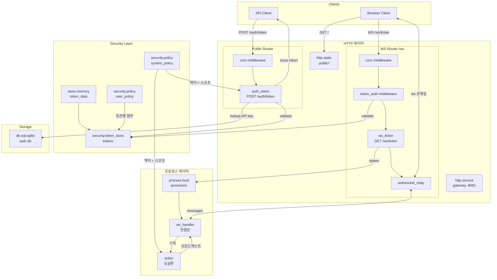

# 암호화폐 시세 표시기

API 키 인증과 WebSocket 전달을 사용하는 스트리밍 시세 데모를 만듭니다. 이 예제에서는 토큰 기반 보안, 미들웨어 구성, 프로세스 기반 연결 처리를 다룹니다.

**분류:** 실행 가능한 로컬 튜토리얼. 레지스트리, Lua 소스, 브라우저 클라이언트, 순서가 지정된 시작 명령, 브라우저 검증 절차를 포함합니다. 허용 범위가 넓은 정책과 메모리 토큰 저장소는 의도적으로 루프백 데모에만 한정됩니다.

## 개요

- **API 키 교환** — API 키를 제출하고 HMAC 서명된 베어러 토큰을 받습니다.
- **토큰 미들웨어** — 베어러 토큰을 검증하고 보안 컨텍스트를 복원합니다. 액터가 없는 요청은 엔드포인트가 거부합니다.
- **WebSocket 팬아웃** — 하나의 시세 프로세스에서 여러 연결 핸들러로 브로드캐스트합니다.
- **정적 자산** — `http.static`으로 브라우저 클라이언트를 제공합니다.
- **저장소** — API 키는 SQLite에, 토큰 데이터는 메모리에 보관합니다.

## 사전 요구 사항

- Wippy 런타임 `v0.3.32a`
- WebSocket을 지원하는 브라우저
- 빈 작업 디렉터리. 아래 파일을 추가하기 전에 프로젝트 디렉터리를 만듭니다.

  ```bash
  mkdir auth-ticker
  cd auth-ticker
  mkdir -p src/public data
  ```

  PowerShell에서는 다음 명령을 사용합니다.

  ```powershell
  New-Item -ItemType Directory -Path auth-ticker\src\public -Force
  New-Item -ItemType Directory -Path auth-ticker\data -Force
  Set-Location auth-ticker
  ```

## 프로젝트 구조

```
auth-ticker/
├── data/
├── wippy.lock
└── src/
    ├── _index.yaml
    ├── auth_token.lua
    ├── ws_ticker.lua
    ├── ws_handler.lua
    ├── ticker.lua
    ├── migrate.lua
    └── public/
        └── index.html
```

## 아키텍처


```mermaid
flowchart TB
    subgraph Clients
        Browser[Browser Client]
        API[API Client]
    end

    subgraph "HTTP 레이어"
        Server[http.service<br/>gateway :8081]
        Static[http.static<br/>public/]

        subgraph "Public Router"
            CORS1[cors middleware]
            AuthEndpoint[auth_token<br/>POST /auth/token]
        end

        subgraph "WS Router /ws"
            CORS2[cors middleware]
            TokenAuth[token_auth middleware]
            WSEndpoint[ws_ticker<br/>GET /ws/ticker]
            WSRelay[websocket_relay]
        end
    end

    subgraph "Security Layer"
        TokenStore[security.token_store<br/>tokens]
        Policy[security.policy<br/>user_policy]
        SysPolicy[security.policy<br/>system_policy]
        MemStore[store.memory<br/>token_data]
    end

    subgraph "Storage"
        DB[db.sql.sqlite<br/>auth.db]
    end

    subgraph "프로세스 레이어"
        Supervisor[process.host<br/>processes]
        WSHandler[ws_handler<br/>연결당]
        Ticker[ticker<br/>싱글톤]
    end

    %% 클라이언트 연결
    Browser -->|"GET /"| Static
    API -->|"POST /auth/token"| CORS1
    Browser -->|"WS /ws/ticker"| CORS2

    %% API flow
    CORS1 --> AuthEndpoint
    AuthEndpoint -->|validate| TokenStore
    AuthEndpoint -->|"issue token"| API

    %% WS flow
    CORS2 --> TokenAuth
    TokenAuth -->|validate| TokenStore
    TokenAuth --> WSEndpoint
    WSEndpoint -->|spawn| Supervisor
    Supervisor --> WSHandler
    WSEndpoint --> WSRelay
    WSRelay <-->|"messages"| WSHandler

    %% Token store deps
    MemStore --> TokenStore
    Policy -->|토큰에 첨부| TokenStore
    SysPolicy -->|"액터 + 스코프"| AuthEndpoint
    SysPolicy -->|"액터 + 스코프"| Ticker

    %% Auth uses DB for API keys
    AuthEndpoint -->|lookup API key| DB

    %% 프로세스 통신
    WSHandler -->|구독| Ticker
    Ticker -->|브로드캐스트| WSHandler
    WSRelay <-->|"ws 프레임"| Browser
```

## 보안 흐름

1. **API 키 교환:** 클라이언트가 `/auth/token`으로 API 키를 게시합니다. 핸들러가 데이터베이스에서 키를 검증하고 `user_policy`를 갖는 액터를 만든 뒤 HMAC 서명된 토큰을 발급합니다.

2. **토큰 인증:** WebSocket 연결은 베어러 토큰을 검증하고 액터 및 정책을 복원하는 `token_auth`를 통과합니다.

3. **프로세스 생성:** WebSocket 엔드포인트가 핸들러 프로세스를 생성합니다. 토큰의 `user_policy`가 이 생성을 허가합니다.

4. **메시지 라우팅:** `websocket_relay` 미들웨어가 WebSocket 프레임을 메시지 형태로 핸들러 프로세스에 라우팅합니다.

## 구성

`src/_index.yaml`을 만듭니다.

```yaml
version: "1.0"
namespace: app

entries:
  # Database for API keys
  - name: db
    kind: db.sql.sqlite
    file: "./data/auth.db"
    lifecycle:
      auto_start: true

  # Token backing store
  - name: token_data
    kind: store.memory
    lifecycle:
      auto_start: true

  # Token store with HMAC signing
  - name: tokens
    kind: security.token_store
    store: app:token_data
    token_length: 32
    default_expiration: "1h"
    token_key: "local-demo-signing-key-do-not-deploy"

  # Security policy for authenticated users
  - name: user_policy
    kind: security.policy
    policy:
      actions: "*"
      resources: "*"
      effect: allow
    groups:
      - user

  # 최종 사용자 액터 없이 실행되는 내부 코드를 위한 정책
  - name: system_policy
    kind: security.policy
    policy:
      actions:
        - db.get
        - security.actor.create
        - security.policy.get
        - security.scope.create
        - security.token_store.get
        - security.token.create
        - process.registry.register
        - process.send
        - process.monitor
      resources: "*"
      effect: allow

  # 프로세스 호스트
  - name: processes
    kind: process.host
    lifecycle:
      auto_start: true

  # Terminal host used by `wippy run -x app:migrate`
  - name: terminal
    kind: terminal.host
    lifecycle:
      auto_start: true

  # Database migration
  - name: migrate
    kind: process.lua
    source: file://migrate.lua
    method: main
    modules: [sql, logger, crypto]
    security:
      actor:
        id: "service:migrate"
      policies:
        - app:system_policy

  # Ticker broadcaster
  - name: ticker
    kind: process.lua
    source: file://ticker.lua
    method: main
    modules: [logger, time, crypto]
    security:
      actor:
        id: "service:ticker"
      policies:
        - app:system_policy

  - name: ticker-service
    kind: process.service
    process: app:ticker
    host: app:processes
    lifecycle:
      auto_start: true

  # WebSocket handler (spawned per connection)
  - name: ws_handler
    kind: process.lua
    source: file://ws_handler.lua
    method: main
    modules: [logger, json]

  # HTTP server
  - name: gateway
    kind: http.service
    addr: "127.0.0.1:8081"
    lifecycle:
      auto_start: true
      requires:
        - app:ticker-service

  # Public router (no auth)
  - name: public_router
    kind: http.router
    meta:
      server: app:gateway
    middleware:
      - cors
    options:
      cors.allow.origins: "http://127.0.0.1:8081"

  # WebSocket router (with auth)
  - name: ws_router
    kind: http.router
    meta:
      server: app:gateway
    prefix: /ws
    middleware:
      - cors
      - token_auth
    options:
      cors.allow.origins: "http://127.0.0.1:8081"
      token_auth.store: "app:tokens"
    post_middleware:
      - websocket_relay
    post_options:
      wsrelay.allowed.origins: "http://127.0.0.1:8081"

  # Static files
  - name: public_fs
    kind: fs.directory
    directory: ./src/public

  - name: static
    kind: http.static
    meta:
      server: app:gateway
    path: /
    fs: app:public_fs
    static_options:
      spa: true
      index: index.html

  # Auth token exchange
  - name: auth_token
    kind: function.lua
    source: file://auth_token.lua
    method: handler
    modules: [http, sql, crypto, security, json]
    security:
      actor:
        id: "service:auth"
      policies:
        - app:system_policy

  - name: auth_token.endpoint
    kind: http.endpoint
    meta:
      router: app:public_router
    method: POST
    path: /auth/token
    func: app:auth_token

  # WebSocket ticker endpoint
  - name: ws_ticker
    kind: function.lua
    source: file://ws_ticker.lua
    method: handler
    modules: [http, json, security, logger]

  - name: ws_ticker.endpoint
    kind: http.endpoint
    meta:
      router: app:ws_router
    method: GET
    path: /ticker
    func: app:ws_ticker
```

`user_policy`는 발급된 모든 토큰 안에 실려 다니며 인증된 연결이 수행하는 작업을 다룹니다. `system_policy`는 토큰이 존재하기 전에 실행되는 코드, 즉 마이그레이션, 티커, 토큰 교환 자체를 다룹니다. 액터와 스코프 없이 이루어진 게이트된 호출은 거부되기 때문입니다.

프로덕션에서는 HMAC 키를 하드코딩하는 대신 플레이스홀더(`token_key: ${env:TOKEN_KEY}`)로 환경 변수에서 읽으세요. [환경 시스템](system/env.md)을 참조하세요.

## 토큰 교환

`auth_token.lua`는 API 키를 검증하고 HMAC 서명된 토큰을 발급합니다.

```lua
local http = require("http")
local sql = require("sql")
local security = require("security")

local function handler()
    local req = http.request()
    local res = http.response()

    local body, parse_err = req:body_json()
    if parse_err then
        res:set_status(http.STATUS.BAD_REQUEST)
        res:write_json({error = "invalid JSON"})
        return
    end

    local api_key = body.api_key
    if not api_key or #api_key == 0 then
        res:set_status(http.STATUS.BAD_REQUEST)
        res:write_json({error = "api_key required"})
        return
    end

    local db, db_err = sql.get("app:db")
    if db_err then
        res:set_status(http.STATUS.INTERNAL_ERROR)
        res:write_json({error = "database unavailable"})
        return
    end

    local rows, query_err = db:query(
        "SELECT user_id, role FROM api_keys WHERE api_key = ?",
        {api_key}
    )
    db:release()

    if query_err then
        res:set_status(http.STATUS.INTERNAL_ERROR)
        res:write_json({error = "lookup failed"})
        return
    end
    if #rows == 0 then
        res:set_status(http.STATUS.UNAUTHORIZED)
        res:write_json({error = "invalid API key"})
        return
    end

    local user = rows[1]

    -- Create actor with user identity
    local actor = security.new_actor("user:" .. user.user_id, {
        role = user.role,
        user_id = user.user_id
    })

    -- Attach user_policy to the scope
    local policy, _ = security.policy("app:user_policy")
    local scope = policy and security.new_scope({policy}) or security.new_scope()

    -- Issue HMAC-signed token
    local store, store_err = security.token_store("app:tokens")
    if store_err then
        res:set_status(http.STATUS.INTERNAL_ERROR)
        res:write_json({error = "token store unavailable"})
        return
    end

    local token, token_err = store:create(actor, scope, {
        expiration = "1h",
        meta = {ip = req:remote_addr()}
    })
    store:close()

    if token_err then
        res:set_status(http.STATUS.INTERNAL_ERROR)
        res:write_json({error = "token creation failed"})
        return
    end

    res:write_json({
        token = token,
        user_id = user.user_id,
        role = user.role,
        expires_in = 3600
    })
end

return { handler = handler }
```

## WebSocket 엔드포인트

`ws_ticker.lua`는 인증된 연결마다 핸들러 프로세스를 생성합니다.

```lua
local http = require("http")
local json = require("json")
local security = require("security")
local logger = require("logger")

local function handler()
    local req = http.request()
    local res = http.response()

    if req:method() ~= http.METHOD.GET then
        res:set_status(http.STATUS.METHOD_NOT_ALLOWED)
        res:write_json({error = "method not allowed"})
        return
    end

    -- Actor is set by token_auth middleware
    local actor = security.actor()
    if not actor then
        res:set_status(http.STATUS.UNAUTHORIZED)
        res:write_json({error = "authentication required"})
        return
    end

    local user_id = actor:id()

    -- Spawn handler process (authorized by user_policy in token)
    local pid, err = process.spawn("app:ws_handler", "app:processes", user_id)
    if err then
        logger:error("spawn failed", {error = tostring(err)})
        res:set_status(http.STATUS.INTERNAL_ERROR)
        res:write_json({error = "failed to create handler"})
        return
    end

    -- Configure websocket_relay to route messages to handler
    res:set_header("X-WS-Relay", json.encode({
        target_pid = tostring(pid),
        metadata = {user_id = user_id, auth_time = os.time()}
    }))
end

return { handler = handler }
```

## 연결 핸들러

`websocket_relay` 미들웨어가 핸들러 프로세스에 라이프사이클 메시지를 자동으로 보냅니다:
- `ws.join` - 연결 설정됨, 응답 전송을 위한 `client_pid` 포함
- `ws.message` - 클라이언트가 메시지를 보냄. 페이로드는 원시 프레임입니다(텍스트 프레임의 경우 문자열)
- `ws.leave` - 연결 종료됨 (연결 해제 시 자동으로 전송)

반대 방향으로, 클라이언트 PID로 보낸 메시지는 `{topic, data}` 형태의 단일 JSON 텍스트 프레임으로 브라우저에 도달합니다. 토픽은 직접 정하며 페이로드는 `data`로 도착합니다.

`ws_handler.lua` - 이러한 라이프사이클 메시지를 처리합니다:

```lua
local logger = require("logger")
local json = require("json")

local function main(user_id)
    local inbox = process.inbox()
    local client_pid = nil
    local subscribed = false

    logger:info("handler started", {user_id = user_id})

    while true do
        local msg, ok = inbox:receive()
        if not ok then break end

        local topic = msg:topic()
        local data = msg:payload():data()

        if topic == "ws.join" then
            client_pid = data.client_pid

            -- Subscribe with our PID for crash monitoring
            local _, subscribe_err = process.send("ticker", "subscribe", {
                client_pid = client_pid,
                handler_pid = process.pid()
            })
            if subscribe_err then
                error("failed to subscribe to ticker: " .. tostring(subscribe_err))
            end
            subscribed = true

            -- 환영 메시지 전송
            process.send(client_pid, "welcome", {user_id = user_id})

            logger:info("client joined", {user_id = user_id, client_pid = client_pid})

        elseif topic == "ws.message" then
            local content = json.decode(data)
            if content and content.type == "ping" then
                process.send(client_pid, "pong", {})
            end

        elseif topic == "ws.leave" then
            -- 연결 해제 시 릴레이가 자동으로 전송
            logger:info("client left", {user_id = user_id, client_pid = data.client_pid})
            if subscribed then
                process.send("ticker", "unsubscribe", {handler_pid = process.pid()})
            end
            break
        end
    end

    return 0
end

return { main = main }
```

## 브로드캐스트

`ticker.lua`는 구독을 유지하고 로컬에서 시뮬레이션한 가격 업데이트를 브로드캐스트합니다. 이 튜토리얼은 외부 시장 데이터 서비스를 호출하지 않습니다.

```lua
local logger = require("logger")
local time = require("time")
local crypto = require("crypto")

-- handler_pid -> client_pid mapping
local subscriptions = {}

local prices = {
    ["BTC-USD"] = 42000.00,
    ["ETH-USD"] = 2500.00,
    ["SOL-USD"] = 95.00
}

local function broadcast(updates)
    for _, client_pid in pairs(subscriptions) do
        process.send(client_pid, "ticker", updates)
    end
end

local function update_prices()
    for symbol, price in pairs(prices) do
        local bytes, random_err = crypto.random.bytes(2)
        if random_err then
            error("failed to generate price movement: " .. tostring(random_err))
        end
        local rand = (bytes:byte(1) * 256 + bytes:byte(2)) / 65535.0
        local factor = (rand - 0.5) * 0.002
        prices[symbol] = price * (1 + factor)
        prices[symbol] = tonumber(string.format("%.2f", prices[symbol]))
    end
end

local function get_updates()
    local updates = {}
    for symbol, price in pairs(prices) do
        table.insert(updates, {symbol = symbol, price = price, timestamp = os.time()})
    end
    return updates
end

local function main()
    local inbox = process.inbox()
    local events = process.events()

    local ticker, ticker_err = time.ticker("1s")
    if ticker_err then
        logger:error("failed to create ticker", {error = tostring(ticker_err)})
        error("failed to create ticker: " .. tostring(ticker_err))
    end
    local tick_ch = ticker:response()

    local _, register_err = process.registry.register("ticker")
    if register_err then
        error("failed to register ticker: " .. tostring(register_err))
    end
    logger:info("ticker started", {pid = process.pid()})

    while true do
        local r = channel.select {
            inbox:case_receive(),
            events:case_receive(),
            tick_ch:case_receive()
        }

        if r.channel == tick_ch then
            update_prices()
            if next(subscriptions) then
                broadcast(get_updates())
            end

        elseif r.channel == events then
            local event = r.value
            if event.kind == process.event.CANCEL then
                ticker:stop()
                logger:info("ticker stopping")
                return 0
            elseif event.kind == process.event.EXIT then
                -- 핸들러가 종료됨, 구독 제거
                if subscriptions[event.from] then
                    logger:info("handler exited", {handler_pid = event.from})
                    subscriptions[event.from] = nil
                end
            end

        else
            local msg = r.value
            local topic = msg:topic()
            local data = msg:payload():data()

            if topic == "subscribe" then
                local handler_pid = data.handler_pid
                local client_pid = data.client_pid

                subscriptions[handler_pid] = client_pid
                process.monitor(handler_pid)

                logger:info("subscribed", {handler_pid = handler_pid, client_pid = client_pid})

                process.send(client_pid, "ticker", get_updates())

            elseif topic == "unsubscribe" then
                subscriptions[data.handler_pid] = nil
                logger:info("unsubscribed", {handler_pid = data.handler_pid})
            end
        end
    end
end

return { main = main }
```

## 데이터베이스 마이그레이션

`migrate.lua`는 API 키 테이블을 만들고 데모 키를 생성합니다.

```lua
local sql = require("sql")
local logger = require("logger")
local crypto = require("crypto")

local function main()
    local db, err = sql.get("app:db")
    if err then
        logger:error("failed to connect", {error = tostring(err)})
        error("failed to connect: " .. tostring(err))
    end

    local _, exec_err = db:execute([[
        CREATE TABLE IF NOT EXISTS api_keys (
            id INTEGER PRIMARY KEY AUTOINCREMENT,
            api_key TEXT UNIQUE NOT NULL,
            user_id TEXT NOT NULL,
            role TEXT NOT NULL DEFAULT 'user',
            created_at INTEGER NOT NULL
        )
    ]])

    if exec_err then
        db:release()
        logger:error("migration failed", {error = tostring(exec_err)})
        error("migration failed: " .. tostring(exec_err))
    end

    -- Create one random local-demo key. It is printed only on first creation.
    local rows, query_err = db:query(
        "SELECT api_key FROM api_keys WHERE user_id = ?",
        {"demo"}
    )
    if query_err then
        db:release()
        error("failed to query demo API key: " .. tostring(query_err))
    end

    if #rows == 0 then
        local demo_key, key_err = crypto.random.string(32)
        if key_err then
            db:release()
            error("failed to generate demo API key: " .. tostring(key_err))
        end

        local _, insert_err = db:execute(
            "INSERT INTO api_keys (api_key, user_id, role, created_at) VALUES (?, ?, ?, ?)",
            {demo_key, "demo", "user", os.time()}
        )
        if insert_err then
            db:release()
            error("failed to store demo API key: " .. tostring(insert_err))
        end
        logger:info("demo API key created", {api_key = demo_key})
    else
        logger:info("demo API key already exists; use the value saved from its first creation")
    end

    db:release()
    return 0
end

return { main = main }
```

## 브라우저 클라이언트

`public/index.html` - API 키를 토큰으로 교환한 다음 가격을 스트리밍합니다. 브라우저는 WebSocket 핸드셰이크에 헤더를 설정할 수 없으므로, 토큰은 `token_auth`도 함께 읽는 `x-auth-token` 쿼리 파라미터로 전달됩니다:

```html
<!doctype html>
<html>
<head>
  <meta charset="utf-8">
  <title>Crypto Ticker</title>
  <style>
    body { font-family: system-ui, sans-serif; max-width: 40rem; margin: 3rem auto; }
    table { border-collapse: collapse; width: 100%; margin-top: 1rem; }
    th, td { text-align: left; padding: .4rem .6rem; border-bottom: 1px solid #ddd; }
    #status { color: #666; }
  </style>
</head>
<body>
  <h1>Crypto Ticker</h1>
  <input id="key" placeholder="demo API key" size="40">
  <button id="connect">Connect</button>
  <p id="status">disconnected</p>
  <table><thead><tr><th>Symbol</th><th>Price</th></tr></thead><tbody id="rows"></tbody></table>

  <script>
    const status = document.getElementById("status");
    const rows = document.getElementById("rows");

    document.getElementById("connect").onclick = async () => {
      const res = await fetch("/auth/token", {
        method: "POST",
        headers: {"Content-Type": "application/json"},
        body: JSON.stringify({api_key: document.getElementById("key").value})
      });
      if (!res.ok) { status.textContent = "auth failed"; return; }
      const {token} = await res.json();

      const url = `ws://${location.host}/ws/ticker?x-auth-token=${encodeURIComponent(token)}`;
      const ws = new WebSocket(url);

      ws.onopen = () => {
        status.textContent = "connected";
        ws.send(JSON.stringify({type: "ping"}));
      };
      ws.onclose = () => { status.textContent = "disconnected"; };

      ws.onmessage = (evt) => {
        const msg = JSON.parse(evt.data);
        if (msg.topic !== "ticker") return;
        rows.innerHTML = "";
        for (const quote of msg.data) {
          rows.insertAdjacentHTML("beforeend",
            `<tr><td>${quote.symbol}</td><td>${quote.price.toFixed(2)}</td></tr>`);
        }
      };
    };
  </script>
</body>
</html>
```

## 실행

잠금 파일을 초기화하고 마이그레이션을 끝까지 실행한 다음 장기 실행 서비스를 시작합니다. 마이그레이션을 별도 명령으로 실행하면 토큰 엔드포인트와 테이블 생성 사이의 경쟁을 방지할 수 있습니다.

```bash
mkdir -p data
wippy init
wippy run -x app:migrate
wippy run
```

`http://127.0.0.1:8081`을 열고 마이그레이션 로그의 데모 API 키를 입력합니다. 페이지에 `Connected as demo`가 표시된 뒤 BTC, ETH, SOL 가격이 1초마다 업데이트되어야 합니다.

브라우저를 열기 전에 교환을 확인할 수도 있습니다.

```bash
curl -X POST http://127.0.0.1:8081/auth/token \
  -H "Content-Type: application/json" \
  -d '{"api_key":"<demo-key-from-migration>"}'
```

PowerShell에서는 다음 명령을 사용합니다.

```powershell
Invoke-RestMethod -Method Post `
  -Uri http://127.0.0.1:8081/auth/token `
  -ContentType 'application/json' `
  -Body '{"api_key":"<demo-key-from-migration>"}'
```

성공한 응답에는 `token`, `user_id: "demo"`, `role: "user"`, `expires_in: 3600`이 포함됩니다. 유효하지 않은 키는 HTTP 401을 반환합니다.

## 문제 해결과 정리

- `no such table: api_keys`는 마이그레이션 명령을 건너뛰었거나 실패했다는 뜻입니다. 런타임을 중지하고 `wippy run -x app:migrate`를 다시 실행한 뒤 런타임을 다시 시작하세요.
- `/auth/token`의 401은 API 키가 `data/auth.db`의 행과 일치하지 않는다는 뜻입니다. 한 번만 로그에 표시되는 값을 잃었다면 데이터베이스를 초기화하세요.
- WebSocket의 401 또는 즉시 닫힘은 대개 쿼리 매개변수가 제거되었거나 런타임 재시작으로 메모리 토큰 저장소가 초기화되었다는 뜻입니다. 재시작할 때마다 API 키를 다시 교환하세요.
- 출처 거부는 브라우저 URL이 `http://127.0.0.1:8081`과 정확히 일치하지 않는다는 뜻입니다. 해당 URL을 사용하거나 두 출처 옵션을 함께 변경하세요.
- Ctrl+C로 런타임을 중지합니다. 데모 API 키를 제거하려면 `data/auth.db`를 삭제하세요.

## 다음 단계

- [WebSocket 릴레이](http/websocket-relay.md) — 미들웨어 구성
- [보안 모듈](lua/security/security.md) — 액터, 정책, 토큰 저장소
- [프로세스 관리](lua/core/process.md) — 프로세스 생성과 메시징
