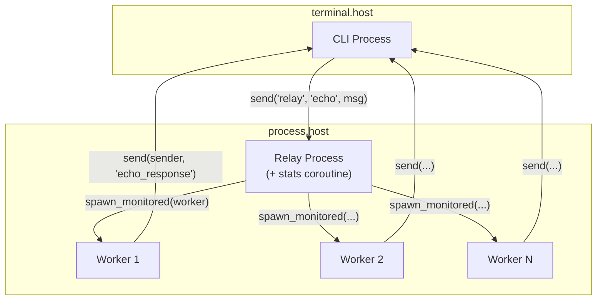

# 에코 서비스

프로세스, 채널, 코루틴, 메시지 전달, 슈퍼비전을 보여주는 분산 에코 서비스를 빌드합니다.

## 개요

이 튜토리얼은 릴레이 서비스에 메시지를 보내는 CLI 클라이언트를 만들고, 릴레이 서비스는 각 메시지를 처리하기 위해 워커를 스폰합니다. 다음을 보여줍니다:

- **프로세스 스폰** - 동적으로 자식 프로세스 생성
- **메시지 전달** - send/receive를 통한 프로세스 간 통신
- **채널과 select** - 여러 이벤트 소스 멀티플렉싱
- **코루틴** - 프로세스 내 동시 실행
- **프로세스 등록** - 이름으로 프로세스 찾기
- **모니터링** - 자식 프로세스 라이프사이클 추적

## 아키텍처



## 프로젝트 구조

```
echo-service/
├── wippy.lock
└── src/
    ├── _index.yaml
    ├── cli.lua
    ├── relay.lua
    └── worker.lua
```

## 엔트리 정의

`src/_index.yaml` 생성:

```yaml
version: "1.0"
namespace: app

entries:
  - name: terminal
    kind: terminal.host
    lifecycle:
      auto_start: true

  - name: processes
    kind: process.host
    lifecycle:
      auto_start: true

  - name: cli
    kind: process.lua
    source: file://cli.lua
    method: main
    modules:
      - io
      - process
      - time
      - channel

  - name: relay
    kind: process.lua
    source: file://relay.lua
    method: main
    modules:
      - process
      - logger
      - channel
      - time

  - name: relay-service
    kind: process.service
    process: app:relay
    host: app:processes
    lifecycle:
      auto_start: true

  - name: worker
    kind: process.lua
    source: file://worker.lua
    method: main
    modules:
      - process
      - time
```

## 릴레이 프로세스

릴레이는 자신을 등록하고, 메시지를 처리하고, 워커를 스폰하고, 통계 코루틴을 실행합니다.

`src/relay.lua` 생성:

```lua
local logger = require("logger")
local time = require("time")

local stats = {
    messages = 0,
    workers_spawned = 0
}

local function stats_reporter()
    while true do
        time.sleep("5s")
        logger:info("stats", {
            messages = stats.messages,
            workers_spawned = stats.workers_spawned
        })
    end
end

local function main()
    local inbox = process.inbox()
    local events = process.events()

    process.registry.register("relay")
    logger:info("relay started", {pid = process.pid()})

    coroutine.spawn(stats_reporter)

    while true do
        local r = channel.select {
            inbox:case_receive(),
            events:case_receive()
        }

        if r.channel == events then
            local event = r.value
            if event.kind == process.event.EXIT then
                logger:info("worker exited", {
                    from = event.from,
                    result = event.result
                })
            end
        else
            local msg = r.value
            if msg:topic() == "echo" then
                local echo = msg:payload():data()
                stats.messages = stats.messages + 1

                local worker_pid, err = process.spawn_monitored(
                    "app:worker",
                    "app:processes",
                    echo.sender,
                    echo.data
                )

                if err then
                    logger:error("spawn failed", {error = err})
                else
                    stats.workers_spawned = stats.workers_spawned + 1
                end
            end
        end
    end
end

return { main = main }
```

### 핵심 패턴 {id="relay-key-patterns"}

**코루틴 스폰**

```lua
coroutine.spawn(stats_reporter)
```

메인 함수와 메모리를 공유하는 동시 코루틴을 생성합니다. 코루틴은 `time.sleep` 같은 I/O 작업에서 양보합니다.

**채널 Select**

```lua
local r = channel.select {
    inbox:case_receive(),
    events:case_receive()
}
```

여러 채널에서 대기합니다. `r.channel`은 어떤 것이 발생했는지 식별하고, `r.value`는 데이터를 포함합니다.

**페이로드 추출**

```lua
local echo = msg:payload():data()
```

메시지는 토픽 문자열용 `msg:topic()`과 페이로드용 `msg:payload():data()`를 가집니다.

**모니터링과 함께 스폰**

```lua
local worker_pid, err = process.spawn_monitored("app:worker", "app:processes", ...)
```

스폰과 모니터를 결합합니다. 워커가 종료되면 EXIT 이벤트를 받습니다.

## 워커 프로세스

워커는 인자를 직접 받고 발신자에게 응답을 보냅니다.

`src/worker.lua` 생성:

```lua
local time = require("time")

local function main(sender_pid, data)
    time.sleep("100ms")

    local response = {
        data = string.upper(data),
        worker = process.pid()
    }

    process.send(sender_pid, "echo_response", response)

    return 0
end

return { main = main }
```

## CLI 프로세스

CLI는 등록된 이름으로 메시지를 보내고 타임아웃과 함께 응답을 기다립니다.

`src/cli.lua` 생성:

```lua
local io = require("io")
local time = require("time")

local reset = "\027[0m"
local function dim(s) return "\027[2m" .. s .. reset end
local function green(s) return "\027[32m" .. s .. reset end
local function yellow(s) return "\027[33m" .. s .. reset end
local function cyan(s) return "\027[36m" .. s .. reset end

local function main()
    local inbox = process.inbox()

    -- 릴레이가 등록될 때까지 대기
    time.sleep("200ms")

    io.print(cyan("Echo Client"))
    io.print(dim("Type messages to echo. Ctrl+C to exit.\n"))

    while true do
        io.write(yellow("> "))
        local input = io.readline()

        if not input or #input == 0 then
            break
        end

        local msg = {
            sender = process.pid(),
            data = input
        }
        local ok, err = process.send("relay", "echo", msg)
        if err then
            io.print(dim("  error: relay not available"))
        else
            local timeout = time.after("2s")
            local r = channel.select {
                inbox:case_receive(),
                timeout:case_receive()
            }

            if r.channel == timeout then
                io.print(dim("  timeout"))
            else
                local msg = r.value
                if msg:topic() == "echo_response" then
                    local resp = msg:payload():data()
                    io.print(green("  " .. resp.data))
                    io.print(dim("  from worker: " .. resp.worker))
                end
            end
        end
    end

    io.print("\nGoodbye!")
    return 0
end

return { main = main }
```

### 핵심 패턴 {id="cli-key-patterns"}

**이름으로 전송**

```lua
process.send("relay", "echo", msg)
```

`process.send`는 등록된 이름을 직접 받습니다. 찾지 못하면 에러를 반환합니다.

**타임아웃 패턴**

```lua
local timeout = time.after("2s")
local r = channel.select {
    inbox:case_receive(),
    timeout:case_receive()
}
if r.channel == timeout then
    -- 타임아웃
end
```

## 실행

```bash
wippy init
wippy run -x app:terminal/app:cli
```

예제 출력:

```
Echo Client
Type messages to echo. Ctrl+C to exit.

> hello world
  HELLO WORLD
  from worker: {app:processes|0x00004}
```

## 개념 요약

| 개념 | API |
|---------|-----|
| 프로세스 스폰 | `process.spawn_monitored(entry, host, ...)` |
| 메시지 전달 | `process.send(dest, topic, data)` |
| 인박스 | `process.inbox()` |
| 이벤트 | `process.events()` |
| 등록 | `process.registry.register(name)` |
| 채널 select | `channel.select {...}` |
| 타임아웃 | `time.after(duration)` |
| 코루틴 | `coroutine.spawn(fn)` |

## 다음 단계

- [프로세스 관리](lua/core/process.md)
- [채널](lua/core/channel.md)
- [시간과 기간](lua/core/time.md)
