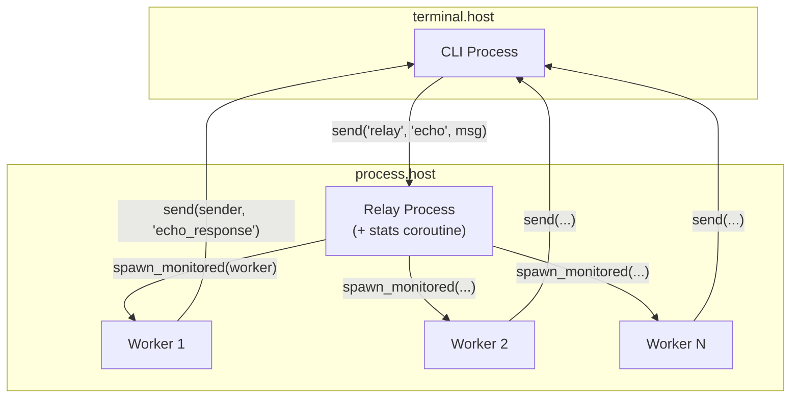

# 에코 서비스

여러 Wippy 프로세스, 채널, 코루틴, 메시지 전달, 프로세스 모니터링을 사용하는 CLI 에코 서비스를 만듭니다.

**분류:** 실행 가능한 튜토리얼. 로컬 단일 노드 CLI 애플리케이션을 위한 완전한 레지스트리와 Lua 소스, 시작 및 검증 단계를 제공합니다.

## 개요

이 튜토리얼에서는 릴레이 서비스로 메시지를 보내는 CLI 클라이언트를 만듭니다. 릴레이는 각 메시지를 처리할 워커를 생성합니다. 다음 내용을 보여 줍니다.

- **프로세스 생성** — 자식 프로세스를 동적으로 만듭니다.
- **메시지 전달** — 보내기와 받기 연산으로 프로세스 간에 통신합니다.
- **채널과 select** — 여러 이벤트 소스를 기다립니다.
- **코루틴** — 한 프로세스 안에서 동시 작업을 실행합니다.
- **프로세스 등록** — 이름으로 프로세스를 찾습니다.
- **모니터링** — 자식 프로세스의 수명 주기를 추적합니다.

## 사전 요구 사항

- `wippy` 명령으로 사용할 수 있는 Wippy 런타임 `v0.3.32a`. `wippy version --short`로 확인하세요.
- 대화형 터미널
- 빈 작업 디렉터리. 아래 파일을 추가하기 전에 프로젝트와 소스 디렉터리를 만듭니다.

  ```bash
  mkdir echo-service
  cd echo-service
  mkdir src
  ```

## 아키텍처


```mermaid
flowchart TB
    subgraph terminal["terminal.host"]
        CLI["CLI Process"]
    end

    subgraph processes["process.host"]
        Relay["Relay Process<br/>(+ stats coroutine)"]
        W1["Worker 1"]
        W2["Worker 2"]
        W3["Worker N"]
    end

    CLI -->|"send('relay', 'echo', msg)"| Relay
    Relay -->|"spawn_monitored(worker)"| W1
    Relay -->|"spawn_monitored(...)"| W2
    Relay -->|"spawn_monitored(...)"| W3
    W1 -->|"send(sender, 'echo_response')"| CLI
    W2 -->|"send(...)"| CLI
    W3 -->|"send(...)"| CLI
```

## 프로젝트 구조

```
echo-service/
├── wippy.lock
└── src/
    ├── _index.yaml
    ├── cli.lua
    ├── relay.lua
    └── worker.lua
```

## 엔트리 정의

`src/_index.yaml`을 만듭니다.

```yaml
version: "1.0"
namespace: app

entries:
  # Capabilities used by the CLI, relay, and workers in strict mode
  - name: process-policy
    kind: security.policy
    policy:
      actions:
        - process.host
        - process.registry.register
        - process.send
        - process.spawn
        - process.spawn.monitored
      resources: "*"
      effect: allow

  - name: terminal
    kind: terminal.host
    lifecycle:
      auto_start: true

  - name: processes
    kind: process.host
    lifecycle:
      auto_start: true

  - name: cli
    kind: process.lua
    source: file://cli.lua
    method: main
    modules:
      - io
      - time
    security:
      actor:
        id: app:cli
      policies:
        - app:process-policy

  - name: relay
    kind: process.lua
    source: file://relay.lua
    method: main
    modules:
      - logger
      - time
    security:
      actor:
        id: app:relay
      policies:
        - app:process-policy

  - name: relay-service
    kind: process.service
    process: app:relay
    host: app:processes
    lifecycle:
      auto_start: true

  - name: worker
    kind: process.lua
    source: file://worker.lua
    method: main
    modules:
      - time
    security:
      actor:
        id: app:worker
      policies:
        - app:process-policy
```

## 릴레이 프로세스

릴레이는 자신을 등록하고, 메시지를 처리하고, 워커를 생성하고, 통계 코루틴을 실행합니다.

`src/relay.lua`를 만듭니다.

```lua
local logger = require("logger")
local time = require("time")

local stats = {
    messages = 0,
    workers_spawned = 0
}

local function stats_reporter()
    while true do
        time.sleep("5s")
        logger:info("stats", {
            messages = stats.messages,
            workers_spawned = stats.workers_spawned
        })
    end
end

local function main()
    local inbox = process.inbox()
    local events = process.events()

    local _, register_err = process.registry.register("relay")
    if register_err then
        error("cannot register relay: " .. tostring(register_err))
    end
    logger:info("relay started", {pid = process.pid()})

    coroutine.spawn(stats_reporter)

    while true do
        local r = channel.select {
            inbox:case_receive(),
            events:case_receive()
        }

        if r.channel == events then
            local event = r.value
            if event.kind == process.event.EXIT then
                logger:info("worker exited", {
                    from = event.from,
                    result = event.result
                })
            end
        else
            local msg = r.value
            if msg:topic() == "echo" then
                local echo = msg:payload():data()
                stats.messages = stats.messages + 1

                local worker_pid, err = process.spawn_monitored(
                    "app:worker",
                    "app:processes",
                    echo.sender,
                    echo.data
                )

                if err then
                    logger:error("spawn failed", {error = tostring(err)})
                else
                    stats.workers_spawned = stats.workers_spawned + 1
                end
            end
        end
    end
end

return { main = main }
```

### 핵심 패턴 {id="relay-key-patterns"}

**코루틴 생성**

```lua
coroutine.spawn(stats_reporter)
```

주 함수와 메모리를 공유하는 코루틴을 시작합니다. 코루틴은 `time.sleep` 같은 I/O 연산에서 양보합니다.

**채널 선택**

```lua
local r = channel.select {
    inbox:case_receive(),
    events:case_receive()
}
```

여러 채널을 기다립니다. `r.channel`은 선택된 채널을 식별하고 `r.value`는 해당 데이터를 담습니다.

**페이로드 추출**

```lua
local echo = msg:payload():data()
```

메시지의 주제 문자열은 `msg:topic()`으로, 페이로드는 `msg:payload():data()`로 가져옵니다.

**모니터링과 함께 생성**

```lua
local worker_pid, err = process.spawn_monitored("app:worker", "app:processes", ...)
```

워커를 생성하고 모니터링을 시작합니다. 워커가 종료되면 릴레이가 `EXIT` 이벤트를 받습니다.

## 워커 프로세스

워커는 인수를 직접 받고 송신자에게 응답을 보냅니다.

`src/worker.lua`를 만듭니다.

```lua
local function main(sender_pid, data)
    local response = {
        data = string.upper(data),
        worker = process.pid()
    }

    local _, send_err = process.send(sender_pid, "echo_response", response)
    if send_err then
        error("cannot send echo response: " .. tostring(send_err))
    end

    return 0
end

return { main = main }
```

## CLI 프로세스

CLI는 등록된 릴레이 이름으로 메시지를 보내고 시간 제한을 적용해 각 응답을 기다립니다.

`src/cli.lua`를 만듭니다.

```lua
local io = require("io")
local time = require("time")

local reset = "\027[0m"
local function dim(s) return "\027[2m" .. s .. reset end
local function green(s) return "\027[32m" .. s .. reset end
local function yellow(s) return "\027[33m" .. s .. reset end
local function cyan(s) return "\027[36m" .. s .. reset end

local function main()
    local inbox = process.inbox()

    -- Wait for relay to register its name
    local deadline = time.after("5s")
    while not process.registry.lookup("relay") do
        local tick = time.after("50ms")
        local r = channel.select { deadline:case_receive(), tick:case_receive() }
        if r.channel == deadline then
            io.print("relay not ready")
            return 1
        end
    end

    io.print(cyan("Echo Client"))
    io.print(dim("Type messages to echo. Ctrl+C to exit.\n"))

    while true do
        local _, write_err = io.write(yellow("> "))
        if write_err then
            io.eprint("cannot write prompt:", write_err)
            return 1
        end

        local _, flush_err = io.flush()
        if flush_err then
            io.eprint("cannot flush prompt:", flush_err)
            return 1
        end

        local input, read_err = io.readline()
        if read_err then
            io.eprint("cannot read input:", read_err)
            return 1
        end

        if not input or #input == 0 then
            break
        end

        local msg = {
            sender = process.pid(),
            data = input
        }
        local _, err = process.send("relay", "echo", msg)
        if err then
            io.print(dim("  error: " .. tostring(err)))
        else
            local timeout = time.after("2s")
            local r = channel.select {
                inbox:case_receive(),
                timeout:case_receive()
            }

            if r.channel == timeout then
                io.print(dim("  timeout"))
            else
                local msg = r.value
                if msg:topic() == "echo_response" then
                    local resp = msg:payload():data()
                    io.print(green("  " .. resp.data))
                    io.print(dim("  from worker: " .. resp.worker))
                end
            end
        end
    end

    io.print("\nGoodbye!")
    return 0
end

return { main = main }
```

### 핵심 패턴 {id="cli-key-patterns"}

**이름으로 보내기**

```lua
process.send("relay", "echo", msg)
```

`process.send`는 등록된 이름을 대상으로 받을 수 있으며, 해당 이름을 해석할 수 없으면 오류를 반환합니다.

**시간 제한 패턴**

```lua
local timeout = time.after("2s")
local r = channel.select {
    inbox:case_receive(),
    timeout:case_receive()
}
if r.channel == timeout then
    -- timed out
end
```

## 실행

```bash
wippy init
wippy run -x app:cli
```

출력 예:

```
Echo Client
Type messages to echo. Ctrl+C to exit.

> hello world
  HELLO WORLD
  from worker: {app:processes|0x00004}
```

워커 PID는 런타임에 생성되므로 실행마다 다릅니다. 여러 줄을 입력해 각 응답이 대문자인지 확인합니다. 빈 줄을 제출하면 정상적으로 종료됩니다.

## 문제 해결과 정리

- `relay not ready`는 자동 시작된 릴레이가 5초 안에 등록되지 않았다는 뜻입니다. 런타임 로그에서 릴레이 시작, 정책 또는 레지스트리 오류를 확인하세요.
- `not allowed to spawn` 또는 `not allowed to send`는 프로세스 엔트리에 위에서 설명한 `app:process-policy` 보안 컨텍스트가 없다는 뜻입니다.
- `no terminal host found`는 `terminal.host` 엔트리가 없다는 뜻입니다. 프로젝트에 터미널 호스트가 여러 개라면 실행 명령에 `--host app:terminal`을 추가하세요.
- 보낸 뒤 시간 초과가 발생했다면 워커가 응답하지 않은 것입니다. 릴레이 로그에서 생성 실패를 확인하고 `app:worker`와 `app:processes`가 엔트리 이름과 일치하는지 확인하세요.
- 빈 줄을 제출해 CLI를 종료합니다. 런타임이 계속 실행 중이면 Ctrl+C를 누르세요. 디렉터리를 벗어난 뒤 `echo-service/`가 일회용 연습 프로젝트였다면 삭제합니다.

## 다음 단계

- [프로세스 관리](lua/core/process.md) — 프로세스 API 참조
- [채널](lua/core/channel.md) — 채널 API 참조
- [시간과 기간](lua/core/time.md) — 시간 API 참조
