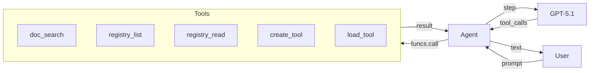
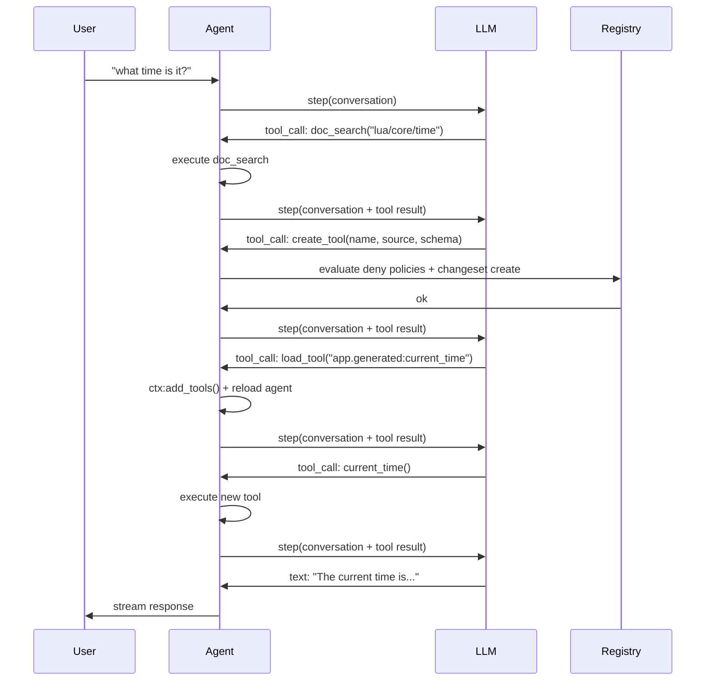
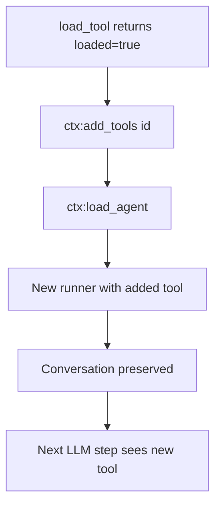
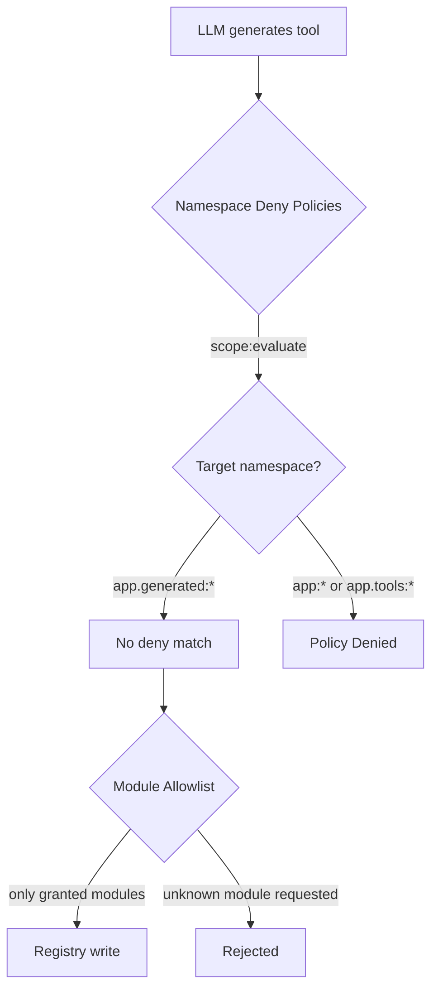

# Micro AGI

런타임에 자체 도구를 만드는 자기 수정 에이전트를 구축합니다 — 문서를 읽고, Lua를 작성하고, 레지스트리에 엔트리를 등록하고, 활성 세션에 로드합니다.

## 우리가 만들 것

다음을 수행하는 터미널 에이전트:
- 스트리밍과 함께 LLM을 사용하여 질문에 답변
- API를 학습하기 위해 Wippy 문서 검색
- 레지스트리를 검사하여 기존 기능 발견
- 기능이 없을 때 즉석에서 새 도구 구축
- 압축을 통해 자체 컨텍스트 윈도우 관리



## 아키텍처

에이전트는 레지스트리에 접근할 수 있는 Wippy 프로세스로 실행됩니다. LLM이 자신에게 없는 기능이 필요하다고 판단하면 자기 수정 루프를 사용합니다:



핵심 통찰: 도구는 레지스트리 엔트리입니다. 도구 생성은 `data.source`에 인라인 Lua 소스가 있는 `function.lua` 엔트리를 작성하는 것일 뿐입니다. 에이전트 런타임은 다른 엔트리와 마찬가지로 컴파일하여 로드합니다.

## 프로젝트 구조

```
micro-agi/
├── .wippy.yaml
├── wippy.yaml
└── src/
    ├── _index.yaml
    ├── README.md
    ├── agent.lua
    └── tools/
        ├── _index.yaml
        ├── doc_search.lua
        ├── registry_list.lua
        ├── registry_read.lua
        ├── create_tool.lua
        └── load_tool.lua
```

## 인프라

`.wippy.yaml` 생성:

```yaml
version: "1.0"

logger:
  encoding: console
```

## 엔트리 정의

인프라, 보안 정책, 모델, 에이전트, 프로세스를 포함한 `src/_index.yaml`을 생성합니다:

```yaml
version: "1.0"
namespace: app

entries:
  - name: definition
    kind: ns.definition
    readme: file://README.md
    meta:
      title: Micro AGI
      description: Self-modifying development agent that builds its own tools at runtime
      depends_on: [wippy/llm, wippy/agent]

  - name: os_env
    kind: env.storage.os

  - name: processes
    kind: process.host
    lifecycle:
      auto_start: true

  - name: __dep.llm
    kind: ns.dependency
    component: wippy/llm
    version: "*"
    parameters:
      - name: env_storage
        value: app:os_env
      - name: process_host
        value: app:processes

  - name: __dep.agent
    kind: ns.dependency
    component: wippy/agent
    version: "*"
    parameters:
      - name: process_host
        value: app:processes
```

### 보안 정책

두 개의 `security.policy` 엔트리가 에이전트가 쓸 수 있는 네임스페이스를 제한합니다:

```yaml
  - name: deny_core_ns
    kind: security.policy
    policy:
      actions: "*"
      resources: "app:*"
      effect: deny
    groups:
      - agent_security

  - name: deny_tools_ns
    kind: security.policy
    policy:
      actions: "*"
      resources: "app.tools:*"
      effect: deny
    groups:
      - agent_security
```

이 정책들은 `create_tool`에 의해 명명된 스코프(`app:agent_security`)로 로드되며, 모든 레지스트리 쓰기 전에 평가됩니다. 에이전트는 `app.generated:*`에 쓸 수 있지만(거부 정책이 일치하지 않음), `app:*`(코어 엔트리, 모델, 에이전트 정의) 또는 `app.tools:*`(내장 도구)에는 쓸 수 없습니다.

정책 평가에 대한 자세한 내용은 [보안 모델](../system/security.md)을 참조하세요.

### 모델

두 모델이 서로 다른 목적을 수행합니다:

```yaml
  - name: gpt-5.1
    kind: registry.entry
    meta:
      name: gpt-5.1
      type: llm.model
      title: GPT-5.1
      comment: Reasoning model
      capabilities: [generate, tool_use, structured_output, vision, thinking]
      class: [reasoning]
      priority: 210
    max_tokens: 128000
    output_tokens: 32768
    pricing:
      input: 2.5
      output: 10
    providers:
      - id: wippy.llm.openai:provider
        options:
          reasoning_model_request: true
        provider_model: gpt-5.1
    thinking_effort: 10

  - name: gpt-4.1-nano
    kind: registry.entry
    meta:
      name: gpt-4.1-nano
      type: llm.model
      title: GPT-4.1 Nano
      comment: Compression model
      capabilities: [generate, tool_use, structured_output]
      class: [fast]
      priority: 100
    max_tokens: 1047576
    output_tokens: 32768
    pricing:
      input: 0.1
      output: 0.4
    providers:
      - id: wippy.llm.openai:provider
        provider_model: gpt-4.1-nano
```

GPT-5.1은 추론과 도구 사용을 처리합니다. GPT-4.1 Nano는 25배 낮은 비용으로 컨텍스트 압축을 처리합니다.

### 에이전트 정의

```yaml
  - name: dev_assistant
    kind: registry.entry
    meta:
      type: agent.gen1
      name: dev_assistant
      title: Dev Assistant
      comment: Wippy development assistant
    prompt: |
      Self-modifying Wippy development agent. You run inside Wippy runtime
      with access to docs, registry, and dynamic tool creation.

      Rules:
      - NEVER fabricate, guess, or hallucinate facts. If you need real data,
        use or build a tool to get it. Only state what a tool actually returned.
      - Maximum 2-3 sentences per response. No bullet lists. No disclaimers.
      - Never say "I can't" or "I don't have". Build the tool and do it.
      - Act first, explain only if asked.

      To gain new capabilities: doc_search the API, create_tool with Lua source,
      load_tool, call it. All in one turn.
    model: gpt-5.1
    max_tokens: 2048
    tools:
      - "app.tools:*"
```

프롬프트는 의도적으로 간결합니다. 핵심 규칙:
- **할루시네이션 금지** — 에이전트는 실제 데이터를 위해 도구를 사용해야 함
- **자기 수정** — 거부하는 대신 도구 구축
- **설명보다 행동** — 먼저 행동하고 요청받으면 설명

### 프로세스

```yaml
  - name: agent
    kind: process.lua
    meta:
      command:
        name: agent
        short: Start dev assistant
    source: file://agent.lua
    method: main
    modules: [io, json, process, channel, funcs, registry, time, security]
    imports:
      prompt: wippy.llm:prompt
      agent_context: wippy.agent:context
      compress: wippy.llm.util:compress
```

프로세스는 터미널 명령으로 실행됩니다. 보안 강제 적용은 `agent_security` 정책 그룹을 로드하고 쓰기 전에 평가하는 `create_tool` 내부에서 발생합니다.

임포트:
- `prompt` — 대화 빌더
- `agent_context` — 에이전트 로딩 및 동적 도구 관리
- `compress` — 컨텍스트 관리를 위한 LLM 기반 텍스트 압축

## 도구

다섯 가지 도구를 포함한 `src/tools/_index.yaml`을 생성합니다:

### doc_search

`wippy.ai/llm` API를 통해 Wippy 문서를 가져옵니다. 두 가지 모드를 지원합니다: 경로로 페이지 가져오기, 또는 쿼리로 검색.

```lua
local http_client = require("http_client")
local json = require("json")

local BASE_URL = "https://wippy.ai/llm"
local MAX_CHARS = 8000

local function fetch_page(path)
    local url = BASE_URL .. "/path/en/" .. path
    local resp, err = http_client.get(url, {
        headers = { ["User-Agent"] = "wippy-agent/1.0" },
    })
    if err then
        return nil, tostring(err)
    end
    if resp.status_code ~= 200 then
        return nil, "HTTP " .. resp.status_code
    end

    local body = resp.body or ""
    if #body > MAX_CHARS then
        body = body:sub(1, MAX_CHARS) .. "\n... (truncated)"
    end
    return body, nil
end

local function search_docs(query)
    local url = BASE_URL .. "/search?q=" .. query
    local resp, err = http_client.get(url, {
        headers = { ["User-Agent"] = "wippy-agent/1.0" },
    })
    if err then
        return { error = tostring(err) }
    end
    if resp.status_code ~= 200 then
        return { error = "HTTP " .. resp.status_code }
    end

    local body = resp.body or ""
    if #body > MAX_CHARS then
        body = body:sub(1, MAX_CHARS) .. "\n... (truncated)"
    end

    return { results = body }
end

local function handler(input)
    if input.path then
        local content, err = fetch_page(input.path)
        if err then
            return { error = err }
        end
        return { path = input.path, content = content }
    end

    if input.query then
        return search_docs(input.query)
    end

    return { error = "provide either 'path' or 'query'" }
end

return { handler = handler }
```

### create_tool

자기 수정의 핵심입니다. 네임스페이스 거부 정책을 평가하고 인라인 Lua 소스로 레지스트리에 `function.lua` 엔트리를 생성합니다.

생성된 엔트리의 `modules` 필드는 도구가 접근할 수 있는 것을 제어합니다. 나열되지 않은 모듈은 해당 엔트리에 존재하지 않으므로 차단하거나 스캔할 것이 없습니다.

```lua
local registry = require("registry")
local json = require("json")
local security = require("security")

local NAMESPACE = "app.generated"
local MAX_SOURCE_LEN = 16000
local MAX_NAME_LEN = 64

local ALLOWED_MODULES = {
    time = true, json = true, http_client = true, expr = true,
    text = true, base64 = true, yaml = true, crypto = true,
    hash = true, uuid = true, url = true,
}
```

**정책 평가** — `create_tool`은 `agent_security` 명명된 스코프를 로드하고 대상 엔트리 ID에 대해 거부 정책을 평가합니다. `app:*` 또는 `app.tools:*`에 대한 쓰기는 거부되고, `app.generated:*`에 대한 쓰기는 통과합니다(일치하는 거부 정책 없음):

```lua
local actor = security.new_actor("service:agent", { role = "agent" })
local scope, scope_err = security.named_scope("app:agent_security")
if scope_err then
    return { error = "failed to load security scope: " .. tostring(scope_err) }
end

local result = scope:evaluate(actor, action, id)
if result == "deny" then
    return { error = "policy denied: " .. action .. " on " .. id }
end
```

**레지스트리 쓰기** — 엔트리는 `data.source`의 소스와 허용된 모듈만으로 작성됩니다:

```lua
local entry = {
    id = id,
    kind = "function.lua",
    meta = {
        type = "tool",
        title = input.name,
        comment = input.description,
        input_schema = schema,
        llm_alias = input.name,
        llm_description = input.description,
    },
    data = {
        source = input.source,
        modules = modules,
        method = "handler",
    },
}

local snap = registry.snapshot()
local changes = snap:changes()
if existing then
    changes:update(entry)
else
    changes:create(entry)
end
changes:apply()
```

디스크에 파일이 없습니다. 도구는 전적으로 레지스트리에만 존재합니다.

### load_tool

엔트리가 도구인지 검증하고 에이전트 루프에 다시 로드하도록 신호를 보냅니다:

```lua
local function handler(input)
    local entry, err = registry.get(input.id)
    if err then
        return { error = tostring(err) }
    end
    if not entry then
        return { error = "not found: " .. input.id }
    end
    if not entry.meta or entry.meta.type ~= "tool" then
        return { error = "not a tool (meta.type != 'tool'): " .. input.id }
    end

    return {
        loaded = true,
        id = entry.id,
        alias = entry.meta.llm_alias or input.id,
        description = entry.meta.llm_description or "",
    }
end
```

에이전트 루프는 결과에서 `loaded = true`를 감지하고 `ctx:add_tools(id)`에 이어 `ctx:load_agent()`를 호출하여 새 도구로 에이전트를 다시 컴파일합니다.

## 에이전트 루프

`src/agent.lua`의 에이전트 루프는 스트리밍, 도구 실행, 동적 로딩, 컨텍스트 압축을 처리합니다.

### 스트리밍

[LLM Agent 튜토리얼](llm-agent.md)과 동일한 코루틴 + 채널 패턴을 사용합니다:

```lua
coroutine.spawn(function()
    local response, err = session.runner:step(session.conversation, {
        stream_target = {
            reply_to = process.pid(),
            topic = STREAM_TOPIC,
        },
    })
    done_ch:send({ response = response, err = err })
end)
```

### 도구 실행

도구는 안전을 위해 `pcall`과 함께 `funcs.call()`로 호출됩니다:

```lua
local ok, result = pcall(funcs.call, tc.registry_id, args)
```

### 동적 도구 로딩

`load_tool`이 `loaded = true`를 반환하면 에이전트가 자신을 다시 로드합니다:



```lua
local function handle_tool_loading(tool_calls, results)
    local reload_needed = false
    for _, tc in ipairs(tool_calls) do
        if tc.name == "load_tool" then
            local result = results[tc.id]
            if result and result.loaded then
                session.ctx:add_tools(result.id)
                reload_needed = true
            end
        end
    end
    if reload_needed then
        reload_agent()
    end
end
```

대화는 러너가 아닌 프롬프트 빌더에 존재하므로 다시 로드해도 보존됩니다.

### 컨텍스트 압축

프롬프트 토큰이 96K(128K 컨텍스트 윈도우의 75%)를 초과하면 GPT-4.1 Nano를 사용하여 대화가 압축됩니다:

```lua
if response.tokens and response.tokens.prompt_tokens
    and response.tokens.prompt_tokens > PROMPT_TOKEN_LIMIT then
    try_compress()
end
```

압축은 메시지 내용을 추출하고, 4000자를 목표로 `compress.to_size()`를 호출하고, 대화를 요약으로 교체합니다:

```lua
local summary = compress.to_size(COMPRESS_MODEL, full_text, COMPRESS_TARGET)
session.conversation = prompt.new()
session.conversation:add_system("Conversation summary:\n\n" .. summary)
```

## 보안 모델

에이전트는 네임스페이스 거부 정책과 모듈 수준 접근 제어를 통해 보호됩니다.



### 네임스페이스 거부 정책

| 정책 | 리소스 | 효과 |
|--------|-----------|--------|
| `deny_core_ns` | `app:*` | deny |
| `deny_tools_ns` | `app.tools:*` | deny |

`create_tool`은 `agent_security` 정책 그룹을 로드하고 대상 엔트리 ID에 대해 평가합니다. 거부 정책은 `app:*`과 `app.tools:*`에만 일치하므로, `app.generated:*`에 대한 쓰기는 통과합니다(결과는 `undefined`, "거부되지 않음"을 의미).

이는 에이전트가 다음을 하지 못하도록 방지합니다:
- 자체 프롬프트 또는 에이전트 정의 수정 (`app:dev_assistant`)
- 내장 도구 덮어쓰기 (`app.tools:*`)
- 인프라 엔트리 변경 (`app:processes` 등)

### 모듈 접근 제어

생성된 도구는 `data.modules`에 자신의 `modules`를 선언합니다. `ALLOWED_MODULES` 집합의 모듈만 허용됩니다. Wippy 런타임은 모듈 수준에서 이를 강제합니다 — 모듈이 엔트리에 나열되지 않으면 `require()`가 오류를 반환합니다. 스캔할 것이 없으므로 소스 코드 스캔이 없습니다: 부여되지 않은 모듈은 실행 컨텍스트에 존재하지 않습니다.

## 실행

Hub에서 직접 실행:

```bash
wippy run wippy/micro-agi agent
```

또는 클론하여 로컬에서 실행:

```bash
cd micro-agi
wippy init && wippy update
wippy run agent
```

```
dev assistant (quit to exit)

> what time is it?
  [doc_search] ok
  [create_tool] ok
  [load_tool] ok
  [+] app.generated:current_time_utc
  [current_time_utc] ok
The current UTC time is 2026-02-13T03:13:41Z.

> fetch https://httpbin.org/get and show my ip
  [create_tool] ok
  [load_tool] ok
  [+] app.generated:http_get
  [http_get] ok
Your IP is 203.0.113.42.
```

## 다음 단계

- [LLM Agent](llm-agent.md) — 처음부터 기본 에이전트 구축
- [에이전트 모듈](../framework/agents.md) — 에이전트 프레임워크 참조
- [레지스트리](../concepts/registry.md) — 레지스트리 동작 방식
- [보안 모델](../system/security.md) — 선언적 보안 정책
- [엔트리 종류](../guides/entry-kinds.md) — 사용 가능한 엔트리 타입
