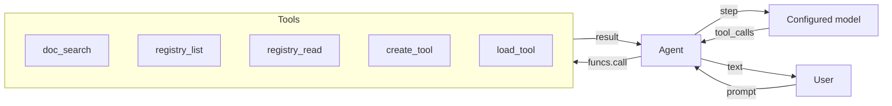
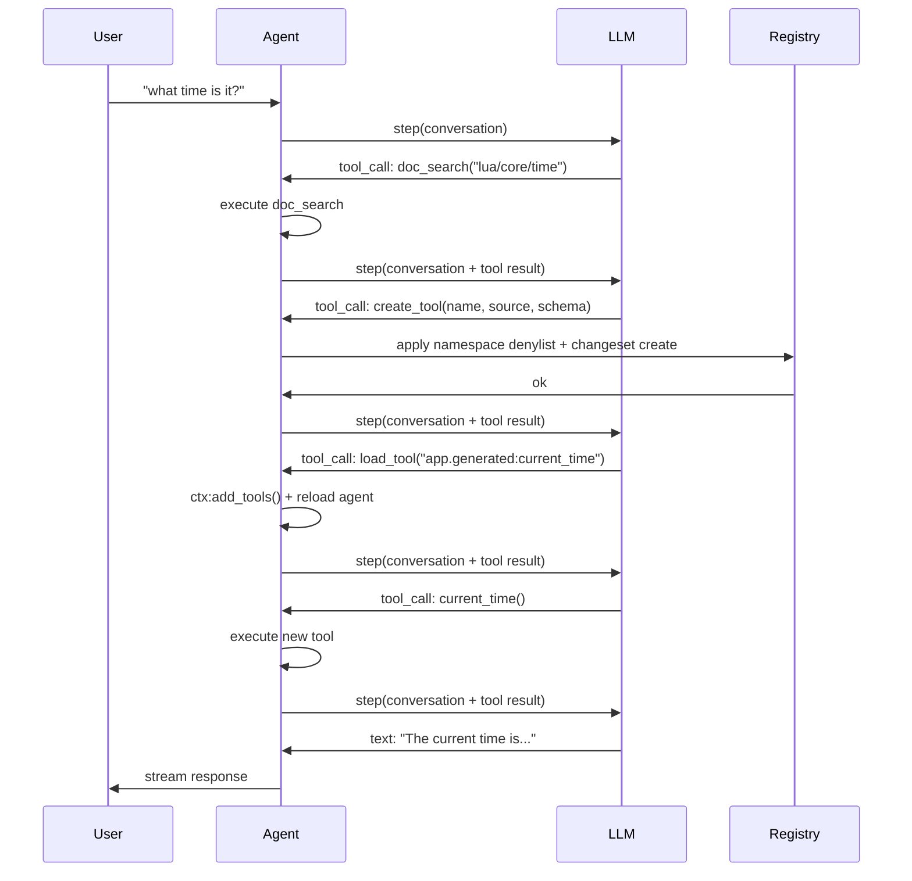
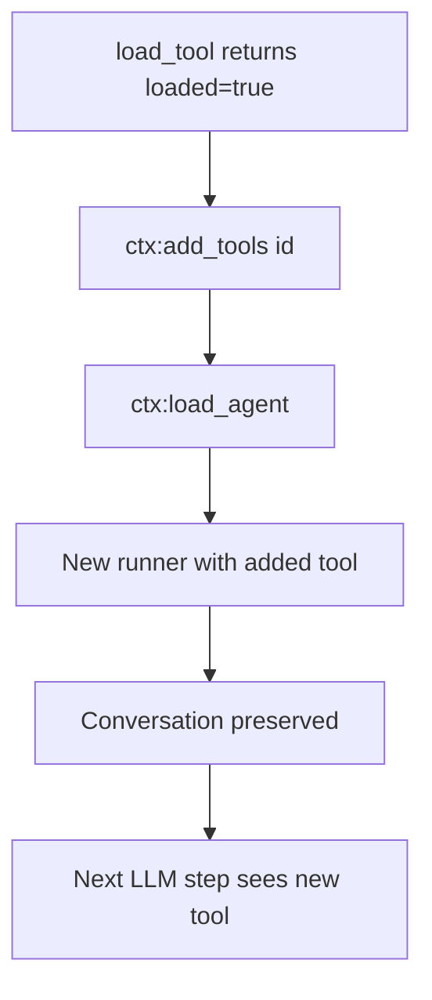
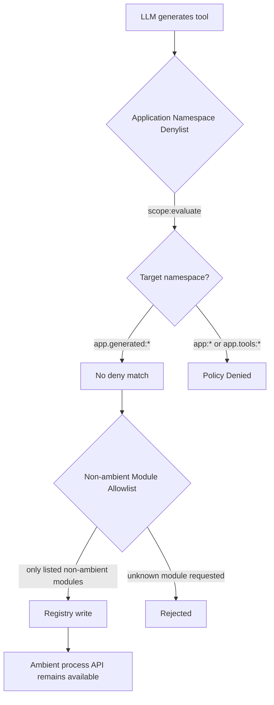

# Micro AGI

문서를 읽고 Lua 도구를 생성해 런타임에 등록하고 활성 세션에 로드하는 에이전트를 살펴봅니다.

**분류: 참조 구현 해설.** 코드 조각은 게시된 `wippy/micro-agi` 모듈을 설명하지만 의도적으로 완전한 소스 트리가 아닙니다. 구현을 실행하려면 Hub 모듈을 사용하고, 독립적으로 빌드하려면 LLM 에이전트 튜토리얼을 사용하세요.

## 패키지가 보여 주는 기능

다음 기능을 갖는 터미널 에이전트입니다.

- LLM의 답변을 스트리밍합니다.
- API를 찾기 위해 Wippy 문서를 검색합니다.
- 기존 기능을 찾기 위해 레지스트리를 검사합니다.
- 필요한 기능이 없으면 도구를 만들고 로드합니다.
- 컨텍스트 제한에 가까워지면 대화 기록을 압축합니다.


```mermaid
flowchart LR
    User -->|prompt| Agent
    Agent -->|step| LLM[Configured model]
    LLM -->|tool_calls| Agent
    Agent -->|funcs.call| Tools
    Tools -->|result| Agent
    Agent -->|text| User

    subgraph Tools
        doc_search
        registry_list
        registry_read
        create_tool
        load_tool
    end
```

## 아키텍처

에이전트는 레지스트리에 접근할 수 있는 Wippy 프로세스로 실행됩니다. LLM이 보유하지 않은 기능이 필요하다고 판단하면 다음 자기 수정 루프를 사용합니다.


```mermaid
sequenceDiagram
    participant U as User
    participant A as Agent
    participant L as LLM
    participant R as Registry

    U->>A: "what time is it?"
    A->>L: step(conversation)
    L->>A: tool_call: doc_search("lua/core/time")
    A->>A: execute doc_search
    A->>L: step(conversation + tool result)
    L->>A: tool_call: create_tool(name, source, schema)
    A->>R: apply namespace denylist + changeset create
    R->>A: ok
    A->>L: step(conversation + tool result)
    L->>A: tool_call: load_tool("app.generated:current_time")
    A->>A: ctx:add_tools() + reload agent
    A->>L: step(conversation + tool result)
    L->>A: tool_call: current_time()
    A->>A: execute new tool
    A->>L: step(conversation + tool result)
    L->>A: text: "The current time is..."
    A->>U: stream response
```

도구는 레지스트리 엔트리입니다. 에이전트는 인라인 Lua 소스를 `data.source`에 담은 `function.lua` 엔트리를 작성하여 도구를 만듭니다. 런타임은 그 엔트리를 컴파일하고 로드합니다.

## 게시된 패키지 구조

패키지는 다음 파일을 모두 소유합니다. 이 페이지는 `doc_search.lua`와 아키텍처에 중요한 계약을 재현하지만 레지스트리 헬퍼, 변경 집합 처리, 동적 로더 헬퍼, 에이전트 루프는 축약합니다. 특히 `create_tool`, `load_tool`, `agent.lua` 섹션은 그대로 복사할 수 있는 파일이 아니라 발췌본입니다. `registry_list`와 `registry_read`의 완전한 레지스트리 정의도 게시된 모듈에만 있습니다.

```
micro-agi/
├── .wippy.yaml
├── wippy.yaml
└── src/
    ├── _index.yaml
    ├── README.md
    ├── agent.lua
    └── tools/
        ├── _index.yaml
        ├── doc_search.lua
        ├── registry_list.lua
        ├── registry_read.lua
        ├── create_tool.lua
        └── load_tool.lua
```

## 인프라

패키지는 다음 `.wippy.yaml` 구성을 사용합니다.

```yaml
version: "1.0"

logger:
  encoding: console
```

## 엔트리 정의

다음 `src/_index.yaml` 엔트리 일부는 인프라, 보안 정책, 모델, 에이전트, 프로세스를 보여 줍니다.

```yaml
version: "1.0"
namespace: app

entries:
  - name: definition
    kind: ns.definition
    readme: file://README.md
    meta:
      title: Micro AGI
      description: Self-modifying development agent that builds its own tools at runtime
      depends_on: [wippy/llm, wippy/agent]

  - name: os_env
    kind: env.storage.os

  - name: processes
    kind: process.host
    lifecycle:
      auto_start: true

  - name: __dep.llm
    kind: ns.dependency
    component: wippy/llm
    version: "*"
    parameters:
      - name: env_storage
        value: app:os_env
      - name: process_host
        value: app:processes

  - name: __dep.agent
    kind: ns.dependency
    component: wippy/agent
    version: "*"
    parameters:
      - name: process_host
        value: app:processes
```

### 보안 정책

두 `security.policy` 엔트리가 애플리케이션 수준 네임스페이스 거부 목록을 구성합니다.

```yaml
  - name: deny_core_ns
    kind: security.policy
    policy:
      actions: "*"
      resources: "app:*"
      effect: deny
    groups:
      - agent_security

  - name: deny_tools_ns
    kind: security.policy
    policy:
      actions: "*"
      resources: "app.tools:*"
      effect: deny
    groups:
      - agent_security
```

`create_tool`은 이 정책들을 명명된 범위(`app:agent_security`)로 로드합니다. 헬퍼는 `app:*`(핵심 엔트리, 모델, 에이전트 정의) 또는 `app.tools:*`(기본 제공 도구)에 대한 명시적 `deny`를 거부하지만, 일치하지 않는 `app.generated:*`의 `undefined` 결과는 자체 필터에서 통과시킵니다. 이것은 Wippy 런타임 권한 부여가 아닙니다. 보호되는 연산에는 아래 보안 모듈 연산과 `changes:apply()` 내부의 `registry.apply`를 포함하여 실행 컨텍스트의 명시적 `allow`가 필요합니다.

정책 평가에 대한 자세한 내용은 [보안 모델](system/security.md)을 참조하세요.

### 모델

서로 다른 목적에 두 모델을 사용합니다.

```yaml
  - name: gpt-5.1
    kind: registry.entry
    meta:
      name: gpt-5.1
      type: llm.model
      title: GPT-5.1
      comment: Reasoning model
      capabilities: [generate, tool_use, structured_output, vision, thinking]
      class: [reasoning]
      priority: 210
    max_tokens: 400000
    output_tokens: 128000
    pricing:
      input: 1.25
      output: 10
    providers:
      - id: wippy.llm.openai:provider
        options:
          reasoning_model_request: true
        provider_model: gpt-5.1

  - name: gpt-4.1-nano
    kind: registry.entry
    meta:
      name: gpt-4.1-nano
      type: llm.model
      title: GPT-4.1 Nano
      comment: Compression model
      capabilities: [generate, tool_use, structured_output]
      class: [fast]
      priority: 100
    max_tokens: 1047576
    output_tokens: 32768
    pricing:
      input: 0.1
      output: 0.4
    providers:
      - id: wippy.llm.openai:provider
        provider_model: gpt-4.1-nano
```

GPT-5.1은 추론과 도구 사용을 처리하고 GPT-4.1 Nano는 컨텍스트 압축을 처리합니다.

### 에이전트 정의

```yaml
  - name: dev_assistant
    kind: registry.entry
    meta:
      type: agent.gen1
      name: dev_assistant
      title: Dev Assistant
      comment: Wippy development assistant
    prompt: |
      Self-modifying Wippy development agent. You run inside Wippy runtime
      with access to docs, registry, and dynamic tool creation.

      Rules:
      - NEVER fabricate, guess, or hallucinate facts. If you need real data,
        use or build a tool to get it. Only state what a tool actually returned.
      - Maximum 2-3 sentences per response. No bullet lists. No disclaimers.
      - Never say "I can't" or "I don't have". Build the tool and do it.
      - Act first, explain only if asked.

      To gain new capabilities: doc_search the API, create_tool with Lua source,
      load_tool, call it. All in one turn.
    model: gpt-5.1
    thinking_effort: 10
    max_tokens: 2048
    tools:
      - "app.tools:*"
```

프롬프트는 에이전트에 세 가지 운영 규칙을 부여합니다.

- **검색한 데이터 사용** — 외부 사실에는 도구를 사용합니다.
- **누락된 기능 생성** — 허용된 기능이 없으면 도구를 만듭니다.
- **행동 우선** — 설명하기 전에 요청된 작업을 수행합니다.

### 프로세스

```yaml
  - name: agent
    kind: process.lua
    meta:
      command:
        name: agent
        short: Start dev assistant
    source: file://agent.lua
    method: main
    modules: [io, json, funcs, registry, time, security]
    imports:
      prompt: wippy.llm:prompt
      agent_context: wippy.agent:context
      compress: wippy.llm.util:compress
```

프로세스는 터미널 명령으로 실행됩니다. `create_tool`은 쓰기 전에 패키지 거부 목록을 적용하지만 그 필터는 명령의 런타임 보안 컨텍스트를 제공하지 않습니다.

가져오기:

- `prompt` — 대화 빌더
- `agent_context` — 에이전트 로딩과 동적 도구 관리
- `compress` — 컨텍스트 관리를 위한 LLM 기반 텍스트 압축

## 도구

다섯 도구를 포함하는 `src/tools/_index.yaml`을 만듭니다.

### doc_search

`wippy.ai/llm` API를 통해 Wippy 문서를 가져옵니다. 경로로 페이지 가져오기와 쿼리 검색, 두 모드를 지원합니다.

```lua
local http_client = require("http_client")
local json = require("json")

local BASE_URL = "https://wippy.ai/llm"
local MAX_CHARS = 8000

local function fetch_page(path)
    local url = BASE_URL .. "/path/en/" .. path
    local resp, err = http_client.get(url, {
        headers = { ["User-Agent"] = "wippy-agent/1.0" },
    })
    if err then
        return nil, tostring(err)
    end
    if resp.status_code ~= 200 then
        return nil, "HTTP " .. resp.status_code
    end

    local body = resp.body or ""
    if #body > MAX_CHARS then
        body = body:sub(1, MAX_CHARS) .. "\n... (truncated)"
    end
    return body, nil
end

local function search_docs(query)
    local url = BASE_URL .. "/search?q=" .. http_client.encode_uri(query)
    local resp, err = http_client.get(url, {
        headers = { ["User-Agent"] = "wippy-agent/1.0" },
    })
    if err then
        return { error = tostring(err) }
    end
    if resp.status_code ~= 200 then
        return { error = "HTTP " .. resp.status_code }
    end

    local body = resp.body or ""
    if #body > MAX_CHARS then
        body = body:sub(1, MAX_CHARS) .. "\n... (truncated)"
    end

    return { results = body }
end

local function handler(input)
    if input.path then
        local content, err = fetch_page(input.path)
        if err then
            return { error = err }
        end
        return { path = input.path, content = content }
    end

    if input.query then
        return search_docs(input.query)
    end

    return { error = "provide either 'path' or 'query'" }
end

return { handler = handler }
```

### create_tool

이 도구는 패키지의 네임스페이스 거부 목록을 평가한 뒤 인라인 Lua 소스를 갖는 `function.lua` 레지스트리 엔트리를 만듭니다.

생성된 엔트리의 `modules` 필드는 도구가 요구할 수 있는 전역이 아닌 런타임 모듈을 제어합니다. 모든 실행 가능한 Lua 엔트리에서 `process` 모듈은 전역이므로 이를 생략하는 것은 보안 경계가 아닙니다. 프로세스 연산에는 여전히 런타임 보안 정책이 적용됩니다.

```lua
local registry = require("registry")
local json = require("json")
local security = require("security")

local NAMESPACE = "app.generated"
local MAX_SOURCE_LEN = 16000
local MAX_NAME_LEN = 64

local ALLOWED_MODULES = {
    time = true, json = true, http_client = true, expr = true,
    text = true, base64 = true, yaml = true, crypto = true,
    hash = true, uuid = true,
}
```

**거부 목록 평가** — `create_tool`은 `agent_security` 명명 범위를 로드합니다. 범위가 `deny`를 반환하면 `app:*` 또는 `app.tools:*` 쓰기를 거부하지만, 일치하지 않는 `app.generated:*` 대상은 `undefined`를 반환하여 이 애플리케이션 필터를 통과합니다.

```lua
local actor = security.new_actor("service:agent", { role = "agent" })
local scope, scope_err = security.named_scope("app:agent_security")
if scope_err then
    return { error = "failed to load security scope: " .. tostring(scope_err) }
end

local result = scope:evaluate(actor, action, id)
if result == "deny" then
    return { error = "policy denied: " .. action .. " on " .. id }
end
```

이 검사는 레지스트리 변경에 권한을 부여하지 않습니다. 현재 명령에는 보안 모듈 호출과 `registry.apply`를 명시적으로 허용하는 런타임 액터 및 범위도 필요합니다.

**레지스트리 쓰기** — 엔트리는 `data.source`의 소스와 허용된 모듈만 사용해 작성됩니다.

```lua
local entry = {
    id = id,
    kind = "function.lua",
    meta = {
        type = "tool",
        title = input.name,
        comment = input.description,
        input_schema = schema,
        llm_alias = input.name,
        llm_description = input.description,
    },
    data = {
        source = input.source,
        modules = modules,
        method = "handler",
    },
}

local snap = registry.snapshot()
local changes = snap:changes()
if existing then
    changes:update(entry)
else
    changes:create(entry)
end
local _, apply_err = changes:apply()
if apply_err then
    return { error = "failed to apply registry change: " .. tostring(apply_err) }
end
```

생성된 도구는 소스 파일에 쓰이지 않고 레지스트리에 저장됩니다.

### load_tool

엔트리가 도구인지 검증하고 에이전트 루프에 다시 로드하라는 신호를 보냅니다.

```lua
local function handler(input)
    local entry, err = registry.get(input.id)
    if err then
        return { error = tostring(err) }
    end
    if not entry then
        return { error = "not found: " .. input.id }
    end
    if not entry.meta or entry.meta.type ~= "tool" then
        return { error = "not a tool (meta.type != 'tool'): " .. input.id }
    end

    return {
        loaded = true,
        id = entry.id,
        alias = entry.meta.llm_alias or input.id,
        description = entry.meta.llm_description or "",
    }
end
```

에이전트 루프는 결과의 `loaded = true`를 감지하고 `ctx:add_tools(id)`에 이어 `ctx:load_agent()`를 호출하여 새 도구와 함께 에이전트를 다시 컴파일합니다.

## 에이전트 루프

`src/agent.lua`의 에이전트 루프는 스트리밍, 도구 실행, 동적 로딩, 컨텍스트 압축을 처리합니다.

### 스트리밍

[LLM 에이전트 튜토리얼](tutorials/llm-agent.md)과 같은 코루틴 및 채널 패턴을 사용합니다.

```lua
coroutine.spawn(function()
    local response, err = session.runner:step(session.conversation, {
        stream_target = {
            reply_to = process.pid(),
            topic = STREAM_TOPIC,
        },
    })
    done_ch:send({ response = response, err = err })
end)
```

### 도구 실행

도구는 `funcs.call()`로 호출합니다. `pcall`은 발생한 Lua 오류를 포착하고 `funcs.call()`의 정상적인 두 번째 반환값은 호출 오류를 전달합니다.

```lua
local ok, result, call_err = pcall(funcs.call, tc.registry_id, args)
if not ok then
    results[tc.id] = { error = tostring(result) }
elseif call_err then
    results[tc.id] = { error = tostring(call_err) }
else
    results[tc.id] = result
end
```

### 동적 도구 로딩

`load_tool`이 `loaded = true`를 반환하면 에이전트가 자신을 다시 로드합니다.


```mermaid
flowchart TD
    A[load_tool returns loaded=true] --> B[ctx:add_tools id]
    B --> C[ctx:load_agent]
    C --> D[New runner with added tool]
    D --> E[Conversation preserved]
    E --> F[Next LLM step sees new tool]
```

```lua
local function handle_tool_loading(tool_calls, results)
    local reload_needed = false
    for _, tc in ipairs(tool_calls) do
        if tc.name == "load_tool" then
            local result = results[tc.id]
            if result and result.loaded then
                session.ctx:add_tools(result.id)
                reload_needed = true
            end
        end
    end
    if reload_needed then
        reload_agent()
    end
end
```

대화는 러너가 아닌 프롬프트 빌더에 있으므로 다시 로드해도 유지됩니다.

### 컨텍스트 압축

프롬프트 토큰이 30만(40만 컨텍스트 창의 75%)을 초과하면 GPT-4.1 Nano로 대화를 압축합니다.

```lua
if response.tokens and response.tokens.prompt_tokens
    and response.tokens.prompt_tokens > PROMPT_TOKEN_LIMIT then
    try_compress()
end
```

압축은 메시지 콘텐츠를 추출하고 `compress.to_size()`를 호출해 4000자를 목표로 만든 뒤 대화를 요약으로 교체합니다.

```lua
local summary, compress_err = compress.to_size(COMPRESS_MODEL, full_text, COMPRESS_TARGET)
if compress_err then
    return nil, compress_err
end
session.conversation = prompt.new()
session.conversation:add_system("Conversation summary:\n\n" .. summary)
```

## 보안 모델

애플리케이션 거부 목록과 모듈 수준 접근 제어가 생성된 도구를 제한하지만 런타임 권한 부여를 대체하지는 않습니다.


```mermaid
flowchart TD
    LLM[LLM generates tool] --> P{Application Namespace Denylist}
    P -->|scope:evaluate| Check{Target namespace?}
    Check -->|app.generated:*| OK[No deny match]
    Check -->|app:* or app.tools:*| Deny[Policy Denied]

    OK --> M{Non-ambient Module Allowlist}
    M -->|only listed non-ambient modules| R[Registry write]
    M -->|unknown module requested| Err[Rejected]
    R --> A[Ambient process API remains available]
```

### 네임스페이스 거부 목록

| 정책 | 리소스 | 효과 |
|--------|-----------|--------|
| `deny_core_ns` | `app:*` | deny |
| `deny_tools_ns` | `app.tools:*` | deny |

`create_tool`은 `agent_security` 정책 그룹을 로드하고 대상 엔트리 ID를 평가합니다. 애플리케이션 수준 필터에서는 의도적으로 `undefined`를 "거부되지 않음"으로 처리합니다. Wippy의 보호된 권한 부여는 그렇지 않으며 명시적 `allow`가 있어야만 연산을 허용합니다. 이 코드를 실행하는 컨텍스트에는 여전히 필요한 런타임 권한이 있어야 합니다.

따라서 에이전트는 다음을 수행할 수 없습니다.

- 자신의 프롬프트 또는 에이전트 정의(`app:dev_assistant`) 수정
- 기본 제공 도구(`app.tools:*`) 덮어쓰기
- 인프라 엔트리(`app:processes` 등) 변경

### 모듈 접근 제어

생성된 도구는 `data.modules`에 전역이 아닌 기능을 선언하며 `create_tool`은 `ALLOWED_MODULES`의 이름만 허용합니다. 선언하지 않은 비전역 모듈은 요구할 수 없습니다. 런타임은 생성된 도구를 포함한 모든 실행 가능한 Lua 엔트리에 여전히 `process`를 주입하므로 `data.modules`에서 `process`를 생략하는 대신 보안 정책으로 프로세스 연산을 제한해야 합니다.

이 튜토리얼은 `process.spawn` 또는 `process.exec` 정책을 정의하지 않습니다. 따라서 생성된 도구는 완전한 샌드박스가 아닙니다. 신뢰할 수 없는 도구 소스를 허용하기 전에 전역 프로세스 연산에 대한 런타임 정책을 추가하세요.

## 실행과 현재 패키지 제한

게시된 산출물은 Hub 모듈입니다. `wippy.lock`이 없는 새 빈 디렉터리에서 시작하세요. Hub 부트스트랩은 관련 없는 잠금 또는 다중 루트 잠금을 거부합니다. 첫 실행에서 배포 잠금을 만들며 이후에는 같은 디렉터리에서 일치하는 잠금을 재사용합니다.

```bash
mkdir micro-agi-deploy
cd micro-agi-deploy
wippy run wippy/micro-agi agent
```

명령은 선택된 모듈 버전을 다운로드하고 선언된 의존성을 해석한 뒤 `agent` 명령을 호출합니다.

해당 모듈이 기대하는 제공자 자격 증명과 모델 구성, Hub 다운로드 및 문서 검색을 위한 레지스트리/네트워크 접근도 필요합니다. 이 페이지는 로컬 복제본이나 잠금 파일을 제공하지 않으므로 재현 가능한 소스 빌드를 주장하지 않습니다.

검토한 릴리스에서 `wippy/micro-agi` v0.3.1은 `agent`에 `meta.command.security` 컨텍스트를 선언하지 않습니다. 기본 엄격 모드에서는 `funcs.call`, 레지스트리 읽기/쓰기, 문서 검색 HTTP 요청을 포함한 보호된 도구 경로가 필요한 명시적 허용을 받지 못합니다. 따라서 위 도구 및 자기 수정 흐름은 기본 엄격 모드에서 성공하는 실행이 아니라 참조 설계입니다. 신뢰할 수 없는 코드 생성기를 작동시키기 위해 엄격 모드를 비활성화하지 마세요. 먼저 패키지가 필요한 작업에 대한 최소 권한 명령 범위를 추가해야 합니다.

## 다음 단계

- [LLM 에이전트](tutorials/llm-agent.md) — 기본 에이전트를 처음부터 만들기
- [에이전트 모듈](framework/agents.md) — 에이전트 프레임워크 참조
- [레지스트리](concepts/registry.md) — 레지스트리 개념
- [보안 모델](system/security.md) — 선언적 보안 정책
- [엔트리 종류](guides/entry-kinds.md) — 사용 가능한 엔트리 유형
