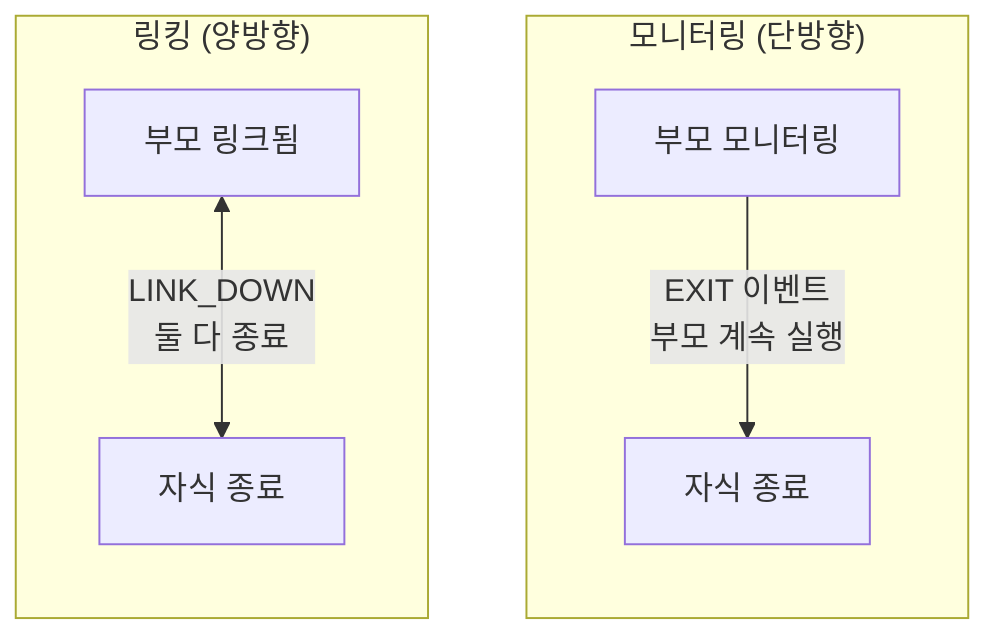

# 프로세스 슈퍼비전

프로세스를 모니터링하고 링크하여 장애 내성 시스템을 구축합니다.

## 모니터링 vs 링킹

**모니터링**은 단방향 관찰을 제공합니다:
- 부모가 자식을 모니터링
- 자식이 종료되면 부모가 EXIT 이벤트를 받음
- 부모는 계속 실행됨

**링킹**은 양방향 운명 공유를 만듭니다:
- 부모와 자식이 링크됨
- 어느 프로세스든 실패하면 둘 다 종료됨
- `trap_links=true`가 설정된 경우 제외



## 프로세스 모니터링

### 모니터링과 함께 스폰

`process.spawn_monitored()`를 사용하여 한 번의 호출로 스폰하고 모니터링:

```lua
local function main()
    local events_ch = process.events()

    -- 워커 스폰하고 모니터링 시작
    local worker_pid, err = process.spawn_monitored(
        "app.workers:task_worker",
        "app:processes"
    )
    if err then
        return nil, "spawn failed: " .. tostring(err)
    end

    -- 워커 완료 대기
    local event = events_ch:receive()

    if event.kind == process.event.EXIT then
        print("Worker exited:", event.from)
        if event.result then
            print("Result:", event.result.value)
        end
        if event.result and event.result.error then
            print("Error:", event.result.error)
        end
    end
end
```

### 기존 프로세스 모니터링

`process.monitor()`를 호출하여 이미 실행 중인 프로세스 모니터링 시작:

```lua
local function main()
    local time = require("time")
    local events_ch = process.events()

    -- 모니터링 없이 스폰
    local worker_pid, err = process.spawn(
        "app.workers:long_worker",
        "app:processes"
    )
    if err then
        return nil, "spawn failed: " .. tostring(err)
    end

    -- 나중에 모니터링 시작
    local ok, monitor_err = process.monitor(worker_pid)
    if monitor_err then
        return nil, "monitor failed: " .. tostring(monitor_err)
    end

    -- 워커 취소
    time.sleep("5ms")
    process.cancel(worker_pid)

    -- EXIT 이벤트 수신
    local event = events_ch:receive()
    if event.kind == process.event.EXIT then
        print("Worker terminated:", event.from)
    end
end
```

### 모니터링 중지

`process.unmonitor()`를 사용하여 EXIT 이벤트 수신 중지:

```lua
local function main()
    local time = require("time")
    local events_ch = process.events()

    -- 스폰하고 모니터링
    local worker_pid, err = process.spawn_monitored(
        "app.workers:long_worker",
        "app:processes"
    )

    time.sleep("5ms")

    -- 모니터링 중지
    local ok, unmon_err = process.unmonitor(worker_pid)
    if unmon_err then
        return nil, "unmonitor failed: " .. tostring(unmon_err)
    end

    -- 워커 취소
    process.cancel(worker_pid)

    -- EXIT 이벤트를 받지 않아야 함 (모니터링 해제함)
    local timeout = time.after("200ms")
    local result = channel.select {
        events_ch:case_receive(),
        timeout:case_receive(),
    }

    if result.channel == events_ch then
        return nil, "should not receive event after unmonitor"
    end
end
```

## 프로세스 링킹

### 명시적 링킹

`process.link()`를 사용하여 양방향 링크 생성:

```lua
-- 대상 프로세스에 링크하는 워커
local function worker_main()
    local time = require("time")
    local events_ch = process.events()
    local inbox_ch = process.inbox()

    -- LINK_DOWN 이벤트를 받기 위해 trap_links 활성화
    process.set_options({ trap_links = true })

    -- 발신자로부터 대상 PID 수신
    local msg = inbox_ch:receive()
    local target_pid = msg:payload():data()
    local sender = msg:from()

    -- 양방향 링크 생성
    local ok, err = process.link(target_pid)
    if err then
        return nil, "link failed: " .. tostring(err)
    end

    -- 발신자에게 링크됐음을 알림
    process.send(sender, "linked", process.pid())

    -- 대상이 종료될 때 LINK_DOWN 대기
    local timeout = time.after("3s")
    local result = channel.select {
        events_ch:case_receive(),
        timeout:case_receive(),
    }

    if result.channel == events_ch then
        local event = result.value
        if event.kind == process.event.LINK_DOWN then
            return "LINK_DOWN_RECEIVED"
        end
    end

    return nil, "no LINK_DOWN received"
end
```

### 링크와 함께 스폰

`process.spawn_linked()`를 사용하여 한 번의 호출로 스폰하고 링크:

```lua
local function parent_main()
    -- 자식 사망을 처리하기 위해 trap_links 활성화
    process.set_options({ trap_links = true })

    local events_ch = process.events()

    -- 자식 스폰하고 링크
    local child_pid, err = process.spawn_linked(
        "app.workers:child_worker",
        "app:processes"
    )
    if err then
        return nil, "spawn_linked failed: " .. tostring(err)
    end

    -- 자식이 죽으면 LINK_DOWN 수신
    local event = events_ch:receive()
    if event.kind == process.event.LINK_DOWN then
        print("Child died:", event.from)
    end
end
```

## Trap Links

기본적으로 링크된 프로세스가 실패하면 현재 프로세스도 실패합니다. LINK_DOWN 이벤트를 대신 받으려면 `trap_links=true`를 설정하세요.

### 기본 동작 (trap_links=false)

`trap_links` 없이 링크된 프로세스 실패는 현재 프로세스를 종료합니다:

```lua
local function worker_main()
    local events_ch = process.events()

    -- trap_links는 기본적으로 false
    local opts = process.get_options()
    print("trap_links:", opts.trap_links)  -- false

    -- 실패할 링크된 워커 스폰
    local child_pid, err = process.spawn_linked(
        "app.workers:error_worker",
        "app:processes"
    )

    -- 자식이 오류를 일으키면 이 프로세스도 종료됨
    -- 이 지점에 도달하지 않음
    local event = events_ch:receive()
end
```

### trap_links=true 사용

LINK_DOWN 이벤트를 받고 생존하기 위해 `trap_links` 활성화:

```lua
local function worker_main()
    -- trap_links 활성화
    process.set_options({ trap_links = true })

    local events_ch = process.events()

    -- 실패할 링크된 워커 스폰
    local child_pid, err = process.spawn_linked(
        "app.workers:error_worker",
        "app:processes"
    )

    -- LINK_DOWN 이벤트 대기
    local event = events_ch:receive()

    if event.kind == process.event.LINK_DOWN then
        print("Child failed, handling gracefully")
        return "LINK_DOWN_RECEIVED"
    end
end
```

## 취소

### 취소 시그널 전송

`process.cancel()`을 사용하여 프로세스를 그레이스풀하게 종료:

```lua
local function main()
    local time = require("time")
    local events_ch = process.events()

    -- 워커 스폰하고 모니터링
    local worker_pid, err = process.spawn_monitored(
        "app.workers:long_worker",
        "app:processes"
    )

    time.sleep("5ms")

    -- 워커 취소
    local ok, cancel_err = process.cancel(worker_pid)
    if cancel_err then
        return nil, "cancel failed: " .. tostring(cancel_err)
    end

    -- EXIT 이벤트 대기
    local event = events_ch:receive()
    if event.kind == process.event.EXIT then
        print("Worker cancelled:", event.from)
    end
end
```

### 취소 처리

워커는 `process.events()`를 통해 CANCEL 이벤트를 받습니다:

```lua
local function worker_main()
    local events_ch = process.events()
    local inbox_ch = process.inbox()

    while true do
        local result = channel.select {
            inbox_ch:case_receive(),
            events_ch:case_receive(),
        }

        if result.channel == events_ch then
            local event = result.value
            if event.kind == process.event.CANCEL then
                -- 리소스 정리
                cleanup()
                return "cancelled gracefully"
            end
        else
            -- 인박스 메시지 처리
            handle_message(result.value)
        end
    end
end
```

## 슈퍼비전 토폴로지

### 스타 토폴로지

부모에게 링크를 역으로 연결하는 여러 자식이 있는 부모:

```lua
-- 부모 워커가 부모에게 링크하는 자식을 스폰
local function star_parent_main()
    local time = require("time")
    local events_ch = process.events()
    local child_count = 10

    -- 자식 사망을 보기 위해 trap_links 활성화
    process.set_options({ trap_links = true })

    local children = {}

    -- 자식 스폰
    for i = 1, child_count do
        local child_pid, err = process.spawn(
            "app.workers:linker_child",
            "app:processes"
        )
        if err then
            error("spawn child failed: " .. tostring(err))
        end

        -- 자식에게 부모 PID 전송
        process.send(child_pid, "inbox", process.pid())
        children[child_pid] = true
    end

    -- 모든 자식이 링크를 확인할 때까지 대기
    for i = 1, child_count do
        local msg = process.inbox():receive()
        if msg:topic() ~= "linked" then
            error("expected linked confirmation")
        end
    end

    -- 실패 트리거 - 모든 자식이 LINK_DOWN을 받아야 함
    error("PARENT_STAR_FAILURE")
end
```

부모에게 링크하는 자식 워커:

```lua
local function linker_child_main()
    local events_ch = process.events()
    local inbox_ch = process.inbox()

    -- 부모 PID 수신
    local msg = inbox_ch:receive()
    local parent_pid = msg:payload():data()

    -- 부모에게 링크
    process.link(parent_pid)

    -- 링크 확인
    process.send(parent_pid, "linked", process.pid())

    -- 부모가 죽을 때 LINK_DOWN 대기
    local event = events_ch:receive()
    if event.kind == process.event.LINK_DOWN then
        return "parent_died"
    end
end
```

### 체인 토폴로지

각 노드가 부모에게 링크하는 선형 체인:

```lua
-- 체인 루트: A -> B -> C -> D -> E
local function chain_root_main()
    local time = require("time")

    -- 첫 번째 자식 스폰
    local child_pid, err = process.spawn_linked(
        "app.workers:chain_node",
        "app:processes",
        4  -- 남은 깊이
    )
    if err then
        error("spawn failed: " .. tostring(err))
    end

    -- 체인 구성 대기
    time.sleep("100ms")

    -- 캐스케이드 트리거 - 링크된 모든 프로세스 종료
    error("CHAIN_ROOT_FAILURE")
end
```

체인 노드가 다음 노드를 스폰하고 링크:

```lua
local function chain_node_main(depth)
    local time = require("time")

    if depth > 0 then
        -- 체인에서 다음 스폰
        local child_pid, err = process.spawn_linked(
            "app.workers:chain_node",
            "app:processes",
            depth - 1
        )
        if err then
            error("spawn failed: " .. tostring(err))
        end
    end

    -- 기본 trap_links=false로 LINK_DOWN을 통해 부모 사망이 종료시킬 때까지 차단
    process.inbox():receive()
end
```

## 슈퍼비전이 있는 워커 풀

### 설정

```yaml
# src/_index.yaml
version: "1.0"
namespace: app

entries:
  - name: processes
    kind: process.host
    host:
      workers: 16
    lifecycle:
      auto_start: true
```

```yaml
# src/supervisor/_index.yaml
version: "1.0"
namespace: app.supervisor

entries:
  - name: pool
    kind: process.lua
    source: file://pool.lua
    method: main
    modules:
      - time
    lifecycle:
      auto_start: true
```

### 슈퍼바이저 구현

```lua
-- src/supervisor/pool.lua
local function main(worker_count)
    local time = require("time")
    worker_count = worker_count or 4

    -- 워커 사망을 처리하기 위해 trap_links 활성화
    process.set_options({ trap_links = true })

    local events_ch = process.events()
    local workers = {}

    local function start_worker(id)
        local pid, err = process.spawn_linked(
            "app.workers:task_worker",
            "app:processes",
            id
        )
        if err then
            print("Failed to start worker " .. id .. ": " .. tostring(err))
            return nil
        end

        workers[pid] = {id = id, started_at = os.time()}
        print("Worker " .. id .. " started: " .. pid)
        return pid
    end

    -- 초기 풀 시작
    for i = 1, worker_count do
        start_worker(i)
    end

    print("Supervisor started with " .. worker_count .. " workers")

    -- 슈퍼비전 루프
    while true do
        local timeout = time.after("60s")
        local result = channel.select {
            events_ch:case_receive(),
            timeout:case_receive(),
        }

        if result.channel == timeout then
            -- 주기적 헬스 체크
            local count = 0
            for _ in pairs(workers) do count = count + 1 end
            print("Health check: " .. count .. " active workers")

        elseif result.channel == events_ch then
            local event = result.value

            if event.kind == process.event.LINK_DOWN then
                local dead_worker = workers[event.from]
                if dead_worker then
                    workers[event.from] = nil
                    local uptime = os.time() - dead_worker.started_at
                    print("Worker " .. dead_worker.id .. " died after " .. uptime .. "s, restarting")

                    -- 재시작 전 짧은 지연
                    time.sleep("100ms")
                    start_worker(dead_worker.id)
                end
            end
        end
    end
end

return { main = main }
```

## 프로세스 설정

### 워커 정의

```yaml
# src/workers/_index.yaml
version: "1.0"
namespace: app.workers

entries:
  - name: task_worker
    kind: process.lua
    source: file://task_worker.lua
    method: main
    modules:
      - time
```

### 워커 구현

```lua
-- src/workers/task_worker.lua
local function main(worker_id)
    local time = require("time")
    local events_ch = process.events()
    local inbox_ch = process.inbox()

    print("Task worker " .. worker_id .. " started")

    while true do
        local timeout = time.after("5s")
        local result = channel.select {
            inbox_ch:case_receive(),
            events_ch:case_receive(),
            timeout:case_receive(),
        }

        if result.channel == events_ch then
            local event = result.value
            if event.kind == process.event.CANCEL then
                print("Worker " .. worker_id .. " cancelled")
                return "cancelled"
            elseif event.kind == process.event.LINK_DOWN then
                print("Worker " .. worker_id .. " linked process died")
                return nil, "linked_process_died"
            end

        elseif result.channel == inbox_ch then
            local msg = result.value
            local topic = msg:topic()
            local payload = msg:payload():data()

            if topic == "work" then
                print("Worker " .. worker_id .. " processing: " .. payload)
                time.sleep("100ms")
                process.send(msg:from(), "result", "completed: " .. payload)
            end

        elseif result.channel == timeout then
            -- 유휴 타임아웃
            print("Worker " .. worker_id .. " idle")
        end
    end
end

return { main = main }
```

## 프로세스 호스트 설정

프로세스 호스트는 프로세스를 실행하는 OS 스레드 수를 제어합니다:

```yaml
# src/_index.yaml
version: "1.0"
namespace: app

entries:
  - name: processes
    kind: process.host
    host:
      workers: 16  # OS 스레드 수
    lifecycle:
      auto_start: true
```

workers 설정:
- CPU 바운드 작업의 병렬성 제어
- 일반적으로 CPU 코어 수로 설정
- 모든 프로세스가 이 스레드 풀을 공유

## 이벤트 타입

| 이벤트 | 트리거 조건 | 필요한 설정 |
|-------|-------------|-------------|
| `EXIT` | 모니터링된 프로세스 종료 | `spawn_monitored()` 또는 `monitor()` |
| `LINK_DOWN` | 링크된 프로세스 실패 | `spawn_linked()` 또는 `link()`와 `trap_links=true` |
| `CANCEL` | `process.cancel()` 호출됨 | 없음 (항상 전달됨) |

## 슈퍼바이저 풀 실행

[설정](#설정)에 표시된 구조에 풀 파일을 배치한 후:

```bash
wippy init
wippy run
```

슈퍼바이저가 자동 시작되고 네 개의 워커를 스폰하며, 워커 중 하나가 죽으면 재시작을 기록합니다. 다른 프로세스에서 워커를 종료하여 재시작을 트리거합니다:

```lua
-- 임시 프로세스나 채팅 명령어에서
process.cancel("<pid-from-supervisor-log>")
```

풀은 `LINK_DOWN`을 받고 100ms를 기다린 후 같은 id로 워커를 다시 스폰합니다.

## 다음 단계

- [프로세스](tutorials/processes.md) - 프로세스 기초
- [채널](tutorials/channels.md) - 메시지 전달 패턴
- [Process 모듈](lua/core/process.md) - API 레퍼런스
