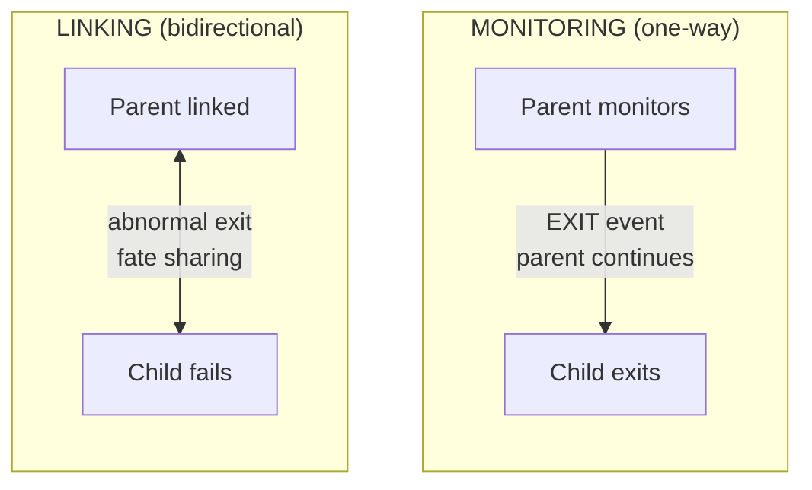

# 프로세스 감독 레시피

모니터링과 연결을 사용하여 프로세스 종료를 관찰하고, 실패를 전파하고, 취소를 처리하고, 워커를 다시 시작합니다.

**분류:** 부분 레시피. 수명 주기 코드 조각은 서로 독립적입니다. 워커 풀 섹션은 핵심 엔트리를 제공하지만 재시작을 유발하고 검증하는 별도의 제어 프로세스는 제공하지 않습니다.

## 실행 환경과 의존성

코드 조각은 Wippy 런타임 `v0.3.32a`를 대상으로 하며, 실행 가능한 Lua 엔트리, `app:processes`라는 실행 중인 `process.host`, `app.workers:task_worker` 같은 프로젝트 정의 워커 엔트리가 있다고 가정합니다. `process`와 `channel` API는 전역으로 제공됩니다. `time.*`을 호출하는 코드 조각은 엔트리에 `time` 모듈이 있어야 하며 소스에서 `local time = require("time")`를 사용해야 합니다.

프로세스 생성, 호스트 선택, 모니터링, 연결, 보내기, 취소, 종료는 보호되는 연산입니다. 각 실행 엔트리에 액터와 필요한 작업만 허용하는 범위가 좁은 정책을 연결하세요. 아래 워커 풀 구성은 해당 레시피에 필요한 정책을 포함하지만 독립 코드 조각은 포함하지 않습니다.

## 모니터링과 연결 비교

**모니터링**은 단방향 관찰을 제공합니다.

- 부모가 자식을 모니터링합니다.
- 자식이 종료되면 부모가 `EXIT` 이벤트를 받습니다.
- 부모는 계속 실행됩니다.

**연결**은 양방향 운명 공유를 만듭니다.

- 부모와 자식이 연결됩니다.
- 어느 한 프로세스가 비정상 종료되면 다른 프로세스도 종료됩니다.
- `trap_links=true`를 설정하면 실패가 프로세스에서 처리할 수 있는 이벤트로 바뀝니다.


```mermaid
flowchart TB
    subgraph Monitoring["MONITORING (one-way)"]
        direction TB
        P1[Parent monitors] -->|EXIT event<br/>parent continues| C1[Child exits]
    end

    subgraph Linking["LINKING (bidirectional)"]
        direction TB
        P2[Parent linked] <-->|abnormal exit<br/>fate sharing| C2[Child fails]
    end
```

## 프로세스 모니터링

### 모니터링과 함께 생성

한 번의 호출로 생성과 모니터링을 수행하려면 `process.spawn_monitored()`를 사용합니다.

```lua
local function main()
    local events_ch = process.events()

    -- Spawn worker and start monitoring
    local worker_pid, err = process.spawn_monitored(
        "app.workers:task_worker",
        "app:processes"
    )
    if err then
        return nil, "spawn failed: " .. tostring(err)
    end

    -- Wait for worker to complete
    local event = events_ch:receive()

    if event.kind == process.event.EXIT then
        print("Worker exited:", event.from)
        if event.result then
            print("Result:", event.result.value)
        end
        if event.result and event.result.error then
            print("Error:", event.result.error)
        end
    end
end
```

### 기존 프로세스 모니터링

이미 실행 중인 프로세스를 모니터링하려면 `process.monitor()`를 호출합니다.

```lua
local function main()
    local time = require("time")
    local events_ch = process.events()

    -- Spawn without monitoring
    local worker_pid, err = process.spawn(
        "app.workers:long_worker",
        "app:processes"
    )
    if err then
        return nil, "spawn failed: " .. tostring(err)
    end

    -- Start monitoring later
    local ok, monitor_err = process.monitor(worker_pid)
    if monitor_err then
        return nil, "monitor failed: " .. tostring(monitor_err)
    end

    -- Cancel the worker
    time.sleep("5ms")
    local _, cancel_err = process.cancel(worker_pid)
    if cancel_err then
        return nil, "cancel failed: " .. tostring(cancel_err)
    end

    -- Receive EXIT event
    local event = events_ch:receive()
    if event.kind == process.event.EXIT then
        print("Worker terminated:", event.from)
    end
end
```

### 모니터링 중지

`EXIT` 이벤트 수신을 중지하려면 `process.unmonitor()`를 사용합니다.

```lua
local function main()
    local time = require("time")
    local events_ch = process.events()

    -- Spawn and monitor
    local worker_pid, err = process.spawn_monitored(
        "app.workers:long_worker",
        "app:processes"
    )
    if err then
        return nil, "spawn failed: " .. tostring(err)
    end

    time.sleep("5ms")

    -- Stop monitoring
    local ok, unmon_err = process.unmonitor(worker_pid)
    if unmon_err then
        return nil, "unmonitor failed: " .. tostring(unmon_err)
    end

    -- Cancel worker
    local _, cancel_err = process.cancel(worker_pid)
    if cancel_err then
        return nil, "cancel failed: " .. tostring(cancel_err)
    end

    -- No EXIT event will be received (we unmonitored)
    local timeout = time.after("200ms")
    local result = channel.select {
        events_ch:case_receive(),
        timeout:case_receive(),
    }

    if result.channel == events_ch then
        return nil, "should not receive event after unmonitor"
    end
end
```

## 프로세스 연결

### 명시적 연결

양방향 연결을 만들려면 `process.link()`를 사용합니다.

```lua
-- Worker that links to a target process
local function worker_main()
    local time = require("time")
    local events_ch = process.events()
    local inbox_ch = process.inbox()

    -- Enable trap_links to receive LINK_DOWN events
    local _, options_err = process.set_options({ trap_links = true })
    if options_err then
        return nil, "set_options failed: " .. tostring(options_err)
    end

    -- Receive target PID from sender
    local msg = inbox_ch:receive()
    local target_pid = msg:payload():data()
    local sender = msg:from()

    -- Create bidirectional link
    local ok, err = process.link(target_pid)
    if err then
        return nil, "link failed: " .. tostring(err)
    end

    -- Notify sender we're linked
    local _, send_err = process.send(sender, "linked", process.pid())
    if send_err then
        return nil, "confirmation failed: " .. tostring(send_err)
    end

    -- Wait for LINK_DOWN when target exits with an error
    local timeout = time.after("3s")
    local result = channel.select {
        events_ch:case_receive(),
        timeout:case_receive(),
    }

    if result.channel == events_ch then
        local event = result.value
        if event.kind == process.event.LINK_DOWN then
            return "LINK_DOWN_RECEIVED"
        end
    end

    return nil, "no LINK_DOWN received"
end
```

### 연결과 함께 생성

한 번의 호출로 생성하고 연결하려면 `process.spawn_linked()`를 사용합니다.

```lua
local function parent_main()
    -- Enable trap_links to handle child death
    local _, options_err = process.set_options({ trap_links = true })
    if options_err then
        return nil, "set_options failed: " .. tostring(options_err)
    end

    local events_ch = process.events()

    -- Spawn and link to child
    local child_pid, err = process.spawn_linked(
        "app.workers:child_worker",
        "app:processes"
    )
    if err then
        return nil, "spawn_linked failed: " .. tostring(err)
    end

    -- If the child exits with an error, we receive LINK_DOWN
    local event = events_ch:receive()
    if event.kind == process.event.LINK_DOWN then
        print("Child died:", event.from)
    end
end
```

이 예제들이 `LINK_DOWN`을 받으려면 대상 또는 자식이 비정상적으로 종료되어야 합니다. 명시적 연결 예제에서는 해당 실패가 3초 대기 시간 안에 발생해야 합니다. 정상 완료는 이 이벤트를 방출하지 않습니다.

## 링크 트랩

기본적으로 연결된 프로세스가 실패하면 현재 프로세스도 실패합니다. 대신 `LINK_DOWN` 이벤트를 받으려면 `trap_links=true`를 설정합니다.

### 기본 동작(trap_links=false)

`trap_links`가 없으면 연결된 프로세스의 실패가 현재 프로세스를 종료합니다.

```lua
local function worker_main()
    local events_ch = process.events()

    -- trap_links is false by default
    local opts = process.get_options()
    print("trap_links:", opts.trap_links)  -- false

    -- Spawn linked worker that will fail
    local child_pid, err = process.spawn_linked(
        "app.workers:error_worker",
        "app:processes"
    )
    if err then
        return nil, "spawn_linked failed: " .. tostring(err)
    end

    -- When child errors, THIS process terminates
    -- We never reach this point
    local event = events_ch:receive()
end
```

### trap_links=true 사용

`LINK_DOWN` 이벤트를 받고 살아남으려면 `trap_links`를 활성화합니다.

```lua
local function worker_main()
    -- Enable trap_links
    local _, options_err = process.set_options({ trap_links = true })
    if options_err then
        return nil, "set_options failed: " .. tostring(options_err)
    end

    local events_ch = process.events()

    -- Spawn linked worker that will fail
    local child_pid, err = process.spawn_linked(
        "app.workers:error_worker",
        "app:processes"
    )
    if err then
        return nil, "spawn_linked failed: " .. tostring(err)
    end

    -- Wait for LINK_DOWN event
    local event = events_ch:receive()

    if event.kind == process.event.LINK_DOWN then
        print("Child failed, handling gracefully")
        return "LINK_DOWN_RECEIVED"
    end
end
```

## 취소

### 취소 신호 보내기

프로세스에 정상 취소를 요청하려면 `process.cancel()`을 사용합니다.

```lua
local function main()
    local time = require("time")
    local events_ch = process.events()

    -- Spawn and monitor worker
    local worker_pid, err = process.spawn_monitored(
        "app.workers:long_worker",
        "app:processes"
    )
    if err then
        return nil, "spawn failed: " .. tostring(err)
    end

    time.sleep("5ms")

    -- Cancel the worker
    local ok, cancel_err = process.cancel(worker_pid)
    if cancel_err then
        return nil, "cancel failed: " .. tostring(cancel_err)
    end

    -- Wait for EXIT event
    local event = events_ch:receive()
    if event.kind == process.event.EXIT then
        print("Worker cancelled:", event.from)
    end
end
```

### 취소 처리

워커는 `process.events()`를 통해 `CANCEL` 이벤트를 받습니다.

아래 `cleanup()`과 `handle_message()`는 이 레시피에서 정의하지 않는 애플리케이션 콜백입니다.

```lua
local function worker_main()
    local events_ch = process.events()
    local inbox_ch = process.inbox()

    while true do
        local result = channel.select {
            inbox_ch:case_receive(),
            events_ch:case_receive(),
        }

        if result.channel == events_ch then
            local event = result.value
            if event.kind == process.event.CANCEL then
                -- Cleanup resources
                cleanup()
                return "cancelled gracefully"
            end
        else
            -- Process inbox message
            handle_message(result.value)
        end
    end
end
```

## 감독 토폴로지

### 별형 토폴로지

부모는 자신에게 다시 연결되는 여러 자식을 조정할 수 있습니다.

```lua
-- Parent worker spawns children that link TO parent
local function star_parent_main()
    local time = require("time")
    local events_ch = process.events()
    local child_count = 10

    -- Enable trap_links to see children die
    local _, options_err = process.set_options({ trap_links = true })
    if options_err then
        error("set_options failed: " .. tostring(options_err))
    end

    local children = {}

    -- Spawn children
    for i = 1, child_count do
        local child_pid, err = process.spawn(
            "app.workers:linker_child",
            "app:processes"
        )
        if err then
            error("spawn child failed: " .. tostring(err))
        end

        -- Send parent PID to child
        local _, send_err = process.send(child_pid, "inbox", process.pid())
        if send_err then
            error("send parent PID failed: " .. tostring(send_err))
        end
        children[child_pid] = true
    end

    -- Wait for all children to confirm link
    for i = 1, child_count do
        local msg = process.inbox():receive()
        if msg:topic() ~= "linked" then
            error("expected linked confirmation")
        end
    end

    -- Trigger failure - all children should receive LINK_DOWN
    error("PARENT_STAR_FAILURE")
end
```

부모에 연결하는 자식 워커:

```lua
local function linker_child_main()
    -- Enable trap_links to receive LINK_DOWN events
    local _, options_err = process.set_options({ trap_links = true })
    if options_err then
        return nil, "set_options failed: " .. tostring(options_err)
    end

    local events_ch = process.events()
    local inbox_ch = process.inbox()

    -- Receive parent PID
    local msg = inbox_ch:receive()
    local parent_pid = msg:payload():data()

    -- Link to parent
    local _, link_err = process.link(parent_pid)
    if link_err then
        return nil, "link failed: " .. tostring(link_err)
    end

    -- Confirm link
    local _, send_err = process.send(parent_pid, "linked", process.pid())
    if send_err then
        return nil, "confirmation failed: " .. tostring(send_err)
    end

    -- Wait for LINK_DOWN when parent dies
    local event = events_ch:receive()
    if event.kind == process.event.LINK_DOWN then
        return "parent_died"
    end
end
```

### 체인 토폴로지

선형 체인에서는 각 노드가 부모에 연결됩니다.

```lua
-- Chain root: A -> B -> C -> D -> E
local function chain_root_main()
    local time = require("time")

    -- Spawn first child
    local child_pid, err = process.spawn_linked(
        "app.workers:chain_node",
        "app:processes",
        4  -- depth remaining
    )
    if err then
        error("spawn failed: " .. tostring(err))
    end

    -- Wait for chain to build
    time.sleep("100ms")

    -- Trigger cascade - all linked processes die
    error("CHAIN_ROOT_FAILURE")
end
```

체인 노드는 다음 노드를 생성하고 연결합니다.

```lua
local function chain_node_main(depth)
    if depth > 0 then
        -- Spawn next in chain
        local child_pid, err = process.spawn_linked(
            "app.workers:chain_node",
            "app:processes",
            depth - 1
        )
        if err then
            error("spawn failed: " .. tostring(err))
        end
    end

    -- Block until parent death kills us via LINK_DOWN (default trap_links=false)
    process.inbox():receive()
end
```

## 감독 기능이 있는 워커 풀

### 구성

```yaml
# src/_index.yaml
version: "1.0"
namespace: app

entries:
  - name: supervision-policy
    kind: security.policy
    policy:
      actions:
        - process.host
        - process.send
        - process.spawn
        - process.spawn.linked
      resources: "*"
      effect: allow

  - name: processes
    kind: process.host
    host:
      workers: 16
    lifecycle:
      auto_start: true
```

```yaml
# src/supervisor/_index.yaml
version: "1.0"
namespace: app.supervisor

entries:
  - name: pool
    kind: process.lua
    source: file://pool.lua
    method: main
    modules:
      - time
    security:
      actor:
        id: app.supervisor:pool
      policies:
        - app:supervision-policy

  - name: pool-service
    kind: process.service
    process: app.supervisor:pool
    host: app:processes
    input:
      - 4
    lifecycle:
      auto_start: true
```

### 감독자 구현

```lua
-- src/supervisor/pool.lua
local function main(worker_count)
    local time = require("time")
    worker_count = worker_count or 4

    -- Enable trap_links to handle worker deaths
    local _, options_err = process.set_options({ trap_links = true })
    if options_err then
        error("set_options failed: " .. tostring(options_err))
    end

    local events_ch = process.events()
    local workers = {}

    local function start_worker(id)
        local pid, err = process.spawn_linked(
            "app.workers:task_worker",
            "app:processes",
            id
        )
        if err then
            print("Failed to start worker " .. id .. ": " .. tostring(err))
            return nil
        end

        workers[pid] = {id = id, started_at = os.time()}
        print("Worker " .. id .. " started: " .. pid)
        return pid
    end

    -- Start initial pool
    for i = 1, worker_count do
        start_worker(i)
    end

    print("Supervisor started with " .. worker_count .. " workers")

    -- Supervision loop
    while true do
        local timeout = time.after("60s")
        local result = channel.select {
            events_ch:case_receive(),
            timeout:case_receive(),
        }

        if result.channel == timeout then
            -- Periodic health check
            local count = 0
            for _ in pairs(workers) do count = count + 1 end
            print("Health check: " .. count .. " active workers")

        elseif result.channel == events_ch then
            local event = result.value

            if event.kind == process.event.LINK_DOWN then
                local dead_worker = workers[event.from]
                if dead_worker then
                    workers[event.from] = nil
                    local uptime = os.time() - dead_worker.started_at
                    print("Worker " .. dead_worker.id .. " died after " .. uptime .. "s, restarting")

                    -- Brief delay before restart
                    time.sleep("100ms")
                    start_worker(dead_worker.id)
                end
            end
        end
    end
end

return { main = main }
```

## 프로세스 구성

### 워커 정의

```yaml
# src/workers/_index.yaml
version: "1.0"
namespace: app.workers

entries:
  - name: task_worker
    kind: process.lua
    source: file://task_worker.lua
    method: main
    modules:
      - time
    security:
      actor:
        id: app.workers:task_worker
      policies:
        - app:supervision-policy
```

### 워커 구현

```lua
-- src/workers/task_worker.lua
local function main(worker_id)
    local time = require("time")
    local events_ch = process.events()
    local inbox_ch = process.inbox()

    print("Task worker " .. worker_id .. " started")

    while true do
        local timeout = time.after("5s")
        local result = channel.select {
            inbox_ch:case_receive(),
            events_ch:case_receive(),
            timeout:case_receive(),
        }

        if result.channel == events_ch then
            local event = result.value
            if event.kind == process.event.CANCEL then
                print("Worker " .. worker_id .. " cancelled")
                return "cancelled"
            elseif event.kind == process.event.LINK_DOWN then
                print("Worker " .. worker_id .. " linked process died")
                return nil, "linked_process_died"
            end

        elseif result.channel == inbox_ch then
            local msg = result.value
            local topic = msg:topic()
            local payload = msg:payload():data()

            if topic == "work" then
                print("Worker " .. worker_id .. " processing: " .. payload)
                time.sleep("100ms")
                local _, send_err = process.send(msg:from(), "result", "completed: " .. payload)
                if send_err then
                    return nil, "send result failed: " .. tostring(send_err)
                end
            end

        elseif result.channel == timeout then
            -- Idle timeout
            print("Worker " .. worker_id .. " idle")
        end
    end
end

return { main = main }
```

## 프로세스 호스트 설정

[구성](#구성)에서 정의한 `app:processes` 엔트리는 다음 호스트 설정을 사용합니다.

```yaml
# Within the app:processes entry in src/_index.yaml
host:
  workers: 16  # Worker goroutines (default: NumCPU)
```

`workers` 설정은 다음과 같이 작동합니다.

- CPU 중심 작업의 병렬성을 제어합니다.
- 일반적으로 CPU 코어 수로 설정합니다.
- 호스트의 모든 프로세스가 공유하는 스케줄러 풀에 적용됩니다.

## 이벤트 유형

| 이벤트 | 발생 조건 | 필요한 설정 |
|-------|--------------|----------------|
| `EXIT` | 모니터링되는 프로세스 종료 | `spawn_monitored()` 또는 `monitor()` |
| `LINK_DOWN` | 연결된 프로세스 실패 | `trap_links=true`와 함께 `spawn_linked()` 또는 `link()` |
| `CANCEL` | `process.cancel()` 호출 | 대상이 `process.events()`를 소비 |

## 감독자 풀 레시피 사용

표시된 풀은 워커를 시작하고 감독하지만 완전한 실행형 튜토리얼은 아닙니다. 제어 프로세스, 해당 프로세스의 종료 정책, 재시작에 대한 결정적 검증을 의도적으로 생략합니다. 레시피를 애플리케이션에 통합한 뒤 일반적인 방법으로 애플리케이션을 초기화하고 실행하세요.

```bash
wippy init
wippy run
```

감독자가 자동 시작되어 워커 네 개를 생성합니다. 재시작 동작을 검증하려면 워커 PID를 찾고, 해당 PID에 대한 `process.terminate` 권한을 가지며, 워커를 종료하고, 감독자가 대체 워커를 시작했는지 확인하는 신뢰할 수 있는 제어 엔트리를 추가하세요.

워커가 비정상 종료되면 풀은 `LINK_DOWN`을 받고 100ms 기다린 뒤 같은 ID로 워커를 다시 생성합니다. 정상적인 `process.cancel()`은 워커가 깨끗하게 종료되도록 하며 `LINK_DOWN`을 발생시키지 않으므로 재시작도 유발하지 않습니다. 검증이 끝나면 Ctrl+C로 애플리케이션을 중지합니다.

## 다음 단계

- [프로세스](tutorials/processes.md) — 프로세스 기본 개념
- [채널](tutorials/channels.md) — 메시지 전달 패턴
- [프로세스 모듈](lua/core/process.md) — 프로세스 API 참조
