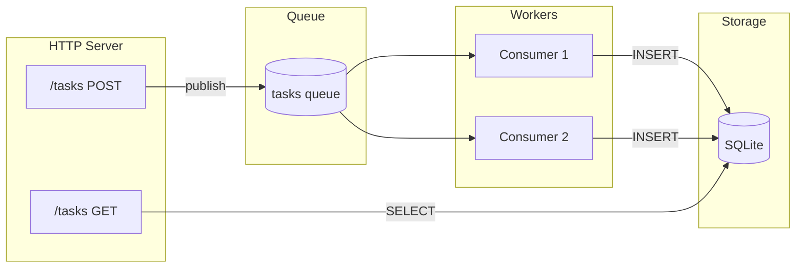

# 태스크 큐

데이터베이스 지속성과 함께 백그라운드 처리를 위해 태스크를 큐잉하는 REST API를 빌드합니다.

## 개요

이 튜토리얼은 다음을 보여주는 태스크 관리 API를 만듭니다:

- **REST 엔드포인트** - POST 태스크, GET 결과
- **큐 발행** - 비동기 작업 디스패치
- **큐 컨슈머** - 백그라운드 워커
- **데이터베이스 지속성** - SQLite 스토리지
- **마이그레이션** - 종료되는 원샷 프로세스



## 프로젝트 구조

```
task-queue/
├── wippy.lock
└── src/
    ├── _index.yaml
    ├── migrate.lua
    ├── create_task.lua
    ├── list_tasks.lua
    └── process_task.lua
```

## 엔트리 정의

`src/_index.yaml` 생성:

```yaml
version: "1.0"
namespace: app

entries:
  # SQLite 데이터베이스
  - name: db
    kind: db.sql.sqlite
    file: "./data/tasks.db"
    lifecycle:
      auto_start: true

  # 메모리 큐 드라이버
  - name: queue_driver
    kind: queue.driver.memory
    lifecycle:
      auto_start: true

  # 태스크 큐
  - name: tasks_queue
    kind: queue.queue
    driver: app:queue_driver

  # HTTP 서버
  - name: gateway
    kind: http.service
    addr: ":8080"
    lifecycle:
      auto_start: true

  # 라우터
  - name: router
    kind: http.router
    meta:
      server: app:gateway

  # 마이그레이션 프로세스 (한 번 실행, 종료)
  - name: migrate
    kind: process.lua
    source: file://migrate.lua
    method: main
    modules:
      - sql
      - logger

  # 마이그레이션 서비스 (자동 시작, 성공 시 종료)
  - name: migrate-service
    kind: process.service
    process: app:migrate
    host: app:processes
    lifecycle:
      auto_start: true

  # 프로세스 호스트
  - name: processes
    kind: process.host
    lifecycle:
      auto_start: true

  # API 핸들러
  - name: create_task
    kind: function.lua
    source: file://create_task.lua
    method: handler
    modules:
      - http
      - queue
      - uuid

  - name: list_tasks
    kind: function.lua
    source: file://list_tasks.lua
    method: handler
    modules:
      - http
      - sql

  # 큐 워커
  - name: process_task
    kind: function.lua
    source: file://process_task.lua
    method: main
    modules:
      - queue
      - sql
      - logger
      - time
      - json

  # 엔드포인트
  - name: create_task.endpoint
    kind: http.endpoint
    meta:
      router: app:router
    method: POST
    path: /tasks
    func: app:create_task

  - name: list_tasks.endpoint
    kind: http.endpoint
    meta:
      router: app:router
    method: GET
    path: /tasks
    func: app:list_tasks

  # 큐 컨슈머
  - name: task_consumer
    kind: queue.consumer
    queue: app:tasks_queue
    func: app:process_task
    concurrency: 2
    prefetch: 5
    lifecycle:
      auto_start: true
```

## 마이그레이션 프로세스

`src/migrate.lua` 생성:

```lua
local sql = require("sql")
local logger = require("logger")

local function main()
    local db, err = sql.get("app:db")
    if err then
        logger:error("failed to connect", {error = tostring(err)})
        return 1
    end

    local _, exec_err = db:execute([[
        CREATE TABLE IF NOT EXISTS tasks (
            id TEXT PRIMARY KEY,
            payload TEXT NOT NULL,
            status TEXT NOT NULL DEFAULT 'pending',
            result TEXT,
            created_at INTEGER NOT NULL,
            processed_at INTEGER
        )
    ]])

    db:release()

    if exec_err then
        logger:error("migration failed", {error = tostring(exec_err)})
        return 1
    end

    logger:info("migration complete")
    return 0
end

return { main = main }
```

<tip>
0을 반환하면 성공을 알립니다. 슈퍼바이저는 코드 0으로 정상 종료된 프로세스를 재시작하지 않습니다.
</tip>

## 태스크 생성 엔드포인트

`src/create_task.lua` 생성:

```lua
local http = require("http")
local queue = require("queue")
local uuid = require("uuid")

local function handler()
    local req, req_err = http.request()
    local res, res_err = http.response()

    if not req or not res then
        return nil, "failed to get HTTP context"
    end

    local body, parse_err = req:body_json()
    if parse_err then
        res:set_status(http.STATUS.BAD_REQUEST)
        res:write_json({error = "invalid JSON"})
        return
    end

    if not body.action then
        res:set_status(http.STATUS.BAD_REQUEST)
        res:write_json({error = "action required"})
        return
    end

    local task_id = uuid.v4()
    local task = {
        id = task_id,
        action = body.action,
        data = body.data or {},
        created_at = os.time()
    }

    local ok, err = queue.publish("app:tasks_queue", task)
    if err then
        res:set_status(http.STATUS.INTERNAL_SERVER_ERROR)
        res:write_json({error = "failed to queue task"})
        return
    end

    res:set_status(http.STATUS.ACCEPTED)
    res:write_json({
        id = task_id,
        status = "queued"
    })
end

return { handler = handler }
```

## 태스크 목록 엔드포인트

`src/list_tasks.lua` 생성:

```lua
local http = require("http")
local sql = require("sql")

local function handler()
    local req, req_err = http.request()
    local res, res_err = http.response()

    if not req or not res then
        return nil, "failed to get HTTP context"
    end

    local db, db_err = sql.get("app:db")
    if db_err then
        res:set_status(http.STATUS.INTERNAL_SERVER_ERROR)
        res:write_json({error = "database unavailable"})
        return
    end

    local status_filter = req:query("status")

    local query = sql.builder.select("id", "payload", "status", "result", "created_at", "processed_at")
        :from("tasks")
        :order_by("created_at DESC")
        :limit(100)

    if status_filter then
        query = query:where({status = status_filter})
    end

    local rows, query_err = query:run_with(db):query()
    db:release()

    if query_err then
        res:set_status(http.STATUS.INTERNAL_SERVER_ERROR)
        res:write_json({error = "query failed"})
        return
    end

    res:set_status(http.STATUS.OK)
    res:write_json({
        tasks = rows,
        count = #rows
    })
end

return { handler = handler }
```

## 큐 워커

`src/process_task.lua` 생성:

```lua
local queue = require("queue")
local sql = require("sql")
local logger = require("logger")
local time = require("time")
local json = require("json")

local function main(task)
    local msg, msg_err = queue.message()
    if msg_err then
        logger:error("failed to get message", {error = tostring(msg_err)})
        return false
    end

    logger:info("processing task", {
        id = task.id,
        action = task.action
    })

    -- 작업 시뮬레이션
    time.sleep("100ms")

    -- 액션에 따라 처리
    local result
    if task.action == "uppercase" then
        result = {output = string.upper(task.data.text or "")}
    elseif task.action == "sum" then
        local nums = task.data.numbers or {}
        local total = 0
        for _, n in ipairs(nums) do
            total = total + n
        end
        result = {output = total}
    else
        result = {output = "processed"}
    end

    -- 데이터베이스에 저장
    local db, db_err = sql.get("app:db")
    if db_err then
        logger:error("database unavailable", {error = tostring(db_err)})
        return false
    end

    local insert = sql.builder.insert("tasks")
        :columns("id", "payload", "status", "result", "created_at", "processed_at")
        :values(
            task.id,
            json.encode(task),
            "completed",
            json.encode(result),
            task.created_at,
            os.time()
        )

    local _, exec_err = insert:run_with(db):exec()
    db:release()

    if exec_err then
        logger:error("failed to store result", {error = tostring(exec_err)})
        return false
    end

    logger:info("task completed", {id = task.id})
    return true
end

return { main = main }
```

<note>
<code>true</code>를 반환하면 메시지를 확인합니다. <code>false</code>를 반환하면 메시지가 재큐잉되거나 데드 레터 큐로 전송됩니다.
</note>

## 서비스 실행

초기화 및 실행:

```bash
mkdir -p data
wippy init
wippy run
```

API 테스트:

```bash
# 태스크 생성
curl -X POST http://localhost:8080/tasks \
  -H "Content-Type: application/json" \
  -d '{"action": "uppercase", "data": {"text": "hello world"}}'

# 응답: {"id": "550e8400-...", "status": "queued"}

# 처리를 위해 잠시 대기 후 태스크 목록
curl http://localhost:8080/tasks

# 응답: {"tasks": [...], "count": 1}

# 상태로 필터링
curl "http://localhost:8080/tasks?status=completed"
```

## 메시지 흐름

1. **POST /tasks**가 요청을 받고, UUID를 생성하고, 큐에 발행
2. **큐 컨슈머**가 메시지를 가져옴 (2개의 동시 워커)
3. **워커**가 태스크를 처리하고, 결과를 SQLite에 쓰기
4. **GET /tasks**가 데이터베이스에서 완료된 태스크 읽기

## 보여주는 개념

| 개념 | API | 설명 |
|---------|-----|-------------|
| REST 엔드포인트 | `http.request()`, `http.response()` | HTTP 요청 처리 |
| 큐 발행 | `queue.publish(id, data)` | 비동기 작업 전송 |
| 큐 소비 | `queue.message()` | 핸들러에서 메시지 접근 |
| 데이터베이스 쿼리 | `sql.get()`, `db:query()` | 데이터 읽기 |
| 쿼리 빌더 | `sql.builder.insert()` | 안전하게 SQL 빌드 |
| 마이그레이션 | 0을 반환하는 프로세스 | 원샷 설정 태스크 |
| 동시성 | `concurrency: 2` | 병렬 워커 |

## 다음 단계

- [HTTP 모듈](lua/http/http.md) - 요청/응답 처리
- [Queue 모듈](lua/storage/queue.md) - 메시지 큐 작업
- [SQL 모듈](lua/storage/sql.md) - 데이터베이스 접근
- [큐 컨슈머](guides/queue-consumers.md) - 큐 설정
