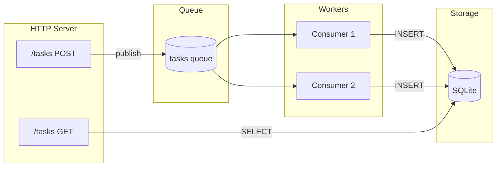

# 작업 큐

작업을 메모리 큐에 게시하고 백그라운드 워커에서 처리한 뒤 완료 결과를 SQLite에 저장하는 REST API를 만듭니다.

**분류:** 실행 가능한 튜토리얼. 로컬 단일 노드 데모를 위한 완전한 레지스트리, Lua 소스, 시작 명령, HTTP 확인 절차를 제공합니다.

## 개요

이 튜토리얼에서는 다음 기능을 보여 주는 작업 관리 API를 만듭니다.

- **REST 엔드포인트** — 작업을 제출하고 결과를 나열합니다.
- **큐 게시** — 작업을 비동기적으로 전달합니다.
- **큐 소비자** — 백그라운드 워커에서 작업을 처리합니다.
- **데이터베이스 영속성** — 완료 결과를 SQLite에 저장합니다.
- **스키마 설정** — 일회성 프로세스에서 데이터베이스 테이블을 만듭니다.


```mermaid
flowchart LR
    subgraph api["HTTP Server"]
        POST["/tasks POST"]
        GET["/tasks GET"]
    end

    subgraph queue["Queue"]
        Q[("tasks queue")]
    end

    subgraph workers["Workers"]
        W1["Consumer 1"]
        W2["Consumer 2"]
    end

    subgraph storage["Storage"]
        DB[(SQLite)]
    end

    POST -->|publish| Q
    Q --> W1
    Q --> W2
    W1 -->|INSERT| DB
    W2 -->|INSERT| DB
    GET -->|SELECT| DB
```

## 사전 요구 사항

- Wippy 런타임 `v0.3.32a`
- `curl` 또는 다른 HTTP 클라이언트
- 빈 작업 디렉터리. 아래 파일을 추가하기 전에 프로젝트와 소스 디렉터리를 만듭니다.

  ```bash
  mkdir task-queue
  cd task-queue
  mkdir src
  ```

## 프로젝트 구조

```
task-queue/
├── wippy.lock
├── data/                    # created before startup
└── src/
    ├── _index.yaml
    ├── migrate.lua
    ├── create_task.lua
    ├── list_tasks.lua
    └── process_task.lua
```

## 엔트리 정의

`src/_index.yaml`을 만듭니다.

```yaml
version: "1.0"
namespace: app

entries:
  # Capabilities used by the tutorial's Lua entries in strict mode
  - name: runtime_policy
    kind: security.policy
    policy:
      actions:
        - db.get
        - queue.publish
        - queue.publish.queue
      resources: "*"
      effect: allow

  # SQLite database
  - name: db
    kind: db.sql.sqlite
    file: "./data/tasks.db"
    lifecycle:
      auto_start: true

  # Memory queue driver
  - name: queue_driver
    kind: queue.driver.memory
    lifecycle:
      auto_start: true

  # Tasks queue
  - name: tasks_queue
    kind: queue.queue
    driver: app:queue_driver

  # HTTP server
  - name: gateway
    kind: http.service
    addr: ":8080"
    lifecycle:
      auto_start: true

  # Router
  - name: router
    kind: http.router
    meta:
      server: app:gateway

  # Migration process (runs once, exits)
  - name: migrate
    kind: process.lua
    source: file://migrate.lua
    method: main
    modules:
      - sql
      - logger
    security:
      actor:
        id: app:migrate
      policies:
        - app:runtime_policy

  # Migration service (auto-starts, exits on success)
  - name: migrate-service
    kind: process.service
    process: app:migrate
    host: app:processes
    lifecycle:
      auto_start: true

  # Process host
  - name: processes
    kind: process.host
    lifecycle:
      auto_start: true

  # API handlers
  - name: create_task
    kind: function.lua
    source: file://create_task.lua
    method: handler
    modules:
      - http
      - queue
      - uuid
    security:
      actor:
        id: app:create_task
      policies:
        - app:runtime_policy

  - name: list_tasks
    kind: function.lua
    source: file://list_tasks.lua
    method: handler
    modules:
      - http
      - sql
    security:
      actor:
        id: app:list_tasks
      policies:
        - app:runtime_policy

  # Queue worker
  - name: process_task
    kind: function.lua
    source: file://process_task.lua
    method: main
    modules:
      - sql
      - logger
      - json
    security:
      actor:
        id: app:process_task
      policies:
        - app:runtime_policy

  # Endpoints
  - name: create_task.endpoint
    kind: http.endpoint
    meta:
      router: app:router
    method: POST
    path: /tasks
    func: app:create_task

  - name: list_tasks.endpoint
    kind: http.endpoint
    meta:
      router: app:router
    method: GET
    path: /tasks
    func: app:list_tasks

  # Queue consumer
  - name: task_consumer
    kind: queue.consumer
    queue: app:tasks_queue
    func: app:process_task
    concurrency: 2
    prefetch: 5
    lifecycle:
      auto_start: true
```

## 마이그레이션 프로세스

`src/migrate.lua`를 만듭니다.

```lua
local sql = require("sql")
local logger = require("logger")

local function main()
    local db, err = sql.get("app:db")
    if err then
        logger:error("failed to connect", {error = tostring(err)})
        error("failed to connect: " .. tostring(err))
    end

    local _, exec_err = db:execute([[
        CREATE TABLE IF NOT EXISTS tasks (
            id TEXT PRIMARY KEY,
            payload TEXT NOT NULL,
            status TEXT NOT NULL DEFAULT 'pending',
            result TEXT,
            created_at INTEGER NOT NULL,
            processed_at INTEGER
        )
    ]])

    db:release()

    if exec_err then
        logger:error("migration failed", {error = tostring(exec_err)})
        error("migration failed: " .. tostring(exec_err))
    end

    logger:info("migration complete")
    return 0
end

return { main = main }
```

<tip>
정상 반환은 다시 시작하지 않고 <code>process.service</code> 자식을 종료합니다. 프로세스가 오류를 발생시킨 경우에만 감독자가 재시도합니다. 같은 프로세스를 CLI 명령으로 시작한 경우에는 <code>0</code> 반환도 성공 종료 상태로 매핑됩니다.
</tip>

## 작업 생성 엔드포인트

`src/create_task.lua`를 만듭니다.

```lua
local http = require("http")
local queue = require("queue")
local uuid = require("uuid")

local function handler()
    local req = http.request()
    local res = http.response()

    local body, parse_err = req:body_json()
    if parse_err then
        res:set_status(http.STATUS.BAD_REQUEST)
        res:write_json({error = "invalid JSON"})
        return
    end

    if not body.action then
        res:set_status(http.STATUS.BAD_REQUEST)
        res:write_json({error = "action required"})
        return
    end

    local task_id = uuid.v4()
    local task = {
        id = task_id,
        action = body.action,
        data = body.data or {},
        created_at = os.time()
    }

    local ok, err = queue.publish("app:tasks_queue", task)
    if err then
        res:set_status(http.STATUS.INTERNAL_ERROR)
        res:write_json({error = "failed to queue task"})
        return
    end

    res:set_status(http.STATUS.ACCEPTED)
    res:write_json({
        id = task_id,
        status = "queued"
    })
end

return { handler = handler }
```

## 작업 목록 엔드포인트

`src/list_tasks.lua`를 만듭니다.

```lua
local http = require("http")
local sql = require("sql")

local function handler()
    local req = http.request()
    local res = http.response()

    local db, db_err = sql.get("app:db")
    if db_err then
        res:set_status(http.STATUS.INTERNAL_ERROR)
        res:write_json({error = "database unavailable"})
        return
    end

    local status_filter = req:query("status")

    local query = sql.builder.select("id", "payload", "status", "result", "created_at", "processed_at")
        :from("tasks")
        :order_by("created_at DESC")
        :limit(100)

    if status_filter then
        query = query:where({status = status_filter})
    end

    local rows, query_err = query:run_with(db):query()
    db:release()

    if query_err then
        res:set_status(http.STATUS.INTERNAL_ERROR)
        res:write_json({error = "query failed"})
        return
    end

    res:set_status(http.STATUS.OK)
    res:write_json({
        tasks = rows,
        count = #rows
    })
end

return { handler = handler }
```

## 큐 워커

`src/process_task.lua`를 만듭니다.

```lua
local sql = require("sql")
local logger = require("logger")
local json = require("json")

local function main(task)
    logger:info("processing task", {
        id = task.id,
        action = task.action
    })

    local result
    if task.action == "uppercase" then
        result = {output = string.upper(task.data.text or "")}
    elseif task.action == "sum" then
        local nums = task.data.numbers or {}
        local total = 0
        for _, n in ipairs(nums) do
            total = total + n
        end
        result = {output = total}
    else
        result = {output = "processed"}
    end

    local db, db_err = sql.get("app:db")
    if db_err then
        error("database unavailable: " .. tostring(db_err))
    end

    local _, exec_err = db:execute(
        "INSERT OR REPLACE INTO tasks (id, payload, status, result, created_at, processed_at) VALUES (?, ?, ?, ?, ?, ?)",
        { task.id, json.encode(task), "completed", json.encode(result), task.created_at, os.time() }
    )
    db:release()

    if exec_err then
        error("failed to store result: " .. tostring(exec_err))
    end

    logger:info("task completed", {id = task.id})
end

return { main = main }
```

<note>
핸들러가 정상 반환하면 소비자가 자동으로 ack하고, 오류를 발생시키면 자동으로 nack합니다. 핸들러가 끝나기 전에 명시적으로 제어해야 하는 경우에만 <code>queue.message()</code>를 통해 <code>msg:ack()</code> 또는 <code>msg:nack()</code>를 호출하세요.
</note>

## 서비스 실행

데이터 디렉터리를 만들고 프로젝트를 초기화한 뒤 런타임을 시작합니다.

```bash
mkdir data
wippy init
wippy run
```

두 번째 터미널에서 HTTP 확인을 수행하는 동안 런타임을 계속 실행해 둡니다. 로그에 HTTP 서비스가 수신 중이고 마이그레이션이 완료되었다고 표시될 때까지 기다리세요. 일회성 마이그레이션과 HTTP 서비스는 부팅 중 서로 독립적으로 시작됩니다.

작업을 제출하고 결과를 조회합니다.

```bash
# Create a task
curl -X POST http://localhost:8080/tasks \
  -H "Content-Type: application/json" \
  -d '{"action": "uppercase", "data": {"text": "hello world"}}'

# Response: {"id":"<generated-uuid>","status":"queued"}

# Wait a moment for processing, then list tasks
curl http://localhost:8080/tasks

# Response includes one completed task and "count":1

# Filter by status
curl "http://localhost:8080/tasks?status=completed"
```

반환된 행의 `status`는 `"completed"`여야 하며, `result` 필드는 `{"output":"HELLO WORLD"}`를 포함하는 JSON 문자열입니다. 메모리 큐는 의도적으로 비내구성이지만 완료된 행은 `data/tasks.db`에 저장되어 재시작 후에도 남습니다.

## 문제 해결과 정리

- `no such table: tasks`는 마이그레이션이 끝나기 전에 요청이 SQLite에 도달했다는 뜻입니다. `migration complete`가 표시될 때까지 기다린 뒤 다시 시도하세요. 마이그레이션 오류는 마이그레이션 서비스를 중지하며 런타임 로그에 표시됩니다.
- `failed to queue task`는 대개 `app:queue_driver` 또는 `app:task_consumer`가 시작되지 않았다는 뜻입니다. 요청을 반복하기보다 시작 로그에서 첫 번째 리소스 오류를 확인하세요.
- `address already in use`는 다른 프로세스가 포트 8080을 사용 중이라는 뜻입니다. 해당 프로세스를 중지하거나 `app:gateway.addr`를 변경하고 `curl` 명령에서도 같은 포트를 사용하세요.
- Ctrl+C로 런타임을 중지합니다. 튜토리얼 데이터를 초기화하려면 `data/tasks.db`를 제거하세요. 다음 시작에서 스키마를 다시 만듭니다.

## 메시지 흐름

1. **POST /tasks**가 요청을 받고 UUID를 생성한 뒤 작업을 게시합니다.
2. **큐 소비자**가 메시지를 받으며, 최대 두 핸들러가 동시에 실행됩니다.
3. **워커**가 작업을 처리하고 결과를 SQLite에 씁니다.
4. **GET /tasks**가 데이터베이스에서 완료된 작업을 읽습니다.

## 다음 단계

- [HTTP 모듈](../lua/http/http.md) — 요청 및 응답 처리
- [큐 모듈](../lua/storage/queue.md) — 메시지 큐 연산
- [SQL 모듈](../lua/storage/sql.md) — 데이터베이스 접근
- [큐 소비자](../guides/queue-consumers.md) — 큐 구성
