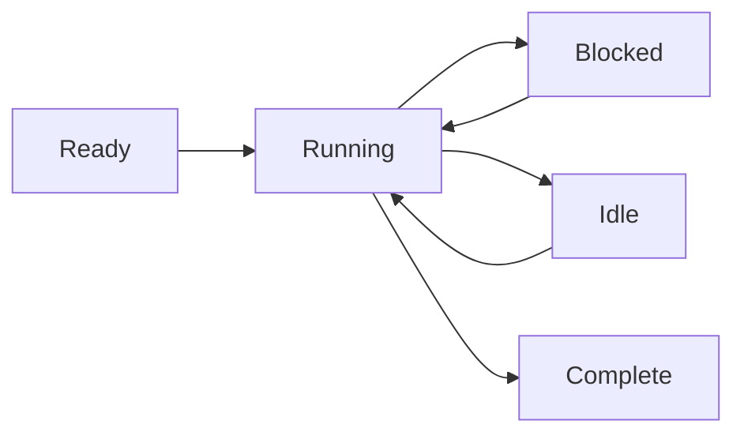

# Modelo de Processos

O Wippy executa código em processos isolados — máquinas de estado leves que se comunicam através de passagem de mensagens. Essa abordagem baseada no modelo de atores elimina bugs de estado compartilhado e torna a programação concorrente previsível.

## Execução como Máquina de Estado

Todo processo segue o mesmo padrão: inicializa, avança pela execução cedendo em operações bloqueantes, e fecha quando completo. O agendador multiplexa milhares de processos através de um pool de workers, executando outros processos enquanto um aguarda I/O.

Processos suportam múltiplos yields concorrentes — você pode iniciar várias operações assíncronas e aguardar que qualquer uma ou todas sejam concluídas. Isso permite I/O paralelo eficiente sem criar processos adicionais.



Processos não estão limitados a Lua. O runtime suporta qualquer implementação de máquina de estado — processos baseados em Go e módulos WebAssembly estão planejados.

<warning>
Processos são leves, mas não são gratuitos. Cada processo inicia com aproximadamente 13KB de overhead base. Alocações dinâmicas e crescimento de heap adicionam a isso durante a execução.
</warning>

## Hosts de Processos

O Wippy executa múltiplos hosts de processos dentro de um único runtime, cada um com diferentes capacidades e limites de segurança. Processos do sistema executando funções privilegiadas podem residir em um host, isolados de hosts executando sessões de usuário. Hosts podem restringir o que os processos podem fazer — em Erlang você precisaria de nós separados para esse nível de isolamento.

Alguns hosts são especializados. O host Terminal, por exemplo, executa um único processo mas concede acesso a operações de IO que outros hosts negam. Isso permite misturar níveis de confiança em uma única implantação — serviços do sistema com acesso total ao lado de código de usuário em sandbox.

## Modelo de Segurança

Todo processo executa sob uma identidade de ator e política de segurança. Tipicamente este é o usuário que iniciou a chamada, mas processos do sistema executam sob um ator de sistema com privilégios diferentes.

O controle de acesso funciona em múltiplos níveis. Processos individuais têm seus próprios níveis de acesso. O envio de mensagens entre hosts pode ser proibido com base na política de segurança — um processo de usuário em sandbox pode não ter permissão para enviar mensagens a hosts do sistema. A política anexada ao ator atual determina quais operações são permitidas.

## Criando Processos

Crie processos em segundo plano com `process.spawn()`:

```lua
local pid = process.spawn("app.workers:handler", "app:processes", arg1, arg2)
```

O primeiro argumento é a entrada do registro, o segundo é o host de processos, e os argumentos restantes são passados ao processo.

Variantes de spawn controlam relacionamentos de ciclo de vida:

| Função | Comportamento |
|--------|---------------|
| `spawn` | Dispara e esquece |
| `spawn_monitored` | Recebe eventos EXIT quando o filho termina |
| `spawn_linked` | Bidirecional — qualquer crash notifica o outro |

## Passagem de Mensagens

Processos se comunicam através de mensagens, nunca memória compartilhada:

```lua
process.send(target_pid, "topic", payload)
```

Mensagens do mesmo remetente chegam em ordem. Mensagens de remetentes diferentes podem intercalar. A entrega é dispara-e-esquece — use padrões de requisição-resposta quando precisar de confirmação.

<note>
Processos podem se registrar em um registro de nomes local e ser endereçados por nome ao invés de PID (ex: `session_manager`). Registro global para endereçamento entre nós está planejado.
</note>

## Supervisão

Qualquer processo pode supervisionar outros monitorando-os. Um processo cria filhos com monitoramento, observa eventos EXIT, e os reinicia em caso de falha. Isso segue a filosofia "deixe falhar" do Erlang: processos falham em condições inesperadas, e o processo de monitoramento trata a recuperação.

```lua
local worker = process.spawn_monitored("app.workers:handler", "app:processes")
local event = process.events():receive()

if event.kind == process.event.EXIT and event.result.error then
    worker = process.spawn_monitored("app.workers:handler", "app:processes")
end
```

No nível raiz, o runtime fornece serviços que iniciam e supervisionam processos de longa duração — similar ao systemd no Linux. Defina uma entrada `process.service` para que o runtime gerencie um processo:

```yaml
- name: worker.service
  kind: process.service
  process: app.workers:handler
  host: app:processes
  lifecycle:
    auto_start: true
    restart:
      max_attempts: 5
      delay: 1s
```

O serviço inicia automaticamente, reinicia em caso de crash com backoff, e se integra com o gerenciamento de ciclo de vida do runtime.

## Atualização de Processos

Processos em execução podem atualizar seu código sem perder a identidade. Chame `process.upgrade()` para trocar para uma nova definição preservando PID, caixa de mensagens e relacionamentos de supervisão:

```lua
process.upgrade("app.workers:v2", current_state)
```

O primeiro argumento é a nova entrada do registro (ou nil para recarregar a definição atual). Argumentos adicionais são passados para a nova versão, permitindo carregar estado através da atualização. O processo retoma a execução com o novo código imediatamente.

Isso permite hot code reload durante o desenvolvimento e atualizações sem tempo de inatividade em produção. O runtime armazena em cache protos compilados, então atualizações não pagam o custo de compilação repetidamente. Se uma atualização falhar por qualquer motivo, o processo falha e a semântica normal de supervisão se aplica — um pai de monitoramento pode reiniciá-lo com a versão anterior ou escalar a falha.

## Agendamento

O agendador de atores usa roubo de trabalho entre núcleos de CPU. Cada worker tem uma fila local para localidade de cache, com uma fila global para distribuição. Processos cedem em operações bloqueantes, permitindo que milhares executem concorrentemente em poucos threads.
