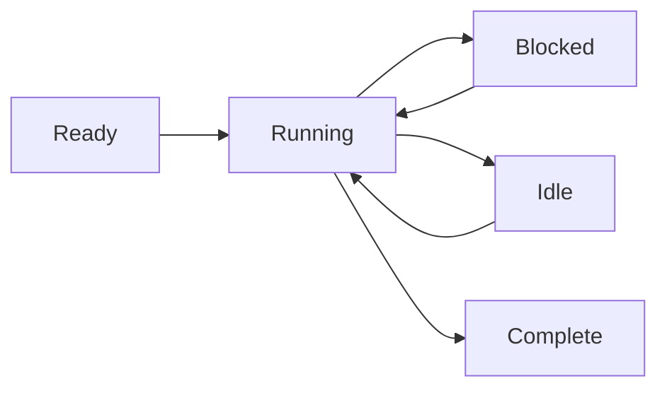

# Modelo de Processos

O Wippy executa codigo em processos isolados - maquinas de estado leves que se comunicam atraves de passagem de mensagens. Essa abordagem baseada no modelo de atores elimina bugs de estado compartilhado e torna a programacao concorrente previsivel.

## Execucao como Maquina de Estado

Todo processo segue o mesmo padrao: inicializa, avanca pela execucao cedendo em operacoes bloqueantes, e fecha quando completo. O agendador multiplexa milhares de processos atraves de um pool de workers, executando outros processos enquanto um aguarda I/O.

Processos suportam multiplos yields concorrentes - voce pode iniciar varias operacoes assincronas e aguardar que qualquer uma ou todas sejam concluidas. Isso permite I/O paralelo eficiente sem criar processos adicionais.



Processos nao estao limitados a Lua. O runtime suporta qualquer implementacao de maquina de estado - processos baseados em Go e modulos WebAssembly estao planejados.

<warning>
Processos sao leves, mas nao sao gratuitos. Cada processo inicia com aproximadamente 13KB de overhead base. Alocacoes dinamicas e crescimento de heap adicionam a isso durante a execucao.
</warning>

## Hosts de Processos

O Wippy executa multiplos hosts de processos dentro de um unico runtime, cada um com diferentes capacidades e limites de seguranca. Processos do sistema executando funcoes privilegiadas podem residir em um host, isolados de hosts executando sessoes de usuario. Hosts podem restringir o que os processos podem fazer - em Erlang voce precisaria de nos separados para esse nivel de isolamento.

Alguns hosts sao especializados. O host Terminal, por exemplo, executa um unico processo mas concede acesso a operacoes de IO que outros hosts negam. Isso permite misturar niveis de confianca em uma unica implantacao - servicos do sistema com acesso total ao lado de codigo de usuario em sandbox.

## Modelo de Seguranca

Todo processo executa sob uma identidade de ator e politica de seguranca. Tipicamente este e o usuario que iniciou a chamada, mas processos do sistema executam sob um ator de sistema com privilegios diferentes.

O controle de acesso funciona em multiplos niveis. Processos individuais tem seus proprios niveis de acesso. O envio de mensagens entre hosts pode ser proibido com base na politica de seguranca - um processo de usuario em sandbox pode nao ter permissao para enviar mensagens a hosts do sistema. A politica anexada ao ator atual determina quais operacoes sao permitidas.

## Criando Processos

Crie processos em segundo plano com `process.spawn()`:

```lua
local pid = process.spawn("app.workers:handler", "app:processes", arg1, arg2)
```

O primeiro argumento e a entrada do registro, o segundo e o host de processos, e os argumentos restantes sao passados ao processo.

Variantes de spawn controlam relacionamentos de ciclo de vida:

| Funcao | Comportamento |
|--------|---------------|
| `spawn` | Dispara e esquece |
| `spawn_monitored` | Recebe eventos EXIT quando o filho termina |
| `spawn_linked` | Bidirecional - qualquer crash notifica o outro |

## Passagem de Mensagens

Processos se comunicam atraves de mensagens, nunca memoria compartilhada:

```lua
process.send(target_pid, "topic", payload)
```

Mensagens do mesmo remetente chegam em ordem. Mensagens de remetentes diferentes podem intercalar. A entrega e dispara-e-esquece - use padroes de requisicao-resposta quando precisar de confirmacao.

<note>
Processos podem se registrar em um registro de nomes local e ser enderecados por nome ao inves de PID (ex: `session_manager`). Registro global para enderecamento entre nos esta planejado.
</note>

## Supervisao

Qualquer processo pode supervisionar outros monitorando-os. Um processo cria filhos com monitoramento, observa eventos EXIT, e os reinicia em caso de falha. Isso segue a filosofia "deixe falhar" do Erlang: processos falham em condicoes inesperadas, e o processo de monitoramento trata a recuperacao.

```lua
local worker = process.spawn_monitored("app.workers:handler", "app:processes")
local event = process.events():receive()

if event.kind == process.event.EXIT and event.result.error then
    worker = process.spawn_monitored("app.workers:handler", "app:processes")
end
```

No nivel raiz, o runtime fornece servicos que iniciam e supervisionam processos de longa duracao - similar ao systemd no Linux. Defina uma entrada `process.service` para que o runtime gerencie um processo:

```yaml
- name: worker.service
  kind: process.service
  process: app.workers:handler
  host: app:processes
  lifecycle:
    auto_start: true
    restart:
      max_attempts: 5
      delay: 1s
```

O servico inicia automaticamente, reinicia em caso de crash com backoff, e se integra com o gerenciamento de ciclo de vida do runtime.

## Atualizacao de Processos

Processos em execucao podem atualizar seu codigo sem perder a identidade. Chame `process.upgrade()` para trocar para uma nova definicao preservando PID, caixa de mensagens e relacionamentos de supervisao:

```lua
process.upgrade("app.workers:v2", current_state)
```

O primeiro argumento e a nova entrada do registro (ou nil para recarregar a definicao atual). Argumentos adicionais sao passados para a nova versao, permitindo carregar estado atraves da atualizacao. O processo retoma a execucao com o novo codigo imediatamente.

Isso permite hot code reload durante o desenvolvimento e atualizacoes sem tempo de inatividade em producao. O runtime armazena em cache protos compilados, entao atualizacoes nao pagam o custo de compilacao repetidamente. Se uma atualizacao falhar por qualquer motivo, o processo falha e a semantica normal de supervisao se aplica - um pai de monitoramento pode reinicia-lo com a versao anterior ou escalar a falha.

## Agendamento

O agendador de atores usa roubo de trabalho entre nucleos de CPU. Cada worker tem uma fila local para localidade de cache, com uma fila global para distribuicao. Processos cedem em operacoes bloqueantes, permitindo que milhares executem concorrentemente em poucos threads.
