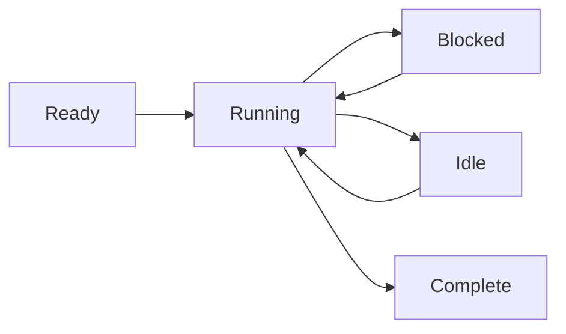

# Modelo de Processos

O Wippy executa código em processos isolados: máquinas de estado leves que se comunicam por mensagens, em vez de memória compartilhada. Esse modelo de atores dá a cada processo seu próprio estado e ciclo de vida.

Esta página explica o modelo de ciclo de vida e isolamento. Use a referência de [Gerenciamento de Processos](../lua/core/process.md) para APIs de spawn, mensagens, monitoramento, registro e atualização. Consulte [Host de Processos e Serviços](../system/process-host.md) para os campos de serviços gerenciados pelo runtime.

## Execução como máquina de estado

Cada processo inicializa, avança pela execução, cede em operações bloqueantes e encerra quando termina. O scheduler multiplexa processos em um pool de workers e executa outros trabalhos enquanto um processo aguarda I/O.

Processos aceitam vários yields simultâneos, permitindo iniciar diversas operações assíncronas e aguardar qualquer uma ou todas elas sem criar processos adicionais.


```mermaid
flowchart LR
    Ready --> Running
    Running --> Blocked
    Running --> Idle
    Blocked --> Running
    Idle --> Running
    Running --> Complete
```

Processos não se limitam a Lua. O runtime também aceita módulos WebAssembly por meio do kind `process.wasm`, e sua arquitetura de processos pode acomodar outras implementações de máquinas de estado.

<warning>
Processos são leves, mas não são gratuitos. Cada processo possui um pequeno custo básico para estado, inbox e bookkeeping do scheduler; alocações dinâmicas aumentam esse consumo durante a execução.
</warning>

## Hosts de processos

O Wippy pode executar vários hosts de processos no mesmo runtime, cada qual com suas próprias capacidades e fronteiras de segurança. Processos de sistema privilegiados podem executar em um host separado dos hosts que atendem sessões de usuários.

Alguns hosts são especializados. O host Terminal, por exemplo, usa um worker do scheduler e fornece contexto de I/O de terminal aos processos aceitos; ele não impõe um limite de vida de um único processo. Hosts separados permitem que uma implantação execute processos com diferentes níveis de confiança.

## Modelo de segurança

Cada processo executa sob uma identidade de ator e uma política de segurança. Em geral, trata-se do usuário que iniciou a chamada, enquanto processos de sistema usam um ator de sistema com privilégios diferentes.

O controle de acesso se aplica em vários níveis. A política de segurança pode restringir operações individuais de processos e a entrega de mensagens entre hosts. A política associada ao ator atual determina quais operações são permitidas.

Para as implicações de segurança do isolamento de processos, consulte o [Modelo de Segurança](./security-model.md).

## Iniciando processos

Crie processos em segundo plano com `process.spawn()`:

```lua
local pid, err = process.spawn("app.workers:handler", "app:processes", arg1, arg2)
if err then return nil, err end
return pid
```

O primeiro argumento é a entrada do registro, o segundo é o host de processos e os argumentos restantes são passados ao processo.

As variantes de spawn controlam as relações de ciclo de vida:

| Função | Comportamento |
|----------|----------|
| `spawn` | Inicia um processo independente |
| `spawn_monitored` | Recebe eventos EXIT quando o filho encerra |
| `spawn_linked` | Uma saída anormal se propaga em qualquer direção; com `trap_links: true`, o peer recebe `LINK_DOWN` em vez de falhar |

## Passagem de mensagens

Processos se comunicam por mensagens, e não por memória compartilhada:

```lua
local ok, err = process.send(target_pid, "topic", payload)
if err then return nil, err end
return ok
```

Mensagens do mesmo remetente chegam em ordem. Mensagens de remetentes diferentes podem se intercalar. A entrega não espera resposta; use padrões de requisição e resposta quando precisar de confirmação.

<note>
Processos podem se registrar em um registro local de nomes e ser endereçados pelo nome, em vez do PID (por exemplo, `session_manager`). Nomes também podem ser registrados em todo o cluster para endereçamento entre nós por meio de `process.registry`, usando os escopos EVENTUAL (baseado em gossip), CONSISTENT ou STRONG (ambos apoiados por Raft).
</note>

## Supervisão

Qualquer processo pode supervisionar outros processos monitorando-os. Um supervisor inicia filhos monitorados, observa eventos EXIT e decide se deve reiniciá-los após uma falha.

```lua
local worker, spawn_err = process.spawn_monitored("app.workers:handler", "app:processes")
if spawn_err then return nil, spawn_err end

local event, open = process.events():receive()
if not open then return nil, errors.new("process event channel closed") end

if event.kind == process.event.EXIT and event.result.error then
    local replacement, restart_err = process.spawn_monitored("app.workers:handler", "app:processes")
    if restart_err then return nil, restart_err end
    worker = replacement
end
```

No nível do runtime, serviços podem iniciar e supervisionar processos de longa duração. Defina uma entrada `process.service` para que o runtime gerencie um processo:

```yaml
- name: worker.service
  kind: process.service
  process: app.workers:handler
  host: app:processes
  lifecycle:
    auto_start: true
    restart:
      max_attempts: 5
      initial_delay: 1s
```

O serviço inicia automaticamente e integra-se ao gerenciamento de ciclo de vida do runtime. No runtime fixado, a primeira inicialização que falha conta para `max_attempts`; portanto, `5` permite no máximo quatro novas tentativas de inicialização. Cada retry aguarda `initial_delay` com jitter; o atraso não aumenta entre tentativas.

## Atualização de processos

Processos em execução podem atualizar seu código sem perder a identidade. Chame `process.upgrade()` para trocar para uma nova definição, preservando PID, mailbox e relações de supervisão:

```lua
process.upgrade("app.workers:v2", current_state)
```

O primeiro argumento é a nova entrada do registro (ou nil para recarregar a definição atual). Argumentos adicionais são passados à nova versão, permitindo transportar estado durante a atualização. O processo retoma imediatamente a execução com o novo código.

O runtime armazena protótipos compilados em cache para evitar compilações repetidas. Se uma atualização falhar, o processo falha e o comportamento normal de supervisão se aplica; um pai que o monitora pode reiniciá-lo ou escalar a falha.

## Agendamento

O scheduler de atores usa work-stealing entre núcleos da CPU. Cada worker possui uma fila local para favorecer a localidade do cache e há uma fila global para distribuir o trabalho. Processos cedem em operações bloqueantes para que outros processos possam executar no pool de workers.
