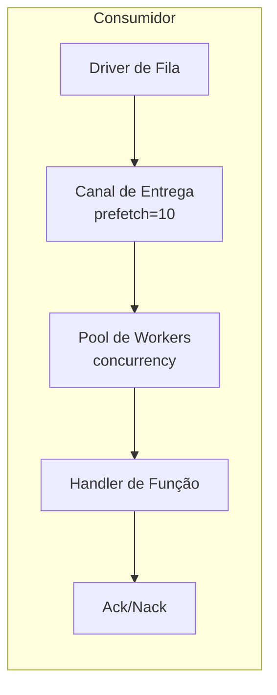

# Consumidores de Filas

Consumidores de filas processam mensagens de filas usando pools de workers.

## Visão Geral



## Configuração

| Opção | Padrão | Max | Descrição |
|-------|--------|-----|-----------|
| `queue` | Obrigatório | - | ID do registro da fila |
| `func` | Obrigatório | - | ID do registro da função handler |
| `concurrency` | 1 | 1000 | Quantidade de workers |
| `prefetch` | 10 | 10000 | Tamanho do buffer de mensagens |

## Definição de Entrada

```yaml
- name: order_consumer
  kind: queue.consumer
  queue: app:orders
  func: app:process_order
  concurrency: 5
  prefetch: 20
  lifecycle:
    auto_start: true
    depends_on:
      - app:orders
```

## Função Handler

A função handler recebe o corpo da mensagem:

```lua
-- process_order.lua
local json = require("json")

local function handler(body)
    local order = json.decode(body)

    -- Processa o pedido
    local result, err = process_order(order)
    if err then
        -- Retorna erro para disparar Nack (reenfileirar)
        return nil, err
    end

    -- Sucesso dispara Ack
    return result
end

return handler
```

```yaml
- name: process_order
  kind: function.lua
  source: file://process_order.lua
  modules:
    - json
```

## Reconhecimento

| Resultado | Ação | Efeito |
|-----------|------|--------|
| Sucesso | Ack | Mensagem removida da fila |
| Erro | Nack | Mensagem reenfileirada (dependente do driver) |

## Pool de Workers

- Workers executam como goroutines concorrentes
- Cada worker processa uma mensagem por vez
- Mensagens distribuídas round-robin do canal de entrega
- Buffer de prefetch permite driver entregar antecipadamente

### Exemplo

```
concurrency: 3
prefetch: 10

Fluxo:
1. Driver entrega até 10 mensagens para o buffer
2. 3 workers pegam do buffer concorrentemente
3. Conforme workers terminam, buffer reabastece
4. Contrapressão quando todos workers ocupados e buffer cheio
```

## Encerramento Gracioso

Ao parar:
1. Para de aceitar novas entregas
2. Cancela contextos de workers
3. Aguarda mensagens em voo (com timeout)
4. Retorna erro de timeout se workers não terminarem

## Declaração de Fila

```yaml
# Driver de fila (memória para dev/teste)
- name: queue_driver
  kind: queue.driver.memory
  lifecycle:
    auto_start: true

# Definição de fila
- name: orders
  kind: queue.queue
  driver: app:queue_driver
  options:
    queue_name: orders      # Sobrescreve nome (padrão: nome da entrada)
    max_length: 10000       # Tamanho máximo da fila
    durable: true           # Sobrevive a reinicializações
```

| Opção | Descrição |
|-------|-----------|
| `queue_name` | Sobrescreve nome da fila (padrão: nome do ID da entrada) |
| `max_length` | Tamanho máximo da fila |
| `durable` | Sobrevive a reinicializações (dependente do driver) |

## Driver de Memória

Fila em memória embutida para desenvolvimento/testes:

- Tipo: `queue.driver.memory`
- Mensagens armazenadas em memória
- Nack reenfileira mensagem no início da fila
- Sem persistência entre reinicializações

## Veja Também

- [Fila de Mensagens](lua/storage/queue.md) - Referência do módulo de filas
- [Configuração de Filas](system/queue.md) - Drivers de fila e definições de entrada
- [Árvores de Supervisão](guides/supervision.md) - Ciclo de vida do consumidor
- [Gerenciamento de Processos](lua/core/process.md) - Criação e comunicação de processos
