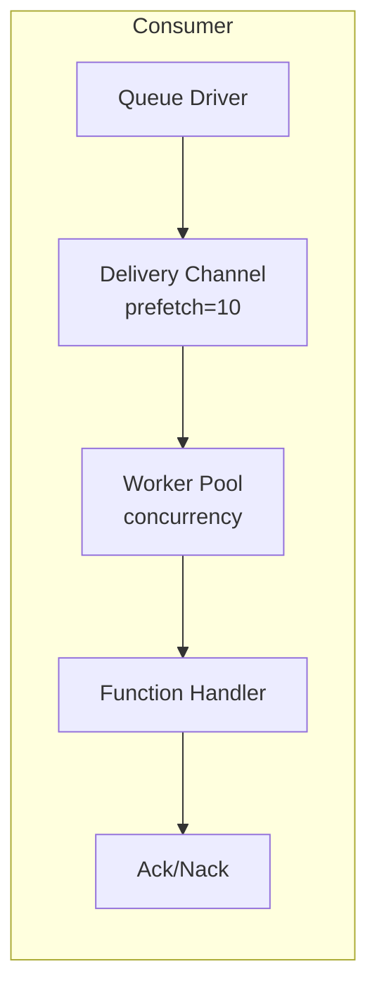

# Consumidores de Filas

Consumidores de filas processam mensagens de filas usando pools de workers.

## Visão Geral


```mermaid
flowchart LR
    subgraph Consumer
        QD[Queue Driver] --> DC[Delivery Channel<br/>prefetch=10]
        DC --> WP[Worker Pool<br/>concurrency]
        WP --> FH[Function Handler]
        FH --> AN[Ack/Nack]
    end
```

## Configuração

| Opção | Padrão | Max | Descrição |
|-------|--------|-----|-----------|
| `queue` | Obrigatório | - | ID do registro da fila |
| `func` | Obrigatório | - | ID do registro da função handler |
| `concurrency` | 1 | 1000 | Quantidade de workers |
| `prefetch` | 10 | 10000 | Tamanho do buffer compartilhado de entregas; o AMQP também o aplica como contagem de prefetch da QoS do canal |
| `auto_ack` | false | - | Opção de auto-ack específica do backend; no AMQP, `true` solicita que o broker confirme no momento da entrega |
| `driver_options` | `{}` | - | Opções de consumidor específicas do driver |

## Definição de Entrada

```yaml
- name: order_consumer
  kind: queue.consumer
  queue: app:orders
  func: app:process_order
  concurrency: 5
  prefetch: 20
  lifecycle:
    auto_start: true
    requires:
      - app:orders
```

## Função Handler

A função handler recebe o corpo depois que o codec da fila o decodifica. Use `queue.message()` para acessar a entrega atual e seus metadados:

```lua
-- process_order.lua
local queue = require("queue")
local logger = require("logger")

local function main(order)
    local msg, msg_err = queue.message()
    if msg_err then
        return nil, msg_err
    end

    logger:info("processing order", {
        message_id = msg:id(),
        order_id = order.id
    })

    return {processed = true, order_id = order.id}
end

return {main = main}
```

```yaml
- name: process_order
  kind: function.lua
  source: file://process_order.lua
  method: main
  modules:
    - queue
    - logger
```

## Confirmação

A menos que o handler conclua explicitamente a entrega, o consumidor usa o resultado da invocação da função:

| Resultado do handler | Ação | Efeito |
|----------------------|------|--------|
| Conclui sem erro de invocação | Ack | Mensagem removida da fila |
| Retorna ou gera um erro de invocação | Nack | A reentrega depende do driver |

Valores comuns de retorno, inclusive `false`, não determinam o comportamento de confirmação. Chame `msg:ack()` ou `msg:nack()` para concluir explicitamente. A conclusão acontece uma única vez: a primeira vence. Com `auto_ack: true` no AMQP, o broker confirma no momento da entrega; portanto, uma falha posterior do handler não pode causar reentrega pelo broker.

## Pool de Workers

- Workers executam como goroutines concorrentes
- Cada worker processa uma mensagem por vez
- Mensagens distribuídas round-robin do canal de entrega
- Buffer de prefetch permite driver entregar antecipadamente

### Exemplo

```
concurrency: 3
prefetch: 10

Flow:
1. Driver delivers up to 10 messages to buffer
2. 3 workers pull from buffer concurrently
3. As workers finish, buffer refills
4. Backpressure when all workers busy and buffer full
```

## Encerramento Gracioso

Ao parar:
1. Para de aceitar novas entregas
2. Cancela contextos de workers
3. Aguarda mensagens em voo (com timeout)
4. Retorna erro de timeout se workers não terminarem

## Declaração de Fila

```yaml
# Queue driver (memory for dev/test)
- name: queue_driver
  kind: queue.driver.memory
  lifecycle:
    auto_start: true

# Queue definition
- name: orders
  kind: queue.queue
  driver: app:queue_driver
  queue_name: orders        # Override name (default: entry name)
  codec: json/plain         # Payload codec (optional; json/plain is the default)
  dead_letter:              # Accepted configuration; not enforced by built-in drivers
    queue: app:dlq
    max_attempts: 5
  driver_options:
    memory:
      max_length: 10000     # Memory driver: bounded queue size
```

| Campo | Descrição |
|-------|-----------|
| `queue_name` | Sobrescreve nome da fila (padrão: nome do ID da entrada) |
| `codec` | Nome do codec de payload |
| `dead_letter.queue` | ID de registro aceito para uma fila dead-letter; não aplicado pelos drivers integrados |
| `dead_letter.max_attempts` | Contagem de tentativas aceita na configuração; não aplicada pelos drivers integrados |
| `driver_options` | Configurações específicas do driver indexadas por nome do driver |

<note>
Nenhum driver integrado conta tentativas ou roteia mensagens a partir do bloco `dead_letter`. O runtime não traduz esse bloco em argumentos de fila AMQP, e falhas comuns do consumidor AMQP solicitam requeue. Portanto, o dead-lettering no broker precisa ser configurado e acionado fora desse bloco. O driver de memória não roteia para uma DLQ.
</note>

## Driver de Memória

Fila em memória embutida para desenvolvimento/testes:

- Tipo: `queue.driver.memory`
- Mensagens armazenadas em memória
- Nack reenfileira a mensagem no final da fila
- Sem persistência entre reinicializações

## Veja Também

- [Fila de Mensagens](../lua/storage/queue.md) - Referência do módulo de filas
- [Configuração de Filas](../system/queue.md) - Drivers de fila e definições de entrada
- [Árvores de Supervisão](./supervision.md) - Ciclo de vida do consumidor
- [Gerenciamento de Processos](../lua/core/process.md) - Criação e comunicação de processos
