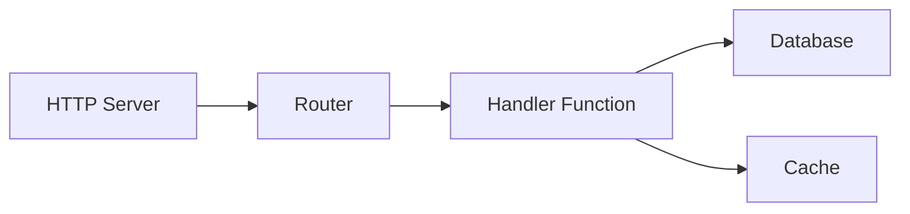
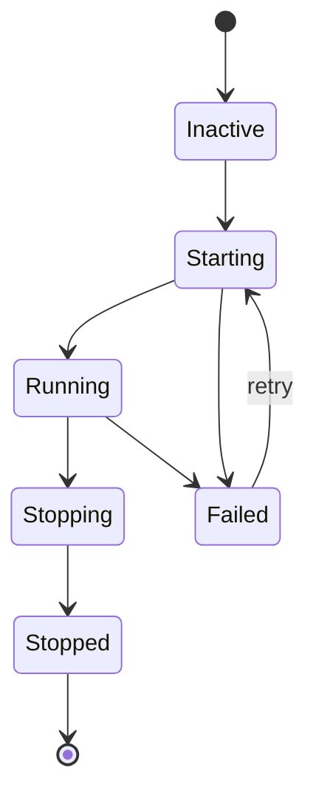

# Supervisão

O supervisor gerencia ciclos de vida de serviços, tratando ordenação de inicialização, reinicializações automáticas e encerramento gracioso. Serviços com `auto_start: true` são iniciados quando a aplicação inicia.

## Configuração de Ciclo de Vida

Serviços se registram com o supervisor usando um bloco `lifecycle`. Para processos, use `process.service` para encapsular uma definição de processo:

```yaml
# Definição de processo (o código)
- name: worker_process
  kind: process.lua
  source: file://worker.lua
  method: main

# Serviço supervisionado (encapsula o processo com gerenciamento de ciclo de vida)
- name: worker
  kind: process.service
  process: app:worker_process
  host: app:processes
  lifecycle:
    auto_start: true
    start_timeout: 30s
    stop_timeout: 10s
    stable_threshold: 5s
    depends_on:
      - app:database
    restart:
      initial_delay: 2s
      max_delay: 60s
      max_attempts: 10
```

| Campo | Padrão | Descrição |
|-------|--------|-----------|
| `auto_start` | `false` | Inicia automaticamente quando supervisor inicia |
| `start_timeout` | `10s` | Tempo máximo permitido para inicialização |
| `stop_timeout` | `10s` | Tempo máximo para encerramento gracioso |
| `stable_threshold` | `5s` | Tempo de execução antes do serviço ser considerado estável |
| `depends_on` | `[]` | Serviços que devem estar executando primeiro |

## Resolução de Dependências

O supervisor resolve dependências de duas fontes:

1. **Dependências explícitas** declaradas em `depends_on`
2. **Dependências extraídas do registro** de referências de entradas (ex: `database: app:db` na sua configuração)



Dependências iniciam antes dos dependentes. Se o Serviço C depende de A e B, ambos A e B devem alcançar o estado `Running` antes de C iniciar.

<tip>
Você não precisa declarar entradas de infraestrutura como bancos de dados em <code>depends_on</code>. O supervisor extrai automaticamente dependências de referências do registro na configuração da sua entrada.
</tip>

## Política de Reinicialização

Quando um serviço falha, o supervisor tenta novamente com backoff exponencial:

```yaml
lifecycle:
  restart:
    initial_delay: 1s      # Espera da primeira tentativa
    max_delay: 90s         # Limite máximo de delay
    backoff_factor: 2.0    # Multiplicador de delay por tentativa
    jitter: 0.1            # +/-10% de randomização
    max_attempts: 0        # 0 = tentativas infinitas
```

| Tentativa | Delay Base | Com Jitter (+/-10%) |
|-----------|------------|-------------------|
| 1 | 1s | 0.9s - 1.1s |
| 2 | 2s | 1.8s - 2.2s |
| 3 | 4s | 3.6s - 4.4s |
| 4 | 8s | 7.2s - 8.8s |
| ... | ... | ... |
| N | 90s | 81s - 99s (limitado) |

Quando um serviço executa por mais tempo que `stable_threshold`, o contador de tentativas reseta. Isso previne que falhas transitórias escalem delays permanentemente.

### Erros Terminais

Estes erros param tentativas de retry:

- Cancelamento de contexto
- Requisição de terminação explícita
- Erros marcados como não-retentáveis

## Contexto de Segurança

Serviços podem executar com uma identidade de segurança específica:

```yaml
# Definição de processo
- name: admin_worker_process
  kind: process.lua
  source: file://admin_worker.lua
  method: main

# Serviço supervisionado com contexto de segurança
- name: admin_worker
  kind: process.service
  process: app:admin_worker_process
  host: app:processes
  lifecycle:
    auto_start: true
    security:
      actor:
        id: "service:admin-worker"
        meta:
          role: admin
      groups:
        - app:admin_policies
      policies:
        - app:data_access
```

O contexto de segurança define:

| Campo | Descrição |
|-------|-----------|
| `actor.id` | String de identidade para este serviço |
| `actor.meta` | Metadados chave-valor (role, permissões, etc.) |
| `groups` | Grupos de políticas a aplicar |
| `policies` | Políticas individuais a aplicar |

Código executando no serviço herda este contexto de segurança. O módulo `security` pode então verificar permissões:

```lua
local security = require("security")

if security.can("delete", "users") then
    -- permitido
end
```

<note>
Quando nenhum contexto de segurança está configurado, o serviço executa sem um ator. No modo estrito (padrão), verificações de segurança falham. Configure um contexto de segurança para serviços que precisam de autorização.
</note>

## Estados de Serviço



O supervisor transiciona serviços através destes estados:

| Estado | Descrição |
|--------|-----------|
| `Inactive` | Registrado mas não iniciado |
| `Starting` | Inicialização em progresso |
| `Running` | Operando normalmente |
| `Stopping` | Encerramento gracioso em progresso |
| `Stopped` | Terminado de forma limpa |
| `Failed` | Erro ocorreu, pode tentar novamente |

## Ordem de Inicialização e Encerramento

**Inicialização**: Dependências primeiro, depois dependentes. Serviços no mesmo nível de dependência podem iniciar em paralelo.

**Encerramento**: Dependentes primeiro, depois dependências. Isso garante que serviços dependentes terminem antes de suas dependências pararem.

```
Inicialização:  database -> cache -> handler -> http_server
Encerramento:   http_server -> handler -> cache -> database
```

## Veja Também

- [Modelo de Processos](concepts/process-model.md) - Ciclo de vida de processos
- [Configuração](guides/configuration.md) - Formato de configuração YAML
- [Módulo Security](lua/security/security.md) - Verificações de permissão em Lua
