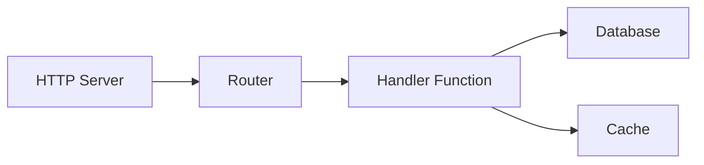
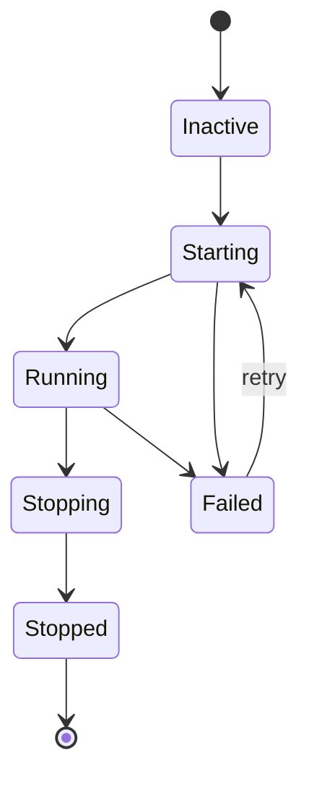

# Supervisao

O supervisor gerencia ciclos de vida de servicos, tratando ordenacao de inicializacao, reinicializacoes automaticas e encerramento gracioso. Servicos com `auto_start: true` sao iniciados quando a aplicacao inicia.

## Configuracao de Ciclo de Vida

Servicos se registram com o supervisor usando um bloco `lifecycle`. Para processos, use `process.service` para encapsular uma definicao de processo:

```yaml
# Definicao de processo (o codigo)
- name: worker_process
  kind: process.lua
  source: file://worker.lua
  method: main

# Servico supervisionado (encapsula o processo com gerenciamento de ciclo de vida)
- name: worker
  kind: process.service
  process: app:worker_process
  host: app:processes
  lifecycle:
    auto_start: true
    start_timeout: 30s
    stop_timeout: 10s
    stable_threshold: 5s
    depends_on:
      - app:database
    restart:
      initial_delay: 2s
      max_delay: 60s
      max_attempts: 10
```

| Campo | Padrao | Descricao |
|-------|--------|-----------|
| `auto_start` | `false` | Inicia automaticamente quando supervisor inicia |
| `start_timeout` | `10s` | Tempo maximo permitido para inicializacao |
| `stop_timeout` | `10s` | Tempo maximo para encerramento gracioso |
| `stable_threshold` | `5s` | Tempo de execucao antes do servico ser considerado estavel |
| `depends_on` | `[]` | Servicos que devem estar executando primeiro |

## Resolucao de Dependencias

O supervisor resolve dependencias de duas fontes:

1. **Dependencias explicitas** declaradas em `depends_on`
2. **Dependencias extraidas do registro** de referencias de entradas (ex: `database: app:db` na sua configuracao)



Dependencias iniciam antes dos dependentes. Se o Servico C depende de A e B, ambos A e B devem alcancar o estado `Running` antes de C iniciar.

<tip>
Voce nao precisa declarar entradas de infraestrutura como bancos de dados em <code>depends_on</code>. O supervisor extrai automaticamente dependencias de referencias do registro na configuracao da sua entrada.
</tip>

## Politica de Reinicializacao

Quando um servico falha, o supervisor tenta novamente com backoff exponencial:

```yaml
lifecycle:
  restart:
    initial_delay: 1s      # Espera da primeira tentativa
    max_delay: 90s         # Limite maximo de delay
    backoff_factor: 2.0    # Multiplicador de delay por tentativa
    jitter: 0.1            # ±10% de randomizacao
    max_attempts: 0        # 0 = tentativas infinitas
```

| Tentativa | Delay Base | Com Jitter (±10%) |
|-----------|------------|-------------------|
| 1 | 1s | 0.9s - 1.1s |
| 2 | 2s | 1.8s - 2.2s |
| 3 | 4s | 3.6s - 4.4s |
| 4 | 8s | 7.2s - 8.8s |
| ... | ... | ... |
| N | 90s | 81s - 99s (limitado) |

Quando um servico executa por mais tempo que `stable_threshold`, o contador de tentativas reseta. Isso previne que falhas transitorias escalem delays permanentemente.

### Erros Terminais

Estes erros param tentativas de retry:

- Cancelamento de contexto
- Requisicao de terminacao explicita
- Erros marcados como nao-retentaveis

## Contexto de Seguranca

Servicos podem executar com uma identidade de seguranca especifica:

```yaml
# Definicao de processo
- name: admin_worker_process
  kind: process.lua
  source: file://admin_worker.lua
  method: main

# Servico supervisionado com contexto de seguranca
- name: admin_worker
  kind: process.service
  process: app:admin_worker_process
  host: app:processes
  lifecycle:
    auto_start: true
    security:
      actor:
        id: "service:admin-worker"
        meta:
          role: admin
      groups:
        - app:admin_policies
      policies:
        - app:data_access
```

O contexto de seguranca define:

| Campo | Descricao |
|-------|-----------|
| `actor.id` | String de identidade para este servico |
| `actor.meta` | Metadados chave-valor (role, permissoes, etc.) |
| `groups` | Grupos de politicas a aplicar |
| `policies` | Politicas individuais a aplicar |

Codigo executando no servico herda este contexto de seguranca. O modulo `security` pode entao verificar permissoes:

```lua
local security = require("security")

if security.can("delete", "users") then
    -- permitido
end
```

<note>
Quando nenhum contexto de seguranca esta configurado, o servico executa sem um ator. No modo estrito (padrao), verificacoes de seguranca falham. Configure um contexto de seguranca para servicos que precisam de autorizacao.
</note>

## Estados de Servico



O supervisor transiciona servicos atraves destes estados:

| Estado | Descricao |
|--------|-----------|
| `Inactive` | Registrado mas nao iniciado |
| `Starting` | Inicializacao em progresso |
| `Running` | Operando normalmente |
| `Stopping` | Encerramento gracioso em progresso |
| `Stopped` | Terminado de forma limpa |
| `Failed` | Erro ocorreu, pode tentar novamente |

## Ordem de Inicializacao e Encerramento

**Inicializacao**: Dependencias primeiro, depois dependentes. Servicos no mesmo nivel de dependencia podem iniciar em paralelo.

**Encerramento**: Dependentes primeiro, depois dependencias. Isso garante que servicos dependentes terminem antes de suas dependencias pararem.

```
Inicializacao:  database → cache → handler → http_server
Encerramento:   http_server → handler → cache → database
```

## Veja Tambem

- [Modelo de Processos](concept-process-model.md) - Ciclo de vida de processos
- [Configuracao](guide-configuration.md) - Formato de configuracao YAML
- [Modulo Security](lua-security.md) - Verificacoes de permissao em Lua
