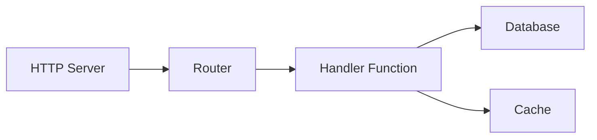
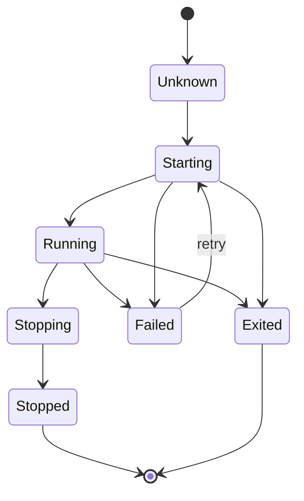

# Supervisão

O supervisor gerencia ciclos de vida de serviços, tratando ordenação de inicialização, reinicializações automáticas e encerramento gracioso. Serviços com `auto_start: true` são iniciados quando a aplicação inicia.

## Configuração de Ciclo de Vida

Serviços se registram com o supervisor usando um bloco `lifecycle`. Para processos, use `process.service` para encapsular uma definição de processo:

```yaml
# Definição de processo (o código)
- name: worker_process
  kind: process.lua
  source: file://worker.lua
  method: main

# Serviço supervisionado (encapsula o processo com gerenciamento de ciclo de vida)
- name: worker
  kind: process.service
  process: app:worker_process
  host: app:processes
  lifecycle:
    auto_start: true
    start_timeout: 30s
    stop_timeout: 10s
    stable_threshold: 5s
    requires:
      - app:database
    restart:
      initial_delay: 2s
      max_delay: 60s
      max_attempts: 10
```

| Campo | Padrão | Descrição |
|-------|--------|-----------|
| `auto_start` | `false` | Inicia automaticamente quando supervisor inicia |
| `start_timeout` | `10s` | Tempo máximo permitido para inicialização |
| `stop_timeout` | `10s` | Tempo máximo para encerramento gracioso |
| `stable_threshold` | `5s` | Tempo de execução antes do serviço ser considerado estável |
| `requires` | `[]` | Serviços que devem estar executando primeiro (alias legado: `depends_on`) |
| `startup` | `required` | `required` reporta um auto-start falho ou bloqueado como erro de transação; `optional` deixa o serviço continuar tentando em segundo plano sem falhar o lote |

## Resolução de Dependências

O supervisor resolve dependências de duas fontes:

1. **Dependências explícitas** declaradas em `requires` (ou o legado `depends_on`)
2. **Dependências extraídas do registro** de referências de entradas (ex: `database: app:db` na sua configuração)


```mermaid
graph LR
    A[HTTP Server] --> B[Router]
    B --> C[Handler Function]
    C --> D[Database]
    C --> E[Cache]
```

Dependências iniciam antes dos dependentes. Se o Serviço C depende de A e B, ambos A e B devem alcançar o estado `Running` antes de C iniciar.

<tip>
Você não precisa declarar entradas de infraestrutura como bancos de dados em <code>depends_on</code>. O supervisor extrai automaticamente dependências de referências do registro na configuração da sua entrada.
</tip>

## Política de Reinicialização

Quando um serviço falha, o supervisor tenta novamente com backoff exponencial:

```yaml
lifecycle:
  restart:
    initial_delay: 1s      # Espera da primeira tentativa
    max_delay: 90s         # Limite máximo de delay
    backoff_factor: 2.0    # Multiplicador de delay por tentativa
    jitter: 0.1            # +/-10% de randomização
    max_attempts: 0        # 0 = tentativas infinitas
```

| Tentativa | Delay Base | Com Jitter (+/-10%) |
|-----------|------------|-------------------|
| 1 | 1s | 0.9s - 1.1s |
| 2 | 2s | 1.8s - 2.2s |
| 3 | 4s | 3.6s - 4.4s |
| 4 | 8s | 7.2s - 8.8s |
| ... | ... | ... |
| N | 90s | 81s - 99s (limitado) |

Quando um serviço executa por mais tempo que `stable_threshold`, o contador de tentativas reseta. Isso previne que falhas transitórias escalem delays permanentemente.

### Erros Terminais

Estes erros param tentativas de retry:

- Cancelamento de contexto
- Requisição de terminação explícita
- Erros marcados como não-retentáveis

## Contexto de Segurança

Serviços podem executar com uma identidade de segurança específica:

```yaml
# Definição de processo
- name: admin_worker_process
  kind: process.lua
  source: file://admin_worker.lua
  method: main

# Serviço supervisionado com contexto de segurança
- name: admin_worker
  kind: process.service
  process: app:admin_worker_process
  host: app:processes
  lifecycle:
    auto_start: true
    security:
      actor:
        id: "service:admin-worker"
        meta:
          role: admin
      groups:
        - app:admin_policies
      policies:
        - app:data_access
```

O contexto de segurança define:

| Campo | Descrição |
|-------|-----------|
| `actor.id` | String de identidade para este serviço |
| `actor.meta` | Metadados chave-valor (role, permissões, etc.) |
| `groups` | Grupos de políticas a aplicar |
| `policies` | Políticas individuais a aplicar |

Código executando no serviço herda este contexto de segurança. O módulo `security` pode então verificar permissões:

```lua
local security = require("security")

if security.can("delete", "users") then
    -- permitido
end
```

<note>
Quando nenhum contexto de segurança está configurado, o serviço executa sem um ator. No modo estrito (padrão), verificações de segurança falham. Configure um contexto de segurança para serviços que precisam de autorização.
</note>

## Reregistro e Substituição

Uma mudança no registry pode reregistrar um ID que já tem um controller em execução. Se o registro carrega a mesma instância de serviço, nada é perturbado. Se carrega uma instância **diferente** — o manager reconstruiu o serviço porque sua configuração mudou — o supervisor aposenta o controller existente e adota o substituto.

A aposentadoria abrange mais que o serviço isolado. Um dependente em execução capturou a instância substituída, então não pode continuar rodando contra um serviço que está sendo trocado por baixo dele; o fecho de aposentadoria é o serviço substituído mais todo serviço em execução que depende dele, parados em ordem de dependência (dependentes primeiro). Serviços já parados não são parados uma segunda vez — um manager que para sua própria instância antes de reregistrar não recebe um `Stop` redundante.

A transferência é transacional:

1. O plano é computado sem tocar em nada, então uma falha de planejamento deixa o conjunto em execução intacto.
2. O lote de paradas é executado. **Se qualquer parada falhar, a transferência é rejeitada**: os serviços que o lote já parou são reerguidos e o erro é reportado. Um serviço que não pôde ser reerguido é nomeado nesse erro. O supervisor termina possuindo o mesmo conjunto em execução que tinha antes do commit, nunca um parcialmente aposentado.
3. Somente depois de o lote ter sucesso os controllers aposentados são descartados e cancelados, liberando as instâncias de serviço substituídas.
4. O substituto é criado e iniciado através do mesmo sequenciador ciente de dependências de qualquer outro início, e os dependentes que foram parados para a transferência voltam a subir contra a instância adotada.

Um serviço que estava em execução antes da substituição é reiniciado depois dela mesmo quando o novo registro define `auto_start: false` — substituir um serviço ativo é uma atualização, não uma parada implícita. Reiniciar um dependente parado é regido por sua própria política de reinicialização e não bloqueia o commit.

## Estados de Serviço


```mermaid
stateDiagram-v2
    [*] --> Unknown
    Unknown --> Starting
    Starting --> Running
    Running --> Stopping
    Stopping --> Stopped
    Stopped --> [*]

    Running --> Failed
    Starting --> Failed
    Failed --> Starting : retry
    Running --> Exited
    Starting --> Exited
    Exited --> [*]
```

O supervisor transiciona serviços através destes estados:

| Estado | Descrição |
|--------|-----------|
| `Unknown` | Registrado mas não iniciado |
| `Starting` | Inicialização em progresso |
| `Running` | Operando normalmente |
| `Stopping` | Encerramento gracioso em progresso |
| `Stopped` | Terminado de forma limpa |
| `Exited` | Terminado por requisição explícita ou por um erro terminal/não recuperável |
| `Failed` | Erro ocorreu, pode tentar novamente |

## Ordem de Inicialização e Encerramento

**Inicialização**: Dependências primeiro, depois dependentes. Serviços no mesmo nível de dependência podem iniciar em paralelo.

**Encerramento**: Dependentes primeiro, depois dependências. Isso garante que serviços dependentes terminem antes de suas dependências pararem.

```
Inicialização: database → cache → handler → http_server
Encerramento:  http_server → handler → cache → database
```

Em SIGINT ou SIGTERM, o runtime inicia um encerramento gracioso e a sequência inteira roda sob um único orçamento, `shutdown.timeout` na configuração do runtime (padrão 30s). Esse orçamento é um prazo novo que não herda o contexto interrompido, então um Ctrl-C não corta o encerramento dos componentes; o `stop_timeout` por serviço continua limitando cada parada individual dentro dele. Um segundo sinal pula a sequência e sai imediatamente.

```yaml
# .wippy.yaml
shutdown:
  timeout: 60s
```

## Veja Também

- [Modelo de Processos](concepts/process-model.md) - Ciclo de vida de processos
- [Configuração](guides/configuration.md) - Formato de configuração YAML
- [Módulo Security](lua/security/security.md) - Verificações de permissão em Lua
