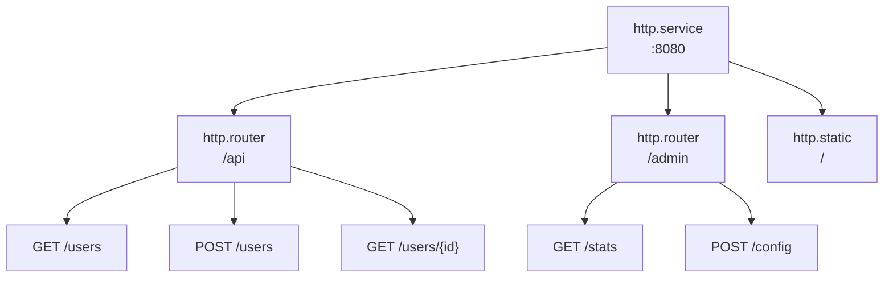

# Roteamento

Roteadores agrupam endpoints sob prefixos de URL e aplicam middleware compartilhado. Endpoints definem handlers HTTP.

## Arquitetura



Entradas referenciam pais via metadados:
- Roteadores: `meta.server: app:gateway`
- Endpoints: `meta.router: app:api`

## Configuração do Roteador

```yaml
- name: api
  kind: http.router
  meta:
    server: gateway
  prefix: /api/v1
  middleware:
    - cors
    - compress
  options:
    cors.allow.origins: "*"
  post_middleware:
    - endpoint_firewall
```

| Campo | Tipo | Descrição |
|-------|------|-----------|
| `meta.server` | ID do Registro | Servidor HTTP pai |
| `prefix` | string | Prefixo de URL para todas as rotas |
| `middleware` | []string | Middleware pre-match |
| `options` | map | Opções de middleware |
| `post_middleware` | []string | Middleware pós-match |
| `post_options` | map | Opções de middleware pós-match |

## Configuração de Endpoint

```yaml
- name: get_user
  kind: http.endpoint
  meta:
    router: api
  method: GET
  path: /users/{id}
  func: app.users:get_user
```

| Campo | Tipo | Descrição |
|-------|------|-----------|
| `meta.router` | ID do Registro | Roteador pai |
| `method` | string | Método HTTP (GET, POST, PUT, DELETE, PATCH, HEAD) |
| `path` | string | Padrão de caminho URL (começa com `/`) |
| `func` | ID do Registro | Função handler |

## Parâmetros de Caminho

Use sintaxe `{param}` para parâmetros de URL:

```yaml
- name: get_post
  kind: http.endpoint
  meta:
    router: api
  method: GET
  path: /users/{user_id}/posts/{post_id}
  func: get_user_post
```

Acesso no handler:

```lua
local http = require("http")

local function handler()
    local req = http.request()
    local user_id = req:param("user_id")
    local post_id = req:param("post_id")

    -- ...
end
```

### Caminhos Curinga

Capture segmentos de caminho restantes com `{param...}`:

```yaml
- name: serve_files
  kind: http.endpoint
  meta:
    router: api
  method: GET
  path: /files/{filepath...}
  func: serve_file
```

```lua
-- Requisição: GET /api/v1/files/docs/guides/readme.md
local file_path = req:param("filepath")  -- "docs/guides/readme.md"
```

O curinga deve ser o último segmento no caminho.

## Funções Handler

Handlers de endpoint usam o módulo `http` para acessar objetos de requisição e resposta. Veja [Módulo HTTP](lua/http/http.md) para a API completa.

```lua
local http = require("http")
local json = require("json")

local function handler()
    local req = http.request()
    local res = http.response()

    local user_id = req:param("id")
    local user = get_user(user_id)

    res:status(200)
    res:write(json.encode(user))
end

return { handler = handler }
```

## Opções de Middleware

Opções de middleware usam notação de ponto com o nome do middleware como prefixo:

```yaml
middleware:
  - cors
  - ratelimit
  - token_auth
options:
  cors.allow.origins: "https://app.example.com"
  cors.allow.methods: "GET,POST,PUT,DELETE"
  ratelimit.requests: "100"
  ratelimit.window: "1m"
  token_auth.store: "app:tokens"
  token_auth.header.name: "Authorization"
```

Middleware pós-match usa `post_options`:

```yaml
post_middleware:
  - endpoint_firewall
post_options:
  endpoint_firewall.default_policy: "deny"
```

## Middleware Pre-Match vs Pós-Match

**Pre-match** (`middleware`) executa antes do match de rota:
- CORS (trata preflight OPTIONS)
- Compressão
- Rate limiting
- Detecção de IP real
- Autenticação por token (enriquecimento de contexto)

**Pós-match** (`post_middleware`) executa após a rota ser correspondida:
- Firewall de endpoint (precisa de info da rota para autorização)
- Firewall de recurso
- Relay WebSocket

```yaml
middleware:        # Pre-match: todas as requisições para este roteador
  - cors
  - compress
  - token_auth     # Enriquece contexto com ator/escopo

post_middleware:   # Pós-match: apenas rotas correspondidas
  - endpoint_firewall  # Usa ator do token_auth
```

<tip>
Autenticação por token pode ser pre-match porque apenas enriquece contexto - não bloqueia requisições. Autorização acontece em middleware pós-match como <code>endpoint_firewall</code> que usa o ator definido por <code>token_auth</code>.
</tip>

## Exemplo Completo

```yaml
version: "1.0"
namespace: app

entries:
  # Servidor
  - name: gateway
    kind: http.service
    addr: ":8080"
    lifecycle:
      auto_start: true

  # Roteador da API
  - name: api
    kind: http.router
    meta:
      server: gateway
    prefix: /api/v1
    middleware:
      - cors
      - compress
      - ratelimit
    options:
      cors.allow.origins: "https://app.example.com"
      ratelimit.requests: "100"
      ratelimit.window: "1m"

  # Função handler
  - name: get_users
    kind: function.lua
    source: file://handlers/users.lua
    method: list
    modules:
      - http
      - json
      - sql

  # Endpoints
  - name: list_users
    kind: http.endpoint
    meta:
      router: api
    method: GET
    path: /users
    func: get_users

  - name: get_user
    kind: http.endpoint
    meta:
      router: api
    method: GET
    path: /users/{id}
    func: app:get_user_by_id

  - name: create_user
    kind: http.endpoint
    meta:
      router: api
    method: POST
    path: /users
    func: app:create_user
```

## Rotas Protegidas

Padrão comum com autenticação:

```yaml
entries:
  # Rotas públicas (sem auth)
  - name: public
    kind: http.router
    meta:
      server: gateway
    prefix: /api/public
    middleware:
      - cors

  # Rotas protegidas
  - name: protected
    kind: http.router
    meta:
      server: gateway
    prefix: /api
    middleware:
      - cors
      - token_auth
    options:
      token_store: app:tokens
    post_middleware:
      - endpoint_firewall
```

## Veja Também

- [Servidor](http/server.md) - Configuração do servidor HTTP
- [Arquivos Estáticos](http/static.md) - Servindo arquivos estáticos
- [Middleware](http/middleware.md) - Middleware disponível
- [Módulo HTTP](lua/http/http.md) - API HTTP Lua
